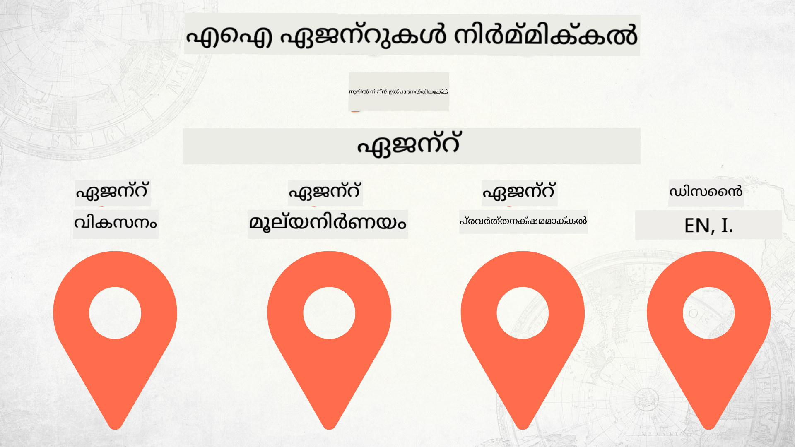

<!--
CO_OP_TRANSLATOR_METADATA:
{
  "original_hash": "03d63bb8bfb7f068db97b3703965a24f",
  "translation_date": "2025-12-17T14:14:35+00:00",
  "source_file": "README.md",
  "language_code": "ml"
}
-->
# സീറോയിൽ നിന്ന് പ്രൊഡക്ഷനിലേക്ക് AI ഏജന്റുകൾ നിർമ്മിക്കൽ

### 🌐 ബഹുഭാഷാ പിന്തുണ

#### GitHub ആക്ഷൻ വഴി പിന്തുണ (സ്വയം പ്രവർത്തിക്കുന്നതും എപ്പോഴും പുതുക്കപ്പെട്ടതും)

<!-- CO-OP TRANSLATOR LANGUAGES TABLE START -->
[Arabic](../ar/README.md) | [Bengali](../bn/README.md) | [Bulgarian](../bg/README.md) | [Burmese (Myanmar)](../my/README.md) | [Chinese (Simplified)](../zh/README.md) | [Chinese (Traditional, Hong Kong)](../hk/README.md) | [Chinese (Traditional, Macau)](../mo/README.md) | [Chinese (Traditional, Taiwan)](../tw/README.md) | [Croatian](../hr/README.md) | [Czech](../cs/README.md) | [Danish](../da/README.md) | [Dutch](../nl/README.md) | [Estonian](../et/README.md) | [Finnish](../fi/README.md) | [French](../fr/README.md) | [German](../de/README.md) | [Greek](../el/README.md) | [Hebrew](../he/README.md) | [Hindi](../hi/README.md) | [Hungarian](../hu/README.md) | [Indonesian](../id/README.md) | [Italian](../it/README.md) | [Japanese](../ja/README.md) | [Kannada](../kn/README.md) | [Korean](../ko/README.md) | [Lithuanian](../lt/README.md) | [Malay](../ms/README.md) | [Malayalam](./README.md) | [Marathi](../mr/README.md) | [Nepali](../ne/README.md) | [Nigerian Pidgin](../pcm/README.md) | [Norwegian](../no/README.md) | [Persian (Farsi)](../fa/README.md) | [Polish](../pl/README.md) | [Portuguese (Brazil)](../br/README.md) | [Portuguese (Portugal)](../pt/README.md) | [Punjabi (Gurmukhi)](../pa/README.md) | [Romanian](../ro/README.md) | [Russian](../ru/README.md) | [Serbian (Cyrillic)](../sr/README.md) | [Slovak](../sk/README.md) | [Slovenian](../sl/README.md) | [Spanish](../es/README.md) | [Swahili](../sw/README.md) | [Swedish](../sv/README.md) | [Tagalog (Filipino)](../tl/README.md) | [Tamil](../ta/README.md) | [Telugu](../te/README.md) | [Thai](../th/README.md) | [Turkish](../tr/README.md) | [Ukrainian](../uk/README.md) | [Urdu](../ur/README.md) | [Vietnamese](../vi/README.md)
<!-- CO-OP TRANSLATOR LANGUAGES TABLE END -->

## AI ഏജന്റ് വികസന ജീവിതചക്രത്തിന്റെ അടിസ്ഥാനങ്ങൾ പഠിപ്പിക്കുന്ന ഒരു കോഴ്‌സ്

## 🌱 ആരംഭിക്കുന്നത്

ഈ കോഴ്‌സിൽ AI ഏജന്റുകൾ നിർമ്മിക്കാനും വിന്യസിക്കാനും അടിസ്ഥാനപരമായ പാഠങ്ങൾ ഉൾക്കൊള്ളുന്നു.

ഓരോ പാഠവും മുൻപത്തെ പാഠത്തെ അടിസ്ഥാനമാക്കി നിർമ്മിക്കപ്പെട്ടതാണ്, അതിനാൽ തുടക്കത്തിൽ നിന്ന് ആരംഭിച്ച് അവസാനം വരെ മുന്നോട്ട് പോകാൻ ഞങ്ങൾ ശുപാർശ ചെയ്യുന്നു.

AI ഏജന്റ് വിഷയങ്ങളെക്കുറിച്ച് കൂടുതൽ അന്വേഷിക്കാൻ ആഗ്രഹിക്കുന്നുവെങ്കിൽ, [AI Agents For Beginners Course](https://aka.ms/ai-agents-beginners) പരിശോധിക്കാം.

### മറ്റ് പഠിതാക്കളെ കാണുക, നിങ്ങളുടെ ചോദ്യങ്ങൾക്ക് ഉത്തരം നേടുക

AI ഏജന്റുകൾ നിർമ്മിക്കുന്നതിൽ നിങ്ങൾക്ക് തടസ്സം നേരിടുകയോ ചോദ്യങ്ങളുണ്ടായിരിക്കുകയോ ചെയ്താൽ, [Microsoft Foundry Discord](https://discord.gg/Kuaw3ktsu6) ലെ പ്രത്യേക Discord ചാനലിൽ ചേരുക.

### നിങ്ങൾക്ക് വേണ്ടത്

ഓരോ പാഠത്തിനും പ്രാദേശികമായി പ്രവർത്തിപ്പിക്കാൻ കഴിയുന്ന കോഡ് സാമ്പിൾ ഉണ്ട്. നിങ്ങളുടെ സ്വന്തം കോപ്പി സൃഷ്ടിക്കാൻ [ഈ റിപോ ഫോർക്ക് ചെയ്യാം](https://github.com/microsoft/Building-AI-Agents-From-Zero-To-Production/fork).

ഈ കോഴ്‌സ് നിലവിൽ താഴെപ്പറയുന്നവ ഉപയോഗിക്കുന്നു:

- [Microsoft Agent Framework (MAF)](https://aka.ms/ai-agents-beginners/agent-framework)
- [Microsoft Foundry](https://azure.microsoft.com/products/ai-foundry)
- [Azure OpenAI Service](https://azure.microsoft.com/products/ai-foundry/models/openai)
- [Azure CLI](https://learn.microsoft.com/cli/azure/authenticate-azure-cli?view=azure-cli-latest)

ആരംഭിക്കുന്നതിന് മുമ്പ് ഈ സേവനങ്ങൾക്ക് നിങ്ങൾക്ക് ആക്‌സസ് ഉണ്ടെന്ന് ഉറപ്പാക്കുക.

മോഡൽ ഹോസ്റ്റിംഗ്, സേവനങ്ങൾ എന്നിവ സംബന്ധിച്ച കൂടുതൽ ഓപ്ഷനുകൾ ഉടൻ വരും.

## 🗃️ പാഠങ്ങൾ

| **പാഠം**         | **വിവരണം**                                                                                  |
|--------------------|--------------------------------------------------------------------------------------------------|
| [Agent Design](./lesson-1-agent-design/README.md)       | നമ്മുടെ "ഡെവലപ്പർ ഓൺബോർഡിംഗ്" ഏജന്റ് ഉപയോഗകേസ് പരിചയപ്പെടുത്തലും ഫലപ്രദമായ ഏജന്റുകൾ രൂപകൽപ്പന ചെയ്യുന്നതും  |
| [Agent Development](./lesson-2-agent-development/README.md)  | Microsoft Agent Framework (MAF) ഉപയോഗിച്ച് പുതിയ ഡെവലപ്പർമാർക്ക് സഹായം നൽകാൻ 3 ഏജന്റുകൾ സൃഷ്ടിക്കുക.       |
| [Agent Evaluations](./lesson-3-agent-evals/README.md)  | Microsoft Foundry ഉപയോഗിച്ച് നമ്മുടെ AI ഏജന്റുകൾ എത്രത്തോളം ഫലപ്രദമാണെന്ന് കണ്ടെത്തുകയും അവ മെച്ചപ്പെടുത്തുന്നതിനുള്ള മാർഗങ്ങൾ പഠിക്കുകയും ചെയ്യുക. |
| [Agent Deployment](./lesson-4-agent-deployment/README.md)   | ഹോസ്റ്റുചെയ്ത ഏജന്റുകളും OpenAI Chatkit ഉപയോഗിച്ച് AI ഏജന്റ് പ്രൊഡക്ഷനിലേക്ക് വിന്യസിക്കുന്ന വിധം കാണുക.       |

## സംഭാവനകൾ

ഈ പ്രോജക്റ്റ് സംഭാവനകളും നിർദ്ദേശങ്ങളും സ്വാഗതം ചെയ്യുന്നു. മിക്ക സംഭാവനകൾക്കും നിങ്ങൾക്ക് അവകാശം ഉള്ളതായി, അതുപോലെ തന്നെ ഞങ്ങൾക്ക് നിങ്ങളുടെ സംഭാവന ഉപയോഗിക്കാൻ അവകാശം നൽകുന്നതായി പ്രഖ്യാപിക്കുന്ന
Contributor License Agreement (CLA) ഒപ്പിടേണ്ടതുണ്ട്. വിശദാംശങ്ങൾക്ക് <https://cla.opensource.microsoft.com> സന്ദർശിക്കുക.

നിങ്ങൾ ഒരു പുൾ റിക്വസ്റ്റ് സമർപ്പിക്കുമ്പോൾ, CLA ബോട്ട് സ്വയം നിങ്ങൾക്ക് CLA നൽകേണ്ടതുണ്ടോ എന്ന് നിർണ്ണയിച്ച് PR യോജിച്ച രീതിയിൽ അലങ്കരിക്കും (ഉദാ: സ്റ്റാറ്റസ് ചെക്ക്, കമന്റ്). ബോട്ടിന്റെ നിർദ്ദേശങ്ങൾ പാലിക്കുക. ഞങ്ങളുടെ CLA ഉപയോഗിക്കുന്ന എല്ലാ റിപോസിറ്ററികളിലും ഇത് ഒരിക്കൽ മാത്രം ചെയ്യേണ്ടതുണ്ട്.

ഈ പ്രോജക്റ്റ് [Microsoft Open Source Code of Conduct](https://opensource.microsoft.com/codeofconduct/) സ്വീകരിച്ചിട്ടുണ്ട്.
കൂടുതൽ വിവരങ്ങൾക്ക് [Code of Conduct FAQ](https://opensource.microsoft.com/codeofconduct/faq/) കാണുക അല്ലെങ്കിൽ
[opencode@microsoft.com](mailto:opencode@microsoft.com) എന്ന വിലാസത്തിൽ ബന്ധപ്പെടുക.

## ട്രേഡ്മാർക്കുകൾ

ഈ പ്രോജക്റ്റിൽ പ്രോജക്റ്റുകൾ, ഉൽപ്പന്നങ്ങൾ, സേവനങ്ങൾ എന്നിവയ്ക്ക് ട്രേഡ്മാർക്കുകൾ അല്ലെങ്കിൽ ലോഗോകൾ ഉൾക്കൊള്ളാം. Microsoft ട്രേഡ്മാർക്കുകൾ അല്ലെങ്കിൽ ലോഗോകളുടെ അംഗീകൃത ഉപയോഗം
[Microsoft's Trademark & Brand Guidelines](https://www.microsoft.com/legal/intellectualproperty/trademarks/usage/general) അനുസരിച്ചിരിക്കണം.
ഈ പ്രോജക്റ്റിന്റെ മാറ്റം വരുത്തിയ പതിപ്പുകളിൽ Microsoft ട്രേഡ്മാർക്കുകൾ അല്ലെങ്കിൽ ലോഗോകൾ ഉപയോഗിക്കുന്നത് ആശയക്കുഴപ്പം സൃഷ്ടിക്കരുത് അല്ലെങ്കിൽ Microsoft സ്പോൺസർഷിപ്പ് സൂചിപ്പിക്കരുത്.
മൂന്നാം കക്ഷി ട്രേഡ്മാർക്കുകൾ അല്ലെങ്കിൽ ലോഗോകൾ ഉപയോഗിക്കുന്നത് ആ മൂന്നാം കക്ഷികളുടെ നയങ്ങൾക്കു വിധേയമാണ്.

## സഹായം നേടുക

AI ആപ്പുകൾ നിർമ്മിക്കുന്നതിൽ നിങ്ങൾക്ക് തടസ്സം നേരിടുകയോ ചോദ്യങ്ങളുണ്ടായിരിക്കുകയോ ചെയ്താൽ, ചേരുക:

ഉൽപ്പന്ന പ്രതികരണങ്ങൾക്കോ പിഴവുകൾക്കോ വേണ്ടി സന്ദർശിക്കുക:

---

<!-- CO-OP TRANSLATOR DISCLAIMER START -->
**അസൂയാ**:  
ഈ രേഖ AI വിവർത്തന സേവനം [Co-op Translator](https://github.com/Azure/co-op-translator) ഉപയോഗിച്ച് വിവർത്തനം ചെയ്തതാണ്. നാം കൃത്യതയ്ക്ക് ശ്രമിച്ചിട്ടുണ്ടെങ്കിലും, സ്വയം പ്രവർത്തിക്കുന്ന വിവർത്തനങ്ങളിൽ പിശകുകൾ അല്ലെങ്കിൽ തെറ്റുകൾ ഉണ്ടാകാമെന്ന് ദയവായി ശ്രദ്ധിക്കുക. അതിന്റെ മാതൃഭാഷയിലുള്ള യഥാർത്ഥ രേഖയാണ് പ്രാമാണികമായ ഉറവിടം എന്ന് പരിഗണിക്കേണ്ടതാണ്. നിർണായകമായ വിവരങ്ങൾക്ക്, പ്രൊഫഷണൽ മനുഷ്യ വിവർത്തനം ശുപാർശ ചെയ്യപ്പെടുന്നു. ഈ വിവർത്തനം ഉപയോഗിക്കുന്നതിൽ നിന്നുണ്ടാകുന്ന ഏതെങ്കിലും തെറ്റിദ്ധാരണകൾക്കോ തെറ്റായ വ്യാഖ്യാനങ്ങൾക്കോ ഞങ്ങൾ ഉത്തരവാദികളല്ല.
<!-- CO-OP TRANSLATOR DISCLAIMER END -->