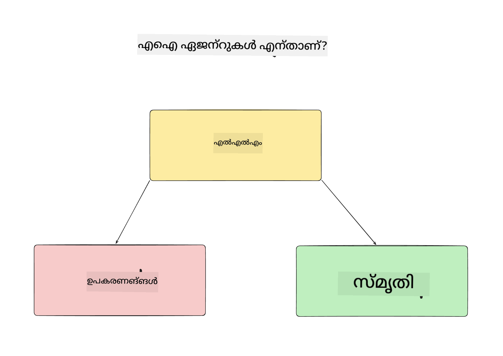
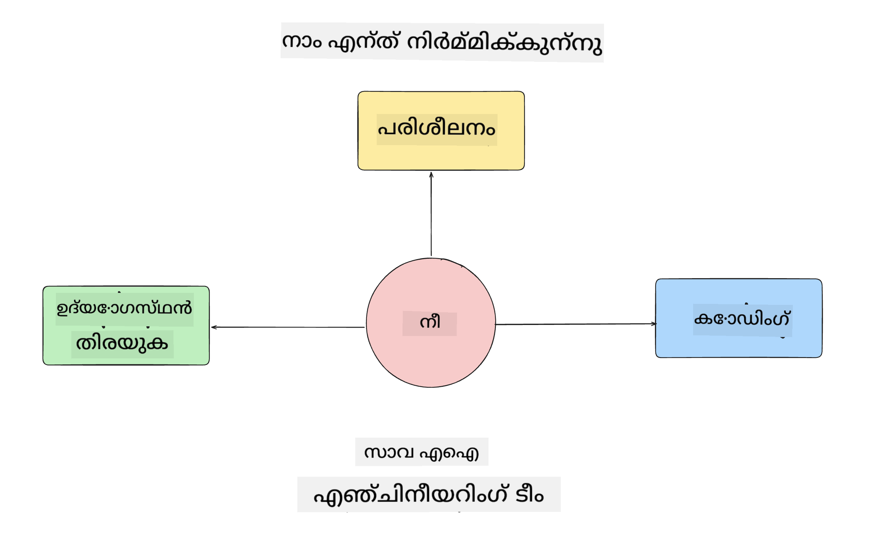
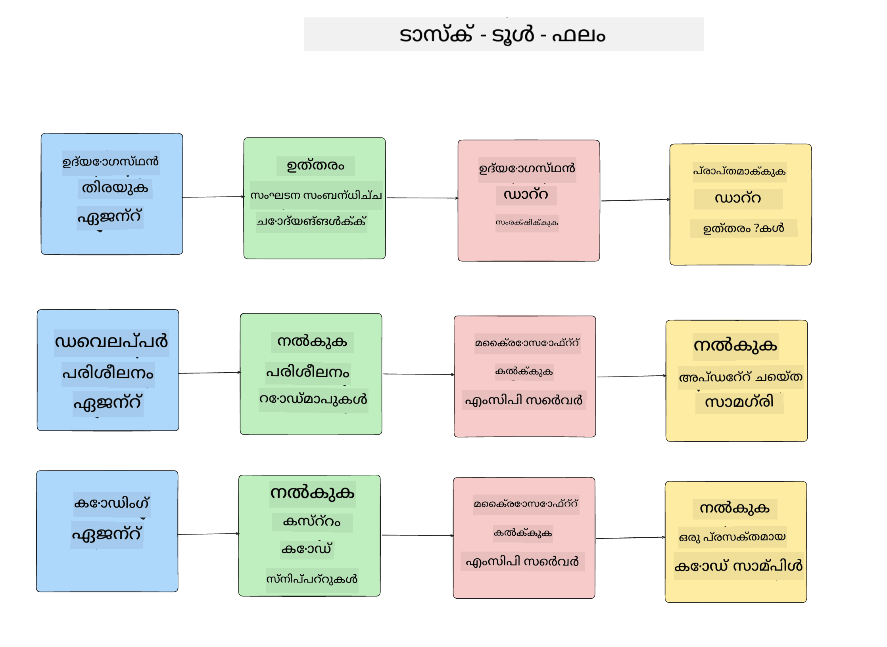
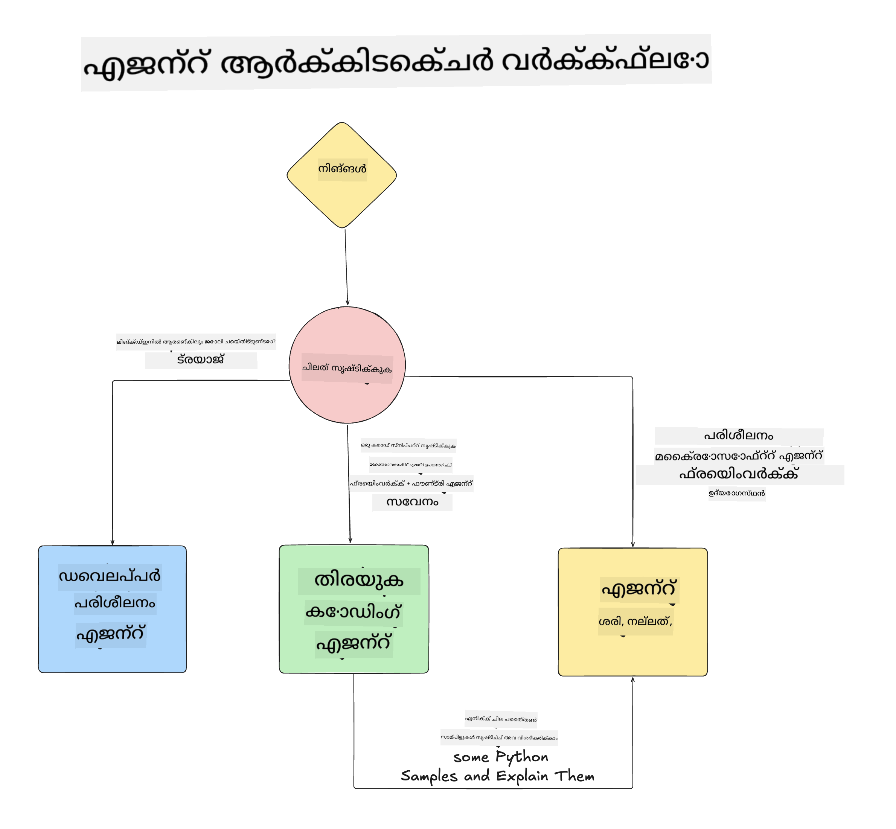

<!--
CO_OP_TRANSLATOR_METADATA:
{
  "original_hash": "99c07849641a850775c188c9333f31e5",
  "translation_date": "2025-12-12T18:47:21+00:00",
  "source_file": "lesson-1-agent-design/README.md",
  "language_code": "ml"
}
-->
# പാഠം 1: AI ഏജന്റ് ഡിസൈൻ

"Building AI Agent from Zero to Production Course" എന്ന കോഴ്സിന്റെ ആദ്യ പാഠത്തിലേക്ക് സ്വാഗതം!

ഈ പാഠത്തിൽ നാം ചർച്ച ചെയ്യുന്നത്:

- AI ഏജന്റുകൾ എന്താണെന്ന് നിർവചിക്കൽ
  
- നാം നിർമ്മിക്കുന്ന AI ഏജന്റ് അപ്ലിക്കേഷൻ ചർച്ച ചെയ്യുക  

- ഓരോ ഏജന്റിനും ആവശ്യമായ ഉപകരണങ്ങളും സേവനങ്ങളും തിരിച്ചറിയുക
  
- നമ്മുടെ ഏജന്റ് അപ്ലിക്കേഷൻ ആർക്കിടെക്ചർ ചെയ്യുക
  
ഏജന്റുകൾ എന്താണെന്നും അവയെ അപ്ലിക്കേഷനിൽ ഉപയോഗിക്കുന്നതെന്തുകൊണ്ടാണെന്നും നിർവചിക്കുന്നതിൽ നിന്ന് തുടങ്ങാം.

## AI ഏജന്റുകൾ എന്താണ്?

നിങ്ങൾക്ക് ആദ്യമായി AI ഏജന്റ് എങ്ങനെ നിർമ്മിക്കാമെന്ന് അന്വേഷിക്കുമ്പോൾ, AI ഏജന്റ് എന്താണെന്ന് കൃത്യമായി നിർവചിക്കാൻ സംശയങ്ങൾ ഉണ്ടാകാം.

AI ഏജന്റ് എന്താണെന്ന് എളുപ്പത്തിൽ നിർവചിക്കാൻ അതിനെ നിർമ്മിക്കുന്ന ഘടകങ്ങൾ നോക്കാം:

**ലാർജ് ലാംഗ്വേജ് മോഡൽ** - LLM ഉപയോക്താവിൽ നിന്നുള്ള സ്വാഭാവിക ഭാഷ പ്രോസസ്സ് ചെയ്ത് അവർ പൂർത്തിയാക്കാൻ ആഗ്രഹിക്കുന്ന ടാസ്ക് വ്യാഖ്യാനിക്കുകയും, ആ ടാസ്കുകൾ പൂർത്തിയാക്കാൻ ലഭ്യമായ ഉപകരണങ്ങളുടെ വിവരണങ്ങൾ വ്യാഖ്യാനിക്കുകയും ചെയ്യാൻ ശക്തി നൽകും.

**ഉപകരണങ്ങൾ** - ഫംഗ്ഷനുകൾ, APIകൾ, ഡാറ്റാ സ്റ്റോറുകൾ, മറ്റ് സേവനങ്ങൾ എന്നിവ LLM ഉപയോക്താവിന്റെ അഭ്യർത്ഥിച്ച ടാസ്കുകൾ പൂർത്തിയാക്കാൻ തിരഞ്ഞെടുക്കാൻ കഴിയും.

**മെമ്മറി** - AI ഏജന്റും ഉപയോക്താവും തമ്മിലുള്ള ചെറുകാലവും ദീർഘകാലവും ഇടപെടലുകൾ ഇവിടെ സൂക്ഷിക്കുന്നു. ഈ വിവരങ്ങൾ സൂക്ഷിക്കുകയും തിരികെ ലഭ്യമാക്കുകയും ചെയ്യുന്നത് മെച്ചപ്പെടുത്തലുകൾക്കും ഉപയോക്തൃ മുൻഗണനകൾ സംരക്ഷിക്കാനും പ്രധാനമാണ്.

## നമ്മുടെ AI ഏജന്റ് ഉപയോഗകേസ്

ഈ കോഴ്സിനായി, നാം ഒരു AI ഏജന്റ് അപ്ലിക്കേഷൻ നിർമ്മിക്കുകയാണ്, ഇത് പുതിയ ഡെവലപ്പർമാർക്ക് നമ്മുടെ AI ഏജന്റ് ഡെവലപ്പ്മെന്റ് ടീമിൽ ചേർക്കാൻ സഹായിക്കും!

ഏതെങ്കിലും ഡെവലപ്പ്മെന്റ് പ്രവർത്തനം തുടങ്ങുന്നതിന് മുമ്പ്, വിജയകരമായ AI ഏജന്റ് അപ്ലിക്കേഷൻ സൃഷ്ടിക്കാൻ ആദ്യ ഘട്ടം, ഉപയോക്താക്കൾ എങ്ങനെ നമ്മുടെ AI ഏജന്റുകളുമായി പ്രവർത്തിക്കുമെന്ന് വ്യക്തമായ സീനാരിയോകൾ നിർവചിക്കുകയാണ്.

ഈ അപ്ലിക്കേഷനിൽ നാം ഈ സീനാരിയോകളിൽ പ്രവർത്തിക്കും:

**സീനാരിയോ 1**: ഒരു പുതിയ ജീവനക്കാരൻ നമ്മുടെ സംഘടനയിൽ ചേർന്നു, അവർ ചേർന്ന ടീമിനെക്കുറിച്ച് കൂടുതൽ അറിയാനും അവരുമായി എങ്ങനെ ബന്ധപ്പെടാമെന്ന് അറിയാനും ആഗ്രഹിക്കുന്നു.

**സീനാരിയോ 2:** ഒരു പുതിയ ജീവനക്കാരൻ ആരംഭിക്കാൻ ഏറ്റവും നല്ല ആദ്യ ടാസ്ക് എന്തായിരിക്കും എന്ന് അറിയാൻ ആഗ്രഹിക്കുന്നു.

**സീനാരിയോ 3:** ഒരു പുതിയ ജീവനക്കാരൻ പഠന വിഭവങ്ങളും കോഡ് സാമ്പിളുകളും ശേഖരിച്ച് ഈ ടാസ്ക് പൂർത്തിയാക്കാൻ സഹായം തേടുന്നു.

## ഉപകരണങ്ങളും സേവനങ്ങളും തിരിച്ചറിയൽ

ഇപ്പോൾ ഈ സീനാരിയോകൾ സൃഷ്ടിച്ചതിനുശേഷം, അടുത്ത ഘട്ടം അവ AI ഏജന്റുകൾക്ക് ടാസ്കുകൾ പൂർത്തിയാക്കാൻ ആവശ്യമായ ഉപകരണങ്ങളുമായി സേവനങ്ങളുമായി മാപ്പ് ചെയ്യുകയാണ്.

ഈ പ്രക്രിയ Context Engineering എന്ന വിഭാഗത്തിൽപ്പെടുന്നു, കാരണം AI ഏജന്റുകൾക്ക് ടാസ്കുകൾ പൂർത്തിയാക്കാൻ ശരിയായ സമയത്ത് ശരിയായ കോൺടെക്സ്റ്റ് ലഭ്യമാക്കുന്നതിൽ നാം ശ്രദ്ധ കേന്ദ്രീകരിക്കും.

ഓരോ സീനാരിയോയും അനുസരിച്ച് ഇത് ചെയ്യാം, ഓരോ ഏജന്റിന്റെ ടാസ്ക്, ഉപകരണങ്ങൾ, ആഗ്രഹിക്കുന്ന ഫലങ്ങൾ പട്ടികപ്പെടുത്തിക്കൊണ്ട് നല്ല ഏജന്റിക് ഡിസൈൻ നടത്താം.

### സീനാരിയോ 1 - ജീവനക്കാരൻ തിരയൽ ഏജന്റ്

**ടാസ്ക്** - സംഘടനയിലെ ജീവനക്കാരെക്കുറിച്ചുള്ള ചോദ്യങ്ങൾക്ക് ഉത്തരം നൽകുക, ഉദാഹരണത്തിന് ജോയിൻ തീയതി, നിലവിലെ ടീം, സ്ഥലം, അവസാന സ്ഥാനങ്ങൾ.

**ഉപകരണങ്ങൾ** - നിലവിലെ ജീവനക്കാരുടെ പട്ടികയും ഓർഗൻ ചാർട്ടും ഉള്ള ഡാറ്റാസ്റ്റോർ

**ഫലങ്ങൾ** - ഡാറ്റാസ്റ്റോറിൽ നിന്ന് വിവരങ്ങൾ തിരികെ ലഭ്യമാക്കി പൊതുവായ സംഘടനാ ചോദ്യങ്ങൾക്കും ജീവനക്കാരെക്കുറിച്ചുള്ള പ്രത്യേക ചോദ്യങ്ങൾക്കും ഉത്തരം നൽകാൻ കഴിയും.

### സീനാരിയോ 2 - ടാസ്ക് ശുപാർശ ഏജന്റ്

**ടാസ്ക്** - പുതിയ ജീവനക്കാരന്റെ ഡെവലപ്പർ അനുഭവം അടിസ്ഥാനമാക്കി, അവർക്ക് ചെയ്യാൻ കഴിയുന്ന 1-3 പ്രശ്നങ്ങൾ നിർദ്ദേശിക്കുക.

**ഉപകരണങ്ങൾ** - GitHub MCP സെർവർ തുറന്ന പ്രശ്നങ്ങൾ ലഭിക്കാൻ, ഡെവലപ്പർ പ്രൊഫൈൽ നിർമ്മിക്കാൻ

**ഫലങ്ങൾ** - GitHub പ്രൊഫൈലിന്റെ അവസാന 5 കമ്മിറ്റുകളും GitHub പ്രോജക്ടിലെ തുറന്ന പ്രശ്നങ്ങളും വായിച്ച്, പൊരുത്തം അടിസ്ഥാനമാക്കി ശുപാർശകൾ നൽകാൻ കഴിയും.

### സീനാരിയോ 3 - കോഡ് അസിസ്റ്റന്റ് ഏജന്റ്

**ടാസ്ക്** - "ടാസ്ക് ശുപാർശ" ഏജന്റ് നിർദ്ദേശിച്ച തുറന്ന പ്രശ്നങ്ങൾ അടിസ്ഥാനമാക്കി, ഗവേഷണം നടത്തുകയും, സഹായത്തിനായി വിഭവങ്ങൾ നൽകുകയും, കോഡ് സ്നിപ്പറ്റുകൾ സൃഷ്ടിക്കുകയും ചെയ്യുക.

**ഉപകരണങ്ങൾ** - Microsoft Learn MCP വിഭവങ്ങൾ കണ്ടെത്താൻ, കോഡ് ഇന്റർപ്രിറ്റർ കസ്റ്റം കോഡ് സ്നിപ്പറ്റുകൾ സൃഷ്ടിക്കാൻ.

**ഫലങ്ങൾ** - ഉപയോക്താവ് അധിക സഹായം ചോദിച്ചാൽ, വർക്ക്‌ഫ്ലോ Learn MCP സെർവർ ഉപയോഗിച്ച് വിഭവങ്ങളുടെ ലിങ്കുകളും സ്നിപ്പറ്റുകളും നൽകുകയും, തുടർന്ന് കോഡ് ഇന്റർപ്രിറ്റർ ഏജന്റിന് കൈമാറി ചെറിയ കോഡ് സ്നിപ്പറ്റുകൾ വിശദീകരണങ്ങളോടുകൂടി സൃഷ്ടിക്കാനും കഴിയും.

## നമ്മുടെ ഏജന്റ് അപ്ലിക്കേഷൻ ആർക്കിടെക്ചർ

ഇപ്പോൾ ഓരോ ഏജന്റും നിർവചിച്ചതിനുശേഷം, ഓരോ ഏജന്റും ടാസ്ക് അനുസരിച്ച് എങ്ങനെ ചേർന്ന് വേർപിരിഞ്ഞ് പ്രവർത്തിക്കുമെന്ന് മനസ്സിലാക്കാൻ സഹായിക്കുന്ന ഒരു ആർക്കിടെക്ചർ ഡയഗ്രാം സൃഷ്ടിക്കാം:

## അടുത്ത ഘട്ടങ്ങൾ

ഇപ്പോൾ ഓരോ ഏജന്റും നമ്മുടെ ഏജന്റിക് സിസ്റ്റവും ഡിസൈൻ ചെയ്തതിനുശേഷം, അടുത്ത പാഠത്തിലേക്ക് പോകാം, അവയെ ഓരോന്നായി വികസിപ്പിക്കാം!

---

<!-- CO-OP TRANSLATOR DISCLAIMER START -->
**അസൂയാ**:  
ഈ രേഖ AI വിവർത്തന സേവനം [Co-op Translator](https://github.com/Azure/co-op-translator) ഉപയോഗിച്ച് വിവർത്തനം ചെയ്തതാണ്. നാം കൃത്യതയ്ക്ക് ശ്രമിച്ചിട്ടുണ്ടെങ്കിലും, സ്വയം പ്രവർത്തിക്കുന്ന വിവർത്തനങ്ങളിൽ പിശകുകൾ അല്ലെങ്കിൽ തെറ്റുകൾ ഉണ്ടാകാമെന്ന് ദയവായി ശ്രദ്ധിക്കുക. അതിന്റെ മാതൃഭാഷയിലുള്ള യഥാർത്ഥ രേഖ പ്രാമാണികമായ ഉറവിടമായി കണക്കാക്കണം. നിർണായക വിവരങ്ങൾക്ക്, പ്രൊഫഷണൽ മനുഷ്യ വിവർത്തനം ശുപാർശ ചെയ്യപ്പെടുന്നു. ഈ വിവർത്തനത്തിന്റെ ഉപയോഗത്തിൽ നിന്നുണ്ടാകുന്ന ഏതെങ്കിലും തെറ്റിദ്ധാരണകൾക്കോ തെറ്റായ വ്യാഖ്യാനങ്ങൾക്കോ ഞങ്ങൾ ഉത്തരവാദികളല്ല.
<!-- CO-OP TRANSLATOR DISCLAIMER END -->