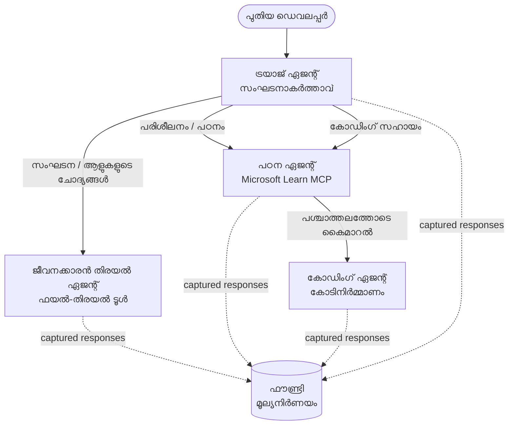

# പാഠം 3: Microsoft Foundry ഉപയോഗിച്ച് ഏജന്റ് വിലയിരുത്തലുകൾ

**"ശൂന്യത്തിൽ നിന്ന് പ്രൊഡക്ഷൻ വരെ AI ഏജന്റുകൾ നിർമ്മിക്കൽ"** കോഴ്‌സിന്റെ മൂന്നാം പാഠത്തിലേക്ക് സ്വാഗതം!

[Lesson 2](../lesson-2-agent-development/README.md)ൽ നിങ്ങൾ ഏജന്റുകൾ നിർമ്മിച്ചിരുന്നു. ഈ പാഠത്തിൽ നിങ്ങൾ കഠിനമായ ഒരു ചോദ്യം പഠിക്കും: **അവ നല്ലവരാണോ?** പ്രവർത്തിക്കുന്ന ഏജന്റ് അയയ്ക്കുക എളുപ്പമാണ്; ഇത് ശരിയായി വഴി കാണിക്കുന്നുണ്ടോ, നിങ്ങളുടെ ഡേറ്റയിൽ ആധാരമാക്കുന്നുണ്ടോ, ടൂളുകൾ ശരിയായി ഉപയോഗിക്കുന്നുണ്ടോ എന്ന് അറിഞ്ഞാൽ ഡെമോയും പ്രൊഡക്ഷൻ സിസ്റ്റത്തിനും തമ്മിലുള്ള വ്യത്യാസം മനസിലാക്കാം.


ഈ പാഠത്തിൽ ഞങ്ങൾ പരിഗണിക്കാനിരിക്കുന്നതാണ്:

- ഏജന്റ് വിലയിരുത്തൽ എന്തിനാണെന്ന്, പരമ്പരാഗത ടെസ്റ്റിംഗ് നിന്നുള്ള വ്യത്യാസം
- **ദർശനം**, **സ്മോക്ക് ടെസ്റ്റുകൾ**, **വിലയിരുത്തലുകൾ** തമ്മിലുള്ള വ്യത്യാസം
- നാം അളക്കാൻ പോകുന്ന മൾട്ടി-ഏജന്റ് പ്രവൃത്തി പ്രവാഹം
- നിർമ്മിച്ച **Microsoft Foundry evaluators** (പ്രസക്തി, ആധാരിത്തം, ടൂൾ കോൾ കൃത്യത, ടൂൾ ഔട്ട്പുട്ട് ഉപയോഗം)
- [`agent-evals.py`](../../../lesson-3-agent-evals/agent-evals.py) ൽ വിലയിരുത്തലിന്റെ ഘട്ടം ഘട്ടമായുള്ള വിശദീകരണം
- അതിനെ എങ്ങനെ നടത്താം, ഫലങ്ങൾ എങ്ങനെ വായിക്കാം

---

## ഏജന്റുകളെ എന്തിനാണ് വിലയിരിക്കാന്‍?

പരമ്പരാഗത യൂണിറ്റ് ടെസ്റ്റ് `add(2, 2) == 4` എന്നത് സ്ഥിരീകരിക്കുന്നു. ഏജന്റുകൾ അതുപോലെയല്ല — ഒരേ പ്രോംപ്റ്റ് ഓരോ തവണവും വ്യത്യസ്തമായ വാക്കുകളെ ഉല്‌പാദിപ്പിക്കാം, ടൂളുകൾ വ്യത്യസ്ത ക്രമത്തിൽ വിളിക്കപ്പെടാം, "സരിയായി" ഉള്ളത് ഒരു ബൂളിയൻ അല്ല, ഒരുപാട് കാര്യങ്ങൾ അനുപാതത്തിൽ ആണ്. നിങ്ങൾ കൃത്യമായ സ്ട്രിംഗുകളിൽ ഉറപ്പ് നൽകാനാകില്ല.


പകരം, നിങ്ങൾ ഏജന്റുകളെ **ഗുണനിലവാര അളവുകളിലൂടെ** മോഡൽ അടിസ്ഥാനമാക്കിയ *വിലയിരുത്തുക* (ഇതിനെ "LLM-ജഡ്ജ്" എന്നും പറയും) തുടർന്ന് ടൂൾ ഉപയോഗത്തിൽ നിർണയാത്മക പരിശോധനകൾ നടത്തിയാണ് വിലയിരുത്തുക. ഇതിലൂടെ മനസ്സിലാകും:


- ഉത്തരം ചോദ്യത്തിന് യഥാർഥത്തിൽ പ്രതികരിച്ചതോ? (**പ്രസക്തി**)
- ഉത്തരം കിട്ടിയ ഡാറ്റയിൽ നിന്നും പിന്തുണക്കപ്പെട്ടതോ, ഏജന്റ് യാഥാർത്ഥ്യത്തിൽ നിന്നും ഒഴിഞ്ഞുപോയോ? (**ആധാരിത്തം**)
- ഏജന്റ് ശരിയായ ടൂൾ ശരിയായ_ARGUMENT_കളോടെ വിളിച്ചോ? (**ടൂൾ കോൾ കൃത്യത**)
- ഏജന്റ് ടൂൾ തിരിച്ചു നൽകിയ വിവരങ്ങൾ ഉപയോഗിച്ചോ? (**ടൂൾ ഔട്ട്പുട്ട് ഉപയോഗം**)

### മൂന്നു പരസ്പരം പൂരകമാകുന്ന ഗുണനിലവാര നിലവറകൾ

ഇവ മത്സരം നടത്തുന്ന സാങ്കേതിക പద్ధതികൾ അല്ല — ഒരു പ്രൊഡക്ഷൻ ഏജന്റ് ഇവ മൂന്ന് ഉപയോഗിക്കുന്നു:

| നില | സോദ്യിക്കാൻ ഉള്ള ചോദ്യമാ | ചെലവ് | എപ്പോൾ പ്രവർത്തിക്കും | ഉൾപ്പെടുത്തിയിടുന്നു |
|-------|---------------------|------|--------------|------------|
| **ദർശനം / ട്രേസിംഗ്** | *ഏജന്റ് എങ്ങനെ പടിപടിയായി പ്രവർത്തിച്ചുവെന്ന്* | സൗജന്യം (എപ്പോഴും ഓണാണ്) | തുടർച്ചയായി പ്രൊഡക്ഷനിൽ | ഈ പാഠത്തിൽ |
| **സ്മോക്ക് ടെസ്റ്റുകൾ** | *ഏജന്റ് ലഭ്യമായോ അടിസ്ഥാന പ്രോംപ്റ്റ് പാലിക്കുമോ?* | ചെലവുകുറഞ്ഞത്, സെക്കൻഡ്‌കൾ | ഓരോ ഡിപ്പ്ലോയ്‌‌മെന്റിനും | [Lesson 4](../lesson-4-agentdeployment/README.md#smoke-testing-the-hosted-agent-ci-gate) |
| **വിലയിരുത്തലുകൾ** | *സമയം **നല്ലതു** വിലയിരുത്തുന്നത്* | കുറച്ച് സമയം, മോഡൽ മീതർഡ് | ആഗ്രഹപ്രകാരം / രാത്രി / പ്രി-റിലീസ് | ഈ പാഠത്തിൽ |

സ്മോക്ക് ടെസ്റ്റുകൾ "ഇത് തകർന്നുവോ?" എന്ന് ചോദിക്കുന്നു; വിലയിരുത്തലുകൾ "ഈ ഉത്തരം നല്ലതാണോ?" എന്ന് ചോദിക്കുന്നു. നിങ്ങള് ഇരുവരും വേണം.

---

## മുൻകൂർ ആവശ്യങ്ങൾ

1. [Lesson 2](../lesson-2-agent-development/README.md) പൂർത്തിയായത് (ഏജന്റുകളും വെക്ടർ സ്റ്റോർ).
2. ഒരു **Microsoft Foundry** പ്രോജക്ട്.
3. **Azure CLI** ഓതന്റിക്കേറ്റ് ചെയ്തിരിക്കുന്നു: `az login`.
4. **Python 3.12+** കൂടാതെ കോഴ്‌സ് ഡിപ്പൻഡൻസികൾ ഇൻസ്റ്റാൾ ചെയ്‌തിരിക്കുക:

   ```bash
   pip install -r ../requirements.txt
   ```


5. പരിസ്ഥിതി വേരിയബിളുകൾ (ഈ ഫോൾഡറിൽ `.env` ഫയൽ സൃഷ്ടിക്കുക അല്ലെങ്കിൽ അവ എക്സ്പോർട്ട് ചെയ്യുക):

   | വേരിയബിള്‍ | ഉദ്ദേശ്യം |
   |----------|---------|
   | `FOUNDRY_PROJECT_ENDPOINT` | നിങ്ങളുടെ Foundry പ്രോജക്ട് എൻഡ്‌പ്പോയിന്റ് (`https://<account>.services.ai.azure.com/api/projects/<project>`). ഏജന്റുകളുടെ `FoundryChatClient` **മറ്റും** വിലയിരുത്തൽ സഹായിയും ഇത് വായിക്കുന്നു. |
   | `FOUNDRY_MODEL` | ഏജന്റുകൾ ഓടിക്കുന്ന മോഡൽ ഡിപ്പ്ലോയ്മെന്റ് (ഉദാ: `gpt-5.1`). |
   | `VECTOR_STORE_ID` | പാഠം 2-ൽ സൃഷ്ടിച്ച ഉടമസ്ഥരുടെ ഡയറക്ടറി വെക്റ്റർ സ്റ്റോർ |
   | `AZURE_AI_MODEL_DEPLOYMENT_NAME` | **വിലയിരുത്തലുകൾക്കായി** ഉപയോഗിക്കുന്ന മോഡൽ ഡിപ്പ്ലോയ്മെന്റ് (`FOUNDRY_MODEL` ആണ് ഡിഫോൾട്ട്, പിന്നെ `gpt-5.1`) |

> ഏജന്റുകൾ `FoundryChatClient` ഉപയോഗിക്കുന്നു, അത് `FOUNDRY_`-പുരസ്കൃത
> വേരിയബിളുകളായ (`FOUNDRY_PROJECT_ENDPOINT`, `FOUNDRY_MODEL`) കൺഫിഗ് വായിക്കുന്നു. ക്ലൗഡ് വിലയിരുത്തൽ സഹായി
> `azure-ai-projects` SDK ഉപയോഗിച്ച് പ്രവർത്തിക്കുന്നുവും, `AZURE_AI_PROJECT_ENDPOINT` സജ്ജമാക്കിയിട്ടില്ലെങ്കിൽ
> `FOUNDRY_PROJECT_ENDPOINT`-ലേക്ക് തിരിച്ചുവരും — അതിനാൽ രണ്ട് `FOUNDRY_` വേരിയബിളുകളും പാഠം മുഴുവനായി
> ഓടിക്കാൻ മതിയാകും.
>
> വിലയിരുത്തലുകൾ തന്നെ ഒരു മോഡലിന്റെ ശക്തി ഉപയോഗിച്ചാണ് പ്രവർത്തിക്കുന്നത്, അതിനാൽ `AZURE_AI_MODEL_DEPLOYMENT_NAME`
> തിരഞ്ഞെടുക്കുന്നത് ആരാണ് വിലയിരുത്തൽ നടത്തുന്നത് എന്നത് നിയന്ത്രിക്കുന്നു — അത് നിങ്ങളുടെ ഏജന്റുകൾ ഉപയോഗിക്കുന്ന മോഡലിൽ നിന്നല്ലാതെ ആയിരിക്കാം.


---

## നാം വിലയിരുത്തുന്നത് പ്രവൃത്തി പ്രക്രിയ

എന്തെങ്കിലും വിലയിരുത്താൻ, ആദ്യം അത് പ്രവർത്തിപ്പിക്കേണ്ടതുണ്ട്. ഈ പാഠം **ഡവലപ്പർ ഓൺബോർഡിങ്**
 മൾട്ടി-ഏജന്റ് പ്രവൃത്തി പ്രക്രിയ വീണ്ടും ഉപയോഗിക്കുന്നു: ഒരു **ട്രയാജ്** കോഓർഡിനേറ്റർ മൂന്ന് വിദഗ്ധന്മാർക്ക് കൈമാറുന്നു.



പ്രവൃത്തി പ്രക്രിയ Microsoft Agent Framework-ന്റെ **handoff** ഓർക്കസ്ട്രേഷനോടെയാണ് നിർമ്മിച്ചിരിക്കുന്നത്. വിലയിരുത്തലിന് പ്രധാന ആശയം
 **എല്ലാ ഏജന്റിന്റെ തിരിച്ച് വിളി സെർവർ-പാർശ്വത്ത് നിലനിർത്തപ്പെടുന്നു** എന്നതാണ്, അവ `response_id`-ഓടെയാണ് തിരിച്ചറിയുന്നത്.
അവ ID-കളാണ് നമ്മൾ വിലയിരുത്തൽ സർവീസിന് കൈമാറുന്നത്.

---

## വിലയിരുത്തല്‍ പൈപ്പ്‌ലൈൻ, ഓരോ ഘട്ടവും

[`agent-evals.py`](../../../lesson-3-agent-evals/agent-evals.py) ആറു ഘട്ടങ്ങളുള്ള പൈപ്പ്‌ലൈൻ നടപ്പാക്കുന്നു. ഇപ്രകാരമാണ് ഓരോ ഘട്ടവും പ്രവർത്തിക്കുന്നത്
 കൂടാതെ കാരണം.

### ഘട്ടം 1 — പ്രവൃത്തി പ്രക്രിയ പ്രവർത്തിപ്പിച്ച് പ്രതികരണ ID-കൾ പിന്തുടരുക

run_stream(...) ഉപയോഗിച്ച് പ്രവൃത്തി പ്രക്രിയ നടപ്പാക്കപ്പെടുന്നു, ഇവന്റ്‌സ് വഴി ദാഖലികൾ തിരികെ വന്നുകൊണ്ടിരിക്കുമ്പോൾ കോഡ് ഓരോ ഏജന്റിനും സൃഷ്ടിച്ച
`response_id`യും `conversation_id`യും രേഖപ്പെടുത്തുന്നു. നിലനിൽക്കുന്ന പ്രതികരണങ്ങൾ.raw
 വിലയിരുത്തലിന് സാധനമാണ് — നിങ്ങൾ പുനര്‍നിർമിച്ച അല്ലെങ്കിൽ പുതിയ নয়, *യഥാർത്ഥ* ഉത്പാദന രൂപത്തിലുള്ള പ്രതികരണങ്ങൾ വിലയിരുത്തുകയാണ്.


### ഘട്ടം 2 — പിടിച്ചെടുത്തത് സംഗ്രഹിക്കുക

ഓരോ ഏജന്റും എത്ര പ്രതികരണങ്ങൾ സൃഷ്ടിച്ചു എന്ന് സംക്ഷേപം പ്രിന്റ് ചെയ്യുന്നു, അതിലൂടെ workflow-നു നിങ്ങൾ മതി എന്ന് വിശ്വാസം വരും.


### ഘട്ടം 3 — അന്തിമ പ്രതികരണങ്ങൾ എടുക്കുക

ഓരോ ഏജന്റിനും, അവസാനത്തെ `response_id` പ്രോജക്ടിന്റെ OpenAI-സഹജമായ
ക്ലയന്റ് (`project_client.get_openai_client().responses.retrieve(...)`) വഴി തിരിച്ച് വാങ്ങുന്നു, അതിലൂടെ നിങ്ങൾ വിലയിരുത്തേണ്ട തെക്സ്റ്റ്
 മുൻ‌കൂട്ടി കാണാൻ കഴിയും.

### ഘട്ടം 4 — വിലയിരുത്തൽ സൃഷ്ടിക്കുക

നാല് **നിറവേറ്റപ്പെട്ട Foundry വിലയിരുത്തികൾ** ഉപയോഗിച്ച് ഒരു വിലയിരുത്തല്‍ സൃഷ്ടിക്കുന്നു:

| വിലയിരുത്തിയവൻ | `evaluator_name` | അത് എന്ത് അളക്കുന്നു |
|-----------|------------------|------------------|

| പ്രസക്തി | `builtin.relevance` | പ്രാർത്ഥനയുള്ളവന്റെ അഭ്യർത്ഥനയ്ക്ക് പ്രതികരണം ഉത്ഘടിപ്പിക്കുന്നുണ്ടോ? |

| ഗ്രൗണ്ടിഡ്‌നസ് | `builtin.groundedness` | പ്രതികരണം തിരിച്ചു കൊണ്ടുവന്ന/ഉപകരണ ഡാറ്റയാൽ (ഹല്യൂസിനേഷൻ അല്ല) അടിസ്ഥാനമാക്കി തന്നെയാണോ? |
| ഉപകരണം-ಕಾಲ್ കൃത്യത | `builtin.tool_call_accuracy` | ശരിയായ arguments ഉപയോഗിച്ച് ശരിയായ ഉപകരണങ്ങൾ വിളിച്ചുവോ? |
| ഉപകരണം-ഔട്ട്പുട്ട് ഉപയോഗം | `builtin.tool_output_utilization` | ഏജന്റ് ഉപകരണ ഫലങ്ങൾ തന്റെ ഉത്തരത്തിൽ സത്യമായി ഉപയോഗിച്ചുവോ? |

ഓരോ മापन ഉപകരണം `AZURE_AI_MODEL_DEPLOYMENT_NAME` എന്ന deployment നാമം ഉപയോഗിച്ച് ആരംഭിക്കുന്നു.

> **ഈ നാലെന്തിനാണ്?** പ്രസക്തിയും ഗ്രൗണ്ടിഡ്‌നസ്സും *ഉത്തരത്തിന്റെ ഗുണനിലവാരത്തെ*അളക്കുന്നു; രണ്ട് ഉപകരണം  
> മാപകങ്ങൾ *ഏജന്റിന്റെ പെരുമാറ്റത്തെ* അളക്കുന്നു — സാധാരണ NLP പാരാമീറ്ററുകൾ മുഴുവൻ മറക്കുന്ന ഭാഗം. ഒരു   
> ഉപകരണം ഉപയോഗിക്കുന്ന, ബഹുഏജന്റ് സിസ്റ്റത്തിലേയ്ക്ക്, ഉപകരണം മാപകങ്ങളിൽ ശരിയായ പിഴവുകൾ പലപ്പോഴും മറവിയിലാകും.

### പടി 5 — മാനം നടത്തുക

ശേഖരിച്ച `response_id`-കൾ `evals.runs.create(...)` എന്നിടത്തേക്ക് ഡാറ്റ സ്രോതസ്സായി വിടുന്നു.  
സേവനം സൂക്ഷിച്ച ಪ್ರತಿಕരണങ്ങൾ ഓരോ മാപകത്തിലൂടെയും വീണ്ടും കളിക്കുന്നു.

### പടി 6 — നിരീക്ഷിക്കുക, ഫലങ്ങൾ വായിക്കുക

കോഡ് റൺ `completed` അല്ലെങ്കിൽ `failed` ആകുന്നത് വരെ പൊളിങ്ങ് ചെയ്യുന്നു, പിന്നെ ഫലങ്ങളുടെ എണ്ണം അച്ചടിക്കുകയും  
**`report_url`** — Foundry പോർട്ടലിലെ വിശദമായ ലിങ്ക്, ഇവിടെയായി നിങ്ങൾ ഓരോ_metrics സ്‌കോറുകളും,  
പോസ് / ഫെയിൽ എണ്ണവും, വ്യക്തിഗത മൂല്യനിർണയ പ്രതികരണങ്ങളും പരിശോധിക്കാം.

---

## ഇത് നടത്തുക

```bash
cd lesson-3-agent-evals
python agent-evals.py
```

ഡീഫോൾട്ടായി ആദ്യ ഉദാഹരണ quiry മാത്രമേ അത് വിലയിരുത്തൂ  
(`"I'm new here! Has anyone worked at Microsoft here?"`). കൂടുതൽ ഇരട്ട-ഉദ്ദേശ്യ ഉദാഹരണ quiry-കൾ  
`run_evaluation_workflow()`-ൽ ഉൾപ്പെടുത്തിയിട്ടുണ്ട് — `query` വ്യത്യസ്ഥീകരിച്ച്  
ഒരിക്കൽ റൺ ചെയ്യുമ്പോൾ കൂടുതൽ ഏജന്റുകൾ പ്രവർത്തിക്കുന്ന കാണിച്ചുകൊള്ളാം.

പ്രതീക്ഷിക്കുന്ന കൺസോൾ പ്രവാഹം:

```
Step 1: Running Developer Onboarding Workflow
Step 2: Response Data Summary
Step 3: Fetching Agent Responses
Step 4: Creating Evaluation
Step 5: Running Evaluation
Step 6: Monitoring Evaluation
  Status: running ...
  Evaluation completed successfully
  Report URL: https://...   <-- open this in the Foundry portal
```

---

## നിരീക്ഷണശേഷിയും ട്രേസിങ്

മാപനങ്ങൾ നിങ്ങൾക്ക് *ഉത്തരങ്ങൾ എത്രമാത്രം നല്ലതായുണ്ടെന്ന്* പറയും; **നിരീക്ഷണശേഷി** നിങ്ങൾക്ക്  
*എന്തുകാര്യമായതുവെന്ന്* കാണിക്കുന്നു — ഓരോ ഏജന്റ് ചുവട്, ഉപകരണം വിളിപ്പിക്കൽ, ടോക്കൺ ഗണന, നേരം. Microsoft  
Foundry-യിൽ ഏജന്റ് റൺസ് OpenTelemetry ട്രേസുകൾ പുറപ്പെടുവിക്കുന്നു, നിങ്ങൾ പോർട്ടലിൽ അവ കാണാം,  
Agent Framework അവയെ Azure Monitor / Application Insights-ലേക്ക് എളുപ്പത്തോടെ അയയ്ക്കുന്നു:

```python
from agent_framework.foundry import FoundryChatClient

client = FoundryChatClient()
client.configure_azure_monitor()   # ട്രേസുകളും മെട്രിക്കുകളും അപ്ലിക്കേഷൻ ഇൻസൈറ്റ്സിലേക്ക് എക്സ്പോർട്ട് ചെയ്യുക
```

നിരീക്ഷണശേഷി ഉപയോഗിച്ച് ഒരു മോശം മാനം നടത്തുന്ന വിലയിരുത്തൽ സ്കോർ **ഡീബഗ്** ചെയ്യുക:  
ഗ്രൗണ്ടിഡ്‌നസ്സ് കുറഞ്ഞാൽ, ട്രേസ് നിങ്ങൾക്ക് കാണിക്കും ഫയൽ-തിരയൽ ഉപകരണം ഒന്നും തിരികെ നൽകാത്തോ, അല്ലെങ്കിൽ  
ഏജന്റ് അവഗണിച്ച ഡാറ്റ നൽകിയതോ (ഇതാണ് ഉപകരണം ഔട്ട്പുട്ട് ഉപയോഗം വിലയിരുത്തുന്നത്).

---

## "റൺസ്" മുതൽ "നല്ലത്" വരെ: തത്സമയത്തിൽ ഇത് എങ്ങനെ ഉപയോഗിക്കാം

- **പ്രീ-റിലീസ് ഗേറ്റ്.** പുതിയ പ്രോംപ്റ്റ് അല്ലെങ്കിൽ മോഡൽ പ്രോത്സാഹിപ്പിക്കുന്നതിന് മുൻപ്  
  പ്രതിനിധി quiry-കളുടെ സ്ഥിരമായ സെറ്റിൽ എതിരോട്ടുള്ള മാനങ്ങൾ നടത്തുക. മുമ്പത്തെ പതിപ്പിനോട്  
  താരതമ്യം ചെയ്യുക — ഡിസ്ട്രെഷൻ ആയി കാണുന്നത് പിപ്രവൃത്തി കരുതുക.
- **രാത്രി ഗുണനിലവാര സൂചകം.** ഡാറ്റ അല്ലെങ്കിൽ ആശ്രിത മാറ്റങ്ങളിലെ പ്രവണത പിടിക്കാൻ മാനം  
  ഷെഡ്യൂൾ ചെയ്യുക.
- **സ്മോക്ക് ടെസ്റ്റുകളോടൊപ്പം ഉപയോഗിക്കുക.** [Lesson 4 സ്മോക്ക് ടെസ്റ്റ്](../lesson-4-agentdeployment/README.md#smoke-testing-the-hosted-agent-ci-gate)  
  നിങ്ങളുടെ വേഗത്തിലുള്ള പ്രതിദിന ഗേറ്റ്; മാനങ്ങൾ ആണ് കൂടുതൽ ആഴത്തിലുള്ള ഗുണ ഗേറ്റ്.  
  കുറഞ്ഞ ചെലവുള്ളത് ഓരോ മർജിലും നടത്തുക, കൂടാതെ വിലയിരുത്തൽ ഷെഡ്യൂളിനെ മുമ്പ് അല്ലെങ്കിൽ റിലീസിനു മുന്‍പ് നടത്തുക.

---

## ആധുനികമാക്കൽ കുറിപ്പ്

ഈ ഉദാഹരണം നിലവിലെ Microsoft Agent Framework Foundry API സര്ഫേസിലേക്കു  
(`agent_framework.foundry`) മാറ്റുന്നു. കോഡ് അപ്‌ഡേറ്റ് ചെയ്യുമ്പോൾ, റെപ്പോസിറ്ററി-റൂട്ട്  
[`MIGRATION-GUIDE.md`](../MIGRATION-GUIDE.md) കാണുക, ഓർമ്മപ്പെടുത്തുന്നതായി আগത്തെയും പിന്നീട് ഉള്ള ഇറക്കുമതി/ക്ലയന്റ്  
മാപ്പിംഗ് (ഉദാ. `AzureAIClient` -> `FoundryChatClient`, ഫയൽ തിരയൽ ഉപകരണം ഘടിപ്പിക്കൽ `client.get_file_search_tool(...)` / `client.get_mcp_tool(...)`) എന്നിവ. മാനം ആശയങ്ങളും  
ഈ ആറു പടി പൈപ്പ്ലൈനും മാറ്റം കൊണ്ട് ബാധിക്കപ്പെടുന്നില്ല.


---

## റിസോഴ്സുകൾ

- [ജനറേറ്റീവ് AI മോഡലുകളും അപ്ലിക്കേഷനുകളും എVALUATE ചെയ്യുക (Microsoft Learn)](https://learn.microsoft.com/en-us/azure/ai-foundry/concepts/evaluation-approach-gen-ai)
- [ജനറേറ്റീവ് AI നുള്ള നിർമ്മിത മാപകങ്ങൾ](https://learn.microsoft.com/en-us/azure/ai-foundry/concepts/evaluation-evaluators/agent-evaluators)
- [Microsoft Foundryയിൽ നിരീക്ഷണ ശേഷി](https://learn.microsoft.com/en-us/azure/ai-foundry/concepts/observability)
- [Microsoft Agent Framework](https://github.com/microsoft/agent-framework)
- [ഏജന്റ് ഹാൻഡ്ഓഫ് ഓർക്കസ്ട്രേഷൻ](https://learn.microsoft.com/en-us/agent-framework/workflows/orchestrations/handoff)

---

<!-- CO-OP TRANSLATOR DISCLAIMER START -->
**അറിയിപ്പ്**:
ഈ രേഖ AI പരിഭാഷാ സേവനം [Co-op Translator](https://github.com/Azure/co-op-translator) ഉപയോഗിച്ച് പരിഭാഷപ്പെടുത്തിയതാണ്. ഞങ്ങൾ കൃത്യതയ്ക്കായി ശ്രമിക്കുന്നുവെങ്കിലും, ഓട്ടോമേറ്റഡ് പരിഭാഷകളിൽ പിഴവുകൾ അല്ലെങ്കിൽ തെറ്റായ വിവരങ്ങൾ ഉണ്ടാകാൻ സാധ്യതയുണ്ട്. അതിന്റെ സ്വാഭാവിക ഭാഷയിലുള്ള അസൽ രേഖയാണ് പ്രാമാണികമായ ഉറവിടമായി പരിഗണിക്കേണ്ടത്. നിർണായകമായ വിവരങ്ങൾക്ക്, പ്രൊഫഷണൽ മനുഷ്യ പരിഭാഷ ശുപാർശ ചെയ്യുന്നു. ഈ പരിഭാഷ ഉപയോഗിച്ച് ഉണ്ടാകുന്ന തെറ്റിദ്ധാരണകൾ അല്ലെങ്കിൽ തെറ്റായ വ്യാഖ്യാനങ്ങൾക്കായി ഞങ്ങൾ ഉത്തരവാദികളല്ല.
<!-- CO-OP TRANSLATOR DISCLAIMER END -->