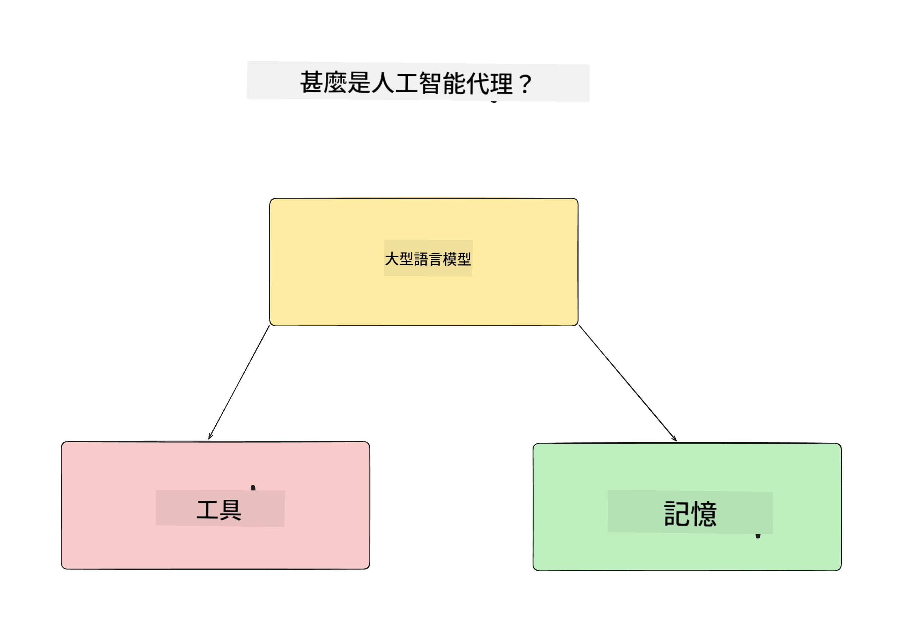
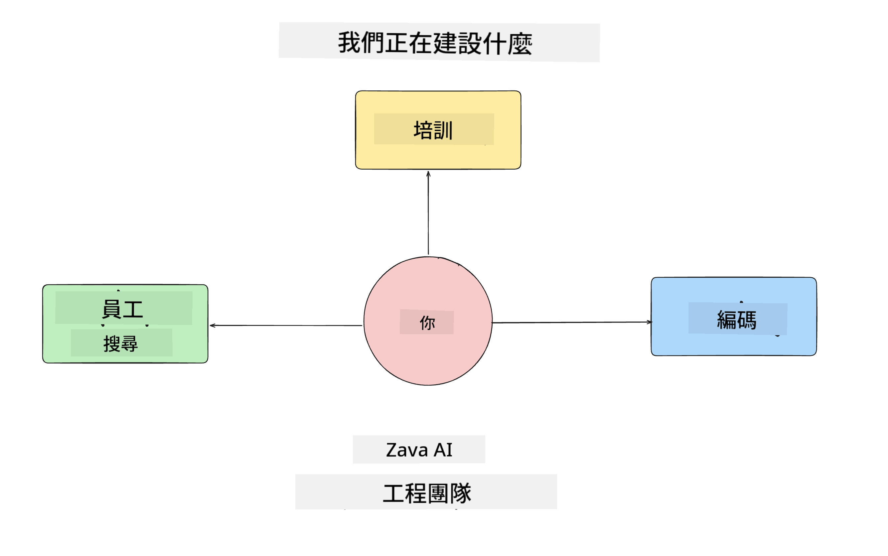
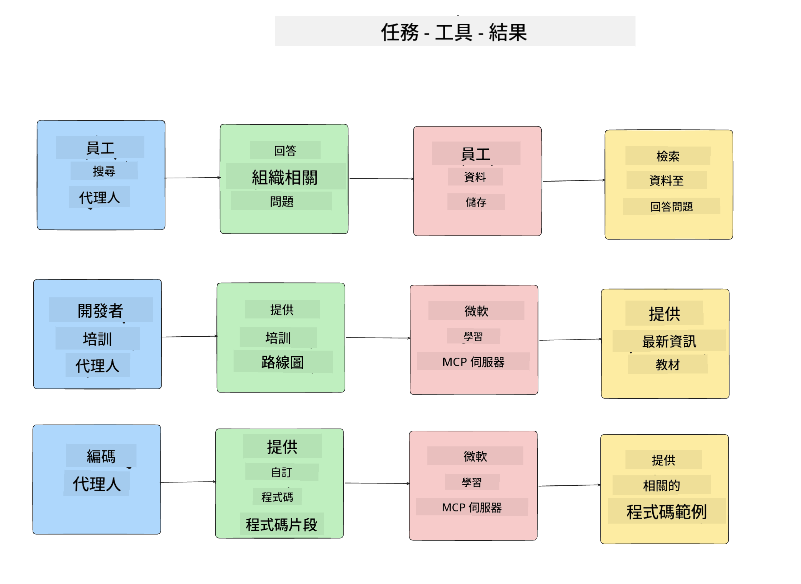
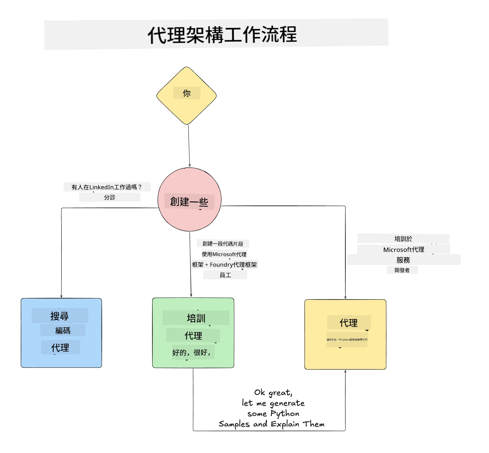

<!--
CO_OP_TRANSLATOR_METADATA:
{
  "original_hash": "99c07849641a850775c188c9333f31e5",
  "translation_date": "2025-12-12T18:18:39+00:00",
  "source_file": "lesson-1-agent-design/README.md",
  "language_code": "mo"
}
-->
# Lesson 1: AI Agent Design

歡迎來到「從零開始建立 AI Agent 到生產課程」的第一課！

在本課中，我們將涵蓋：

- 定義什麼是 AI Agents
  
- 討論我們正在建立的 AI Agent 應用程式  

- 確認每個 agent 所需的工具和服務
  
- 架構我們的 Agent 應用程式
  
讓我們先從定義什麼是 agent 以及為什麼我們會在應用程式中使用它們開始。

## 什麼是 AI Agents？

如果這是你第一次探索如何建立 AI Agent，你可能會有關於如何準確定義 AI Agent 是什麼的問題。

一個簡單的定義 AI Agent 的方式是透過組成它的元件：

**大型語言模型** - LLM 將驅動處理使用者自然語言的能力，解讀他們想完成的任務，以及解讀可用來完成這些任務的工具描述。

**工具** - 這些將是函數、API、資料庫和其他服務，LLM 可以選擇使用它們來完成使用者請求的任務。

**記憶** - 這是我們用來儲存 AI Agent 與使用者之間短期和長期互動的方式。儲存和檢索這些資訊對於持續改進和保存使用者偏好非常重要。

## 我們的 AI Agent 使用案例

在本課程中，我們將建立一個 AI Agent 應用程式，幫助新開發者加入我們的 AI Agent 開發團隊！

在進行任何開發工作之前，建立成功 AI Agent 應用程式的第一步，是明確定義我們期望使用者如何與 AI Agents 互動的場景。

針對此應用程式，我們將處理以下場景：

**場景 1**：新員工加入我們的組織，想了解他們所加入的團隊以及如何與團隊成員聯繫。

**場景 2**：新員工想知道最適合他們開始著手的第一個任務是什麼。

**場景 3**：新員工想收集學習資源和程式碼範例，以幫助他們開始完成任務。

## 確認工具和服務

現在我們已經建立了這些場景，下一步是將它們對應到我們的 AI agents 需要使用的工具和服務，以完成這些任務。

這個過程屬於上下文工程（Context Engineering）範疇，我們將專注於確保 AI Agents 在正確的時間擁有完成任務所需的正確上下文。

讓我們逐場景進行，並透過列出每個 agent 的任務、工具和期望結果，來執行良好的 agentic 設計。

### 場景 1 - 員工搜尋 Agent

**任務** - 回答關於組織中員工的問題，例如加入日期、目前團隊、地點和最後職位。

**工具** - 目前員工名單和組織架構的資料庫

**結果** - 能夠從資料庫檢索資訊，回答一般組織問題及關於員工的具體問題。

### 場景 2 - 任務推薦 Agent

**任務** - 根據新員工的開發經驗，提出 1-3 個新員工可以著手處理的議題。

**工具** - GitHub MCP 伺服器以取得開放議題並建立開發者檔案

**結果** - 能夠閱讀 GitHub 個人檔案的最近 5 次提交和 GitHub 專案的開放議題，並根據匹配情況提出建議。

### 場景 3 - 程式碼助理 Agent

**任務** - 根據「任務推薦」Agent 推薦的開放議題，研究並提供資源，並產生程式碼片段以協助員工。

**工具** - Microsoft Learn MCP 以尋找資源，Code Interpreter 以產生自訂程式碼片段。

**結果** - 如果使用者要求額外協助，工作流程應使用 Learn MCP 伺服器提供資源連結和片段，然後交由 Code Interpreter agent 產生帶有說明的小程式碼片段。

## 架構我們的 Agent 應用程式

現在我們已定義每個 Agent，讓我們建立一個架構圖，幫助我們了解每個 agent 如何根據任務一起或分別運作：

## 下一步

現在我們已設計好每個 agent 及我們的 agentic 系統，讓我們進入下一課，開始開發這些 agents！

---

<!-- CO-OP TRANSLATOR DISCLAIMER START -->
**免責聲明**：  
本文件係使用人工智能翻譯服務 [Co-op Translator](https://github.com/Azure/co-op-translator) 進行翻譯。雖然我們致力於確保準確性，但請注意，自動翻譯可能包含錯誤或不準確之處。原始文件之母語版本應被視為權威來源。對於重要資訊，建議採用專業人工翻譯。我們不對因使用本翻譯而引起之任何誤解或誤釋承擔責任。
<!-- CO-OP TRANSLATOR DISCLAIMER END -->