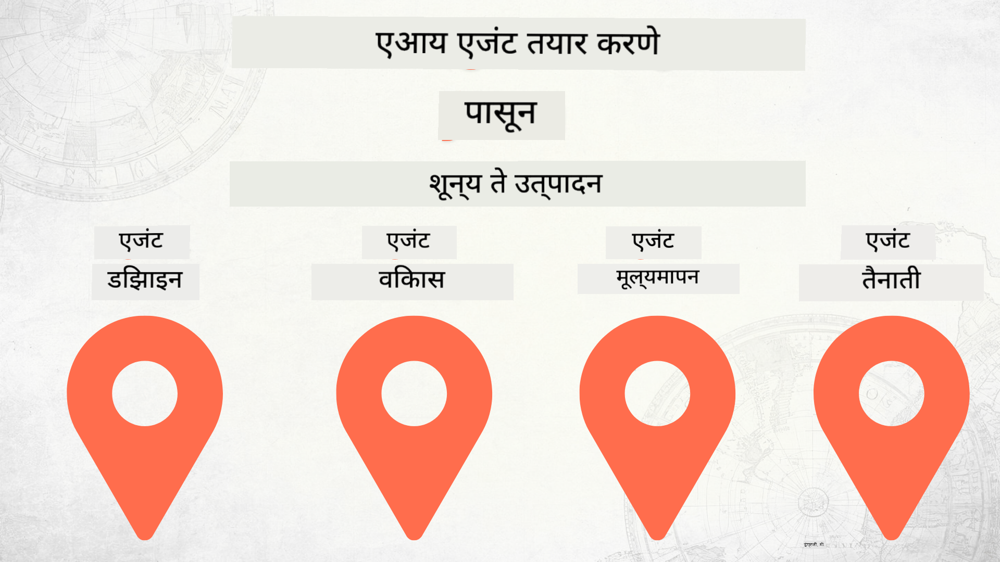

<!--
CO_OP_TRANSLATOR_METADATA:
{
  "original_hash": "73b37a335747d59d319b00aac130f073",
  "translation_date": "2025-12-24T23:07:41+00:00",
  "source_file": "README.md",
  "language_code": "mr"
}
-->
# शून्यापासून उत्पादनापर्यंत AI एजंट्स तयार करणे

### 🌐 बहुभाषिक समर्थन

#### GitHub Action द्वारे समर्थित (स्वयंचलित आणि नेहमी अद्ययावत)

<!-- CO-OP TRANSLATOR LANGUAGES TABLE START -->
[अरबी](../ar/README.md) | [बांग्ला](../bn/README.md) | [बुल्गेरियन](../bg/README.md) | [बर्मी (म्यानमार)](../my/README.md) | [चिनी (सरलीकृत)](../zh/README.md) | [चिनी (परंपरागत, हाँगकाँग)](../hk/README.md) | [चिनी (परंपरागत, मकाऊ)](../mo/README.md) | [चिनी (परंपरागत, तैवान)](../tw/README.md) | [क्रोएशियन](../hr/README.md) | [चेक](../cs/README.md) | [डॅनिश](../da/README.md) | [डच](../nl/README.md) | [एस्टोनियन](../et/README.md) | [फिनिश](../fi/README.md) | [फ्रेंच](../fr/README.md) | [जर्मन](../de/README.md) | [ग्रीक](../el/README.md) | [हिब्रू](../he/README.md) | [हिंदी](../hi/README.md) | [हंगेरियन](../hu/README.md) | [इंडोनेशियाई](../id/README.md) | [इटालियन](../it/README.md) | [जपानी](../ja/README.md) | [कन्नड](../kn/README.md) | [कोरियन](../ko/README.md) | [लिथुआनियन](../lt/README.md) | [मलय](../ms/README.md) | [मलयाळम](../ml/README.md) | [मराठी](./README.md) | [नेपाली](../ne/README.md) | [नायजेरियन पिजिन](../pcm/README.md) | [नॉर्वेजियन](../no/README.md) | [फारसी (पर्शियन)](../fa/README.md) | [पोलिश](../pl/README.md) | [पोर्तुगीज (ब्राझील)](../br/README.md) | [पोर्तुगीज (पोर्तुगाल)](../pt/README.md) | [पंजाबी (गुरमुखी)](../pa/README.md) | [रोमानियन](../ro/README.md) | [रशियन](../ru/README.md) | [सर्बियन (सिरिलिक)](../sr/README.md) | [स्लोव्हाक](../sk/README.md) | [स्लोव्हेनियन](../sl/README.md) | [स्पॅनिश](../es/README.md) | [स्वाहिली](../sw/README.md) | [स्वीडिश](../sv/README.md) | [टागालॉग (फिलिपिनो)](../tl/README.md) | [तामिळ](../ta/README.md) | [तेलुगु](../te/README.md) | [थाई](../th/README.md) | [तुर्किश](../tr/README.md) | [युक्रेनियन](../uk/README.md) | [उर्दू](../ur/README.md) | [व्हिएतनामी](../vi/README.md)
<!-- CO-OP TRANSLATOR LANGUAGES TABLE END -->

## AI एजंट विकास जीवनचक्राच्या मूलभूत तत्त्वे शिकवणारा कोर्स

## 🌱 सुरूवात

हा कोर्स AI एजंट्स तयार करण्याचे आणि तैनात करण्याचे मूलभूत तत्त्वे शिकवणारे धडे समाविष्ट करतो.

प्रत्येक धडा मागील धड्यावर आधारित असतो, त्यामुळे आम्ही सुरुवातीपासून सुरू करून शेवटपर्यंत जाण्याची शिफारस करतो.

AI एजंट विषयांबद्दल अधिक शोधायचे असल्यास, आपण [AI एजंट्स प्रारंभिकांसाठी कोर्स](https://aka.ms/ai-agents-beginners) पाहू शकता.

### इतर शिकणाऱ्यांना भेटा, आपल्या प्रश्नांची उत्तरे मिळवा

जर आपण अडकलात किंवा AI एजंट तयार करण्याबद्दल काही प्रश्न असतील, तर आमच्या समर्पित Discord चॅनेलमध्ये सामील व्हा: [Microsoft Foundry Discord](https://discord.gg/Kuaw3ktsu6).

### आपल्याला काय आवश्यक आहे

प्रत्येक धड्याशी संबंधित स्वतंत्र कोड नमुना आहे जो आपण स्थानिकपणे चालवू शकता. आपली स्वतःची कॉपी तयार करण्यासाठी आपण [या रेपोचे फोर्क करा](https://github.com/microsoft/Building-AI-Agents-From-Zero-To-Production/fork).

हा कोर्स सध्या खालील गोष्टी वापरतो:

- [Microsoft Agent Framework (MAF)](https://aka.ms/ai-agents-beginners/agent-framework)
- [Microsoft Foundry](https://azure.microsoft.com/products/ai-foundry)
- [Azure OpenAI Service](https://azure.microsoft.com/products/ai-foundry/models/openai)
- [Azure CLI](https://learn.microsoft.com/cli/azure/authenticate-azure-cli?view=azure-cli-latest)

सुरू करण्यापूर्वी कृपया खात्री करा की आपल्याकडे या सेवांमध्ये प्रवेश आहे.

मॉडेल होस्टिंग आणि सेवांबाबत अधिक पर्याय लवकरच उपलब्ध होतील. 

## 🗃️ धडे

| **धडा**         | **वर्णन**                                                                                  |
|--------------------|--------------------------------------------------------------------------------------------------|
| [एजंट डिझाइन](./lesson-1-agent-design/README.md)       | आमच्या "Developer Onboarding" एजंट वापर केसची ओळख आणि प्रभावी एजंट कसे डिझाइन करायचे  |
| [एजंट विकास](./lesson-2-agent-development/README.md)  | Microsoft Agent Framework (MAF) वापरून, नवीन विकासकांना ऑनबोर्ड करण्यात मदत करण्यासाठी 3 एजंट तयार करा.       |
| [एजंट मूल्यमापन](./lesson-3-agent-evals/README.md)  | Microsoft Foundry वापरून, आमचे AI एजंट किती चांगले काम करत आहेत आणि त्यांना कसे सुधारायचे ते शोधा. |
| [एजंट तैनाती](./lesson-4-agent-deployment/README.md)   | Hosted Agents आणि OpenAI Chatkit वापरून, AI एजंट कसा उत्पादनात तैनात करायचा ते पहा.       |

## 🎒 इतर कोर्सेस

आमची टीम इतर कोर्सेस तयार करते! हे तपासा:

<!-- CO-OP TRANSLATOR OTHER COURSES START -->
### LangChain

---

### Azure / Edge / MCP / एजंट्स

---
 
### जनरेटिव्ह AI मालिका

[-9333EA?style=for-the-badge&labelColor=E5E7EB&color=9333EA)](https://github.com/microsoft/Generative-AI-for-beginners-dotnet?WT.mc_id=academic-105485-koreyst)
[-C084FC?style=for-the-badge&labelColor=E5E7EB&color=C084FC)](https://github.com/microsoft/generative-ai-for-beginners-java?WT.mc_id=academic-105485-koreyst)
[-E879F9?style=for-the-badge&labelColor=E5E7EB&color=E879F9)](https://github.com/microsoft/generative-ai-with-javascript?WT.mc_id=academic-105485-koreyst)

---
 
### मूलभूत शिक्षण

---
 
### Copilot Series

<!-- CO-OP TRANSLATOR OTHER COURSES END -->

## Contributing

हा प्रकल्प योगदान आणि सूचना स्वागत करतो. बहुतेक योगदानांसाठी आपण Contributor License Agreement (CLA) शी सहमत व्हावे लागते ज्यात आपण हे घोषित करता की आपल्याकडे आपल्या योगदानाचा वापर करण्याचा अधिकार आहे आणि आपण प्रत्यक्षात आम्हाला तो अधिकार देत आहात. तपशीलांसाठी भेट द्या <https://cla.opensource.microsoft.com>.

जेव्हा आपण एक pull request सादर करता, तेव्हा एक CLA बॉट आपल्याला CLA देण्याची आवश्यकता आहे का हे स्वयंचलितपणे ठरवेल आणि PR योग्यरित्या चिन्हांकित करेल (उदा., स्थिती तपासणी, टिप्पणी). फक्त बॉटने दिलेल्या सूचनांचे अनुसरण करा. आमच्या CLA चा वापर करणाऱ्या सर्व रेपॉजमध्ये हे आपल्याला फक्त एकदाच करावे लागेल.

या प्रकल्पाने [Microsoft Open Source Code of Conduct](https://opensource.microsoft.com/codeofconduct/) स्वीकारला आहे. अधिक माहितीसाठी [Code of Conduct FAQ](https://opensource.microsoft.com/codeofconduct/faq/) पहा किंवा कोणतेही अतिरिक्त प्रश्न किंवा टिप्पणी असल्यास [opencode@microsoft.com](mailto:opencode@microsoft.com) यांना संपर्क करा.

## Trademarks

हा प्रकल्प प्रकल्प, उत्पादने किंवा सेवांसाठी ट्रेडमार्क किंवा लोगो समाविष्ट करू शकतो. Microsoft ट्रेडमार्क किंवा लोगोचा अधिकृत वापर हे [Microsoft's Trademark & Brand Guidelines](https://www.microsoft.com/legal/intellectualproperty/trademarks/usage/general) लागू असून त्यांचे पालन करणे आवश्यक आहे. या प्रकल्पाच्या सुधारित आवृत्त्यांमध्ये Microsoft चे ट्रेडमार्क किंवा लोगो वापरल्याने गोंधळ निर्माण होऊ नये किंवा Microsoft च्या प्रायोजकत्वाचा अर्थ निघू नये. तृतीय-पक्ष ट्रेडमार्क किंवा लोगोच्या कोणत्याही वापरासाठी त्या तृतीय-पक्षांच्या धोरणांचे पालन करणे आवश्यक आहे.

## Getting Help

जर आपण अडकलात किंवा AI अॅप्स बनवण्याबद्दल काही प्रश्न असतील तर सामील व्हा:

आपल्याकडे उत्पादनाबद्दल अभिप्राय किंवा निर्माण करताना त्रुटी असल्यास भेट द्या:

---

<!-- CO-OP TRANSLATOR DISCLAIMER START -->
अस्वीकरण:
हा दस्तऐवज AI अनुवाद सेवा Co‑op Translator (https://github.com/Azure/co-op-translator) वापरून अनुवादित केला आहे. आम्ही अचूकतेसाठी प्रयत्न करतो, परंतु कृपया लक्षात घ्या की स्वयंचलित अनुवादांमध्ये त्रुटी किंवा अयोग्य माहिती असू शकते. मूळ दस्तऐवज त्याच्या मूळ भाषेत अधिकृत स्रोत म्हणून मानले जावे. महत्त्वाच्या माहितीसाठी व्यावसायिक मानवी अनुवादाची शिफारस केली जाते. या अनुवादाच्या वापरामुळे उद्भवणाऱ्या कोणत्याही गैरसमजांसाठी किंवा चुकीच्या अर्थलावण्यांबद्दल आम्ही जबाबदार नाही.
<!-- CO-OP TRANSLATOR DISCLAIMER END -->