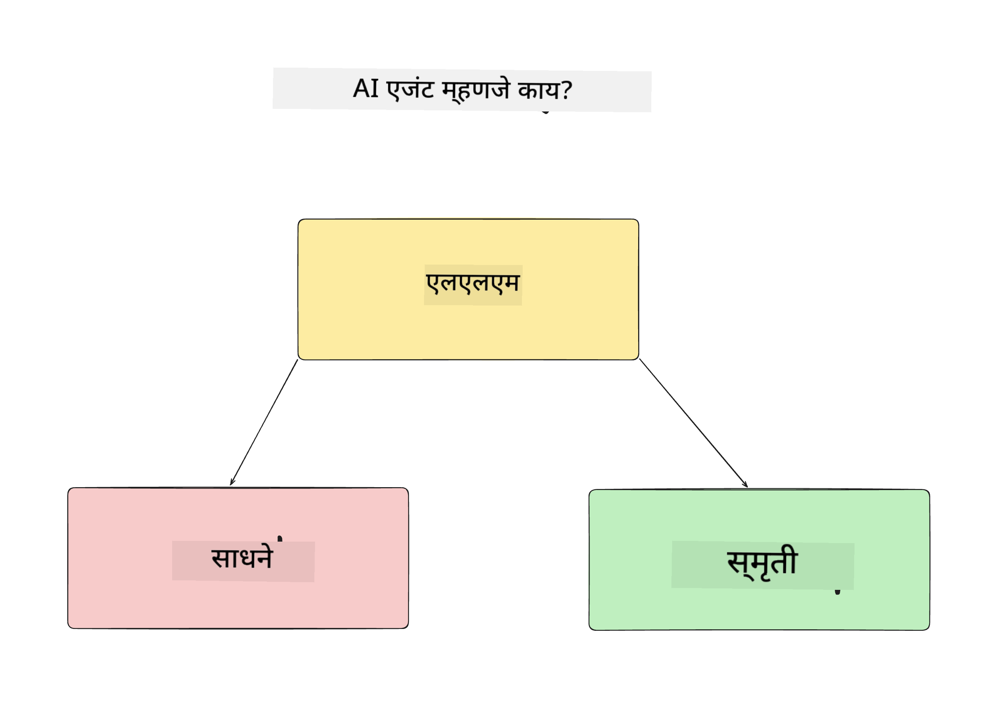
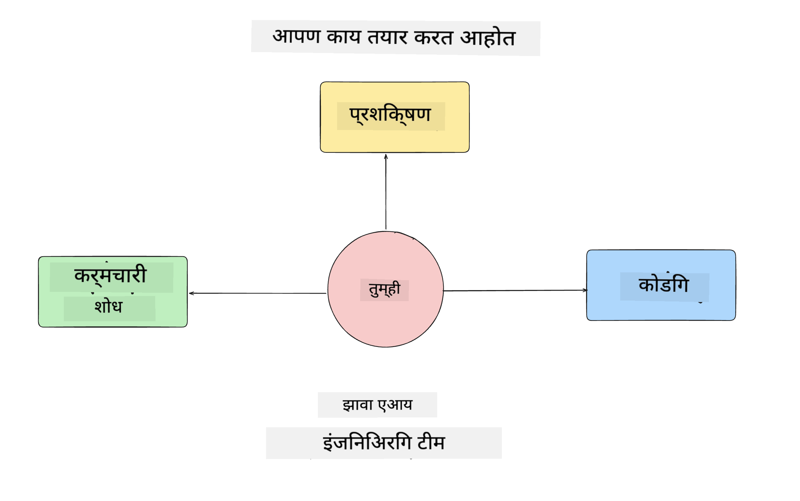
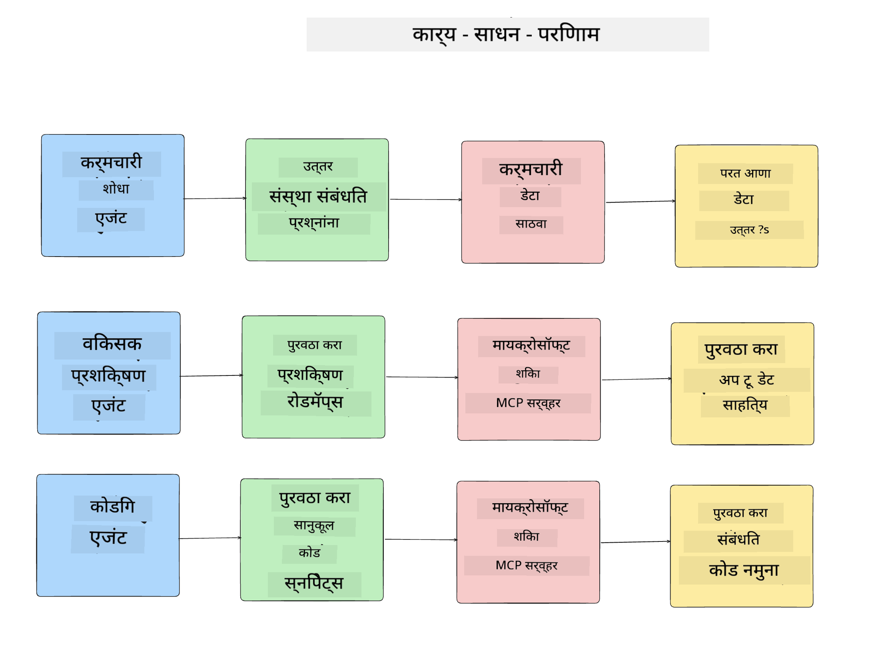
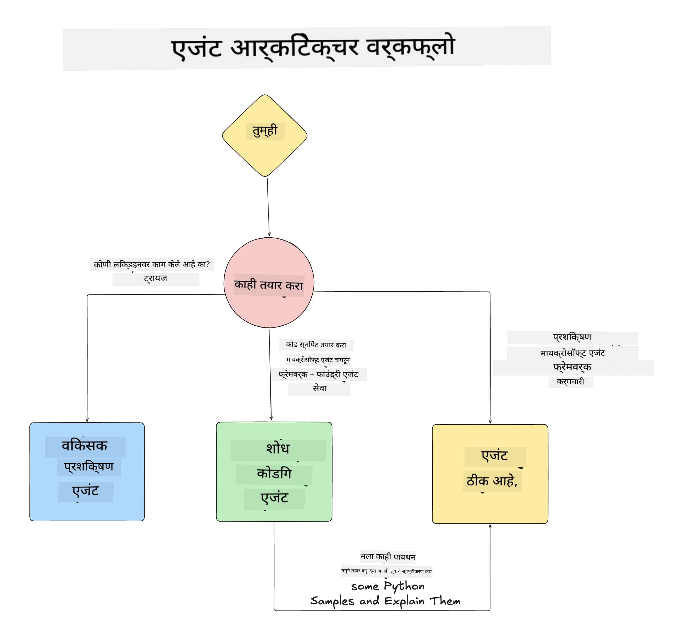

<!--
CO_OP_TRANSLATOR_METADATA:
{
  "original_hash": "99c07849641a850775c188c9333f31e5",
  "translation_date": "2025-12-12T18:23:19+00:00",
  "source_file": "lesson-1-agent-design/README.md",
  "language_code": "mr"
}
-->
# धडा 1: AI एजंट डिझाइन

"शून्यापासून उत्पादनापर्यंत AI एजंट तयार करणे" कोर्सच्या पहिल्या धड्यात आपले स्वागत आहे!

या धड्यात आपण खालील गोष्टींचा आढावा घेऊ:

- AI एजंट म्हणजे काय हे परिभाषित करणे
  
- आपण तयार करत असलेल्या AI एजंट अनुप्रयोगावर चर्चा करणे  

- प्रत्येक एजंटसाठी आवश्यक साधने आणि सेवा ओळखणे
  
- आपल्या एजंट अनुप्रयोगाची रचना करणे
  
चला सुरुवात करूया की एजंट म्हणजे काय आणि आपण अनुप्रयोगात त्यांचा वापर का करतो.

## AI एजंट म्हणजे काय?

जर तुम्ही AI एजंट कसा तयार करायचा हे पहिल्यांदा शोधत असाल, तर तुम्हाला AI एजंट म्हणजे काय याबाबत नेमके कसे परिभाषित करायचे याबाबत प्रश्न असू शकतात.

AI एजंट म्हणजे काय हे सोप्या भाषेत समजावून सांगायचे तर त्याचे घटक हे आहेत:

**मोठे भाषा मॉडेल** - LLM वापरकर्त्यांकडून नैसर्गिक भाषा प्रक्रिया करण्याची क्षमता देते, ज्यामुळे ते पूर्ण करायचे असलेले कार्य समजून घेते तसेच त्या कार्यांसाठी उपलब्ध साधनांचे वर्णन समजून घेते.

**साधने** - ही फंक्शन्स, API, डेटा स्टोअर्स आणि इतर सेवा असतात ज्यांचा LLM वापरकर्त्याने मागितलेल्या कार्यांसाठी वापर करू शकतो.

**स्मृती** - ही AI एजंट आणि वापरकर्त्यादरम्यानच्या लघुकालीन आणि दीर्घकालीन संवादांची साठवण आणि पुनर्प्राप्ती कशी करायची यासाठी आहे. ही माहिती साठवणे आणि पुनर्प्राप्त करणे सुधारणा करण्यासाठी आणि वापरकर्त्याच्या पसंती जपण्यासाठी महत्त्वाचे आहे.

## आमचा AI एजंट वापर प्रकरण

या कोर्ससाठी, आपण एक AI एजंट अनुप्रयोग तयार करणार आहोत जो नवीन विकासकांना आमच्या AI एजंट विकास टीममध्ये सामील होण्यास मदत करतो!

कोणतेही विकास कार्य करण्यापूर्वी, यशस्वी AI एजंट अनुप्रयोग तयार करण्याचा पहिला टप्पा म्हणजे वापरकर्ते आमच्या AI एजंटसह कसे काम करतील याबाबत स्पष्ट परिस्थिती परिभाषित करणे.

या अनुप्रयोगासाठी, आपण या परिस्थितींवर काम करू:

**परिस्थिती 1**: नवीन कर्मचारी आमच्या संस्थेत सामील होतो आणि त्यांनी सामील झालेल्या टीमबद्दल अधिक जाणून घ्यायचे आहे तसेच त्यांच्याशी कसे संपर्क साधायचा हे जाणून घ्यायचे आहे.

**परिस्थिती 2:** नवीन कर्मचारी त्यांच्यासाठी सुरुवातीला कोणते कार्य सर्वोत्तम असेल हे जाणून घेऊ इच्छितो.

**परिस्थिती 3:** नवीन कर्मचारी शिकण्याचे स्रोत आणि कोड नमुने गोळा करू इच्छितो जे त्यांना हे कार्य पूर्ण करण्यात मदत करतील.

## साधने आणि सेवा ओळखणे

आता जेव्हा आपण या परिस्थिती तयार केल्या आहेत, पुढचा टप्पा म्हणजे त्या साधने आणि सेवा यांच्याशी जुळवून घेणे ज्यांची आमच्या AI एजंट्सना या कार्यांसाठी गरज असेल.

हा प्रक्रिया संदर्भ अभियांत्रिकीच्या श्रेणीत येते कारण आपण हे सुनिश्चित करण्यावर लक्ष केंद्रित करणार आहोत की आमच्या AI एजंट्सकडे योग्य वेळी योग्य संदर्भ आहे जेणेकरून ते कार्य पूर्ण करू शकतील.

चला ही परिस्थिती एक एक करून पाहू आणि प्रत्येक एजंटचे कार्य, साधने आणि अपेक्षित परिणाम यादी करून चांगले एजंट डिझाइन करूया.

### परिस्थिती 1 - कर्मचारी शोध एजंट

**कार्य** - संस्थेतील कर्मचाऱ्यांबद्दल प्रश्नांची उत्तरे देणे जसे की सामील होण्याची तारीख, सध्याची टीम, स्थान आणि शेवटची पदवी.

**साधने** - सध्याच्या कर्मचाऱ्यांची यादी आणि संघटनेचा चार्ट असलेला डेटास्टोर

**परिणाम** - डेटास्टोरमधून माहिती मिळवून सामान्य संघटनात्मक प्रश्न आणि कर्मचाऱ्यांबद्दल विशिष्ट प्रश्नांची उत्तरे देणे.

### परिस्थिती 2 - कार्य शिफारस एजंट

**कार्य** - नवीन कर्मचाऱ्याच्या विकासक अनुभवावर आधारित, 1-3 समस्या सुचवणे ज्यावर नवीन कर्मचारी काम करू शकतो.

**साधने** - GitHub MCP सर्व्हर जेथे खुले मुद्दे मिळवता येतात आणि विकासक प्रोफाइल तयार करता येतो

**परिणाम** - GitHub प्रोफाइलच्या शेवटच्या 5 कमिट्स वाचणे आणि GitHub प्रोजेक्टवरील खुले मुद्दे वाचून जुळणीवर आधारित शिफारसी करणे.

### परिस्थिती 3 - कोड सहाय्यक एजंट

**कार्य** - "कार्य शिफारस" एजंटने सुचवलेल्या खुले मुद्द्यांवर आधारित संशोधन करणे, संसाधने प्रदान करणे आणि कर्मचाऱ्याला मदत करण्यासाठी कोड स्निपेट्स तयार करणे.

**साधने** - Microsoft Learn MCP संसाधने शोधण्यासाठी आणि Code Interpreter सानुकूल कोड स्निपेट्स तयार करण्यासाठी.

**परिणाम** - जर वापरकर्त्याने अतिरिक्त मदत मागितली, तर वर्कफ्लो Learn MCP सर्व्हर वापरून संसाधनांचे दुवे आणि स्निपेट्स प्रदान करेल आणि नंतर Code Interpreter एजंटकडे लहान कोड स्निपेट्स स्पष्टीकरणांसह तयार करण्यासाठी हस्तांतरित करेल.

## आमच्या एजंट अनुप्रयोगाची रचना

आता जेव्हा आपण प्रत्येक एजंट परिभाषित केला आहे, तर एक आर्किटेक्चर आकृती तयार करूया जी आपल्याला समजून घेण्यास मदत करेल की प्रत्येक एजंट कसा एकत्र आणि स्वतंत्रपणे कार्य करेल, कार्यानुसार:

## पुढील टप्पे

आता जेव्हा आपण प्रत्येक एजंट आणि आमची एजंट प्रणाली डिझाइन केली आहे, तर चला पुढील धड्यात जाऊया जिथे आपण प्रत्येक एजंट विकसित करू!

---

<!-- CO-OP TRANSLATOR DISCLAIMER START -->
**अस्वीकरण**:
हा दस्तऐवज AI अनुवाद सेवा [Co-op Translator](https://github.com/Azure/co-op-translator) वापरून अनुवादित केला आहे. आम्ही अचूकतेसाठी प्रयत्नशील असलो तरी, कृपया लक्षात घ्या की स्वयंचलित अनुवादांमध्ये चुका किंवा अचूकतेची कमतरता असू शकते. मूळ दस्तऐवज त्याच्या स्थानिक भाषेत अधिकृत स्रोत मानला जावा. महत्त्वाच्या माहितीसाठी व्यावसायिक मानवी अनुवाद शिफारसीय आहे. या अनुवादाच्या वापरामुळे उद्भवलेल्या कोणत्याही गैरसमजुती किंवा चुकीच्या अर्थलागी आम्ही जबाबदार नाही.
<!-- CO-OP TRANSLATOR DISCLAIMER END -->