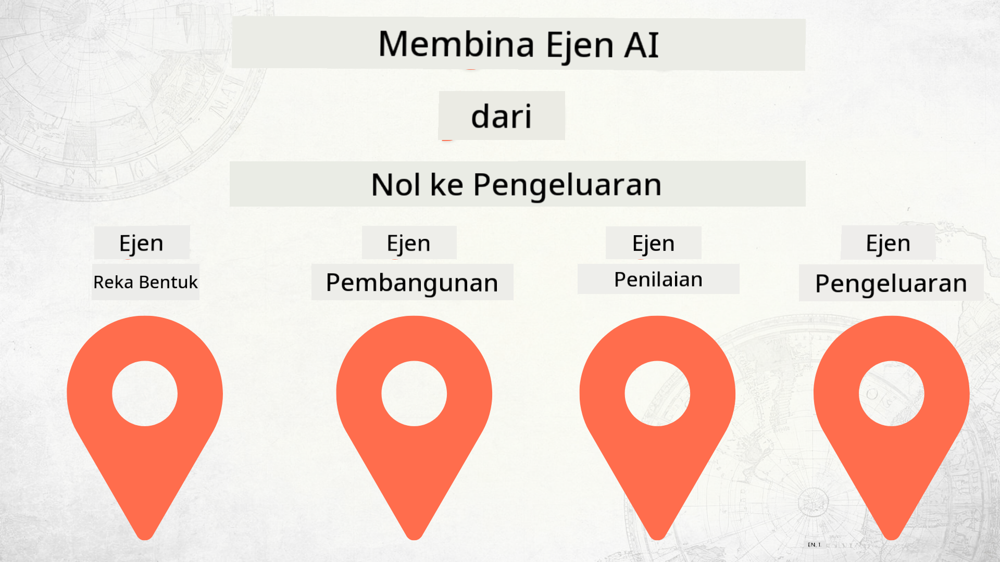

<!--
CO_OP_TRANSLATOR_METADATA:
{
  "original_hash": "f8ea8224e106540413202b4151bb2bcd",
  "translation_date": "2025-12-15T14:29:59+00:00",
  "source_file": "README.md",
  "language_code": "ms"
}
-->
# Membina Ejen AI dari Kosong ke Pengeluaran

### 🌐 Sokongan Pelbagai Bahasa

#### Disokong melalui GitHub Action (Automatik & Sentiasa Dikemas Kini)

<!-- CO-OP TRANSLATOR LANGUAGES TABLE START -->
[Arabic](../ar/README.md) | [Bengali](../bn/README.md) | [Bulgarian](../bg/README.md) | [Burmese (Myanmar)](../my/README.md) | [Chinese (Simplified)](../zh/README.md) | [Chinese (Traditional, Hong Kong)](../hk/README.md) | [Chinese (Traditional, Macau)](../mo/README.md) | [Chinese (Traditional, Taiwan)](../tw/README.md) | [Croatian](../hr/README.md) | [Czech](../cs/README.md) | [Danish](../da/README.md) | [Dutch](../nl/README.md) | [Estonian](../et/README.md) | [Finnish](../fi/README.md) | [French](../fr/README.md) | [German](../de/README.md) | [Greek](../el/README.md) | [Hebrew](../he/README.md) | [Hindi](../hi/README.md) | [Hungarian](../hu/README.md) | [Indonesian](../id/README.md) | [Italian](../it/README.md) | [Japanese](../ja/README.md) | [Kannada](../kn/README.md) | [Korean](../ko/README.md) | [Lithuanian](../lt/README.md) | [Malay](./README.md) | [Malayalam](../ml/README.md) | [Marathi](../mr/README.md) | [Nepali](../ne/README.md) | [Nigerian Pidgin](../pcm/README.md) | [Norwegian](../no/README.md) | [Persian (Farsi)](../fa/README.md) | [Polish](../pl/README.md) | [Portuguese (Brazil)](../br/README.md) | [Portuguese (Portugal)](../pt/README.md) | [Punjabi (Gurmukhi)](../pa/README.md) | [Romanian](../ro/README.md) | [Russian](../ru/README.md) | [Serbian (Cyrillic)](../sr/README.md) | [Slovak](../sk/README.md) | [Slovenian](../sl/README.md) | [Spanish](../es/README.md) | [Swahili](../sw/README.md) | [Swedish](../sv/README.md) | [Tagalog (Filipino)](../tl/README.md) | [Tamil](../ta/README.md) | [Telugu](../te/README.md) | [Thai](../th/README.md) | [Turkish](../tr/README.md) | [Ukrainian](../uk/README.md) | [Urdu](../ur/README.md) | [Vietnamese](../vi/README.md)
<!-- CO-OP TRANSLATOR LANGUAGES TABLE END -->

## Kursus yang mengajar anda asas-asas Kitaran Hayat Pembangunan Ejen AI

## 🌱 Memulakan

Kursus ini mempunyai pelajaran yang merangkumi asas-asas membina dan menyebarkan Ejen AI.

Setiap pelajaran dibina berdasarkan pelajaran sebelumnya, jadi kami mengesyorkan bermula dari awal dan meneruskan sehingga akhir.

Jika anda ingin meneroka lebih lanjut tentang topik Ejen AI, anda boleh semak [Kursus Ejen AI untuk Pemula](https://aka.ms/ai-agents-beginners).

### Berjumpa Pelajar Lain, Dapatkan Jawapan untuk Soalan Anda

Jika anda tersekat atau mempunyai sebarang soalan tentang membina Ejen AI, sertai Saluran Discord khusus kami di [Microsoft Foundry Discord](https://discord.gg/Kuaw3ktsu6).

### Apa yang Anda Perlukan

Setiap Pelajaran mempunyai contoh kod sendiri yang boleh anda jalankan secara tempatan. Anda boleh [fork repo ini](https://github.com/microsoft/Building-AI-Agents-From-Zero-To-Production/fork) untuk membuat salinan anda sendiri.

Kursus ini kini menggunakan yang berikut:

- [Microsoft Agent Framework (MAF)](https://aka.ms/ai-agents-beginners/agent-framework)
- [Microsoft Foundry](https://azure.microsoft.com/products/ai-foundry)
- [Azure OpenAI Service](https://azure.microsoft.com/products/ai-foundry/models/openai)
- [Azure CLI](https://learn.microsoft.com/cli/azure/authenticate-azure-cli?view=azure-cli-latest)

Sila pastikan anda mempunyai akses kepada perkhidmatan ini sebelum memulakan.

Pilihan lebih lanjut mengenai hosting model dan perkhidmatan akan datang tidak lama lagi.

## 🗃️ Pelajaran

| **Pelajaran**         | **Penerangan**                                                                                  |
|-----------------------|------------------------------------------------------------------------------------------------|
| [Reka Bentuk Ejen](./lesson-1-agent-design/README.md)       | Pengenalan kepada Kes Penggunaan Ejen "Developer Onboarding" kami dan cara mereka bentuk ejen yang berkesan  |
| [Pembangunan Ejen](./lesson-2-agent-development/README.md)  | Menggunakan Microsoft Agent Framework (MAF), cipta 3 ejen untuk membantu pembangun baru memulakan.       |
| [Penilaian Ejen](./lesson-3-agent-evals/README.md)  | Menggunakan Microsoft Foundry, ketahui prestasi Ejen AI kami dan cara memperbaikinya. |
| [Pengeluaran Ejen](./lesson-4-agent-deployment/README.md)   | Menggunakan Hosted Agents dan OpenAI Chatkit, lihat cara menyebarkan Ejen AI ke dalam pengeluaran.       |

## Menyumbang

Projek ini mengalu-alukan sumbangan dan cadangan. Kebanyakan sumbangan memerlukan anda bersetuju dengan
Perjanjian Lesen Penyumbang (CLA) yang menyatakan bahawa anda mempunyai hak, dan benar-benar memberikan kami
hak untuk menggunakan sumbangan anda. Untuk maklumat lanjut, lawati <https://cla.opensource.microsoft.com>.

Apabila anda menghantar permintaan tarik, bot CLA akan secara automatik menentukan sama ada anda perlu menyediakan
CLA dan menghias PR dengan sewajarnya (contohnya, pemeriksaan status, komen). Ikuti sahaja arahan
yang diberikan oleh bot. Anda hanya perlu melakukan ini sekali sahaja untuk semua repos yang menggunakan CLA kami.

Projek ini telah mengamalkan [Kod Etika Sumber Terbuka Microsoft](https://opensource.microsoft.com/codeofconduct/).
Untuk maklumat lanjut, lihat [Soalan Lazim Kod Etika](https://opensource.microsoft.com/codeofconduct/faq/) atau
hubungi [opencode@microsoft.com](mailto:opencode@microsoft.com) untuk sebarang soalan atau komen tambahan.

## Tanda Dagangan

Projek ini mungkin mengandungi tanda dagangan atau logo untuk projek, produk, atau perkhidmatan. Penggunaan sah tanda dagangan atau logo Microsoft tertakluk kepada dan mesti mengikuti
[Garisan Panduan Tanda Dagangan & Jenama Microsoft](https://www.microsoft.com/legal/intellectualproperty/trademarks/usage/general).
Penggunaan tanda dagangan atau logo Microsoft dalam versi projek yang diubah suai tidak boleh menyebabkan kekeliruan atau memberi gambaran bahawa Microsoft menaja.
Sebarang penggunaan tanda dagangan atau logo pihak ketiga tertakluk kepada polisi pihak ketiga tersebut.

## Mendapatkan Bantuan

Jika anda tersekat atau mempunyai sebarang soalan tentang membina aplikasi AI, sertai:

Jika anda mempunyai maklum balas produk atau ralat semasa membina, lawati:

---

<!-- CO-OP TRANSLATOR DISCLAIMER START -->
**Penafian**:  
Dokumen ini telah diterjemahkan menggunakan perkhidmatan terjemahan AI [Co-op Translator](https://github.com/Azure/co-op-translator). Walaupun kami berusaha untuk ketepatan, sila ambil maklum bahawa terjemahan automatik mungkin mengandungi kesilapan atau ketidaktepatan. Dokumen asal dalam bahasa asalnya harus dianggap sebagai sumber yang sahih. Untuk maklumat penting, terjemahan profesional oleh manusia adalah disyorkan. Kami tidak bertanggungjawab atas sebarang salah faham atau salah tafsir yang timbul daripada penggunaan terjemahan ini.
<!-- CO-OP TRANSLATOR DISCLAIMER END -->