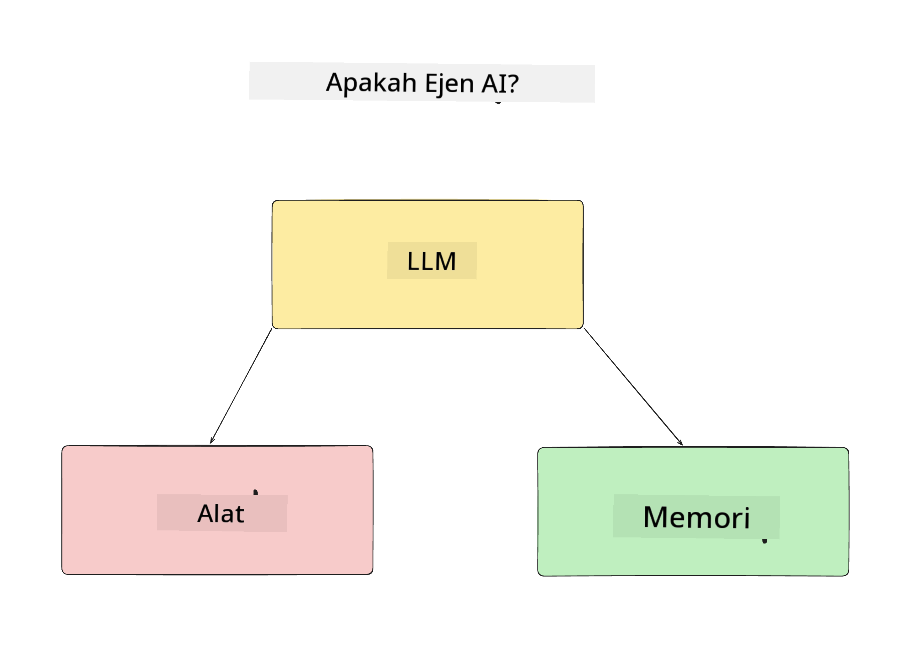
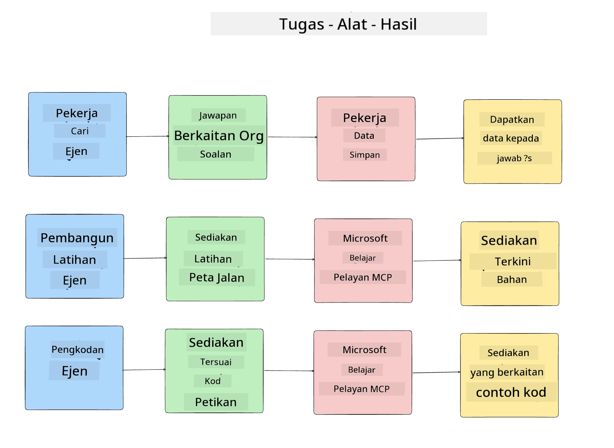
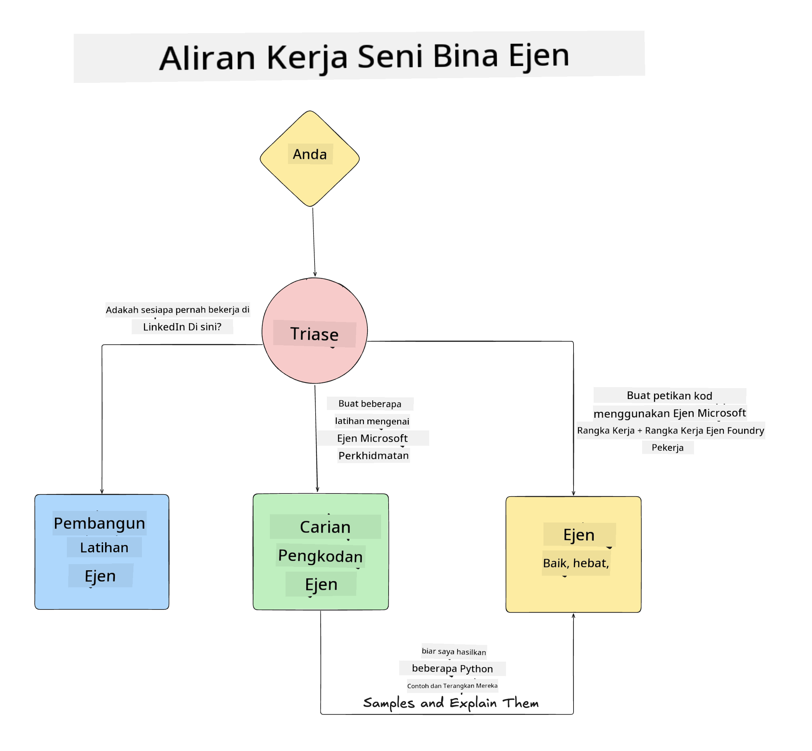

<!--
CO_OP_TRANSLATOR_METADATA:
{
  "original_hash": "99c07849641a850775c188c9333f31e5",
  "translation_date": "2025-12-12T18:35:15+00:00",
  "source_file": "lesson-1-agent-design/README.md",
  "language_code": "ms"
}
-->
# Lesson 1: Reka Bentuk Ejen AI

Selamat datang ke pelajaran pertama kursus "Membina Ejen AI dari Kosong ke Pengeluaran"!

Dalam pelajaran ini kita akan membincangkan:

- Mendefinisikan apa itu Ejen AI
  
- Membincangkan Aplikasi Ejen AI yang kita bina  

- Mengenal pasti alat dan perkhidmatan yang diperlukan untuk setiap ejen
  
- Merekabentuk Aplikasi Ejen kita
  
Mari kita mulakan dengan mendefinisikan apa itu ejen dan mengapa kita menggunakannya dalam aplikasi.

## Apa Itu Ejen AI?

Jika ini kali pertama anda meneroka cara membina Ejen AI, anda mungkin mempunyai soalan tentang bagaimana untuk mentakrifkan dengan tepat apa itu Ejen AI.

Cara mudah untuk mentakrifkan apa itu Ejen AI adalah melalui komponen yang membinanya:

**Model Bahasa Besar** - LLM akan menggerakkan kedua-dua keupayaan untuk memproses bahasa semula jadi dari pengguna untuk mentafsir tugasan yang mereka ingin selesaikan serta mentafsir penerangan alat yang tersedia untuk melengkapkan tugasan tersebut.

**Alat** - Ini akan menjadi fungsi, API, stor data dan perkhidmatan lain yang boleh dipilih oleh LLM untuk digunakan bagi melengkapkan tugasan yang diminta oleh pengguna.

**Memori** - Ini adalah cara kita menyimpan interaksi jangka pendek dan jangka panjang antara Ejen AI dan pengguna. Menyimpan dan mengambil maklumat ini penting untuk membuat penambahbaikan dan menyimpan keutamaan pengguna dari masa ke masa.

## Kes Penggunaan Ejen AI Kami

Untuk kursus ini, kita akan membina aplikasi Ejen AI yang membantu pembangun baru menyertai Pasukan Pembangunan Ejen AI kami!

Sebelum kita melakukan sebarang kerja pembangunan, langkah pertama untuk mencipta aplikasi Ejen AI yang berjaya adalah dengan mentakrifkan senario yang jelas tentang bagaimana kita menjangka pengguna kita akan berinteraksi dengan Ejen AI kita.

Untuk aplikasi ini, kita akan bekerja dengan senario berikut:

**Senario 1**: Seorang pekerja baru menyertai organisasi kita dan ingin mengetahui lebih lanjut tentang pasukan yang mereka sertai dan bagaimana untuk berhubung dengan mereka.

**Senario 2:** Seorang pekerja baru ingin mengetahui apakah tugasan pertama terbaik untuk mereka mulakan.

**Senario 3:** Seorang pekerja baru ingin mengumpul sumber pembelajaran dan contoh kod untuk membantu mereka memulakan tugasan ini.

## Mengenal Pasti Alat dan Perkhidmatan

Sekarang kita telah mencipta senario ini, langkah seterusnya adalah memetakan mereka kepada alat dan perkhidmatan yang diperlukan oleh ejen AI kita untuk melengkapkan tugasan ini.

Proses ini termasuk dalam kategori Kejuruteraan Konteks kerana kita akan memberi tumpuan untuk memastikan Ejen AI kita mempunyai konteks yang betul pada masa yang tepat untuk melengkapkan tugasan.

Mari kita lakukan ini satu persatu mengikut senario dan melaksanakan reka bentuk ejen yang baik dengan menyenaraikan tugasan, alat dan hasil yang diingini untuk setiap ejen.

### Senario 1 - Ejen Carian Pekerja

**Tugasan** - Menjawab soalan tentang pekerja dalam organisasi seperti tarikh menyertai, pasukan semasa, lokasi dan jawatan terakhir.

**Alat** - Stor data senarai pekerja semasa dan carta organisasi

**Hasil** - Mampu mendapatkan maklumat dari stor data untuk menjawab soalan umum organisasi dan soalan khusus tentang pekerja.

### Senario 2 - Ejen Cadangan Tugasan

**Tugasan** - Berdasarkan pengalaman pembangun pekerja baru, mencadangkan 1-3 isu yang boleh pekerja baru kerjakan.

**Alat** - Pelayan MCP GitHub untuk mendapatkan isu terbuka dan membina profil pembangun

**Hasil** - Mampu membaca 5 komit terakhir profil GitHub dan isu terbuka pada projek GitHub serta membuat cadangan berdasarkan padanan

### Senario 3 - Ejen Pembantu Kod

**Tugasan** - Berdasarkan Isu Terbuka yang dicadangkan oleh Ejen "Cadangan Tugasan", membuat kajian dan menyediakan sumber serta menjana petikan kod untuk membantu pekerja.

**Alat** - Microsoft Learn MCP untuk mencari sumber dan Penafsir Kod untuk menjana petikan kod khusus.

**Hasil** - Jika pengguna meminta bantuan tambahan, aliran kerja harus menggunakan Pelayan Learn MCP untuk menyediakan pautan dan petikan kepada sumber dan kemudian menyerahkan kepada ejen Penafsir Kod untuk menjana petikan kod kecil dengan penjelasan.

## Merekabentuk Aplikasi Ejen Kita

Sekarang kita telah mentakrifkan setiap Ejen kita, mari cipta rajah seni bina yang akan membantu kita memahami bagaimana setiap ejen akan bekerjasama dan berasingan bergantung pada tugasan:

## Langkah Seterusnya

Sekarang kita telah mereka bentuk setiap ejen dan sistem ejen kita, mari teruskan ke pelajaran seterusnya di mana kita akan membangunkan setiap ejen ini!

---

<!-- CO-OP TRANSLATOR DISCLAIMER START -->
**Penafian**:  
Dokumen ini telah diterjemahkan menggunakan perkhidmatan terjemahan AI [Co-op Translator](https://github.com/Azure/co-op-translator). Walaupun kami berusaha untuk ketepatan, sila ambil perhatian bahawa terjemahan automatik mungkin mengandungi kesilapan atau ketidaktepatan. Dokumen asal dalam bahasa asalnya harus dianggap sebagai sumber yang sahih. Untuk maklumat penting, terjemahan profesional oleh manusia adalah disyorkan. Kami tidak bertanggungjawab atas sebarang salah faham atau salah tafsir yang timbul daripada penggunaan terjemahan ini.
<!-- CO-OP TRANSLATOR DISCLAIMER END -->