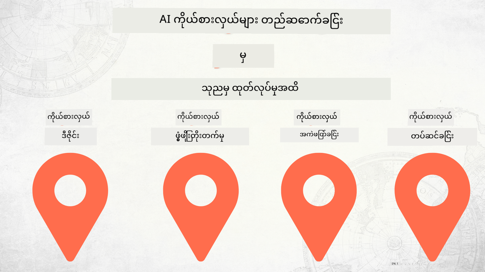

<!--
CO_OP_TRANSLATOR_METADATA:
{
  "original_hash": "73b37a335747d59d319b00aac130f073",
  "translation_date": "2025-12-25T00:03:55+00:00",
  "source_file": "README.md",
  "language_code": "my"
}
-->
# သုညမှ ထုတ်လုပ်ရေးထိ AI Agent များကို တည်ဆောက်ခြင်း

### 🌐 ဘာသာစကား မျိုးစုံ ထောက်ပံ့မှု

#### GitHub Action မှတဆင့် ထောက်ပံ့ထားသည် (အလိုအလျှောက်နှင့် အမြဲတမ်း အပ်ဒိတ်)

<!-- CO-OP TRANSLATOR LANGUAGES TABLE START -->
[အာရဗစ်](../ar/README.md) | [ဘင်္ဂါလီ](../bn/README.md) | [ဘူလ်ဂေးရီးယား](../bg/README.md) | [မြန်မာ (Myanmar)](./README.md) | [တရုတ် (ရိုးရှင်း)](../zh/README.md) | [တရုတ် (ပုံမှန်၊ ဟောင်ကောင်)](../hk/README.md) | [တရုတ် (ပုံမှန်၊ မကာအို)](../mo/README.md) | [တရုတ် (ပုံမှန်၊ တိုင်းဝမ်)](../tw/README.md) | [ခရိုအေးရှီးယား](../hr/README.md) | [ချက်](../cs/README.md) | [ဒိန်းမတ်](../da/README.md) | [ဒတ်ချ်](../nl/README.md) | [အက်စတိုနီးယား](../et/README.md) | [ဖင်နစ်](../fi/README.md) | [ပြင်သစ်](../fr/README.md) | [ဂျာမန်](../de/README.md) | [ဂရိ](../el/README.md) | [ဟီဘရူး](../he/README.md) | [ဟိန်ဒီ](../hi/README.md) | [ဟန်ဂေရီယန်](../hu/README.md) | [အင်ဒိုနီးရှား](../id/README.md) | [အီတလီ](../it/README.md) | [ဂျပန်](../ja/README.md) | [ကန်နာဒါ](../kn/README.md) | [ကိုရီးယား](../ko/README.md) | [လစ်သူဝေးနီးယား](../lt/README.md) | [မလေး](../ms/README.md) | [မာလယာလံ](../ml/README.md) | [မာရာသီ](../mr/README.md) | [နီပေါလီ](../ne/README.md) | [နိုင်ဂျီးရီးယား ပစ်ဂင်](../pcm/README.md) | [နော်ဝေ](../no/README.md) | [ဖာစီ (Farsi)](../fa/README.md) | [ပိုလန်](../pl/README.md) | [ပေါ်တူဂီ (ဘရာဇီး)](../br/README.md) | [ပေါ်တူဂီ (Portugal)](../pt/README.md) | [ပန်ချာဘီ (Gurmukhi)](../pa/README.md) | [ရိုမေးနီးယား](../ro/README.md) | [ရုရှား](../ru/README.md) | [ဆားဘီးယား (Cyrillic)](../sr/README.md) | [စလိုဗက်](../sk/README.md) | [စလိုဗေးနီးယား](../sl/README.md) | [စပိန်](../es/README.md) | [ဆွာဟီလီ](../sw/README.md) | [ဆွီဒင်](../sv/README.md) | [တာဂလိုဂ် (ဖိလစ်ပိုင်)](../tl/README.md) | [တမီးလ်](../ta/README.md) | [တယ်လူဂူ](../te/README.md) | [ထိုင်း](../th/README.md) | [တူရကီ](../tr/README.md) | [ယူကရိန်း](../uk/README.md) | [ဥာဒူး](../ur/README.md) | [ဗီယက်နမ်](../vi/README.md)
<!-- CO-OP TRANSLATOR LANGUAGES TABLE END -->

## AI Agent ဖွံ့ဖြိုးရေး၏ ဘဝစဉ် (Development Lifecycle) အခြေခံများကို သင်ကြားပေးသည့် သင်တန်းတစ်ခု

## 🌱 စတင်ရန်

ဒီသင်တန်းတွင် AI Agent များ တည်ဆောက်ခြင်းနှင့် ထုတ်လုပ်ရေး၌ တင်ခိုင်းခြင်း ဆိုင်ရာ အခြေခံ သင်ခန်းစာများ ပါဝင်သည်။

သင်ခန်းစာတစ်ခုချင်းစီသည် ယခင်သင်ခန်းစာပေါ် မူတည်၍ တိုးတက်လာသဖြင့် စတင်ရာမှ အဆုံးအထိ တစ်ဆင့်ချင်း ဖြတ်သန်းသွားရန် အကြံပြုပါသည်။

AI Agent ဆိုင်ရာ အပိုင်းများကို ပိုမိုလေ့လာလိုပါက [AI Agents For Beginenrs Course](https://aka.ms/ai-agents-beginners) ကို ကြည့်ရှုနိုင်ပါသည်။

### အခြား သင်ယူသူများနှင့် တွေ့ဆုံ၊ မေးခွန်းများ အဖြေ ရယူရန်

AI Agent တည်ဆောက်ရာတွင် အခက်အခဲ ကြုံရပါက သို့မဟုတ် မေးခွန်းများရှိပါက ကျွန်ုပ်တို့၏ သီးသန့် Discord ချန်နယ်ကို [Microsoft Foundry Discord](https://discord.gg/Kuaw3ktsu6) တွင် လက်ခံပါ။

### လိုအပ်သော အရာများ

သင်ခန်းစာတစ်ခုချင်းစီတွင် မိမိစက်တွင် locally ရေးဆွဲ চালထည့်နိုင်သော ကိုဒ်နမူနာများ ပါရှိသည်။ မိမိ၏ မိတ္တူကို ဖန်တီးရန် [fork this repo](https://github.com/microsoft/Building-AI-Agents-From-Zero-To-Production/fork) လုပ်နိုင်သည်။

ဒီသင်တန်းသည် လက်ရှိတွင် အောက်ပါ ဝန်ဆောင်မှုများကို အသုံးပြုထားပါသည် -

- [Microsoft Agent Framework (MAF)](https://aka.ms/ai-agents-beginners/agent-framework)
- [Microsoft Foundry](https://azure.microsoft.com/products/ai-foundry)
- [Azure OpenAI Service](https://azure.microsoft.com/products/ai-foundry/models/openai)
- [Azure CLI](https://learn.microsoft.com/cli/azure/authenticate-azure-cli?view=azure-cli-latest)

စတင်မီ မိမိတွင် ဤဝန်ဆောင်မှုများသို့ ဝင်ရောက်ခွင့် ရှိထားကြောင်း သေချာစေပါ။

မော်ဒယ် ဟိုစ့်ခြင်းနှင့် ဝန်ဆောင်မှုများ အပေါ် နောက်ထပ်ရွေးချယ်စရာများကို မကြာမီ ထပ်မံထည့်သွင်းမည်။

## 🗃️ သင်ခန်းစာများ

| **သင်ခန်းစာ**         | **ဖော်ပြချက်**                                                                                  |
|--------------------|--------------------------------------------------------------------------------------------------|
| [Agent Design](./lesson-1-agent-design/README.md)       | ကျွန်ုပ်တို့၏ "Developer Onboarding" Agent အသုံးလုပ်မှုကိစ္စနှင့် ထိရောက်သော agent များကို ဒီဇိုင်းဆွဲနည်း မိတ်ဆက်ခြင်း  |
| [Agent Development](./lesson-2-agent-development/README.md)  | Microsoft Agent Framework (MAF) ကို အသုံးပြု၍ developer အသစ်များကို onboard လုပ်ရာတွင် ကူညီမည့် agent ၃ ခု ဖန်တီးခြင်း       |
| [Agent Evaluations](./lesson-3-agent-evals/README.md)  | Microsoft Foundry ကို အသုံးပြု၍ ကျွန်ုပ်တို့၏ AI Agent များသည် ဘယ်လောက်ထိ စွမ်းဆောင်နေပြီး ဘယ်လို တိုးတက်စေမည့်နည်းလမ်းများ ရှာဖွေရန်  |
| [Agent Deployment](./lesson-4-agent-deployment/README.md)   | Hosted Agents နှင့် OpenAI Chatkit ကို အသုံးပြု၍ AI Agent ကို ထုတ်လုပ်ရေး စနစ်ထဲသို့ မည်သို့ တင်သွင်းမည်ကို ကြည့်ရှုခြင်း       |

## 🎒 အခြား သင်တန်းများ

ကျွန်ုပ်တို့၏ အဖွဲ့သည် အခြား သင်တန်းများကိုလည်း ထုတ်လုပ်ထားပါသည်! အောက်ဖော်ပြထားသည်များကို ကြည့်ပါ:

<!-- CO-OP TRANSLATOR OTHER COURSES START -->
### LangChain

---

### Azure / Edge / MCP / Agents

---
 
### Generative AI Series

[-9333EA?style=for-the-badge&labelColor=E5E7EB&color=9333EA)](https://github.com/microsoft/Generative-AI-for-beginners-dotnet?WT.mc_id=academic-105485-koreyst)
[-C084FC?style=for-the-badge&labelColor=E5E7EB&color=C084FC)](https://github.com/microsoft/generative-ai-for-beginners-java?WT.mc_id=academic-105485-koreyst)
[-E879F9?style=for-the-badge&labelColor=E5E7EB&color=E879F9)](https://github.com/microsoft/generative-ai-with-javascript?WT.mc_id=academic-105485-koreyst)

---
 
### အခြေခံ သင်ယူမှု

---
 
### Copilot စီးရီး

<!-- CO-OP TRANSLATOR OTHER COURSES END -->

## ပါဝင်ဆောင်ရွက်ခြင်း

ဒီပရိုဂျက်တွင် အထောက်အကူများနှင့် အကြံပြုချက်များကို ကြိုဆိုပါသည်။  အများစုသော ပါဝင်ဆောင်ရွက်ချက်များအတွက် သင်သည် သင့်ပံ့ပိုးမှုကို အသုံးပြုခွင့်များပေးနိုင်သည်ဟု နှင့် တကယ့်ကိုပဲ ပေးထားသည်ဟု ကြေညာသည့် Contributor License Agreement (CLA) သို့ သဘောတူရန် လိုအပ်ပါသည်။ အသေးစိတ်များအတွက် <https://cla.opensource.microsoft.com> ကို ကြည့်ပါ။

သင် pull request တင်သောအခါ CLA bot သည် သင် CLA ပေးရန် လိုအပ်မလိုကို အလိုအလျောက် ဆုံးဖြတ်ပေးပြီး PR ကို ကိုက်ညီစွာ အလှဆင်ပေးပါလိမ့်မည် (ဥပမာ၊ status check, comment)။ bot က ပေးထားသည့် ညွှန်ကြားချက်များနှင့်သာ လိုက်နာပါ။ ကျွန်တော်တို့၏ CLA ကို အသုံးပြုနေသော အပိုင်းအစ repo အားလုံးတွင် ဤလုပ်ဆောင်ချက်ကို တစ်ကြိမ်တည်းသာ ပြုလုပ်ရမည်ဖြစ်သည်။

ဤပရိုဂျက်သည် [Microsoft Open Source Code of Conduct](https://opensource.microsoft.com/codeofconduct/) ကို လက်ခံအသုံးပြုထားသည်။ ထပ်ဆင့်သိရှိလိုပါက [Code of Conduct FAQ](https://opensource.microsoft.com/codeofconduct/faq/) ကို ကြည့်ကြပါ သို့မဟုတ် ထပ်မံမေးမြန်းလိုပါက [opencode@microsoft.com](mailto:opencode@microsoft.com) သို့ ဆက်သွယ်ပါ။

 
## ကုန်အမှတ်တံဆိပ်များ

ဤပရိုဂျက်တွင် ပရိုဂျက်များ၊ ထုတ်ကုန်များ သို့မဟုတ် ဝန်ဆောင်မှုများအတွက် ကုန်အမှတ်တံဆိပ်များ သို့မဟုတ် လိုဂိုများ ပါဝင်နိုင်သည်။ Microsoft ကုန်အမှတ်တံဆိပ်များ သို့မဟုတ် လိုဂိုများ၏ ခွင့်ပြုအသုံးပြုမှုသည် [Microsoft's Trademark & Brand Guidelines](https://www.microsoft.com/legal/intellectualproperty/trademarks/usage/general) ကို လိုက်နာရမည်ဖြစ်သည်။ ဤပရိုဂျက်၏ ပြုပြင်ပြောင်းလဲထားသည့် ဗားရှင်းများတွင် Microsoft ကုန်အမှတ်တံဆိပ်များ သို့မဟုတ် လိုဂိုများကို အသုံးပြုခြင်းက အနှစ်သာရပြောင်းလဲသော အယူအဆ ဖြစ်စေခြင်း သို့မဟုတ် Microsoft အား ပံ့ပိုးကြောင်း ဆိုလိုခြင်း မဖြစ်စေရန် လိုအပ်ပါသည်။ တတိယပါတီ၏ ကုန်အမှတ်တံဆိပ်များ သို့မဟုတ် လိုဂိုများကို အသုံးပြုခြင်းသည် ထိုတတိယပါတီများ၏ မူဝါဒများအပေါ် ကိုက်ညီရမည်ဖြစ်သည်။

## ကူညီမှု ရယူရန်

AI အက်ပ်များ တည်ဆောက်ရာတွင် အပေါက်တွေ့သွားပါက သို့မဟုတ် မေးခွန်းများရှိပါက ပါဝင်ဆွေးနွေးရန်:

ထုတ်ကုန်အကြောင်း တုံ့ပြန်ချက်များ သို့မဟုတ် တည်ဆောက်စဉ် အမှားများ ရှိပါက ဤနေရာကို သွားကြည့်ပါ:

---

<!-- CO-OP TRANSLATOR DISCLAIMER START -->
တာဝန်မယူကြောင်း:
ဤစာရွက်စာတမ်းကို AI ဘာသာပြန်ဝန်ဆောင်မှုဖြစ်သော Co-op Translator (https://github.com/Azure/co-op-translator) သုံး၍ ဘာသာပြန်ထားပါသည်။ ကျွန်တော်/ကျွန်မတို့သည် တိကျမှုအတွက် ကြိုးပမ်းသော်လည်း အလိုအလျောက် ဘာသာပြန်ချက်များတွင် အမှားများ သို့မဟုတ် မမှန်ကန်မှုများ ပါဝင်နိုင်ကြောင်း ဂရုစိုက်ပါ။ မူရင်းစာရွက်ကို မူလဘာသာဖြင့် အာဏာပိုင်ရင်းမြစ်အဖြစ် ယူဆသင့်ပါသည်။ အရေးကြီးသော အချက်အလက်များအတွက် ပရော်ဖက်ရှင်နယ် လူသားဘာသာပြန်မှုကို အကြံပြုပါသည်။ ဤဘာသာပြန်ချက်ကို အသုံးပြုမှုကြောင့် ဖြစ်ပေါ်လာနိုင်သည့် နားမလည်မှုများ သို့မဟုတ် မှားယွင်းတတ်သည့် ဖတ်ရှုချက်များအတွက် ကျွန်ုပ်တို့သည် တာဝန်မယူပါ။
<!-- CO-OP TRANSLATOR DISCLAIMER END -->