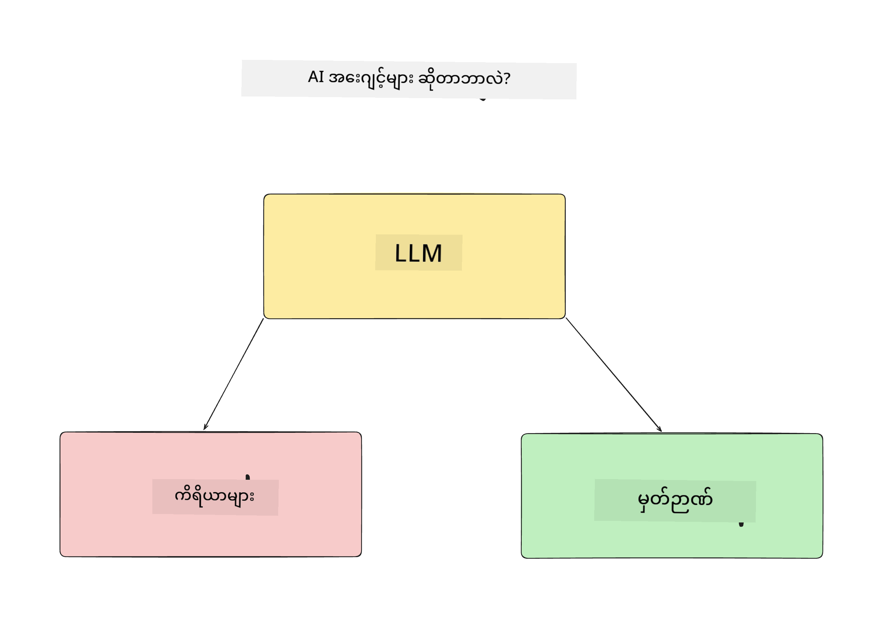
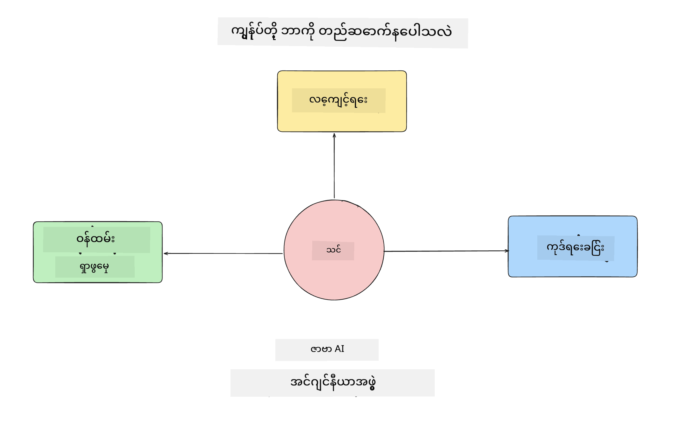
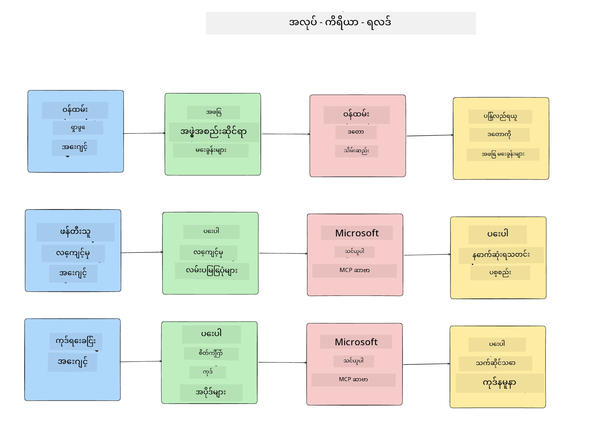
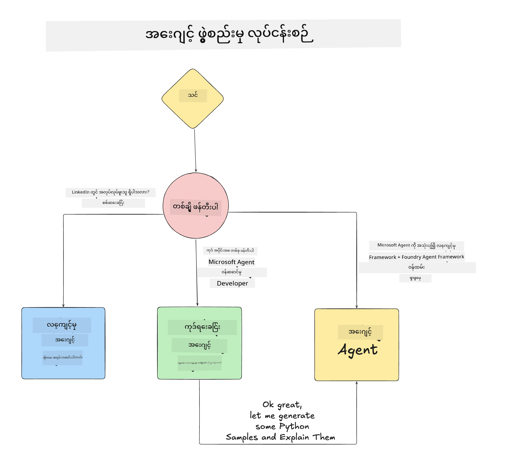

<!--
CO_OP_TRANSLATOR_METADATA:
{
  "original_hash": "99c07849641a850775c188c9333f31e5",
  "translation_date": "2025-12-12T18:42:54+00:00",
  "source_file": "lesson-1-agent-design/README.md",
  "language_code": "my"
}
-->
# သင်ခန်းစာ ၁: AI Agent ဒီဇိုင်း

"Building AI Agent from Zero to Production Course" ၏ ပထမဆုံးသင်ခန်းစာသို့ ကြိုဆိုပါသည်!

ဤသင်ခန်းစာတွင် ကျွန်ုပ်တို့သည် အောက်ပါအကြောင်းအရာများကို ဖော်ပြပါမည်-

- AI Agents ဆိုတာဘာလဲဆိုတာ သတ်မှတ်ခြင်း
  
- ကျွန်ုပ်တို့ တည်ဆောက်မည့် AI Agent Application ကို ဆွေးနွေးခြင်း  

- Agent တစ်ခုချင်းစီအတွက် လိုအပ်သော ကိရိယာများနှင့် ဝန်ဆောင်မှုများကို ဖော်ထုတ်ခြင်း
  
- ကျွန်ုပ်တို့၏ Agent Application ကို အင်ဂျင်နီယာလုပ်ခြင်း
  
Agent ဆိုတာဘာလဲ၊ အက်ပလီကေးရှင်းအတွင်း၌ အဘယ်ကြောင့် အသုံးပြုရမည်ကို သတ်မှတ်ခြင်းဖြင့် စတင်ကြပါစို့။

## AI Agents ဆိုတာဘာလဲ?

AI Agent တစ်ခုကို ဘယ်လို တိတိကျကျ သတ်မှတ်ရမည်ကို စူးစမ်းကြည့်မည့် ပထမဆုံးအကြိမ်ဖြစ်ပါက မေးခွန်းများရှိနိုင်သည်။

AI Agent ဆိုတာကို ရိုးရှင်းစွာ သတ်မှတ်ရန် အစိတ်အပိုင်းများဖြင့် ဖော်ပြပါ-

**ကြီးမားသောဘာသာစကားမော်ဒယ် (Large Language Model)** - LLM သည် အသုံးပြုသူထံမှ သဘာဝဘာသာစကားကို လက်ခံ၍ သူတို့ ပြီးမြောက်လိုသော အလုပ်ကို နားလည်ခြင်းနှင့် အလုပ်များ ပြီးမြောက်ရန် အသုံးပြုနိုင်သော ကိရိယာများ၏ ဖော်ပြချက်များကို နားလည်ပေးနိုင်စွမ်းရှိသည်။

**ကိရိယာများ (Tools)** - ၎င်းတို့မှာ လုပ်ဆောင်ချက်များ၊ API များ၊ ဒေတာသိုလှောင်မှုများနှင့် အခြားဝန်ဆောင်မှုများဖြစ်ပြီး LLM သည် အသုံးပြုသူတောင်းဆိုသည့် အလုပ်များ ပြီးမြောက်ရန် အသုံးပြုနိုင်သည်။

**မှတ်ဉာဏ် (Memory)** - AI Agent နှင့် အသုံးပြုသူအကြား ရှေ့ဆက်နှင့် ရေရှည် ဆက်ဆံရေးများကို သိမ်းဆည်းထားသည်။ ဤသတင်းအချက်အလက်များကို သိမ်းဆည်းခြင်းနှင့် ပြန်လည်ရယူခြင်းသည် တိုးတက်မှုများ ပြုလုပ်ရန်နှင့် အသုံးပြုသူ စိတ်ကြိုက်မှုများကို သိမ်းဆည်းရန် အရေးကြီးသည်။

## ကျွန်ုပ်တို့၏ AI Agent အသုံးပြုမှုကိစ္စ

ဤသင်တန်းအတွက် ကျွန်ုပ်တို့သည် AI Agent အသစ်များကို ကျွန်ုပ်တို့၏ AI Agent ဖွံ့ဖြိုးရေးအဖွဲ့သို့ ဝင်ရောက်ရန် ကူညီပေးသည့် AI Agent application တစ်ခု တည်ဆောက်မည်ဖြစ်သည်။

ဖွံ့ဖြိုးရေးအလုပ်မစတင်မီ အောင်မြင်သော AI Agent application တစ်ခု ဖန်တီးရန် ပထမဆုံးအဆင့်မှာ အသုံးပြုသူများသည် AI Agents များနှင့် မည်သို့ လုပ်ဆောင်မည်ကို ရှင်းလင်းသော အခြေအနေများ သတ်မှတ်ခြင်းဖြစ်သည်။

ဤ application အတွက် ကျွန်ုပ်တို့သည် အောက်ပါ အခြေအနေများနှင့် လုပ်ဆောင်မည်-

**အခြေအနေ ၁**: ဝန်ထမ်းအသစ်တစ်ဦးသည် အဖွဲ့ဝင်သည့်အဖွဲ့နှင့် မိတ်ဆက်ရန်နှင့် ဆက်သွယ်ရန် နည်းလမ်းများကို သိရှိလိုသည်။

**အခြေအနေ ၂**: ဝန်ထမ်းအသစ်သည် စတင်လုပ်ဆောင်ရန် အကောင်းဆုံး ပထမဆုံးအလုပ်ကို သိရှိလိုသည်။

**အခြေအနေ ၃**: ဝန်ထမ်းအသစ်သည် အလုပ်ကို စတင်ပြီးမြောက်ရန် လေ့လာရေးအရင်းအမြစ်များနှင့် ကုဒ်နမူနာများ စုဆောင်းလိုသည်။

## ကိရိယာများနှင့် ဝန်ဆောင်မှုများ ဖော်ထုတ်ခြင်း

ယခု အခြေအနေများကို ဖန်တီးပြီးနောက် AI agents များသည် အလုပ်များ ပြီးမြောက်ရန် လိုအပ်သော ကိရိယာများနှင့် ဝန်ဆောင်မှုများကို ချိတ်ဆက်ရန် နောက်တစ်ဆင့်ဖြစ်သည်။

ဤလုပ်ငန်းစဉ်ကို Context Engineering ဟုခေါ်ပြီး AI Agents များသည် အလုပ်များ ပြီးမြောက်ရန် သင့်တော်သော context ကို အချိန်မှန်တွင် ရရှိစေရန် အာရုံစိုက်မည်ဖြစ်သည်။

အခြေအနေတစ်ခုချင်းစီအလိုက် လုပ်ဆောင်ပြီး agent တစ်ဦးချင်းစီ၏ အလုပ်များ၊ ကိရိယာများနှင့် ရည်မှန်းထားသော ရလဒ်များကို စာရင်းပြုစု၍ ကောင်းမွန်သော agentic ဒီဇိုင်း ပြုလုပ်ကြပါစို့။

### အခြေအနေ ၁ - ဝန်ထမ်းရှာဖွေရေး Agent

**အလုပ်** - အဖွဲ့အစည်းရှိ ဝန်ထမ်းများအကြောင်း မေးခွန်းများကို ဖြေကြားခြင်း၊ ဥပမာ- ဝင်ရောက်သည့်ရက်၊ လက်ရှိအဖွဲ့၊ တည်နေရာနှင့် နောက်ဆုံးရာထူး။

**ကိရိယာများ** - လက်ရှိဝန်ထမ်းစာရင်းနှင့် အဖွဲ့အစည်းဇယား ဒေတာသိုလှောင်မှု

**ရလဒ်များ** - ဒေတာသိုလှောင်မှုမှ အချက်အလက်များ ရယူ၍ အဖွဲ့အစည်းဆိုင်ရာ မေးခွန်းများနှင့် ဝန်ထမ်းဆိုင်ရာ မေးခွန်းများကို ဖြေကြားနိုင်ခြင်း။

### အခြေအနေ ၂ - အလုပ်အကြံပြု Agent

**အလုပ်** - ဝန်ထမ်းအသစ်၏ ဖွံ့ဖြိုးရေးအတွေ့အကြုံအပေါ် အခြေခံ၍ ဝန်ထမ်းအသစ် အလုပ်လုပ်နိုင်မည့် ပြဿနာ ၁-၃ ခုကို အကြံပြုခြင်း။

**ကိရိယာများ** - GitHub MCP Server မှ ဖွင့်ထားသော ပြဿနာများ ရယူခြင်းနှင့် ဖွံ့ဖြိုးရေးသူ ပရိုဖိုင် တည်ဆောက်ခြင်း။

**ရလဒ်များ** - GitHub ပရိုဖိုင်၏ နောက်ဆုံး ၅ ကြိမ် commit များနှင့် GitHub ပရိုဂျက်တွင် ဖွင့်ထားသော ပြဿနာများကို ဖတ်ရှု၍ ကိုက်ညီမှုအပေါ် အကြံပြုချက်များ ပေးနိုင်ခြင်း။

### အခြေအနေ ၃ - ကုဒ်အကူအညီ Agent

**အလုပ်** - "အလုပ်အကြံပြု" Agent မှ အကြံပြုထားသော ဖွင့်ထားသော ပြဿနာများအပေါ် အခြေခံ၍ သုတေသနပြုခြင်း၊ အရင်းအမြစ်များ ပေးခြင်းနှင့် ကုဒ်နမူနာများ ဖန်တီးပေးခြင်း။

**ကိရိယာများ** - Microsoft Learn MCP မှ အရင်းအမြစ်များ ရှာဖွေရန်နှင့် Code Interpreter မှ စိတ်ကြိုက်ကုဒ်နမူနာများ ဖန်တီးရန်။

**ရလဒ်များ** - အသုံးပြုသူက ထပ်မံအကူအညီ တောင်းဆိုပါက Learn MCP Server ကို အသုံးပြု၍ အရင်းအမြစ်များ၏ လင့်ခ်များနှင့် နမူနာများ ပေးပြီး Code Interpreter agent သို့ လက်လှမ်းပေး၍ ရှင်းလင်းချက်များပါသော သေးငယ်သော ကုဒ်နမူနာများ ဖန်တီးပေးရန်။

## ကျွန်ုပ်တို့၏ Agent Application အင်ဂျင်နီယာလုပ်ခြင်း

Agent တစ်ဦးချင်းစီကို သတ်မှတ်ပြီးနောက် အလုပ်အလိုက် Agent များသည် မည်သို့ပူးပေါင်းလုပ်ဆောင်မည်နှင့် သီးခြားလုပ်ဆောင်မည်ကို နားလည်ရန် အင်ဂျင်နီယာပုံစံဇယား တစ်ခု ဖန်တီးကြပါစို့-

## နောက်တစ်ဆင့်များ

Agent တစ်ဦးချင်းစီနှင့် ကျွန်ုပ်တို့၏ agentic စနစ်ကို ဒီဇိုင်းဆွဲပြီးနောက် နောက်သင်ခန်းစာသို့ ရောက်ရှိပြီး Agent များကို တည်ဆောက်မည်ဖြစ်သည်!

---

<!-- CO-OP TRANSLATOR DISCLAIMER START -->
**အကြောင်းကြားချက်**  
ဤစာတမ်းကို AI ဘာသာပြန်ဝန်ဆောင်မှု [Co-op Translator](https://github.com/Azure/co-op-translator) ဖြင့် ဘာသာပြန်ထားပါသည်။ ကျွန်ုပ်တို့သည် တိကျမှန်ကန်မှုအတွက် ကြိုးစားနေသော်လည်း၊ အလိုအလျောက် ဘာသာပြန်ခြင်းတွင် အမှားများ သို့မဟုတ် မှားယွင်းချက်များ ပါဝင်နိုင်ကြောင်း သတိပြုပါရန် မေတ္တာရပ်ခံအပ်ပါသည်။ မူရင်းစာတမ်းကို မိမိဘာသာစကားဖြင့်သာ တရားဝင်အချက်အလက်အဖြစ် သတ်မှတ်သင့်ပါသည်။ အရေးကြီးသော အချက်အလက်များအတွက် လူ့ဘာသာပြန်ပညာရှင်မှ ဘာသာပြန်ခြင်းကို အကြံပြုပါသည်။ ဤဘာသာပြန်ချက်ကို အသုံးပြုရာမှ ဖြစ်ပေါ်လာနိုင်သည့် နားလည်မှုမှားယွင်းမှုများအတွက် ကျွန်ုပ်တို့သည် တာဝန်မယူပါ။
<!-- CO-OP TRANSLATOR DISCLAIMER END -->