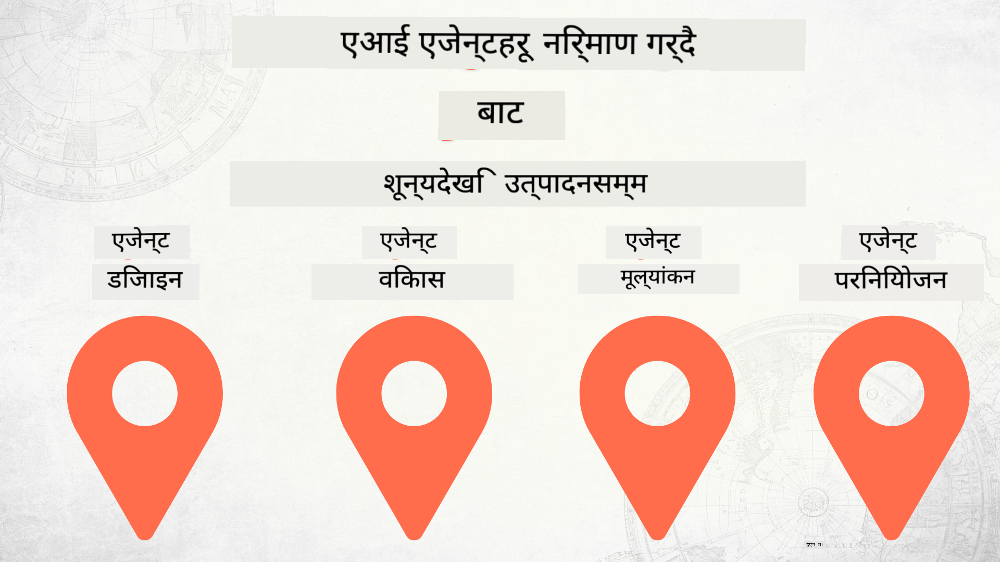

<!--
CO_OP_TRANSLATOR_METADATA:
{
  "original_hash": "73b37a335747d59d319b00aac130f073",
  "translation_date": "2025-12-24T23:11:24+00:00",
  "source_file": "README.md",
  "language_code": "ne"
}
-->
# शून्यबाट उत्पादनसम्म AI एजेन्टहरू निर्माण

### 🌐 बहुभाषी समर्थन

#### GitHub Action मार्फत समर्थित (स्वचालित र सँधै अद्यावधिक)

<!-- CO-OP TRANSLATOR LANGUAGES TABLE START -->
[Arabic](../ar/README.md) | [Bengali](../bn/README.md) | [Bulgarian](../bg/README.md) | [Burmese (Myanmar)](../my/README.md) | [Chinese (Simplified)](../zh/README.md) | [Chinese (Traditional, Hong Kong)](../hk/README.md) | [Chinese (Traditional, Macau)](../mo/README.md) | [Chinese (Traditional, Taiwan)](../tw/README.md) | [Croatian](../hr/README.md) | [Czech](../cs/README.md) | [Danish](../da/README.md) | [Dutch](../nl/README.md) | [Estonian](../et/README.md) | [Finnish](../fi/README.md) | [French](../fr/README.md) | [German](../de/README.md) | [Greek](../el/README.md) | [Hebrew](../he/README.md) | [Hindi](../hi/README.md) | [Hungarian](../hu/README.md) | [Indonesian](../id/README.md) | [Italian](../it/README.md) | [Japanese](../ja/README.md) | [Kannada](../kn/README.md) | [Korean](../ko/README.md) | [Lithuanian](../lt/README.md) | [Malay](../ms/README.md) | [Malayalam](../ml/README.md) | [Marathi](../mr/README.md) | [Nepali](./README.md) | [Nigerian Pidgin](../pcm/README.md) | [Norwegian](../no/README.md) | [Persian (Farsi)](../fa/README.md) | [Polish](../pl/README.md) | [Portuguese (Brazil)](../br/README.md) | [Portuguese (Portugal)](../pt/README.md) | [Punjabi (Gurmukhi)](../pa/README.md) | [Romanian](../ro/README.md) | [Russian](../ru/README.md) | [Serbian (Cyrillic)](../sr/README.md) | [Slovak](../sk/README.md) | [Slovenian](../sl/README.md) | [Spanish](../es/README.md) | [Swahili](../sw/README.md) | [Swedish](../sv/README.md) | [Tagalog (Filipino)](../tl/README.md) | [Tamil](../ta/README.md) | [Telugu](../te/README.md) | [Thai](../th/README.md) | [Turkish](../tr/README.md) | [Ukrainian](../uk/README.md) | [Urdu](../ur/README.md) | [Vietnamese](../vi/README.md)
<!-- CO-OP TRANSLATOR LANGUAGES TABLE END -->

## AI एजेन्ट विकास जीवनचक्रका आधारभूत सिद्धान्तहरू सिकाउने एक पाठ्यक्रम

## 🌱 सुरु गर्नुहोस्

यो पाठ्यक्रमले AI एजेन्टहरू निर्माण र परिनियोजन गर्ने आधारभूत सिद्धान्तहरू समेटेका पाठहरू समावेश गर्दछ।

हरेक पाठले अघिल्लो पाठमा निर्माण गर्छ, त्यसैले हामी सुरुबाटै सुरु गरी अन्त्यसम्म क्रमशः अगाडि बढ्न सिफारिस गर्छौं।

यदि तपाईं AI एजेन्ट विषयहरू बारे थप अन्वेषण गर्न चाहनुहुन्छ भने, तपाईं [शुरुआतीहरूको लागि AI एजेन्टहरू कोर्स](https://aka.ms/ai-agents-beginners) मा हेर्न सक्नुहुन्छ।

### अन्य सिक्नेहरूलाई भेट्नुहोस्, आफ्ना प्रश्नहरूको उत्तर पाउनुहोस्

यदि तपाईं अड्कनु भयो वा AI एजेन्टहरू निर्माण सम्बन्धी कुनै प्रश्नहरू छन् भने, हाम्रो समर्पित Discord च्यानलमा सामेल हुनुहोस्: [Microsoft Foundry Discord](https://discord.gg/Kuaw3ktsu6).

### तपाईंलाई के चाहिन्छ

हरेक पाठसँग यसको आफ्नै कोड नमूना हुन्छ जुन तपाईं स्थानीय रूपमा चलाउन सक्नुहुन्छ। तपाईं आफ्नै कपी बनाउन [यो रिपो fork गर्न](https://github.com/microsoft/Building-AI-Agents-From-Zero-To-Production/fork) सक्नुहुन्छ।

यो पाठ्यक्रम हाल निम्न प्रयोग गर्दछ:

- [Microsoft Agent Framework (MAF)](https://aka.ms/ai-agents-beginners/agent-framework)
- [Microsoft Foundry](https://azure.microsoft.com/products/ai-foundry)
- [Azure OpenAI Service](https://azure.microsoft.com/products/ai-foundry/models/openai)
- [Azure CLI](https://learn.microsoft.com/cli/azure/authenticate-azure-cli?view=azure-cli-latest)

कृपया सुरु गर्नु अघि यी सेवाहरूमा पहुँच भएको सुनिश्चित गर्नुहोस्।

मोडेल होस्टिङ र सेवाहरू सम्बन्धी थप विकल्पहरू चाँडै उपलब्ध हुनेछ। 

## 🗃️ पाठहरू

| **पाठ**         | **वर्णन**                                                                                  |
|--------------------|--------------------------------------------------------------------------------------------------|
| [Agent Design](./lesson-1-agent-design/README.md)       | हाम्रो "Developer Onboarding" एजेन्ट प्रयोग केस र प्रभावकारी एजेन्टहरू कसरी डिजाइन गर्ने भन्ने परिचय  |
| [Agent Development](./lesson-2-agent-development/README.md)  | Microsoft Agent Framework (MAF) प्रयोग गरी, नयाँ विकासकर्ताहरूलाई अनबोर्ड गर्न सहयोग पुर्‍याउन 3 एजेन्टहरू निर्माण गर्नुहोस्।       |
| [Agent Evaluations](./lesson-3-agent-evals/README.md)  | Microsoft Foundry प्रयोग गरी, हाम्रा AI एजेन्टहरू कति राम्रो प्रदर्शन गरिरहेका छन् र तिनीहरूलाई कसरी सुधार्ने भनेर पत्ता लगाउनुहोस्। |
| [Agent Deployment](./lesson-4-agent-deployment/README.md)   | Hosted Agents र OpenAI Chatkit प्रयोग गरी, AI एजेन्टलाई उत्पादनमा कसरी परिनियोजन गर्ने हेर्नुहोस्।       |

## 🎒 अन्य पाठ्यक्रमहरू

हाम्रो टोलीले अन्य पाठ्यक्रमहरू पनि उत्पादन गर्दछ! हेर्नुहोस्:

<!-- CO-OP TRANSLATOR OTHER COURSES START -->
### LangChain

---

### Azure / Edge / MCP / Agents

---
 
### Generative AI Series

[-9333EA?style=for-the-badge&labelColor=E5E7EB&color=9333EA)](https://github.com/microsoft/Generative-AI-for-beginners-dotnet?WT.mc_id=academic-105485-koreyst)
[-C084FC?style=for-the-badge&labelColor=E5E7EB&color=C084FC)](https://github.com/microsoft/generative-ai-for-beginners-java?WT.mc_id=academic-105485-koreyst)
[-E879F9?style=for-the-badge&labelColor=E5E7EB&color=E879F9)](https://github.com/microsoft/generative-ai-with-javascript?WT.mc_id=academic-105485-koreyst)

---
 
### Core Learning

---
 
### Copilot श्रृंखला

<!-- CO-OP TRANSLATOR OTHER COURSES END -->

## योगदान

यस परियोजनाले योगदान र सुझावहरू स्वागत गर्दछ। धेरै योगदानहरूका लागि तपाईंले Contributor License Agreement (CLA) मा सहमत हुन आवश्यक पर्छ, जसले घोषणा गर्छ कि तपाईंले आफ्नो योगदानको प्रयोग गर्ने अधिकार दिन सक्नुहुन्छ र वास्तवमा ती अधिकारहरू हामीलाई प्रदान गर्नुभएको छ। विवरणका लागि हेर्नुहोस् <https://cla.opensource.microsoft.com>।

जब तपाईंले पुल रिक्वेस्ट पठाउनुहुन्छ, CLA बोटले स्वचालित रूपमा निर्धारण गर्नेछ कि तपाईंले CLA प्रस्तुत गर्न आवश्यक छ वा छैन र PR लाई उपयुक्त रूपमा चिन्हित गर्नेछ (जस्तै, स्थिति जाँच, टिप्पणी)। बोटले दिएका निर्देशनहरू मात्र पालना गर्नुहोस्। हाम्रो CLA प्रयोग गर्ने सबै रिपोहरूमा तपाईंले यो केवल एकपटक मात्रै गर्नु पर्नेछ।

यस परियोजनाले [Microsoft खुला स्रोत आचार संहिता](https://opensource.microsoft.com/codeofconduct/) अपनाएको छ। थप जानकारीका लागि [आचार संहिता FAQ](https://opensource.microsoft.com/codeofconduct/faq/) हेर्नुहोस् वा थप प्रश्न वा टिप्पणीहरूको लागि [opencode@microsoft.com](mailto:opencode@microsoft.com) मा सम्पर्क गर्नुहोस्।

## ट्रेडमार्कहरू

यस परियोजनामा परियोजना, उत्पादन, वा सेवाहरूका ट्रेडमार्क वा लोगोहरू समावेश हुन सक्छन्। Microsoft का ट्रेडमार्क वा लोगोहरूको अधिकृत प्रयोग [Microsoft का ट्रेडमार्क र ब्रान्ड मार्गनिर्देशहरू](https://www.microsoft.com/legal/intellectualproperty/trademarks/usage/general) अनुसार हुनुपर्छ र त्यसको पालना गर्नैपर्छ। यस परियोजनाका संशोधित संस्करणहरूमा Microsoft का ट्रेडमार्क वा लोगोहरूको प्रयोगले भ्रम सिर्जना गर्नु हुँदैन वा Microsoft को प्रायोजन संकेत गर्नु हुँदैन। तेस्रो-पक्षका ट्रेडमार्क वा लोगोहरूको कुनै पनि प्रयोग ती तेस्रो-पक्षहरूको नीतिहरूको अधीनमा हुनेछ।

## सहायता पाउनुहोस्

यदि तपाईं अल्झनुहुन्छ वा AI अनुप्रयोगहरू निर्माण सम्बन्धी कुनै प्रश्न छ भने, सामेल हुनुहोस्:

यदि तपाईंसँग उत्पादन सम्बन्धी प्रतिक्रिया वा निर्माण गर्दा त्रुटिहरू छन् भने भ्रमण गर्नुहोस्:

---

<!-- CO-OP TRANSLATOR DISCLAIMER START -->
अस्वीकरण:
यो दस्तावेज AI अनुवाद सेवा [Co-op Translator](https://github.com/Azure/co-op-translator) प्रयोग गरेर अनुवाद गरिएको हो। हामी शुद्धताको लागि प्रयास गर्छौं, तर कृपया जान्नुहोस् कि स्वचालित अनुवादहरूमा त्रुटि वा अशुद्धता हुनसक्छ। मूल दस्तावेजलाई त्यसको मूल भाषामा अधिकारिक स्रोत मानिनु पर्छ। महत्वपूर्ण जानकारीका लागि व्यावसायिक मानव अनुवाद सिफारिस गरिन्छ। यस अनुवादको प्रयोगबाट उत्पन्न कुनै पनि गलतफहमी वा गलत व्याख्याका लागि हामी जिम्मेवार छैनौं।
<!-- CO-OP TRANSLATOR DISCLAIMER END -->