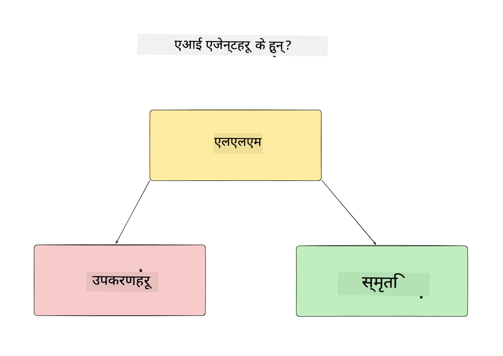
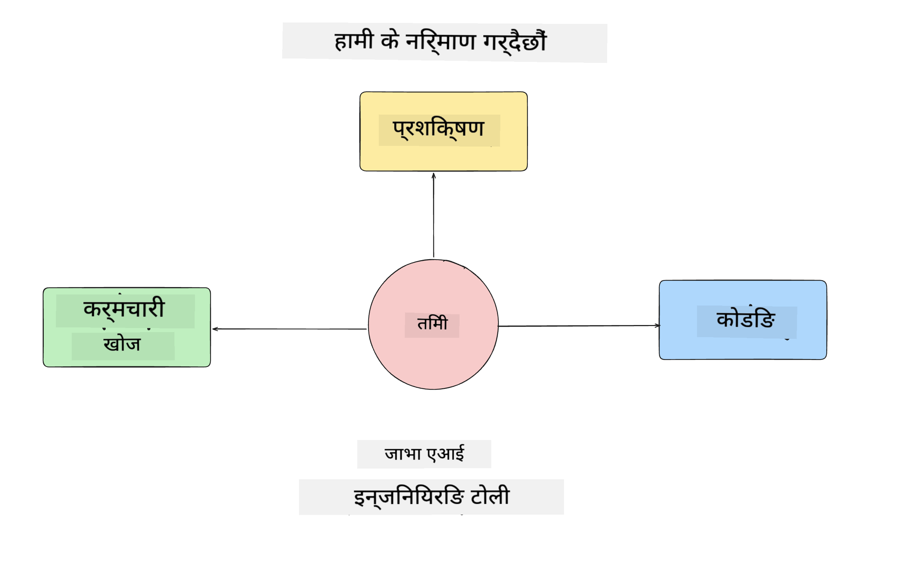
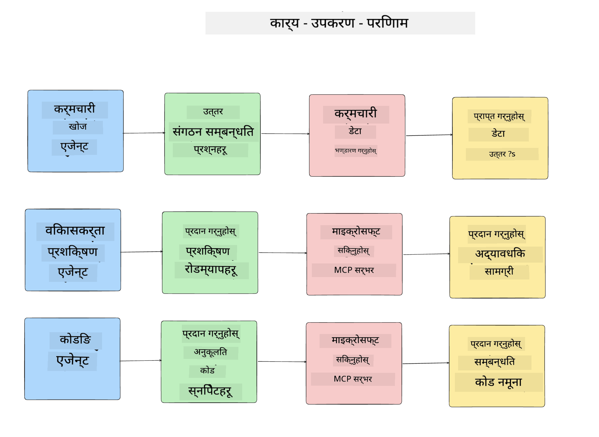
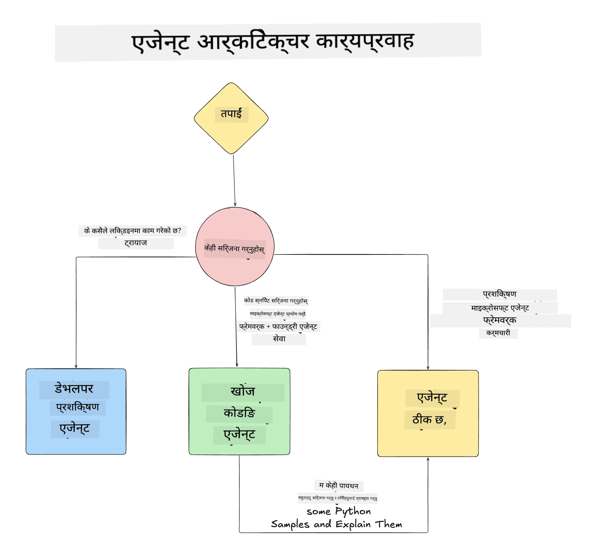

<!--
CO_OP_TRANSLATOR_METADATA:
{
  "original_hash": "99c07849641a850775c188c9333f31e5",
  "translation_date": "2025-12-12T18:24:07+00:00",
  "source_file": "lesson-1-agent-design/README.md",
  "language_code": "ne"
}
-->
# पाठ १: एआई एजेन्ट डिजाइन

"शून्यदेखि उत्पादनसम्म एआई एजेन्ट निर्माण कोर्स" को पहिलो पाठमा स्वागत छ!

यस पाठमा हामीले समेट्नेछौं:

- एआई एजेन्ट के हुन् भनेर परिभाषित गर्ने
  
- हामीले बनाउँदै गरेको एआई एजेन्ट अनुप्रयोगको चर्चा गर्ने  

- प्रत्येक एजेन्टका लागि आवश्यक उपकरण र सेवा पहिचान गर्ने
  
- हाम्रो एजेन्ट अनुप्रयोगको वास्तुकला बनाउने
  
एजेन्ट के हुन् र हामी किन अनुप्रयोग भित्र तिनीहरू प्रयोग गर्ने हो भनेर परिभाषित गरेर सुरु गरौं।

## एआई एजेन्ट के हुन्?

यदि यो तपाईंको पहिलो पटक हो एआई एजेन्ट कसरी बनाउने भनेर अन्वेषण गर्दै हुनुहुन्छ भने, तपाईंलाई एआई एजेन्ट के हो भनेर ठीकसँग परिभाषित गर्ने बारे प्रश्नहरू हुन सक्छन्।

एआई एजेन्ट के हो भनेर सरल तरिकाले परिभाषित गर्ने हो भने तिनीहरूलाई बनाउने कम्पोनेन्टहरूबाट:

**ठूलो भाषा मोडेल** - LLM ले प्रयोगकर्ताबाट प्राकृतिक भाषा प्रक्रिया गर्ने क्षमता प्रदान गर्नेछ जसले उनीहरूले पूरा गर्न चाहेको कार्य व्याख्या गर्ने साथै ती कार्यहरू पूरा गर्न उपलब्ध उपकरणहरूको विवरण व्याख्या गर्नेछ।

**उपकरणहरू** - यी कार्यहरू पूरा गर्न LLM ले प्रयोग गर्न सक्ने फंक्शनहरू, API हरू, डाटा स्टोरहरू र अन्य सेवाहरू हुनेछन्।

**स्मृति** - यो हो जहाँ हामी एआई एजेन्ट र प्रयोगकर्ताबीचको छोटो र लामो समयको अन्तरक्रियाहरू भण्डारण गर्छौं। यो जानकारी भण्डारण र पुनःप्राप्ति सुधारहरू गर्न र प्रयोगकर्ताका प्राथमिकताहरू समयसँगै बचत गर्न महत्त्वपूर्ण छ।

## हाम्रो एआई एजेन्ट प्रयोग केस

यस कोर्सका लागि, हामी एउटा एआई एजेन्ट अनुप्रयोग बनाउँदैछौं जसले नयाँ विकासकर्ताहरूलाई हाम्रो एआई एजेन्ट विकास टोलीमा सामेल हुन मद्दत गर्दछ!

कुनै विकास कार्य गर्नु अघि, सफल एआई एजेन्ट अनुप्रयोग सिर्जना गर्ने पहिलो कदम भनेको हाम्रो प्रयोगकर्ताहरूले हाम्रो एआई एजेन्टहरूसँग कसरी काम गर्ने अपेक्षा गर्छन् भन्ने स्पष्ट परिदृश्यहरू परिभाषित गर्नु हो।

यस अनुप्रयोगका लागि, हामी यी परिदृश्यहरूसँग काम गर्नेछौं:

**परिदृश्य १**: नयाँ कर्मचारी हाम्रो संगठनमा सामेल हुन्छ र उनीहरूले सामेल भएको टोली र कसरी सम्पर्क गर्ने बारे जान्न चाहन्छन्।

**परिदृश्य २:** नयाँ कर्मचारीले उनीहरूको लागि सुरु गर्न उत्तम पहिलो कार्य के हुनेछ भनेर जान्न चाहन्छन्।

**परिदृश्य ३:** नयाँ कर्मचारीले यो कार्य पूरा गर्न मद्दत गर्न सिकाइ स्रोतहरू र कोड नमूनाहरू सङ्कलन गर्न चाहन्छन्।

## उपकरण र सेवाहरू पहिचान गर्दै

अब जब यी परिदृश्यहरू तयार भइसकेका छन्, अर्को कदम भनेको ती कार्यहरू पूरा गर्न हाम्रो एआई एजेन्टहरूले आवश्यक पर्ने उपकरण र सेवाहरूलाई म्याप गर्नु हो।

यो प्रक्रिया सन्दर्भ इन्जिनियरिङको श्रेणीमा पर्छ किनभने हामीले सुनिश्चित गर्न केन्द्रित हुनेछौं कि हाम्रो एआई एजेन्टहरूसँग सही समयमा सही सन्दर्भ छ कार्यहरू पूरा गर्न।

हामी यो परिदृश्य अनुसार गर्दै राम्रो एजेन्टिक डिजाइन गर्नेछौं प्रत्येक एजेन्टको कार्य, उपकरण र चाहिने परिणामहरू सूचीबद्ध गरेर।

### परिदृश्य १ - कर्मचारी खोज एजेन्ट

**कार्य** - संगठनका कर्मचारीहरूका बारेमा प्रश्नहरूको उत्तर दिनु जस्तै सामेल हुने मिति, वर्तमान टोली, स्थान र अन्तिम पद।

**उपकरणहरू** - वर्तमान कर्मचारी सूची र संगठन चार्टको डाटास्टोर

**परिणामहरू** - सामान्य संगठनात्मक प्रश्नहरू र कर्मचारीहरूका विशिष्ट प्रश्नहरूको उत्तर दिन डाटास्टोरबाट जानकारी पुनःप्राप्त गर्न सक्षम।

### परिदृश्य २ - कार्य सिफारिस एजेन्ट

**कार्य** - नयाँ कर्मचारीको विकासकर्ता अनुभवको आधारमा, नयाँ कर्मचारीले काम गर्न सक्ने १-३ मुद्दाहरू सिफारिस गर्ने।

**उपकरणहरू** - GitHub MCP सर्भरबाट खुला मुद्दाहरू प्राप्त गर्ने र विकासकर्ता प्रोफाइल बनाउने

**परिणामहरू** - GitHub प्रोफाइलका अन्तिम ५ कमिटहरू र GitHub परियोजनाका खुला मुद्दाहरू पढ्न र मेल खाने आधारमा सिफारिसहरू गर्न सक्षम।

### परिदृश्य ३ - कोड सहायक एजेन्ट

**कार्य** - "कार्य सिफारिस" एजेन्टले सिफारिस गरेको खुला मुद्दाहरूको आधारमा अनुसन्धान गर्ने, स्रोतहरू प्रदान गर्ने र कर्मचारीलाई मद्दत गर्न कोड स्निपेटहरू उत्पन्न गर्ने।

**उपकरणहरू** - Microsoft Learn MCP स्रोतहरू खोज्न र Code Interpreter अनुकूलित कोड स्निपेटहरू उत्पन्न गर्न।

**परिणामहरू** - यदि प्रयोगकर्ताले थप मद्दत मागेमा, कार्यप्रवाहले Learn MCP सर्भर प्रयोग गरेर स्रोतहरूका लिंक र स्निपेटहरू प्रदान गर्ने र त्यसपछि Code Interpreter एजेन्टलाई साना कोड स्निपेटहरू व्याख्यासहित उत्पन्न गर्न हस्तान्तरण गर्ने।

## हाम्रो एजेन्ट अनुप्रयोगको वास्तुकला बनाउँदै

अब जब हामीले हरेक एजेन्ट परिभाषित गरिसकेका छौं, एउटा वास्तुकला चित्र बनाऔं जसले हामीलाई बुझ्न मद्दत गर्नेछ कि प्रत्येक एजेन्ट कसरी सँगै र अलग-अलग कार्य अनुसार काम गर्नेछ:

## अर्को कदमहरू

अब जब हामीले प्रत्येक एजेन्ट र हाम्रो एजेन्टिक प्रणाली डिजाइन गरिसकेका छौं, आउनुहोस् अर्को पाठमा जहाँ हामी यी प्रत्येक एजेन्टहरू विकास गर्नेछौं!

---

<!-- CO-OP TRANSLATOR DISCLAIMER START -->
**अस्वीकरण**:
यो दस्तावेज AI अनुवाद सेवा [Co-op Translator](https://github.com/Azure/co-op-translator) प्रयोग गरी अनुवाद गरिएको हो। हामी शुद्धताका लागि प्रयासरत छौं, तर कृपया ध्यान दिनुहोस् कि स्वचालित अनुवादमा त्रुटि वा अशुद्धता हुन सक्छ। मूल दस्तावेज यसको मूल भाषामा आधिकारिक स्रोत मानिनु पर्छ। महत्वपूर्ण जानकारीका लागि व्यावसायिक मानव अनुवाद सिफारिस गरिन्छ। यस अनुवादको प्रयोगबाट उत्पन्न कुनै पनि गलतफहमी वा गलत व्याख्याका लागि हामी जिम्मेवार छैनौं।
<!-- CO-OP TRANSLATOR DISCLAIMER END -->