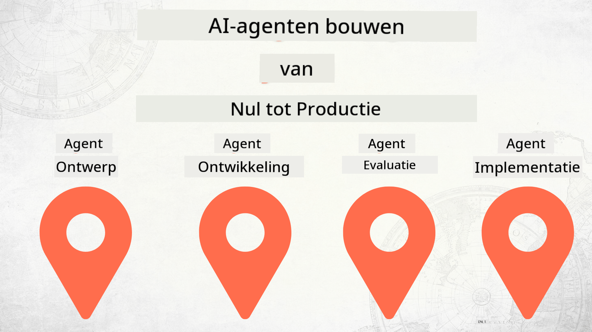

<!--
CO_OP_TRANSLATOR_METADATA:
{
  "original_hash": "f8ea8224e106540413202b4151bb2bcd",
  "translation_date": "2025-12-15T14:27:40+00:00",
  "source_file": "README.md",
  "language_code": "nl"
}
-->
# AI-agenten bouwen van nul tot productie

### 🌐 Meertalige ondersteuning

#### Ondersteund via GitHub Action (Geautomatiseerd & Altijd Up-to-Date)

<!-- CO-OP TRANSLATOR LANGUAGES TABLE START -->
[Arabic](../ar/README.md) | [Bengali](../bn/README.md) | [Bulgarian](../bg/README.md) | [Burmese (Myanmar)](../my/README.md) | [Chinese (Simplified)](../zh/README.md) | [Chinese (Traditional, Hong Kong)](../hk/README.md) | [Chinese (Traditional, Macau)](../mo/README.md) | [Chinese (Traditional, Taiwan)](../tw/README.md) | [Croatian](../hr/README.md) | [Czech](../cs/README.md) | [Danish](../da/README.md) | [Dutch](./README.md) | [Estonian](../et/README.md) | [Finnish](../fi/README.md) | [French](../fr/README.md) | [German](../de/README.md) | [Greek](../el/README.md) | [Hebrew](../he/README.md) | [Hindi](../hi/README.md) | [Hungarian](../hu/README.md) | [Indonesian](../id/README.md) | [Italian](../it/README.md) | [Japanese](../ja/README.md) | [Kannada](../kn/README.md) | [Korean](../ko/README.md) | [Lithuanian](../lt/README.md) | [Malay](../ms/README.md) | [Malayalam](../ml/README.md) | [Marathi](../mr/README.md) | [Nepali](../ne/README.md) | [Nigerian Pidgin](../pcm/README.md) | [Norwegian](../no/README.md) | [Persian (Farsi)](../fa/README.md) | [Polish](../pl/README.md) | [Portuguese (Brazil)](../br/README.md) | [Portuguese (Portugal)](../pt/README.md) | [Punjabi (Gurmukhi)](../pa/README.md) | [Romanian](../ro/README.md) | [Russian](../ru/README.md) | [Serbian (Cyrillic)](../sr/README.md) | [Slovak](../sk/README.md) | [Slovenian](../sl/README.md) | [Spanish](../es/README.md) | [Swahili](../sw/README.md) | [Swedish](../sv/README.md) | [Tagalog (Filipino)](../tl/README.md) | [Tamil](../ta/README.md) | [Telugu](../te/README.md) | [Thai](../th/README.md) | [Turkish](../tr/README.md) | [Ukrainian](../uk/README.md) | [Urdu](../ur/README.md) | [Vietnamese](../vi/README.md)
<!-- CO-OP TRANSLATOR LANGUAGES TABLE END -->

## Een cursus die je de basisprincipes van de AI Agent Ontwikkelingslevenscyclus leert

## 🌱 Aan de slag

Deze cursus bevat lessen over de basisprincipes van het bouwen en implementeren van AI-agenten.

Elke les bouwt voort op de vorige, dus we raden aan om bij het begin te beginnen en door te werken tot het einde.

Als je meer wilt ontdekken over AI-agent onderwerpen, kun je de [AI Agents For Beginners Course](https://aka.ms/ai-agents-beginners) bekijken.

### Ontmoet andere leerlingen, krijg antwoord op je vragen

Als je vastloopt of vragen hebt over het bouwen van AI-agenten, sluit je dan aan bij ons speciale Discord-kanaal in de [Microsoft Foundry Discord](https://discord.gg/Kuaw3ktsu6).

### Wat je nodig hebt

Elke les heeft zijn eigen codevoorbeeld dat je lokaal kunt uitvoeren. Je kunt [deze repo forken](https://github.com/microsoft/Building-AI-Agents-From-Zero-To-Production/fork) om je eigen kopie te maken.

Deze cursus gebruikt momenteel het volgende:

- [Microsoft Agent Framework (MAF)](https://aka.ms/ai-agents-beginners/agent-framework)
- [Microsoft Foundry](https://azure.microsoft.com/products/ai-foundry)
- [Azure OpenAI Service](https://azure.microsoft.com/products/ai-foundry/models/openai)
- [Azure CLI](https://learn.microsoft.com/cli/azure/authenticate-azure-cli?view=azure-cli-latest)

Zorg ervoor dat je toegang hebt tot deze diensten voordat je begint.

Meer opties rond modelhosting en services volgen binnenkort.

## 🗃️ Lessen

| **Les**            | **Beschrijving**                                                                                  |
|--------------------|--------------------------------------------------------------------------------------------------|
| [Agentontwerp](./lesson-1-agent-design/README.md)       | Een introductie tot onze "Developer Onboarding" Agent Use Case en hoe je effectieve agenten ontwerpt  |
| [Agentontwikkeling](./lesson-2-agent-development/README.md)  | Met het Microsoft Agent Framework (MAF) maak je 3 agenten om nieuwe ontwikkelaars te helpen onboarden.       |
| [Agentbeoordelingen](./lesson-3-agent-evals/README.md)  | Met Microsoft Foundry ontdek je hoe goed onze AI-agenten presteren en hoe je ze kunt verbeteren. |
| [Agentimplementatie](./lesson-4-agent-deployment/README.md)   | Met de Hosted Agents en OpenAI Chatkit zie je hoe je een AI-agent in productie brengt.       |

## Bijdragen

Dit project verwelkomt bijdragen en suggesties. De meeste bijdragen vereisen dat je akkoord gaat met een
Contributor License Agreement (CLA) waarin je verklaart dat je het recht hebt en daadwerkelijk verleent
dat wij jouw bijdrage mogen gebruiken. Voor details, bezoek <https://cla.opensource.microsoft.com>.

Wanneer je een pull request indient, bepaalt een CLA-bot automatisch of je een CLA moet aanleveren
en voorziet het PR van de juiste aanduidingen (bijv. statuscontrole, commentaar). Volg gewoon de instructies
van de bot. Dit hoef je maar één keer te doen voor alle repos die onze CLA gebruiken.

Dit project heeft de [Microsoft Open Source Code of Conduct](https://opensource.microsoft.com/codeofconduct/) aangenomen.
Voor meer informatie zie de [Code of Conduct FAQ](https://opensource.microsoft.com/codeofconduct/faq/) of
neem contact op met [opencode@microsoft.com](mailto:opencode@microsoft.com) voor aanvullende vragen of opmerkingen.

## Handelsmerken

Dit project kan handelsmerken of logo's bevatten van projecten, producten of diensten. Geautoriseerd gebruik van Microsoft
handelsmerken of logo's is onderhevig aan en moet voldoen aan
[Microsoft's Trademark & Brand Guidelines](https://www.microsoft.com/legal/intellectualproperty/trademarks/usage/general).
Gebruik van Microsoft handelsmerken of logo's in gewijzigde versies van dit project mag geen verwarring veroorzaken of Microsoft-sponsoring impliceren.
Elk gebruik van handelsmerken of logo's van derden is onderhevig aan het beleid van die derden.

## Hulp krijgen

Als je vastloopt of vragen hebt over het bouwen van AI-apps, sluit je aan bij:

Als je productfeedback hebt of fouten tegenkomt tijdens het bouwen, bezoek:

---

<!-- CO-OP TRANSLATOR DISCLAIMER START -->
**Disclaimer**:  
Dit document is vertaald met behulp van de AI-vertalingsdienst [Co-op Translator](https://github.com/Azure/co-op-translator). Hoewel we streven naar nauwkeurigheid, dient u er rekening mee te houden dat geautomatiseerde vertalingen fouten of onnauwkeurigheden kunnen bevatten. Het originele document in de oorspronkelijke taal moet als de gezaghebbende bron worden beschouwd. Voor cruciale informatie wordt professionele menselijke vertaling aanbevolen. Wij zijn niet aansprakelijk voor eventuele misverstanden of verkeerde interpretaties die voortvloeien uit het gebruik van deze vertaling.
<!-- CO-OP TRANSLATOR DISCLAIMER END -->