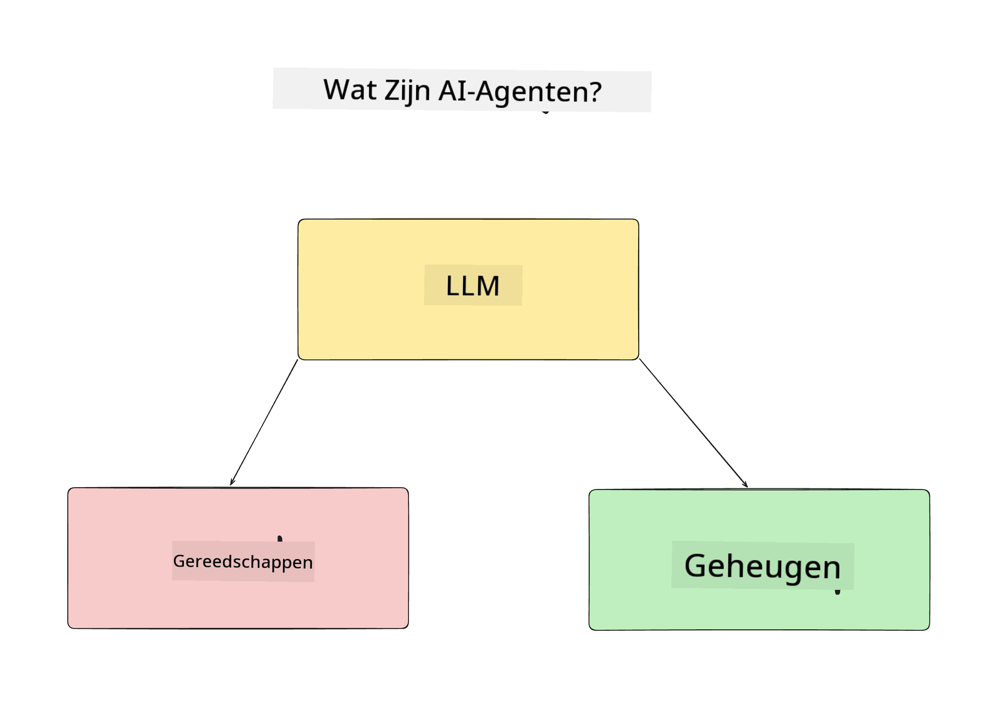
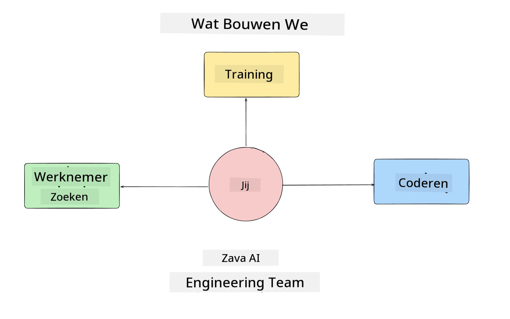
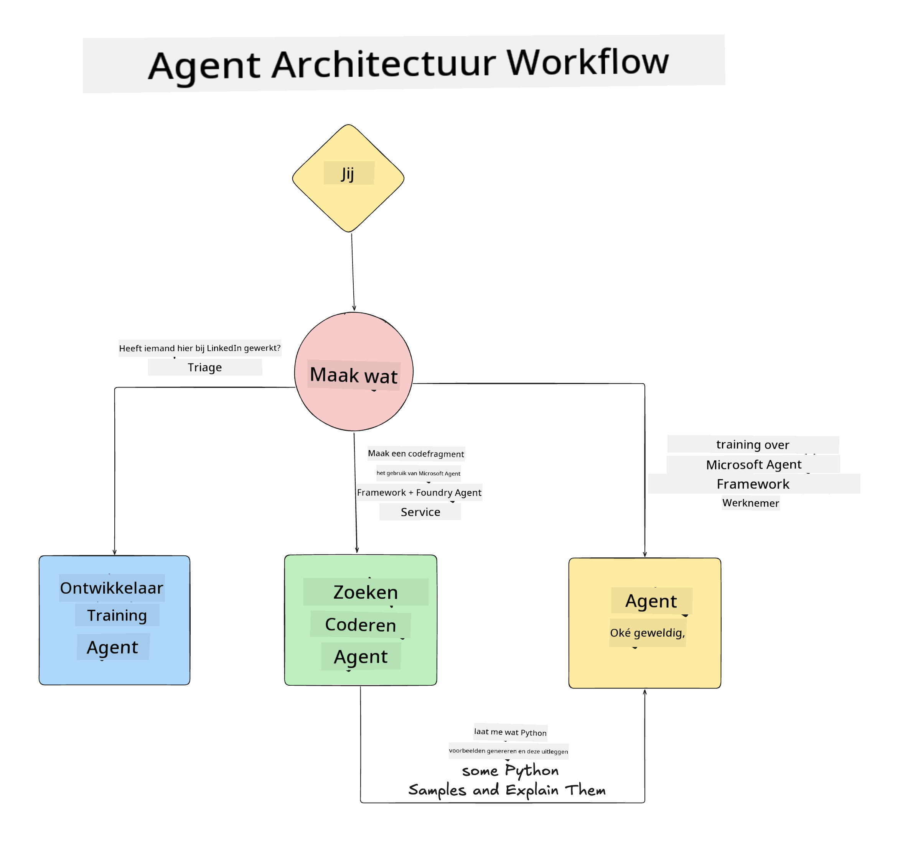

<!--
CO_OP_TRANSLATOR_METADATA:
{
  "original_hash": "99c07849641a850775c188c9333f31e5",
  "translation_date": "2025-12-12T18:32:49+00:00",
  "source_file": "lesson-1-agent-design/README.md",
  "language_code": "nl"
}
-->
# Les 1: Ontwerp van AI-agenten

Welkom bij de eerste les van de cursus "AI-agent bouwen van nul tot productie"!

In deze les behandelen we:

- Definiëren wat AI-agenten zijn
  
- Bespreken van de AI-agenttoepassing die we bouwen  

- Identificeren van de benodigde tools en services voor elke agent
  
- Architectuur van onze agenttoepassing
  
Laten we beginnen met het definiëren wat een agent is en waarom we ze in een toepassing zouden gebruiken.

## Wat zijn AI-agenten?

Als dit de eerste keer is dat je onderzoekt hoe je een AI-agent bouwt, heb je misschien vragen over hoe je precies definieert wat een AI-agent is.

Een eenvoudige manier om te definiëren wat een AI-agent is, is door de componenten die het vormen:

**Groot Taalmodel** - Het LLM zal zowel de mogelijkheid aandrijven om natuurlijke taal van de gebruiker te verwerken om de taak die ze willen voltooien te interpreteren als om de beschrijvingen van de beschikbare tools te interpreteren om die taken uit te voeren.

**Tools** - Dit zijn functies, API's, gegevensopslagplaatsen en andere services die het LLM kan kiezen te gebruiken om de door de gebruiker gevraagde taken te voltooien.

**Geheugen** - Dit is hoe we zowel korte- als langetermijninteracties tussen de AI-agent en de gebruiker opslaan. Het opslaan en ophalen van deze informatie is belangrijk om verbeteringen aan te brengen en gebruikersvoorkeuren in de loop van de tijd te bewaren.

## Onze AI-agent use case

Voor deze cursus gaan we een AI-agenttoepassing bouwen die nieuwe ontwikkelaars helpt om aan boord te komen bij ons AI-agentontwikkelingsteam!

Voordat we enige ontwikkelwerkzaamheden doen, is de eerste stap om een succesvolle AI-agenttoepassing te creëren het definiëren van duidelijke scenario's over hoe we verwachten dat onze gebruikers met onze AI-agenten werken.

Voor deze toepassing werken we met deze scenario's:

**Scenario 1**: Een nieuwe medewerker komt bij onze organisatie en wil meer weten over het team waar ze bij zijn gekomen en hoe ze contact kunnen maken.

**Scenario 2:** Een nieuwe medewerker wil weten wat de beste eerste taak is om aan te beginnen.

**Scenario 3:** Een nieuwe medewerker wil leermaterialen en codevoorbeelden verzamelen om hen te helpen aan deze taak te beginnen.

## Identificeren van de tools en services

Nu we deze scenario's hebben gemaakt, is de volgende stap om ze te koppelen aan de tools en services die onze AI-agenten nodig hebben om deze taken te voltooien.

Dit proces valt onder de categorie Context Engineering, omdat we ons gaan richten op het zorgen dat onze AI-agenten de juiste context op het juiste moment hebben om de taken te voltooien.

Laten we dit scenario per scenario doen en goed agentontwerp toepassen door de taak, tools en gewenste uitkomsten van elke agent op te sommen.

### Scenario 1 - Medewerkerzoekagent

**Taak** - Vragen beantwoorden over medewerkers in de organisatie zoals datum van indiensttreding, huidig team, locatie en laatste functie.

**Tools** - Gegevensopslag van de huidige medewerkerslijst en organigram

**Uitkomsten** - In staat zijn om informatie uit de gegevensopslag op te halen om algemene organisatorische vragen en specifieke vragen over medewerkers te beantwoorden.

### Scenario 2 - Taanaanbevelingsagent

**Taak** - Op basis van de ontwikkelaarservaring van de nieuwe medewerker 1-3 issues bedenken waar de nieuwe medewerker aan kan werken.

**Tools** - GitHub MCP-server om openstaande issues te krijgen en een ontwikkelaarsprofiel op te bouwen

**Uitkomsten** - In staat zijn om de laatste 5 commits van een GitHub-profiel en openstaande issues van een GitHub-project te lezen en aanbevelingen te doen op basis van een match

### Scenario 3 - Code-assistentagent

**Taak** - Op basis van de openstaande issues die door de "Taanaanbevelingsagent" zijn aanbevolen, onderzoek doen en bronnen bieden en codefragmenten genereren om de medewerker te helpen.

**Tools** - Microsoft Learn MCP om bronnen te vinden en Code Interpreter om aangepaste codefragmenten te genereren.

**Uitkomsten** - Als de gebruiker om extra hulp vraagt, moet de workflow de Learn MCP-server gebruiken om links en fragmenten naar bronnen te bieden en vervolgens overdragen aan de Code Interpreter-agent om kleine codefragmenten met uitleg te genereren.

## Architectuur van onze agenttoepassing

Nu we elk van onze agenten hebben gedefinieerd, laten we een architectuurdiagram maken dat ons helpt te begrijpen hoe elke agent samen en afzonderlijk zal werken, afhankelijk van de taak:

## Volgende stappen

Nu we elke agent en ons agentensysteem hebben ontworpen, gaan we door naar de volgende les waarin we elk van deze agenten gaan ontwikkelen!

---

<!-- CO-OP TRANSLATOR DISCLAIMER START -->
**Disclaimer**:  
Dit document is vertaald met behulp van de AI-vertalingsdienst [Co-op Translator](https://github.com/Azure/co-op-translator). Hoewel we streven naar nauwkeurigheid, dient u er rekening mee te houden dat geautomatiseerde vertalingen fouten of onnauwkeurigheden kunnen bevatten. Het originele document in de oorspronkelijke taal moet als de gezaghebbende bron worden beschouwd. Voor cruciale informatie wordt professionele menselijke vertaling aanbevolen. Wij zijn niet aansprakelijk voor eventuele misverstanden of verkeerde interpretaties die voortvloeien uit het gebruik van deze vertaling.
<!-- CO-OP TRANSLATOR DISCLAIMER END -->