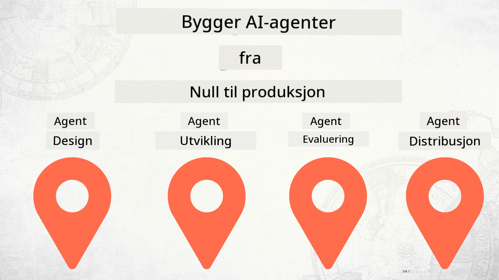

<!--
CO_OP_TRANSLATOR_METADATA:
{
  "original_hash": "df86a71d9a4a65d134d60f783a2aba86",
  "translation_date": "2025-12-18T14:33:09+00:00",
  "source_file": "README.md",
  "language_code": "no"
}
-->
# Bygge AI-agenter fra null til produksjon

### 🌐 Flerspråklig støtte

#### Støttet via GitHub Action (Automatisert og alltid oppdatert)

<!-- CO-OP TRANSLATOR LANGUAGES TABLE START -->
[Arabic](../ar/README.md) | [Bengali](../bn/README.md) | [Bulgarian](../bg/README.md) | [Burmese (Myanmar)](../my/README.md) | [Chinese (Simplified)](../zh/README.md) | [Chinese (Traditional, Hong Kong)](../hk/README.md) | [Chinese (Traditional, Macau)](../mo/README.md) | [Chinese (Traditional, Taiwan)](../tw/README.md) | [Croatian](../hr/README.md) | [Czech](../cs/README.md) | [Danish](../da/README.md) | [Dutch](../nl/README.md) | [Estonian](../et/README.md) | [Finnish](../fi/README.md) | [French](../fr/README.md) | [German](../de/README.md) | [Greek](../el/README.md) | [Hebrew](../he/README.md) | [Hindi](../hi/README.md) | [Hungarian](../hu/README.md) | [Indonesian](../id/README.md) | [Italian](../it/README.md) | [Japanese](../ja/README.md) | [Kannada](../kn/README.md) | [Korean](../ko/README.md) | [Lithuanian](../lt/README.md) | [Malay](../ms/README.md) | [Malayalam](../ml/README.md) | [Marathi](../mr/README.md) | [Nepali](../ne/README.md) | [Nigerian Pidgin](../pcm/README.md) | [Norwegian](./README.md) | [Persian (Farsi)](../fa/README.md) | [Polish](../pl/README.md) | [Portuguese (Brazil)](../br/README.md) | [Portuguese (Portugal)](../pt/README.md) | [Punjabi (Gurmukhi)](../pa/README.md) | [Romanian](../ro/README.md) | [Russian](../ru/README.md) | [Serbian (Cyrillic)](../sr/README.md) | [Slovak](../sk/README.md) | [Slovenian](../sl/README.md) | [Spanish](../es/README.md) | [Swahili](../sw/README.md) | [Swedish](../sv/README.md) | [Tagalog (Filipino)](../tl/README.md) | [Tamil](../ta/README.md) | [Telugu](../te/README.md) | [Thai](../th/README.md) | [Turkish](../tr/README.md) | [Ukrainian](../uk/README.md) | [Urdu](../ur/README.md) | [Vietnamese](../vi/README.md)
<!-- CO-OP TRANSLATOR LANGUAGES TABLE END -->

## Et kurs som lærer deg grunnleggende om AI-agentutviklingslivssyklusen

## 🌱 Komme i gang

Dette kurset har leksjoner som dekker det grunnleggende om å bygge og distribuere AI-agenter.

Hver leksjon bygger på den forrige, så vi anbefaler å starte fra begynnelsen og jobbe deg gjennom til slutten.

Hvis du vil utforske mer om AI-agentemner, kan du sjekke ut [AI Agents For Beginners Course](https://aka.ms/ai-agents-beginners).

### Møt andre lærende, få svar på spørsmålene dine

Hvis du står fast eller har spørsmål om å bygge AI-agenter, bli med i vår dedikerte Discord-kanal i [Microsoft Foundry Discord](https://discord.gg/Kuaw3ktsu6).

### Hva du trenger

Hver leksjon har sitt eget kodeeksempel som du kan kjøre lokalt. Du kan [forke dette repoet](https://github.com/microsoft/Building-AI-Agents-From-Zero-To-Production/fork) for å lage din egen kopi.

Dette kurset bruker for øyeblikket følgende:

- [Microsoft Agent Framework (MAF)](https://aka.ms/ai-agents-beginners/agent-framework)
- [Microsoft Foundry](https://azure.microsoft.com/products/ai-foundry)
- [Azure OpenAI Service](https://azure.microsoft.com/products/ai-foundry/models/openai)
- [Azure CLI](https://learn.microsoft.com/cli/azure/authenticate-azure-cli?view=azure-cli-latest)

Vennligst sørg for at du har tilgang til disse tjenestene før du begynner.

Flere alternativer for modellhosting og tjenester kommer snart.

## 🗃️ Leksjoner

| **Leksjon**         | **Beskrivelse**                                                                                  |
|--------------------|--------------------------------------------------------------------------------------------------|
| [Agent Design](./lesson-1-agent-design/README.md)       | En introduksjon til vår "Developer Onboarding" agentbrukstilfelle og hvordan designe effektive agenter  |
| [Agent Development](./lesson-2-agent-development/README.md)  | Bruke Microsoft Agent Framework (MAF), lag 3 agenter for å hjelpe nye utviklere med onboarding.       |
| [Agent Evaluations](./lesson-3-agent-evals/README.md)  | Bruke Microsoft Foundry, finn ut hvor godt AI-agentene våre presterer og hvordan forbedre dem. |
| [Agent Deployment](./lesson-4-agent-deployment/README.md)   | Bruke Hosted Agents og OpenAI Chatkit, se hvordan man distribuerer en AI-agent i produksjon.       |

## Bidra

Dette prosjektet ønsker bidrag og forslag velkommen. De fleste bidrag krever at du godtar en
Contributor License Agreement (CLA) som erklærer at du har rett til, og faktisk gir oss
rettighetene til å bruke ditt bidrag. For detaljer, besøk <https://cla.opensource.microsoft.com>.

Når du sender en pull request, vil en CLA-bot automatisk avgjøre om du må levere
en CLA og merke PR-en passende (f.eks. statuskontroll, kommentar). Følg bare instruksjonene
fra boten. Du trenger bare å gjøre dette én gang på tvers av alle repoer som bruker vår CLA.

Dette prosjektet har tatt i bruk [Microsoft Open Source Code of Conduct](https://opensource.microsoft.com/codeofconduct/).
For mer informasjon, se [Code of Conduct FAQ](https://opensource.microsoft.com/codeofconduct/faq/) eller
kontakt [opencode@microsoft.com](mailto:opencode@microsoft.com) med eventuelle spørsmål eller kommentarer.

## Varemerker

Dette prosjektet kan inneholde varemerker eller logoer for prosjekter, produkter eller tjenester. Autorisert bruk av Microsoft
varemerker eller logoer er underlagt og må følge
[Microsofts retningslinjer for varemerker og merkevare](https://www.microsoft.com/legal/intellectualproperty/trademarks/usage/general).
Bruk av Microsoft-varemerker eller logoer i modifiserte versjoner av dette prosjektet må ikke skape forvirring eller antyde Microsoft-sponsing.
Enhver bruk av tredjeparts varemerker eller logoer er underlagt disse tredjepartenes retningslinjer.

## Få hjelp

Hvis du står fast eller har spørsmål om å bygge AI-apper, bli med:

Hvis du har produktfeedback eller feil under bygging, besøk:

---

<!-- CO-OP TRANSLATOR DISCLAIMER START -->
**Ansvarsfraskrivelse**:
Dette dokumentet er oversatt ved hjelp av AI-oversettelsestjenesten [Co-op Translator](https://github.com/Azure/co-op-translator). Selv om vi streber etter nøyaktighet, vennligst vær oppmerksom på at automatiske oversettelser kan inneholde feil eller unøyaktigheter. Det opprinnelige dokumentet på originalspråket skal anses som den autoritative kilden. For kritisk informasjon anbefales profesjonell menneskelig oversettelse. Vi er ikke ansvarlige for eventuelle misforståelser eller feiltolkninger som oppstår ved bruk av denne oversettelsen.
<!-- CO-OP TRANSLATOR DISCLAIMER END -->