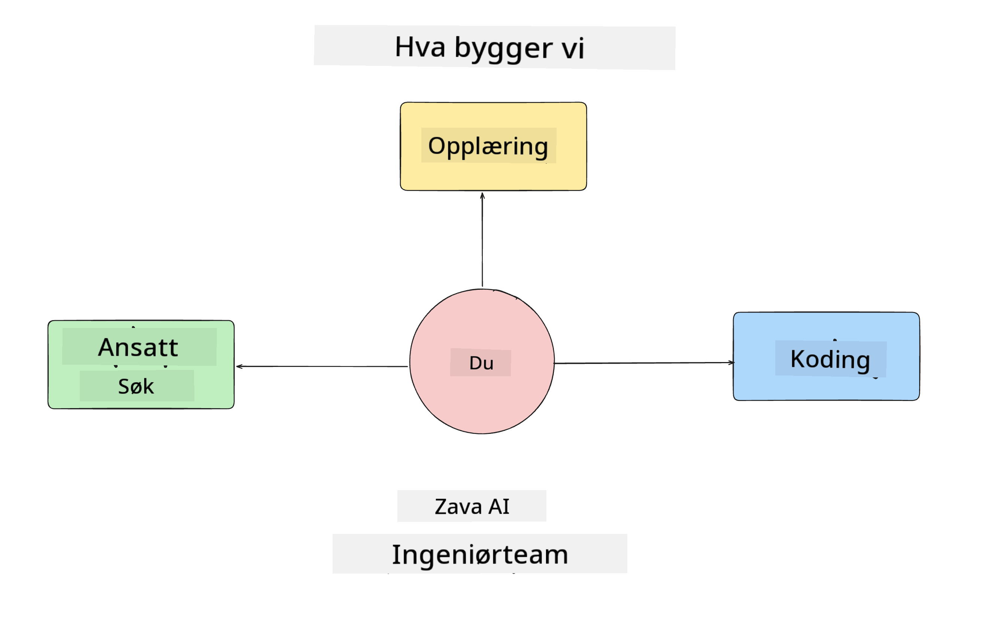
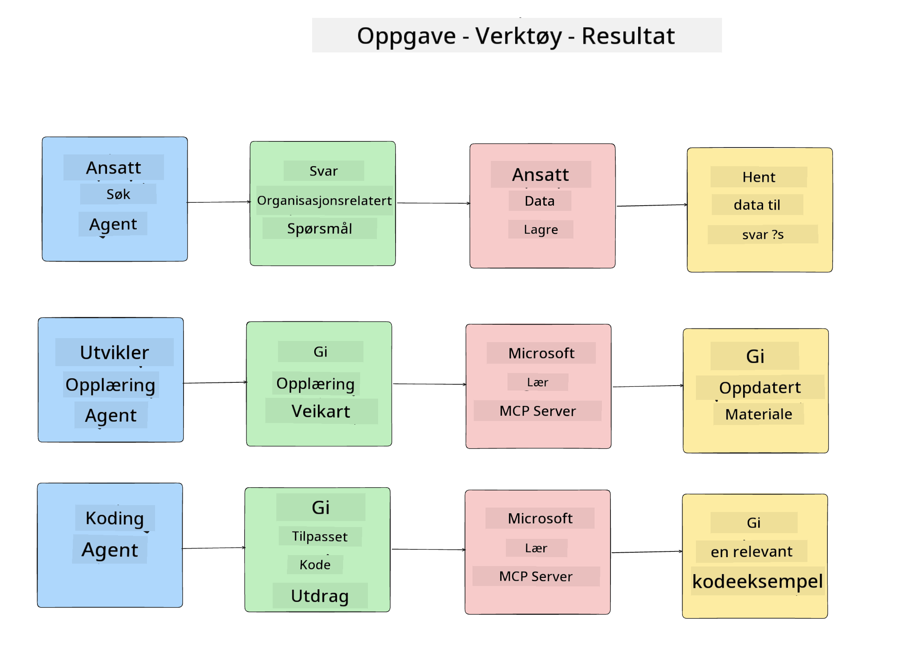
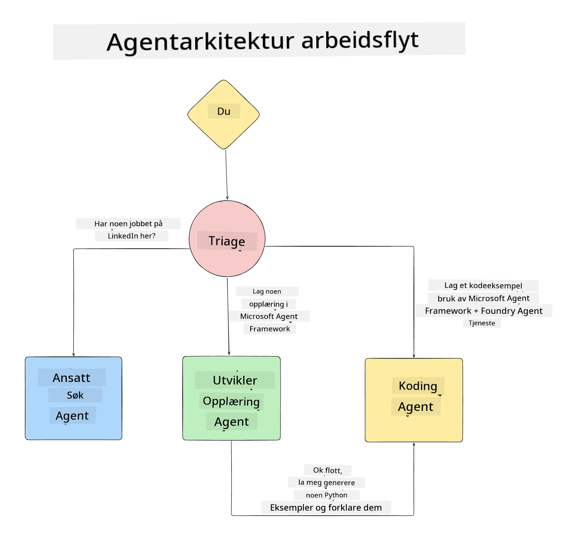

<!--
CO_OP_TRANSLATOR_METADATA:
{
  "original_hash": "99c07849641a850775c188c9333f31e5",
  "translation_date": "2025-12-12T18:31:45+00:00",
  "source_file": "lesson-1-agent-design/README.md",
  "language_code": "no"
}
-->
# Lesson 1: AI Agent Design

Velkommen til den første leksjonen i "Bygge AI-agent fra null til produksjon-kurset"!

I denne leksjonen skal vi dekke:

- Definere hva AI-agenter er
  
- Diskutere AI-agentapplikasjonen vi bygger  

- Identifisere nødvendige verktøy og tjenester for hver agent
  
- Arkitektere vår agentapplikasjon
  
La oss starte med å definere hva en agent er og hvorfor vi vil bruke dem i en applikasjon.

## Hva er AI-agenter?

Hvis dette er første gang du utforsker hvordan man bygger en AI-agent, kan du ha spørsmål om hvordan man nøyaktig definerer hva en AI-agent er.

En enkel måte å definere hva en AI-agent er, er ved komponentene som utgjør den:

**Large Language Model** - LLM-en vil drive både evnen til å behandle naturlig språk fra brukeren for å tolke oppgaven de ønsker å fullføre, samt tolke beskrivelsene av verktøyene som er tilgjengelige for å fullføre disse oppgavene.

**Verktøy** - Dette vil være funksjoner, API-er, datalagre og andre tjenester som LLM-en kan velge å bruke for å fullføre oppgavene brukeren ber om.

**Minne** - Dette er hvordan vi lagrer både kortsiktige og langsiktige interaksjoner mellom AI-agenten og brukeren. Å lagre og hente denne informasjonen er viktig for å gjøre forbedringer og lagre brukerpreferanser over tid.

## Vår AI-agent brukstilfelle

For dette kurset skal vi bygge en AI-agentapplikasjon som hjelper nye utviklere med å bli kjent med vårt AI-agentutviklingsteam!

Før vi gjør noe utviklingsarbeid, er det første steget for å lage en vellykket AI-agentapplikasjon å definere klare scenarier for hvordan vi forventer at brukerne våre skal jobbe med AI-agentene våre.

For denne applikasjonen skal vi jobbe med disse scenariene:

**Scenario 1**: En ny ansatt begynner i organisasjonen vår og ønsker å vite mer om teamet de har blitt med i og hvordan de kan komme i kontakt med dem.

**Scenario 2:** En ny ansatt ønsker å vite hva som vil være den beste første oppgaven for dem å begynne å jobbe med.

**Scenario 3:** En ny ansatt ønsker å samle læringsressurser og kodeeksempler for å hjelpe dem i gang med å fullføre denne oppgaven.

## Identifisere verktøy og tjenester

Nå som vi har laget disse scenariene, er neste steg å kartlegge dem til verktøyene og tjenestene som AI-agentene våre trenger for å fullføre disse oppgavene.

Denne prosessen faller inn under kategorien kontekstingeniørkunst, da vi skal fokusere på å sørge for at AI-agentene våre har riktig kontekst til riktig tid for å fullføre oppgavene.

La oss gjøre dette scenario for scenario og utføre god agentdesign ved å liste opp hver agents oppgave, verktøy og ønskede resultater.

### Scenario 1 - Ansatt søkeagent

**Oppgave** - Svare på spørsmål om ansatte i organisasjonen som ansettelsesdato, nåværende team, lokasjon og siste stilling.

**Verktøy** - Datalager med nåværende ansattliste og organisasjonskart

**Resultater** - I stand til å hente informasjon fra datalageret for å svare på generelle organisasjonsrelaterte spørsmål og spesifikke spørsmål om ansatte.

### Scenario 2 - Oppgaveanbefalingsagent

**Oppgave** - Basert på den nye ansattes utviklererfaring, komme opp med 1-3 saker som den nye ansatte kan jobbe med.

**Verktøy** - GitHub MCP-server for å hente åpne saker og bygge en utviklerprofil

**Resultater** - I stand til å lese de siste 5 committene til en GitHub-profil og åpne saker på et GitHub-prosjekt og gi anbefalinger basert på en match

### Scenario 3 - Kodeassistentagent

**Oppgave** - Basert på de åpne sakene som ble anbefalt av "Oppgaveanbefalingsagenten", undersøke og gi ressurser og generere kodeeksempler for å hjelpe den ansatte.

**Verktøy** - Microsoft Learn MCP for å finne ressurser og Code Interpreter for å generere tilpassede kodeeksempler.

**Resultater** - Hvis brukeren ber om ekstra hjelp, skal arbeidsflyten bruke Learn MCP-serveren for å gi lenker og utdrag til ressurser, og deretter overlevere til Code Interpreter-agenten for å generere små kodeeksempler med forklaringer.

## Arkitektere vår agentapplikasjon

Nå som vi har definert hver av agentene våre, la oss lage et arkitekturdiagram som vil hjelpe oss å forstå hvordan hver agent vil jobbe sammen og separat avhengig av oppgaven:

## Neste steg

Nå som vi har designet hver agent og vårt agentiske system, la oss gå videre til neste leksjon hvor vi skal utvikle hver av disse agentene!

---

<!-- CO-OP TRANSLATOR DISCLAIMER START -->
**Ansvarsfraskrivelse**:
Dette dokumentet er oversatt ved hjelp av AI-oversettelsestjenesten [Co-op Translator](https://github.com/Azure/co-op-translator). Selv om vi streber etter nøyaktighet, vennligst vær oppmerksom på at automatiske oversettelser kan inneholde feil eller unøyaktigheter. Det opprinnelige dokumentet på originalspråket skal anses som den autoritative kilden. For kritisk informasjon anbefales profesjonell menneskelig oversettelse. Vi er ikke ansvarlige for eventuelle misforståelser eller feiltolkninger som oppstår ved bruk av denne oversettelsen.
<!-- CO-OP TRANSLATOR DISCLAIMER END -->