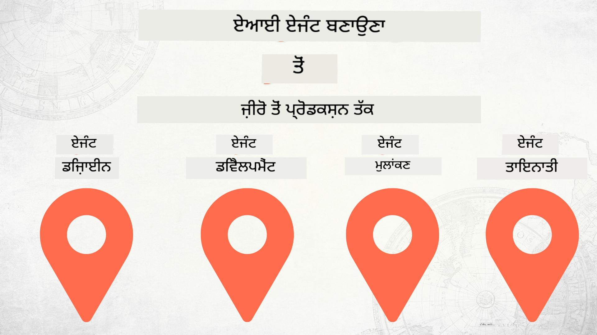

<!--
CO_OP_TRANSLATOR_METADATA:
{
  "original_hash": "84eb09fa4e48cff3f63a5dc64f8efab7",
  "translation_date": "2025-12-17T11:38:43+00:00",
  "source_file": "README.md",
  "language_code": "pa"
}
-->
# ਜ਼ੀਰੋ ਤੋਂ ਪ੍ਰੋਡਕਸ਼ਨ ਤੱਕ AI ਏਜੰਟ ਬਣਾਉਣਾ

### 🌐 ਬਹੁ-ਭਾਸ਼ਾਈ ਸਹਾਇਤਾ

#### GitHub ਐਕਸ਼ਨ ਰਾਹੀਂ ਸਮਰਥਿਤ (ਆਟੋਮੇਟਿਕ ਅਤੇ ਹਮੇਸ਼ਾ ਅਪ-ਟੂ-ਡੇਟ)

<!-- CO-OP TRANSLATOR LANGUAGES TABLE START -->
[Arabic](../ar/README.md) | [Bengali](../bn/README.md) | [Bulgarian](../bg/README.md) | [Burmese (Myanmar)](../my/README.md) | [Chinese (Simplified)](../zh/README.md) | [Chinese (Traditional, Hong Kong)](../hk/README.md) | [Chinese (Traditional, Macau)](../mo/README.md) | [Chinese (Traditional, Taiwan)](../tw/README.md) | [Croatian](../hr/README.md) | [Czech](../cs/README.md) | [Danish](../da/README.md) | [Dutch](../nl/README.md) | [Estonian](../et/README.md) | [Finnish](../fi/README.md) | [French](../fr/README.md) | [German](../de/README.md) | [Greek](../el/README.md) | [Hebrew](../he/README.md) | [Hindi](../hi/README.md) | [Hungarian](../hu/README.md) | [Indonesian](../id/README.md) | [Italian](../it/README.md) | [Japanese](../ja/README.md) | [Kannada](../kn/README.md) | [Korean](../ko/README.md) | [Lithuanian](../lt/README.md) | [Malay](../ms/README.md) | [Malayalam](../ml/README.md) | [Marathi](../mr/README.md) | [Nepali](../ne/README.md) | [Nigerian Pidgin](../pcm/README.md) | [Norwegian](../no/README.md) | [Persian (Farsi)](../fa/README.md) | [Polish](../pl/README.md) | [Portuguese (Brazil)](../br/README.md) | [Portuguese (Portugal)](../pt/README.md) | [Punjabi (Gurmukhi)](./README.md) | [Romanian](../ro/README.md) | [Russian](../ru/README.md) | [Serbian (Cyrillic)](../sr/README.md) | [Slovak](../sk/README.md) | [Slovenian](../sl/README.md) | [Spanish](../es/README.md) | [Swahili](../sw/README.md) | [Swedish](../sv/README.md) | [Tagalog (Filipino)](../tl/README.md) | [Tamil](../ta/README.md) | [Telugu](../te/README.md) | [Thai](../th/README.md) | [Turkish](../tr/README.md) | [Ukrainian](../uk/README.md) | [Urdu](../ur/README.md) | [Vietnamese](../vi/README.md)
<!-- CO-OP TRANSLATOR LANGUAGES TABLE END -->

## AI ਏਜੰਟ ਵਿਕਾਸ ਲਾਈਫਸਾਈਕਲ ਦੇ ਮੂਲ ਤੱਤ ਸਿਖਾਉਂਦਾ ਇੱਕ ਕੋਰਸ

## 🌱 ਸ਼ੁਰੂਆਤ ਕਰਨਾ

ਇਸ ਕੋਰਸ ਵਿੱਚ AI ਏਜੰਟ ਬਣਾਉਣ ਅਤੇ ਤਾਇਨਾਤ ਕਰਨ ਦੇ ਮੂਲ ਤੱਤਾਂ ਨੂੰ ਕਵਰ ਕਰਨ ਵਾਲੇ ਪਾਠ ਹਨ।

ਹਰ ਪਾਠ ਪਿਛਲੇ ਪਾਠ 'ਤੇ ਨਿਰਭਰ ਕਰਦਾ ਹੈ, ਇਸ ਲਈ ਅਸੀਂ ਸਿਫਾਰਸ਼ ਕਰਦੇ ਹਾਂ ਕਿ ਤੁਸੀਂ ਸ਼ੁਰੂ ਤੋਂ ਸ਼ੁਰੂ ਕਰਕੇ ਅੰਤ ਤੱਕ ਜਾਵੋ।

ਜੇ ਤੁਸੀਂ AI ਏਜੰਟ ਵਿਸ਼ਿਆਂ ਬਾਰੇ ਹੋਰ ਜਾਣਨਾ ਚਾਹੁੰਦੇ ਹੋ, ਤਾਂ ਤੁਸੀਂ [AI Agents For Beginners Course](https://aka.ms/ai-agents-beginners) ਨੂੰ ਵੇਖ ਸਕਦੇ ਹੋ।

### ਹੋਰ ਸਿੱਖਣ ਵਾਲਿਆਂ ਨਾਲ ਮਿਲੋ, ਆਪਣੇ ਸਵਾਲਾਂ ਦੇ ਜਵਾਬ ਲਵੋ

ਜੇ ਤੁਸੀਂ ਫਸ ਜਾਂਦੇ ਹੋ ਜਾਂ AI ਏਜੰਟ ਬਣਾਉਣ ਬਾਰੇ ਕੋਈ ਸਵਾਲ ਹੈ, ਤਾਂ ਸਾਡੇ ਸਮਰਪਿਤ Discord ਚੈਨਲ ਵਿੱਚ ਸ਼ਾਮਲ ਹੋਵੋ [Microsoft Foundry Discord](https://discord.gg/Kuaw3ktsu6)।

### ਤੁਹਾਨੂੰ ਕੀ ਚਾਹੀਦਾ ਹੈ

ਹਰ ਪਾਠ ਦਾ ਆਪਣਾ ਕੋਡ ਸੈਂਪਲ ਹੁੰਦਾ ਹੈ ਜੋ ਤੁਸੀਂ ਲੋਕਲ ਤੌਰ 'ਤੇ ਚਲਾ ਸਕਦੇ ਹੋ। ਤੁਸੀਂ ਆਪਣੀ ਕਾਪੀ ਬਣਾਉਣ ਲਈ [ਇਸ ਰੇਪੋ ਨੂੰ ਫੋਰਕ ਕਰ ਸਕਦੇ ਹੋ](https://github.com/microsoft/Building-AI-Agents-From-Zero-To-Production/fork)।

ਇਹ ਕੋਰਸ ਇਸ ਸਮੇਂ ਹੇਠਾਂ ਦਿੱਤੀਆਂ ਚੀਜ਼ਾਂ ਵਰਤਦਾ ਹੈ:

- [Microsoft Agent Framework (MAF)](https://aka.ms/ai-agents-beginners/agent-framework)
- [Microsoft Foundry](https://azure.microsoft.com/products/ai-foundry)
- [Azure OpenAI Service](https://azure.microsoft.com/products/ai-foundry/models/openai)
- [Azure CLI](https://learn.microsoft.com/cli/azure/authenticate-azure-cli?view=azure-cli-latest)

ਕਿਰਪਾ ਕਰਕੇ ਸ਼ੁਰੂ ਕਰਨ ਤੋਂ ਪਹਿਲਾਂ ਇਹ ਸੇਵਾਵਾਂ ਤੁਹਾਡੇ ਕੋਲ ਉਪਲਬਧ ਹੋਣ ਦੀ ਪੁਸ਼ਟੀ ਕਰੋ।

ਮਾਡਲ ਹੋਸਟਿੰਗ ਅਤੇ ਸੇਵਾਵਾਂ ਦੇ ਹੋਰ ਵਿਕਲਪ ਜਲਦੀ ਆ ਰਹੇ ਹਨ।

## 🗃️ ਪਾਠ

| **ਪਾਠ**         | **ਵੇਰਵਾ**                                                                                  |
|--------------------|--------------------------------------------------------------------------------------------------|
| [Agent Design](./lesson-1-agent-design/README.md)       | ਸਾਡੇ "ਡਿਵੈਲਪਰ ਓਨਬੋਰਡਿੰਗ" ਏਜੰਟ ਯੂਜ਼ ਕੇਸ ਦਾ ਪਰਿਚਯ ਅਤੇ ਪ੍ਰਭਾਵਸ਼ਾਲੀ ਏਜੰਟ ਡਿਜ਼ਾਈਨ ਕਰਨ ਦਾ ਤਰੀਕਾ  |
| [Agent Development](./lesson-2-agent-development/README.md)  | Microsoft Agent Framework (MAF) ਦੀ ਵਰਤੋਂ ਕਰਕੇ, ਨਵੇਂ ਡਿਵੈਲਪਰਾਂ ਦੀ ਮਦਦ ਲਈ 3 ਏਜੰਟ ਬਣਾਓ।       |
| [Agent Evaluations](./lesson-3-agent-evals/README.md)  | Microsoft Foundry ਦੀ ਵਰਤੋਂ ਕਰਕੇ, ਸਾਡੇ AI ਏਜੰਟਾਂ ਦੀ ਕਾਰਗੁਜ਼ਾਰੀ ਕਿਵੇਂ ਹੈ ਅਤੇ ਉਨ੍ਹਾਂ ਨੂੰ ਕਿਵੇਂ ਸੁਧਾਰਿਆ ਜਾ ਸਕਦਾ ਹੈ। |
| [Agent Deployment](./lesson-4-agent-deployment/README.md)   | Hosted Agents ਅਤੇ OpenAI Chatkit ਦੀ ਵਰਤੋਂ ਕਰਕੇ, AI ਏਜੰਟ ਨੂੰ ਪ੍ਰੋਡਕਸ਼ਨ ਵਿੱਚ ਕਿਵੇਂ ਤਾਇਨਾਤ ਕਰਨਾ ਹੈ।       |

## ਯੋਗਦਾਨ ਪਾਉਣਾ

ਇਹ ਪ੍ਰੋਜੈਕਟ ਯੋਗਦਾਨ ਅਤੇ ਸੁਝਾਵਾਂ ਦਾ ਸਵਾਗਤ ਕਰਦਾ ਹੈ। ਜ਼ਿਆਦਾਤਰ ਯੋਗਦਾਨਾਂ ਲਈ ਤੁਹਾਨੂੰ ਇੱਕ Contributor License Agreement (CLA) ਨਾਲ ਸਹਿਮਤ ਹੋਣਾ ਪੈਂਦਾ ਹੈ ਜੋ ਇਹ ਘੋਸ਼ਣਾ ਕਰਦਾ ਹੈ ਕਿ ਤੁਹਾਡੇ ਕੋਲ ਆਪਣੇ ਯੋਗਦਾਨ ਦੇ ਉਪਯੋਗ ਦੇ ਹੱਕ ਹਨ। ਵਿਸਥਾਰ ਲਈ, <https://cla.opensource.microsoft.com> ਵੇਖੋ।

ਜਦੋਂ ਤੁਸੀਂ ਪੂਲ ਰਿਕਵੇਸਟ ਸਬਮਿਟ ਕਰਦੇ ਹੋ, ਤਾਂ CLA ਬੋਟ ਆਪਣੇ ਆਪ ਨਿਰਧਾਰਤ ਕਰੇਗਾ ਕਿ ਤੁਹਾਨੂੰ CLA ਦੇਣੀ ਹੈ ਜਾਂ ਨਹੀਂ ਅਤੇ PR ਨੂੰ ਉਚਿਤ ਤਰੀਕੇ ਨਾਲ ਸਜਾਏਗਾ (ਜਿਵੇਂ ਕਿ ਸਥਿਤੀ ਜਾਂਚ, ਟਿੱਪਣੀ)। ਸਿਰਫ ਬੋਟ ਵੱਲੋਂ ਦਿੱਤੇ ਗਏ ਨਿਰਦੇਸ਼ਾਂ ਦੀ ਪਾਲਣਾ ਕਰੋ। ਤੁਹਾਨੂੰ ਸਾਡੇ CLA ਵਾਲੇ ਸਾਰੇ ਰੇਪੋਜ਼ ਵਿੱਚ ਇਹ ਸਿਰਫ ਇੱਕ ਵਾਰੀ ਕਰਨਾ ਪਵੇਗਾ।

ਇਸ ਪ੍ਰੋਜੈਕਟ ਨੇ [Microsoft Open Source Code of Conduct](https://opensource.microsoft.com/codeofconduct/) ਨੂੰ ਅਪਣਾਇਆ ਹੈ। ਹੋਰ ਜਾਣਕਾਰੀ ਲਈ [Code of Conduct FAQ](https://opensource.microsoft.com/codeofconduct/faq/) ਵੇਖੋ ਜਾਂ ਕਿਸੇ ਵੀ ਹੋਰ ਸਵਾਲ ਜਾਂ ਟਿੱਪਣੀ ਲਈ [opencode@microsoft.com](mailto:opencode@microsoft.com) ਨਾਲ ਸੰਪਰਕ ਕਰੋ।

## ਟ੍ਰੇਡਮਾਰਕ

ਇਸ ਪ੍ਰੋਜੈਕਟ ਵਿੱਚ ਪ੍ਰੋਜੈਕਟਾਂ, ਉਤਪਾਦਾਂ ਜਾਂ ਸੇਵਾਵਾਂ ਲਈ ਟ੍ਰੇਡਮਾਰਕ ਜਾਂ ਲੋਗੋ ਹੋ ਸਕਦੇ ਹਨ। Microsoft ਟ੍ਰੇਡਮਾਰਕ ਜਾਂ ਲੋਗੋ ਦੀ ਅਧਿਕਾਰਤ ਵਰਤੋਂ [Microsoft's Trademark & Brand Guidelines](https://www.microsoft.com/legal/intellectualproperty/trademarks/usage/general) ਦੇ ਅਧੀਨ ਹੈ। ਇਸ ਪ੍ਰੋਜੈਕਟ ਦੇ ਸੋਧੇ ਹੋਏ ਸੰਸਕਰਣਾਂ ਵਿੱਚ Microsoft ਟ੍ਰੇਡਮਾਰਕ ਜਾਂ ਲੋਗੋ ਦੀ ਵਰਤੋਂ ਨਾਲ ਗਲਤਫਹਮੀ ਜਾਂ Microsoft ਦੀ ਸਪਾਂਸਰਸ਼ਿਪ ਦਾ ਭਾਵ ਨਹੀਂ ਹੋਣਾ ਚਾਹੀਦਾ। ਤੀਜੀ ਪੱਖ ਦੇ ਟ੍ਰੇਡਮਾਰਕ ਜਾਂ ਲੋਗੋ ਦੀ ਵਰਤੋਂ ਉਹਨਾਂ ਤੀਜੀ ਪੱਖ ਦੀਆਂ ਨੀਤੀਆਂ ਦੇ ਅਧੀਨ ਹੈ।

## ਮਦਦ ਪ੍ਰਾਪਤ ਕਰਨਾ

ਜੇ ਤੁਸੀਂ ਫਸ ਜਾਂਦੇ ਹੋ ਜਾਂ AI ਐਪ ਬਣਾਉਣ ਬਾਰੇ ਕੋਈ ਸਵਾਲ ਹੈ, ਤਾਂ ਸ਼ਾਮਲ ਹੋਵੋ:

ਜੇ ਤੁਹਾਡੇ ਕੋਲ ਉਤਪਾਦ ਫੀਡਬੈਕ ਹੈ ਜਾਂ ਬਣਾਉਂਦੇ ਸਮੇਂ ਕੋਈ ਗਲਤੀ ਆਈ ਹੈ ਤਾਂ ਜਾਓ:

---

<!-- CO-OP TRANSLATOR DISCLAIMER START -->
**ਅਸਵੀਕਾਰੋਪੱਤਰ**:  
ਇਹ ਦਸਤਾਵੇਜ਼ AI ਅਨੁਵਾਦ ਸੇਵਾ [Co-op Translator](https://github.com/Azure/co-op-translator) ਦੀ ਵਰਤੋਂ ਕਰਕੇ ਅਨੁਵਾਦਿਤ ਕੀਤਾ ਗਿਆ ਹੈ। ਜਦੋਂ ਕਿ ਅਸੀਂ ਸਹੀਤਾ ਲਈ ਕੋਸ਼ਿਸ਼ ਕਰਦੇ ਹਾਂ, ਕਿਰਪਾ ਕਰਕੇ ਧਿਆਨ ਵਿੱਚ ਰੱਖੋ ਕਿ ਸਵੈਚਾਲਿਤ ਅਨੁਵਾਦਾਂ ਵਿੱਚ ਗਲਤੀਆਂ ਜਾਂ ਅਸਮਰਥਤਾਵਾਂ ਹੋ ਸਕਦੀਆਂ ਹਨ। ਮੂਲ ਦਸਤਾਵੇਜ਼ ਆਪਣੀ ਮੂਲ ਭਾਸ਼ਾ ਵਿੱਚ ਪ੍ਰਮਾਣਿਕ ਸਰੋਤ ਮੰਨਿਆ ਜਾਣਾ ਚਾਹੀਦਾ ਹੈ। ਮਹੱਤਵਪੂਰਨ ਜਾਣਕਾਰੀ ਲਈ, ਪੇਸ਼ੇਵਰ ਮਨੁੱਖੀ ਅਨੁਵਾਦ ਦੀ ਸਿਫਾਰਸ਼ ਕੀਤੀ ਜਾਂਦੀ ਹੈ। ਅਸੀਂ ਇਸ ਅਨੁਵਾਦ ਦੀ ਵਰਤੋਂ ਤੋਂ ਉਤਪੰਨ ਕਿਸੇ ਵੀ ਗਲਤਫਹਿਮੀ ਜਾਂ ਗਲਤ ਵਿਆਖਿਆ ਲਈ ਜ਼ਿੰਮੇਵਾਰ ਨਹੀਂ ਹਾਂ।
<!-- CO-OP TRANSLATOR DISCLAIMER END -->