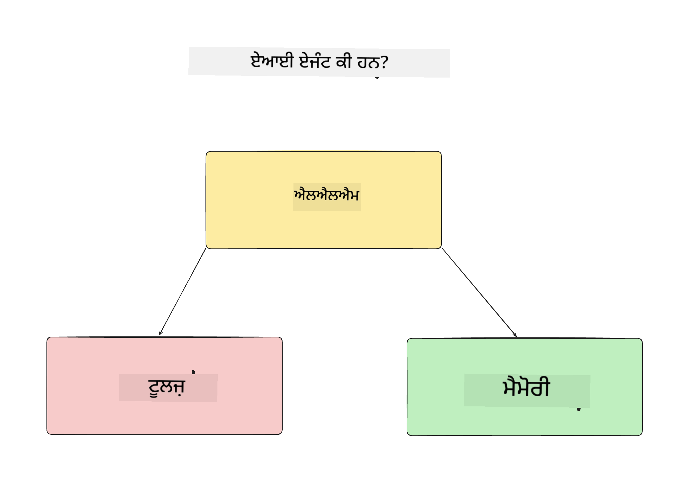
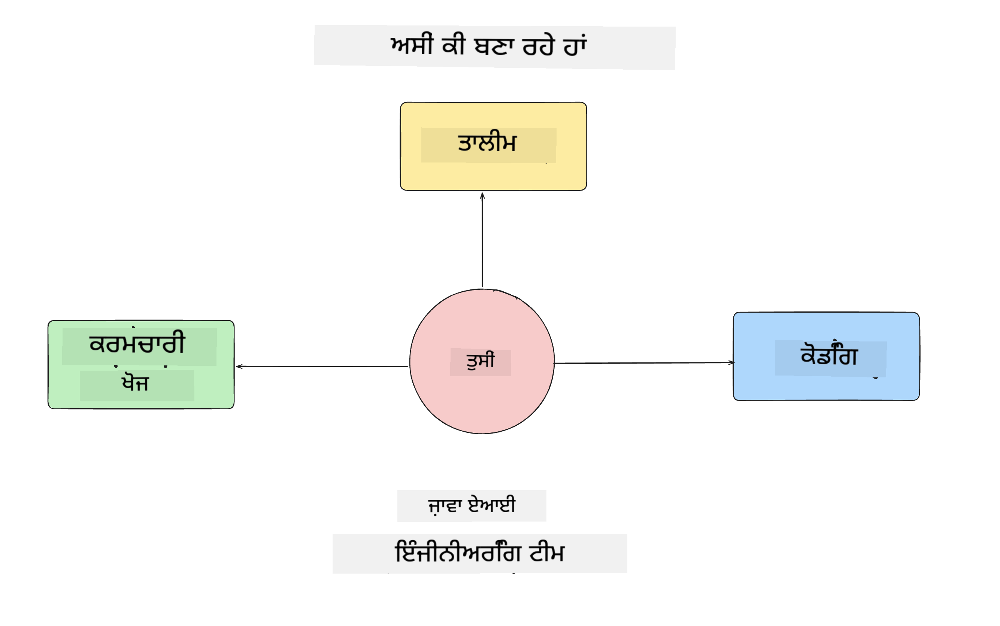
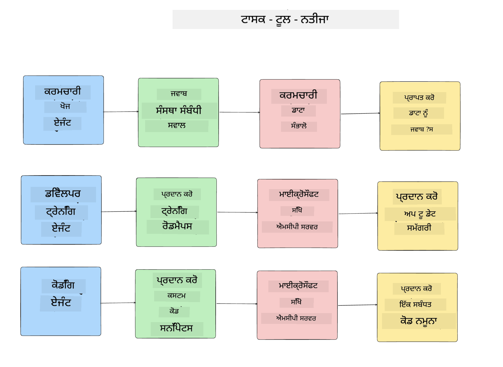
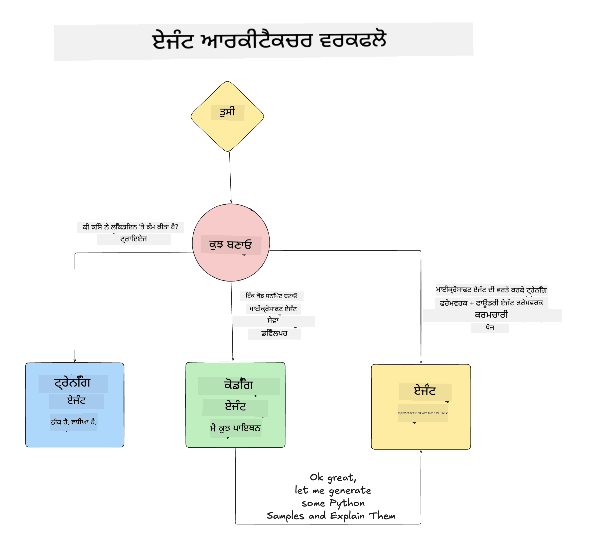

<!--
CO_OP_TRANSLATOR_METADATA:
{
  "original_hash": "99c07849641a850775c188c9333f31e5",
  "translation_date": "2025-12-12T18:25:06+00:00",
  "source_file": "lesson-1-agent-design/README.md",
  "language_code": "pa"
}
-->
# ਪਾਠ 1: ਏਆਈ ਏਜੰਟ ਡਿਜ਼ਾਈਨ

"ਜ਼ੀਰੋ ਤੋਂ ਪ੍ਰੋਡਕਸ਼ਨ ਤੱਕ ਏਆਈ ਏਜੰਟ ਬਣਾਉਣ ਕੋਰਸ" ਦੇ ਪਹਿਲੇ ਪਾਠ ਵਿੱਚ ਤੁਹਾਡਾ ਸਵਾਗਤ ਹੈ!

ਇਸ ਪਾਠ ਵਿੱਚ ਅਸੀਂ ਕਵਰ ਕਰਾਂਗੇ:

- ਏਆਈ ਏਜੰਟ ਕੀ ਹਨ ਇਹ ਪਰਿਭਾਸ਼ਿਤ ਕਰਨਾ
  
- ਅਸੀਂ ਜੋ ਏਆਈ ਏਜੰਟ ਐਪਲੀਕੇਸ਼ਨ ਬਣਾ ਰਹੇ ਹਾਂ ਉਸ ਬਾਰੇ ਚਰਚਾ ਕਰਨਾ  

- ਹਰ ਏਜੰਟ ਲਈ ਲੋੜੀਂਦੇ ਟੂਲ ਅਤੇ ਸੇਵਾਵਾਂ ਦੀ ਪਹਚਾਣ ਕਰਨਾ
  
- ਸਾਡੇ ਏਜੰਟ ਐਪਲੀਕੇਸ਼ਨ ਦੀ ਆਰਕੀਟੈਕਚਰ ਬਣਾਉਣਾ
  
ਆਓ ਪਹਿਲਾਂ ਇਹ ਪਰਿਭਾਸ਼ਿਤ ਕਰੀਏ ਕਿ ਏਜੰਟ ਕੀ ਹੁੰਦੇ ਹਨ ਅਤੇ ਅਸੀਂ ਕਿਸ ਲਈ ਉਨ੍ਹਾਂ ਨੂੰ ਐਪਲੀਕੇਸ਼ਨ ਵਿੱਚ ਵਰਤਦੇ ਹਾਂ।

## ਏਆਈ ਏਜੰਟ ਕੀ ਹਨ?

ਜੇ ਇਹ ਤੁਹਾਡਾ ਪਹਿਲਾ ਵਾਰ ਹੈ ਕਿ ਤੁਸੀਂ ਏਆਈ ਏਜੰਟ ਬਣਾਉਣ ਬਾਰੇ ਖੋਜ ਕਰ ਰਹੇ ਹੋ, ਤਾਂ ਤੁਹਾਡੇ ਮਨ ਵਿੱਚ ਇਹ ਸਵਾਲ ਹੋ ਸਕਦੇ ਹਨ ਕਿ ਏਆਈ ਏਜੰਟ ਨੂੰ ਕਿਵੇਂ ਸਹੀ ਤਰੀਕੇ ਨਾਲ ਪਰਿਭਾਸ਼ਿਤ ਕੀਤਾ ਜਾਵੇ।

ਸਰਲ ਤਰੀਕੇ ਨਾਲ, ਏਆਈ ਏਜੰਟ ਉਹ ਹਨ ਜੋ ਇਹ ਹਿੱਸੇ ਬਣਾਉਂਦੇ ਹਨ:

**ਵੱਡਾ ਭਾਸ਼ਾ ਮਾਡਲ** - LLM ਦੋਹਾਂ ਨੂੰ ਸਮਰੱਥਾ ਦੇਵੇਗਾ ਕਿ ਉਹ ਉਪਭੋਗਤਾ ਤੋਂ ਕੁਦਰਤੀ ਭਾਸ਼ਾ ਨੂੰ ਪ੍ਰਕਿਰਿਆ ਕਰਕੇ ਉਹ ਕੰਮ ਸਮਝ ਸਕੇ ਜੋ ਉਹ ਪੂਰਾ ਕਰਨਾ ਚਾਹੁੰਦੇ ਹਨ ਅਤੇ ਉਪਲਬਧ ਟੂਲਾਂ ਦੇ ਵਰਣਨ ਨੂੰ ਵੀ ਸਮਝ ਸਕੇ ਜੋ ਉਹ ਕੰਮ ਪੂਰੇ ਕਰਨ ਲਈ ਵਰਤ ਸਕਦੇ ਹਨ।

**ਟੂਲ** - ਇਹ ਫੰਕਸ਼ਨ, APIs, ਡੇਟਾ ਸਟੋਰ ਅਤੇ ਹੋਰ ਸੇਵਾਵਾਂ ਹੋਣਗੇ ਜੋ LLM ਚੁਣ ਸਕਦਾ ਹੈ ਉਪਭੋਗਤਾ ਵੱਲੋਂ ਮੰਗੇ ਗਏ ਕੰਮ ਪੂਰੇ ਕਰਨ ਲਈ।

**ਮੈਮੋਰੀ** - ਇਹ ਸਾਡੇ ਲਈ ਛੋਟੇ ਸਮੇਂ ਅਤੇ ਲੰਮੇ ਸਮੇਂ ਦੇ ਇੰਟਰੈਕਸ਼ਨ ਨੂੰ ਸਟੋਰ ਕਰਨ ਦਾ ਤਰੀਕਾ ਹੈ ਜੋ ਏਆਈ ਏਜੰਟ ਅਤੇ ਉਪਭੋਗਤਾ ਵਿਚਕਾਰ ਹੁੰਦੇ ਹਨ। ਇਸ ਜਾਣਕਾਰੀ ਨੂੰ ਸਟੋਰ ਅਤੇ ਪ੍ਰਾਪਤ ਕਰਨਾ ਸੁਧਾਰ ਕਰਨ ਅਤੇ ਸਮੇਂ ਦੇ ਨਾਲ ਉਪਭੋਗਤਾ ਦੀਆਂ ਪਸੰਦਾਂ ਨੂੰ ਸੁਰੱਖਿਅਤ ਕਰਨ ਲਈ ਮਹੱਤਵਪੂਰਨ ਹੈ।

## ਸਾਡਾ ਏਆਈ ਏਜੰਟ ਉਪਯੋਗ ਕੇਸ

ਇਸ ਕੋਰਸ ਲਈ, ਅਸੀਂ ਇੱਕ ਏਆਈ ਏਜੰਟ ਐਪਲੀਕੇਸ਼ਨ ਬਣਾਉਣ ਜਾ ਰਹੇ ਹਾਂ ਜੋ ਨਵੇਂ ਡਿਵੈਲਪਰਾਂ ਨੂੰ ਸਾਡੇ ਏਆਈ ਏਜੰਟ ਵਿਕਾਸ ਟੀਮ ਵਿੱਚ ਸ਼ਾਮਿਲ ਹੋਣ ਵਿੱਚ ਮਦਦ ਕਰੇਗਾ!

ਕਿਸੇ ਵੀ ਵਿਕਾਸ ਕੰਮ ਨੂੰ ਸ਼ੁਰੂ ਕਰਨ ਤੋਂ ਪਹਿਲਾਂ, ਇੱਕ ਸਫਲ ਏਆਈ ਏਜੰਟ ਐਪਲੀਕੇਸ਼ਨ ਬਣਾਉਣ ਦਾ ਪਹਿਲਾ ਕਦਮ ਇਹ ਹੈ ਕਿ ਅਸੀਂ ਸਪਸ਼ਟ ਸਥਿਤੀਆਂ ਨੂੰ ਪਰਿਭਾਸ਼ਿਤ ਕਰੀਏ ਕਿ ਅਸੀਂ ਆਪਣੇ ਉਪਭੋਗਤਾਵਾਂ ਤੋਂ ਕਿਵੇਂ ਉਮੀਦ ਕਰਦੇ ਹਾਂ ਕਿ ਉਹ ਸਾਡੇ ਏਆਈ ਏਜੰਟਾਂ ਨਾਲ ਕੰਮ ਕਰਨਗੇ।

ਇਸ ਐਪਲੀਕੇਸ਼ਨ ਲਈ, ਅਸੀਂ ਇਹ ਸਥਿਤੀਆਂ ਵਰਤਾਂਗੇ:

**ਸਥਿਤੀ 1**: ਇੱਕ ਨਵਾਂ ਕਰਮਚਾਰੀ ਸਾਡੇ ਸੰਗਠਨ ਵਿੱਚ ਸ਼ਾਮਿਲ ਹੁੰਦਾ ਹੈ ਅਤੇ ਉਹ ਟੀਮ ਬਾਰੇ ਹੋਰ ਜਾਣਨਾ ਚਾਹੁੰਦਾ ਹੈ ਜਿਸ ਵਿੱਚ ਉਹ ਸ਼ਾਮਿਲ ਹੋਇਆ ਹੈ ਅਤੇ ਉਹਨਾਂ ਨਾਲ ਕਿਵੇਂ ਜੁੜਨਾ ਹੈ।

**ਸਥਿਤੀ 2:** ਇੱਕ ਨਵਾਂ ਕਰਮਚਾਰੀ ਜਾਣਨਾ ਚਾਹੁੰਦਾ ਹੈ ਕਿ ਉਸ ਲਈ ਸਭ ਤੋਂ ਵਧੀਆ ਪਹਿਲਾ ਕੰਮ ਕੀ ਹੋਵੇਗਾ ਜਿਸ 'ਤੇ ਉਹ ਕੰਮ ਕਰਨਾ ਸ਼ੁਰੂ ਕਰ ਸਕੇ।

**ਸਥਿਤੀ 3:** ਇੱਕ ਨਵਾਂ ਕਰਮਚਾਰੀ ਸਿੱਖਣ ਵਾਲੇ ਸਰੋਤ ਅਤੇ ਕੋਡ ਨਮੂਨੇ ਇਕੱਠੇ ਕਰਨਾ ਚਾਹੁੰਦਾ ਹੈ ਜੋ ਉਸ ਨੂੰ ਇਸ ਕੰਮ ਨੂੰ ਪੂਰਾ ਕਰਨ ਵਿੱਚ ਮਦਦ ਕਰਨ।

## ਟੂਲ ਅਤੇ ਸੇਵਾਵਾਂ ਦੀ ਪਹਚਾਣ

ਹੁਣ ਜਦੋਂ ਕਿ ਸਾਡੇ ਕੋਲ ਇਹ ਸਥਿਤੀਆਂ ਬਣ ਚੁੱਕੀਆਂ ਹਨ, ਅਗਲਾ ਕਦਮ ਇਹ ਹੈ ਕਿ ਅਸੀਂ ਉਨ੍ਹਾਂ ਨੂੰ ਉਹਨਾਂ ਟੂਲਾਂ ਅਤੇ ਸੇਵਾਵਾਂ ਨਾਲ ਜੋੜੀਏ ਜੋ ਸਾਡੇ ਏਆਈ ਏਜੰਟਾਂ ਨੂੰ ਇਹ ਕੰਮ ਪੂਰੇ ਕਰਨ ਲਈ ਲੋੜੀਂਦੇ ਹਨ।

ਇਹ ਪ੍ਰਕਿਰਿਆ ਸੰਦਰਭ ਇੰਜੀਨੀਅਰਿੰਗ ਦੀ ਸ਼੍ਰੇਣੀ ਵਿੱਚ ਆਉਂਦੀ ਹੈ ਕਿਉਂਕਿ ਅਸੀਂ ਇਹ ਯਕੀਨੀ ਬਣਾਉਣ 'ਤੇ ਧਿਆਨ ਦੇ ਰਹੇ ਹਾਂ ਕਿ ਸਾਡੇ ਏਆਈ ਏਜੰਟਾਂ ਕੋਲ ਸਹੀ ਸਮੇਂ 'ਤੇ ਸਹੀ ਸੰਦਰਭ ਹੋਵੇ ਤਾਂ ਜੋ ਉਹ ਕੰਮ ਪੂਰੇ ਕਰ ਸਕਣ।

ਆਓ ਇਹ ਸਥਿਤੀ ਦਰ ਸਥਿਤੀ ਕਰੀਏ ਅਤੇ ਹਰ ਏਜੰਟ ਦੇ ਕੰਮ, ਟੂਲ ਅਤੇ ਚਾਹੁੰਦੇ ਨਤੀਜੇ ਲਿਖ ਕੇ ਵਧੀਆ ਏਜੰਟਿਕ ਡਿਜ਼ਾਈਨ ਕਰੀਏ।

### ਸਥਿਤੀ 1 - ਕਰਮਚਾਰੀ ਖੋਜ ਏਜੰਟ

**ਕੰਮ** - ਸੰਗਠਨ ਵਿੱਚ ਕਰਮਚਾਰੀਆਂ ਬਾਰੇ ਸਵਾਲਾਂ ਦੇ ਜਵਾਬ ਦੇਣਾ ਜਿਵੇਂ ਕਿ ਸ਼ਾਮਿਲ ਹੋਣ ਦੀ ਤਾਰੀਖ, ਮੌਜੂਦਾ ਟੀਮ, ਸਥਾਨ ਅਤੇ ਆਖਰੀ ਪਦਵੀ।

**ਟੂਲ** - ਮੌਜੂਦਾ ਕਰਮਚਾਰੀ ਸੂਚੀ ਅਤੇ ਸੰਗਠਨ ਚਾਰਟ ਦਾ ਡੇਟਾਸਟੋਰ

**ਨਤੀਜੇ** - ਡੇਟਾਸਟੋਰ ਤੋਂ ਜਾਣਕਾਰੀ ਪ੍ਰਾਪਤ ਕਰਨ ਯੋਗ ਹੋਣਾ ਤਾਂ ਜੋ ਆਮ ਸੰਗਠਨਕ ਸਵਾਲਾਂ ਅਤੇ ਕਰਮਚਾਰੀਆਂ ਬਾਰੇ ਵਿਸ਼ੇਸ਼ ਸਵਾਲਾਂ ਦੇ ਜਵਾਬ ਦਿੱਤੇ ਜਾ ਸਕਣ।

### ਸਥਿਤੀ 2 - ਕੰਮ ਸਿਫਾਰਸ਼ੀ ਏਜੰਟ

**ਕੰਮ** - ਨਵੇਂ ਕਰਮਚਾਰੀ ਦੇ ਡਿਵੈਲਪਰ ਅਨੁਭਵ ਦੇ ਆਧਾਰ 'ਤੇ, 1-3 ਮੁੱਦੇ ਲੱਭੋ ਜਿਨ੍ਹਾਂ 'ਤੇ ਨਵਾਂ ਕਰਮਚਾਰੀ ਕੰਮ ਕਰ ਸਕਦਾ ਹੈ।

**ਟੂਲ** - GitHub MCP ਸਰਵਰ ਖੁੱਲ੍ਹੇ ਮੁੱਦਿਆਂ ਨੂੰ ਪ੍ਰਾਪਤ ਕਰਨ ਅਤੇ ਡਿਵੈਲਪਰ ਪ੍ਰੋਫਾਈਲ ਬਣਾਉਣ ਲਈ

**ਨਤੀਜੇ** - GitHub ਪ੍ਰੋਫਾਈਲ ਦੇ ਆਖਰੀ 5 ਕਮਿਟ ਪੜ੍ਹਨ ਅਤੇ GitHub ਪ੍ਰੋਜੈਕਟ 'ਤੇ ਖੁੱਲ੍ਹੇ ਮੁੱਦਿਆਂ ਨੂੰ ਪੜ੍ਹਨ ਅਤੇ ਮੇਲ ਦੇ ਆਧਾਰ 'ਤੇ ਸਿਫਾਰਸ਼ਾਂ ਦੇਣ ਯੋਗ ਹੋਣਾ

### ਸਥਿਤੀ 3 - ਕੋਡ ਸਹਾਇਕ ਏਜੰਟ

**ਕੰਮ** - "ਕੰਮ ਸਿਫਾਰਸ਼ੀ" ਏਜੰਟ ਵੱਲੋਂ ਸਿਫਾਰਸ਼ ਕੀਤੇ ਗਏ ਖੁੱਲ੍ਹੇ ਮੁੱਦਿਆਂ ਦੇ ਆਧਾਰ 'ਤੇ, ਖੋਜ ਕਰਨਾ ਅਤੇ ਸਰੋਤ ਪ੍ਰਦਾਨ ਕਰਨਾ ਅਤੇ ਕਰਮਚਾਰੀ ਦੀ ਮਦਦ ਲਈ ਕੋਡ ਸਨਿੱਪੇਟ ਤਿਆਰ ਕਰਨਾ।

**ਟੂਲ** - Microsoft Learn MCP ਸਰੋਤ ਲੱਭਣ ਲਈ ਅਤੇ ਕੋਡ ਇੰਟਰਪ੍ਰੀਟਰ ਵਿਸ਼ੇਸ਼ ਕੋਡ ਸਨਿੱਪੇਟ ਤਿਆਰ ਕਰਨ ਲਈ।

**ਨਤੀਜੇ** - ਜੇ ਉਪਭੋਗਤਾ ਵਾਧੂ ਮਦਦ ਮੰਗਦਾ ਹੈ, ਤਾਂ ਵਰਕਫਲੋ Learn MCP ਸਰਵਰ ਦੀ ਵਰਤੋਂ ਕਰਕੇ ਸਰੋਤਾਂ ਲਈ ਲਿੰਕ ਅਤੇ ਸਨਿੱਪੇਟ ਪ੍ਰਦਾਨ ਕਰੇ ਅਤੇ ਫਿਰ ਕੋਡ ਇੰਟਰਪ੍ਰੀਟਰ ਏਜੰਟ ਨੂੰ ਛੋਟੇ ਕੋਡ ਸਨਿੱਪੇਟ ਵਿਆਖਿਆਵਾਂ ਸਮੇਤ ਤਿਆਰ ਕਰਨ ਲਈ ਸੌਂਪ ਦੇਵੇ।

## ਸਾਡੇ ਏਜੰਟ ਐਪਲੀਕੇਸ਼ਨ ਦੀ ਆਰਕੀਟੈਕਚਰ

ਹੁਣ ਜਦੋਂ ਕਿ ਅਸੀਂ ਆਪਣੇ ਹਰ ਏਜੰਟ ਨੂੰ ਪਰਿਭਾਸ਼ਿਤ ਕਰ ਲਿਆ ਹੈ, ਆਓ ਇੱਕ ਆਰਕੀਟੈਕਚਰ ਡਾਇਗ੍ਰਾਮ ਬਣਾਈਏ ਜੋ ਸਾਨੂੰ ਸਮਝਣ ਵਿੱਚ ਮਦਦ ਕਰੇਗਾ ਕਿ ਹਰ ਏਜੰਟ ਕਿਵੇਂ ਇਕੱਠੇ ਅਤੇ ਵੱਖ-ਵੱਖ ਕੰਮ ਕਰੇਗਾ ਕੰਮ ਦੇ ਅਨੁਸਾਰ:

## ਅਗਲੇ ਕਦਮ

ਹੁਣ ਜਦੋਂ ਕਿ ਅਸੀਂ ਹਰ ਏਜੰਟ ਅਤੇ ਸਾਡੀ ਏਜੰਟਿਕ ਸਿਸਟਮ ਦਾ ਡਿਜ਼ਾਈਨ ਕਰ ਲਿਆ ਹੈ, ਆਓ ਅਗਲੇ ਪਾਠ ਵੱਲ ਵਧੀਏ ਜਿੱਥੇ ਅਸੀਂ ਹਰ ਏਜੰਟ ਨੂੰ ਵਿਕਸਿਤ ਕਰਾਂਗੇ!

---

<!-- CO-OP TRANSLATOR DISCLAIMER START -->
**ਅਸਵੀਕਾਰੋਪੱਤਰ**:  
ਇਹ ਦਸਤਾਵੇਜ਼ AI ਅਨੁਵਾਦ ਸੇਵਾ [Co-op Translator](https://github.com/Azure/co-op-translator) ਦੀ ਵਰਤੋਂ ਕਰਕੇ ਅਨੁਵਾਦ ਕੀਤਾ ਗਿਆ ਹੈ। ਜਦੋਂ ਕਿ ਅਸੀਂ ਸਹੀਤਾ ਲਈ ਕੋਸ਼ਿਸ਼ ਕਰਦੇ ਹਾਂ, ਕਿਰਪਾ ਕਰਕੇ ਧਿਆਨ ਵਿੱਚ ਰੱਖੋ ਕਿ ਸਵੈਚਾਲਿਤ ਅਨੁਵਾਦਾਂ ਵਿੱਚ ਗਲਤੀਆਂ ਜਾਂ ਅਸਮਰਥਤਾਵਾਂ ਹੋ ਸਕਦੀਆਂ ਹਨ। ਮੂਲ ਦਸਤਾਵੇਜ਼ ਆਪਣੀ ਮੂਲ ਭਾਸ਼ਾ ਵਿੱਚ ਪ੍ਰਮਾਣਿਕ ਸਰੋਤ ਮੰਨਿਆ ਜਾਣਾ ਚਾਹੀਦਾ ਹੈ। ਮਹੱਤਵਪੂਰਨ ਜਾਣਕਾਰੀ ਲਈ, ਪੇਸ਼ੇਵਰ ਮਨੁੱਖੀ ਅਨੁਵਾਦ ਦੀ ਸਿਫਾਰਸ਼ ਕੀਤੀ ਜਾਂਦੀ ਹੈ। ਅਸੀਂ ਇਸ ਅਨੁਵਾਦ ਦੀ ਵਰਤੋਂ ਤੋਂ ਉਤਪੰਨ ਕਿਸੇ ਵੀ ਗਲਤਫਹਿਮੀ ਜਾਂ ਗਲਤ ਵਿਆਖਿਆ ਲਈ ਜ਼ਿੰਮੇਵਾਰ ਨਹੀਂ ਹਾਂ।
<!-- CO-OP TRANSLATOR DISCLAIMER END -->