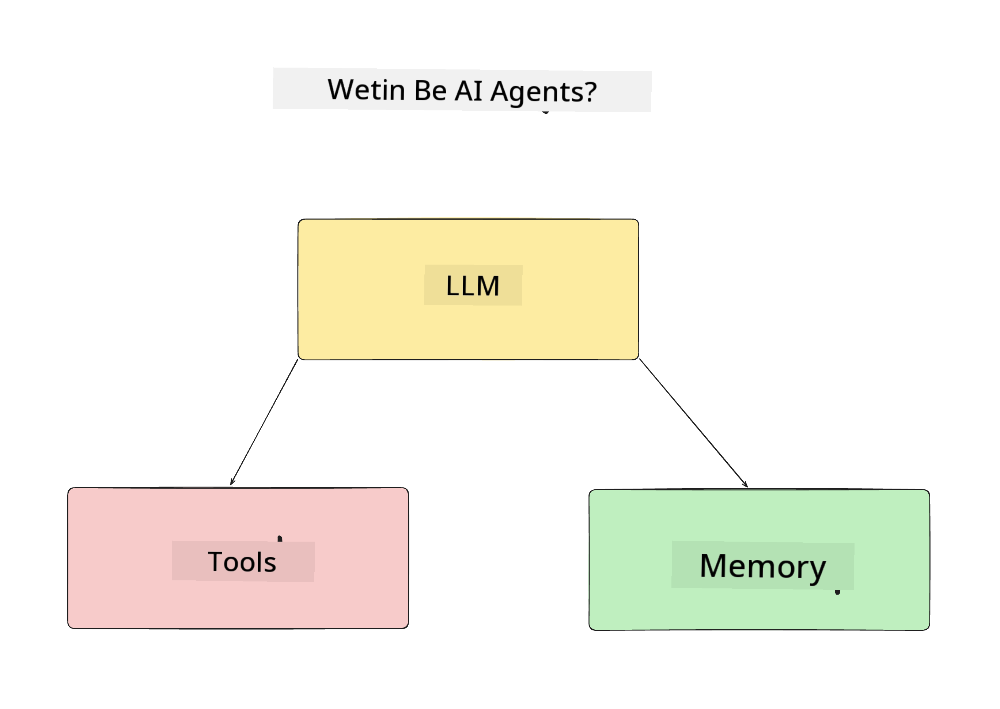
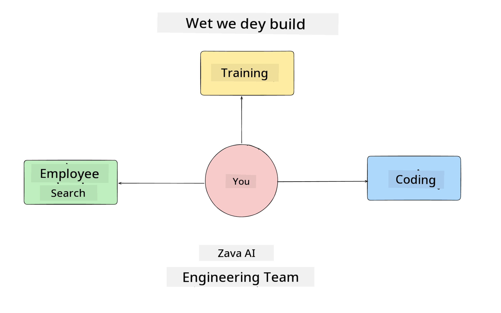
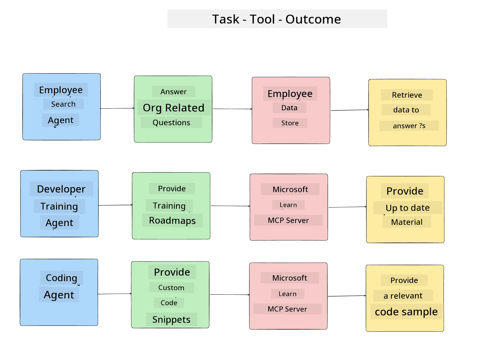
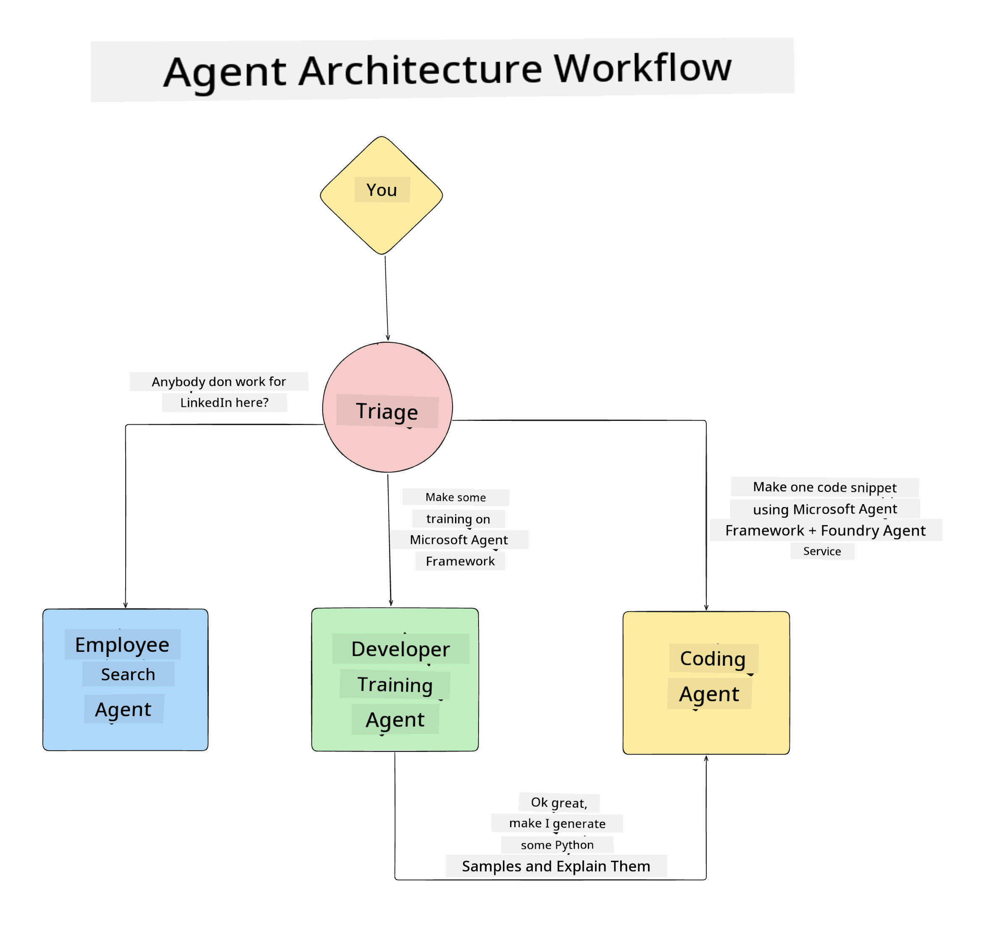

<!--
CO_OP_TRANSLATOR_METADATA:
{
  "original_hash": "99c07849641a850775c188c9333f31e5",
  "translation_date": "2025-12-12T18:46:07+00:00",
  "source_file": "lesson-1-agent-design/README.md",
  "language_code": "pcm"
}
-->
# Lesson 1: AI Agent Design

Welcome to di first lesson of di "Building AI Agent from Zero to Production Course"!

For dis lesson we go cover:

- Defining wetin AI Agents be
  
- Talk about di AI Agent Application we dey build  

- Identify di tools and service wey each agent need
  
- Architect our Agent Application
  
Make we start by defining wetin agent be and why we go use dem inside application.

## Wetin Be AI Agents?

If dis na your first time to explore how to build AI Agent, you fit get questions on how to exactly define wetin AI Agent be.

For simple way to define wetin AI Agent be na di components wey make am:

**Large Language Model** - Di LLM go power di ability to process natural language from di user to understand di task dem want do plus to understand di descriptions of di tools wey dey available to do those tasks.

**Tools** - Dem go be functions, APIs, data stores and other services wey di LLM fit choose to use to complete di tasks wey user request.

**Memory** - Na how we dey store both short term and long term interactions between di AI Agent and di user. To store and retrieve dis information important to make improvements and save user preferences over time.

## Our AI Agent Use Case

For dis course, we go build AI Agent application wey go help new developers join our AI Agent Development Team!

Before we start any development work, di first step to create successful AI Agent application na to define clear scenarios on how we expect our users to work with our AI Agents.

For dis application, we go work with these scenarios:

**Scenario 1**: New employee join our organization and want to know more about di team dem join and how to connect with dem.

**Scenario 2:** New employee want know wetin be di best first task for dem to start work on.

**Scenario 3:** New employee want gather learning resources and code samples to help dem start to complete dis task.

## Identifying the Tools and Services

Now we get these scenarios, di next step na to map dem to di tools and services wey our AI agents go need to complete these tasks.

Dis process dey under di category of Context Engineering as we go focus on making sure say our AI Agents get di right context at di right time to complete di tasks.

Make we do dis scenario by scenario and perform good agentic design by listing each agent's task, tools and wetin we want make e achieve.

### Scenario 1 - Employee Search Agent

**Task** - Answer questions about employees for di organization like join date, current team, location and last position.

**Tools** - Datastore of current employee list and org chart

**Outcomes** - Fit retrieve information from di datastore to answer general organizational questions and specific questions about employees.

### Scenario 2 - Task Recommendation Agent

**Task** - Based on di new employee's developer experience, come up with 1-3 issues wey di new employee fit work on.

**Tools** - GitHub MCP Server to get open issues and build developer profile

**Outcomes** - Fit read di last 5 commits of GitHub Profile and open issues for GitHub project and make recommendations based on match

### Scenario 3 - Code Assistant Agent

**Task** - Based on di Open Issues wey "Task Recommendation" Agent recommend, research and provide resources and generate code snippets to help di employee.

**Tools** - Microsoft Learn MCP to find resources and Code Interpreter to generate custom code snippets.

**Outcomes** - If user ask for extra help, di workflow suppose use Learn MCP Server to provide links and snippets to resources then handoff to Code Interpreter agent to generate small code snippets with explanations.

## Architecting our Agent Application

Now we don define each of our Agents, make we create architecture diagram wey go help us understand how each agent go work together and separately depending on di task:

## Next Steps

Now we don design each agent and our agentic system, make we move go di next lesson wey we go develop each of these agents!

---

<!-- CO-OP TRANSLATOR DISCLAIMER START -->
**Disclaimer**:
Dis document don translate wit AI translation service [Co-op Translator](https://github.com/Azure/co-op-translator). Even though we try make e correct, abeg sabi say automated translation fit get some errors or mistakes. Di original document wey dey im own language na di correct one. If na serious matter, e better make human professional translate am. We no go responsible for any misunderstanding or wrong meaning wey fit come from dis translation.
<!-- CO-OP TRANSLATOR DISCLAIMER END -->