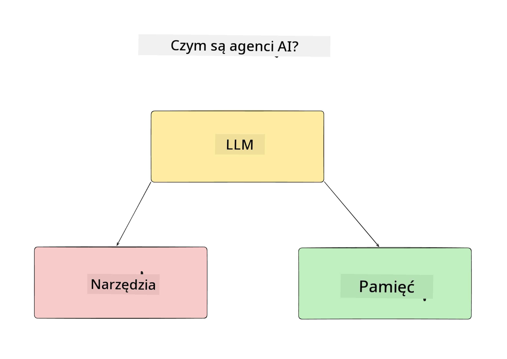
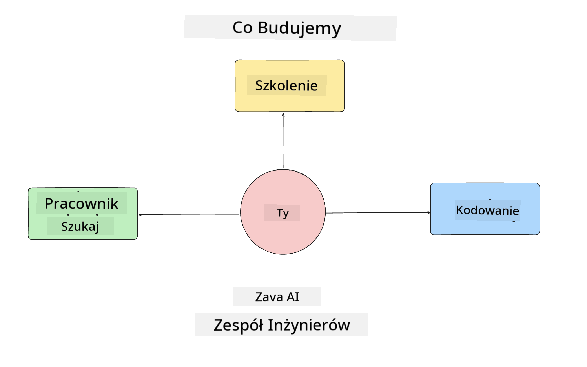
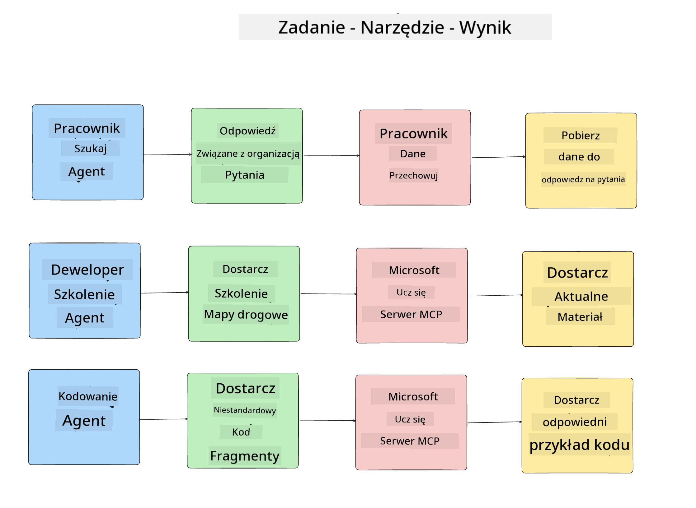
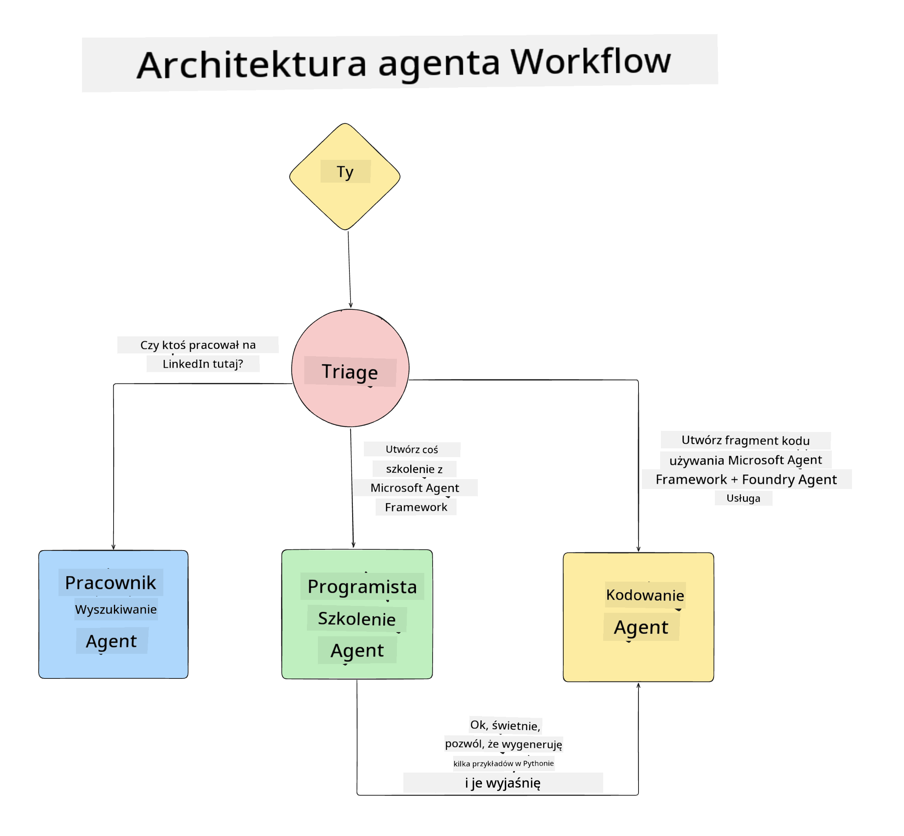

<!--
CO_OP_TRANSLATOR_METADATA:
{
  "original_hash": "99c07849641a850775c188c9333f31e5",
  "translation_date": "2025-12-12T18:27:21+00:00",
  "source_file": "lesson-1-agent-design/README.md",
  "language_code": "pl"
}
-->
# Lekcja 1: Projektowanie Agenta AI

Witamy w pierwszej lekcji kursu "Budowanie Agenta AI od Zera do Produkcji"!

W tej lekcji omówimy:

- Definicję, czym są Agenci AI
  
- Omówimy aplikację Agenta AI, którą budujemy  

- Zidentyfikujemy wymagane narzędzia i usługi dla każdego agenta
  
- Zaprojektujemy naszą aplikację Agenta
  
Zacznijmy od zdefiniowania, czym jest agent i dlaczego chcielibyśmy ich używać w aplikacji.

## Czym są Agenci AI?

Jeśli to Twój pierwszy raz, gdy eksplorujesz, jak zbudować Agenta AI, możesz mieć pytania, jak dokładnie zdefiniować, czym jest Agent AI.

Prosty sposób na zdefiniowanie Agenta AI to przez komponenty, które go tworzą:

**Duży Model Językowy** - LLM będzie napędzał zarówno zdolność do przetwarzania języka naturalnego od użytkownika, aby zinterpretować zadanie, które chce wykonać, jak i interpretować opisy narzędzi dostępnych do realizacji tych zadań.

**Narzędzia** - Będą to funkcje, API, magazyny danych i inne usługi, które LLM może wybrać do użycia, aby wykonać zadania zlecone przez użytkownika.

**Pamięć** - To sposób, w jaki przechowujemy zarówno krótkoterminowe, jak i długoterminowe interakcje między Agentem AI a użytkownikiem. Przechowywanie i pobieranie tych informacji jest ważne dla wprowadzania ulepszeń i zapisywania preferencji użytkownika w czasie.

## Nasz Przypadek Użycia Agenta AI

W tym kursie zbudujemy aplikację Agenta AI, która pomaga nowym programistom wdrożyć się do naszego Zespołu Rozwoju Agentów AI!

Zanim rozpoczniemy prace programistyczne, pierwszym krokiem do stworzenia udanej aplikacji Agenta AI jest zdefiniowanie jasnych scenariuszy, jak oczekujemy, że nasi użytkownicy będą współpracować z naszymi Agentami AI.

Dla tej aplikacji będziemy pracować z następującymi scenariuszami:

**Scenariusz 1**: Nowy pracownik dołącza do naszej organizacji i chce dowiedzieć się więcej o zespole, do którego dołączył, oraz jak się z nim skontaktować.

**Scenariusz 2:** Nowy pracownik chce wiedzieć, jakie będzie najlepsze pierwsze zadanie do rozpoczęcia pracy.

**Scenariusz 3:** Nowy pracownik chce zebrać zasoby edukacyjne i przykłady kodu, które pomogą mu zacząć realizować to zadanie.

## Identyfikacja Narzędzi i Usług

Teraz, gdy mamy stworzone te scenariusze, kolejnym krokiem jest przypisanie ich do narzędzi i usług, których nasi Agenci AI będą potrzebować do wykonania tych zadań.

Ten proces należy do kategorii Inżynierii Kontekstu, ponieważ skupimy się na zapewnieniu, że nasi Agenci AI mają odpowiedni kontekst w odpowiednim czasie, aby wykonać zadania.

Zróbmy to scenariusz po scenariuszu i przeprowadźmy dobre projektowanie agentów, wymieniając zadania, narzędzia i oczekiwane rezultaty każdego agenta.

### Scenariusz 1 - Agent Wyszukiwania Pracowników

**Zadanie** - Odpowiadanie na pytania o pracowników w organizacji, takie jak data dołączenia, obecny zespół, lokalizacja i ostatnie stanowisko.

**Narzędzia** - Magazyn danych z aktualną listą pracowników i schemat organizacyjny

**Rezultaty** - Możliwość pobierania informacji z magazynu danych, aby odpowiadać na ogólne pytania organizacyjne i konkretne pytania o pracowników.

### Scenariusz 2 - Agent Rekomendacji Zadań

**Zadanie** - Na podstawie doświadczenia programistycznego nowego pracownika, zaproponować 1-3 zadania, nad którymi nowy pracownik może pracować.

**Narzędzia** - Serwer MCP GitHub do pobierania otwartych zgłoszeń i budowania profilu programisty

**Rezultaty** - Możliwość odczytania ostatnich 5 commitów profilu GitHub oraz otwartych zgłoszeń w projekcie GitHub i dokonania rekomendacji na podstawie dopasowania

### Scenariusz 3 - Agent Asystenta Kodowania

**Zadanie** - Na podstawie otwartych zgłoszeń rekomendowanych przez Agenta "Rekomendacji Zadań", wyszukiwać i dostarczać zasoby oraz generować fragmenty kodu, aby pomóc pracownikowi.

**Narzędzia** - Microsoft Learn MCP do znajdowania zasobów oraz Interpreter Kodów do generowania niestandardowych fragmentów kodu.

**Rezultaty** - Jeśli użytkownik poprosi o dodatkową pomoc, przepływ pracy powinien użyć serwera Learn MCP, aby dostarczyć linki i fragmenty do zasobów, a następnie przekazać do agenta Interpreter Kodów, aby wygenerować małe fragmenty kodu z wyjaśnieniami.

## Projektowanie architektury naszej aplikacji Agenta

Teraz, gdy zdefiniowaliśmy każdego z naszych Agentów, stwórzmy diagram architektury, który pomoże nam zrozumieć, jak każdy agent będzie współpracował i działał osobno w zależności od zadania:

## Kolejne kroki

Teraz, gdy zaprojektowaliśmy każdego agenta i nasz system agentowy, przejdźmy do następnej lekcji, w której opracujemy każdego z tych agentów!

---

<!-- CO-OP TRANSLATOR DISCLAIMER START -->
**Zastrzeżenie**:  
Niniejszy dokument został przetłumaczony za pomocą usługi tłumaczenia AI [Co-op Translator](https://github.com/Azure/co-op-translator). Mimo że dokładamy starań, aby tłumaczenie było jak najbardziej precyzyjne, prosimy mieć na uwadze, że automatyczne tłumaczenia mogą zawierać błędy lub nieścisłości. Oryginalny dokument w języku źródłowym należy traktować jako źródło wiarygodne i autorytatywne. W przypadku informacji o kluczowym znaczeniu zalecane jest skorzystanie z profesjonalnego tłumaczenia wykonanego przez człowieka. Nie ponosimy odpowiedzialności za jakiekolwiek nieporozumienia lub błędne interpretacje wynikające z korzystania z tego tłumaczenia.
<!-- CO-OP TRANSLATOR DISCLAIMER END -->