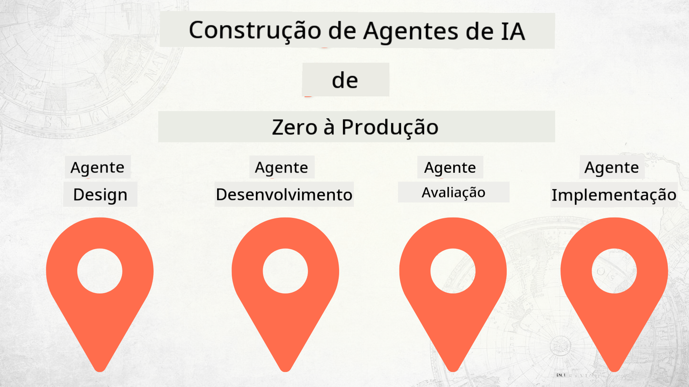

<!--
CO_OP_TRANSLATOR_METADATA:
{
  "original_hash": "2799ceaaefbd8571688459ac03eac5aa",
  "translation_date": "2025-12-12T16:57:41+00:00",
  "source_file": "README.md",
  "language_code": "pt"
}
-->
# Construir Agentes de IA do Zero até à Produção

## Um curso que ensina os fundamentos do Ciclo de Vida do Desenvolvimento de Agentes de IA

## 🌱 Começar

Este curso tem lições que cobrem os fundamentos da construção e implementação de Agentes de IA.

Cada lição baseia-se na anterior, por isso recomendamos começar desde o início e avançar até ao fim.

Se quiser explorar mais sobre tópicos de Agentes de IA, pode consultar o [Curso de Agentes de IA para Iniciantes](https://aka.ms/ai-agents-beginners).

### Conheça Outros Alunos, Tire as Suas Dúvidas

Se ficar bloqueado ou tiver alguma questão sobre a construção de Agentes de IA, junte-se ao nosso Canal Discord dedicado no [Microsoft Foundry Discord](https://discord.gg/Kuaw3ktsu6).

### O Que Precisa

Cada lição tem o seu próprio exemplo de código que pode executar localmente. Pode [fazer fork deste repositório](https://github.com/microsoft/Building-AI-Agents-From-Zero-To-Production/fork) para criar a sua própria cópia.

Este curso utiliza atualmente o seguinte:

- [Microsoft Agent Framework (MAF)](https://aka.ms/ai-agents-beginners/agent-framework)
- [Microsoft Foundry](https://azure.microsoft.com/products/ai-foundry)
- [Azure OpenAI Service](https://azure.microsoft.com/products/ai-foundry/models/openai)
- [Azure CLI](https://learn.microsoft.com/cli/azure/authenticate-azure-cli?view=azure-cli-latest)

Por favor, assegure-se de que tem acesso a estes serviços antes de começar.

Mais opções sobre alojamento de modelos e serviços em breve.

## 🗃️ Lições

| **Lição**         | **Descrição**                                                                                  |
|--------------------|--------------------------------------------------------------------------------------------------|
| [Design do Agente](./lesson-1-agent-design/README.md)       | Uma introdução ao nosso Caso de Uso "Integração de Desenvolvedor" e como desenhar agentes eficazes  |
| [Desenvolvimento do Agente](./lesson-2-agent-development/README.md)  | Usando o Microsoft Agent Framework (MAF), crie 3 agentes para ajudar novos desenvolvedores a integrar-se.       |
| [Avaliações do Agente](./lesson-3-agent-evals/README.md)  | Usando o Microsoft Foundry, descubra o desempenho dos nossos Agentes de IA e como os melhorar. |
| [Implementação do Agente](./lesson-4-agent-deployment/README.md)   | Usando os Agentes Hospedados e OpenAI Chatkit, veja como implementar um Agente de IA em produção.       |

## Contribuir

Este projeto aceita contribuições e sugestões. A maioria das contribuições requer que concorde com um
Acordo de Licença de Contribuidor (CLA) declarando que tem o direito, e de facto concede,
os direitos para usarmos a sua contribuição. Para detalhes, visite <https://cla.opensource.microsoft.com>.

Quando submeter um pedido de pull, um bot CLA determinará automaticamente se precisa de fornecer
um CLA e decorará o PR adequadamente (por exemplo, verificação de estado, comentário). Basta seguir as instruções
fornecidas pelo bot. Só precisará de fazer isto uma vez em todos os repositórios que usam o nosso CLA.

Este projeto adotou o [Código de Conduta de Código Aberto da Microsoft](https://opensource.microsoft.com/codeofconduct/).
Para mais informações veja as [FAQ do Código de Conduta](https://opensource.microsoft.com/codeofconduct/faq/) ou
contacte [opencode@microsoft.com](mailto:opencode@microsoft.com) para quaisquer perguntas ou comentários adicionais.

## Marcas Comerciais

Este projeto pode conter marcas comerciais ou logótipos de projetos, produtos ou serviços. O uso autorizado das marcas comerciais ou logótipos da Microsoft está sujeito e deve seguir
as [Diretrizes de Marcas e Marca da Microsoft](https://www.microsoft.com/legal/intellectualproperty/trademarks/usage/general).
O uso de marcas comerciais ou logótipos da Microsoft em versões modificadas deste projeto não deve causar confusão nem implicar patrocínio da Microsoft.
Qualquer uso de marcas comerciais ou logótipos de terceiros está sujeito às políticas desses terceiros.

## Obter Ajuda

Se ficar bloqueado ou tiver alguma questão sobre a construção de aplicações de IA, junte-se a:

Se tiver feedback sobre o produto ou erros durante a construção, visite:

---

<!-- CO-OP TRANSLATOR DISCLAIMER START -->
**Aviso Legal**:
Este documento foi traduzido utilizando o serviço de tradução automática [Co-op Translator](https://github.com/Azure/co-op-translator). Embora nos esforcemos para garantir a precisão, por favor tenha em conta que traduções automáticas podem conter erros ou imprecisões. O documento original na sua língua nativa deve ser considerado a fonte autorizada. Para informações críticas, recomenda-se a tradução profissional humana. Não nos responsabilizamos por quaisquer mal-entendidos ou interpretações erradas decorrentes do uso desta tradução.
<!-- CO-OP TRANSLATOR DISCLAIMER END -->