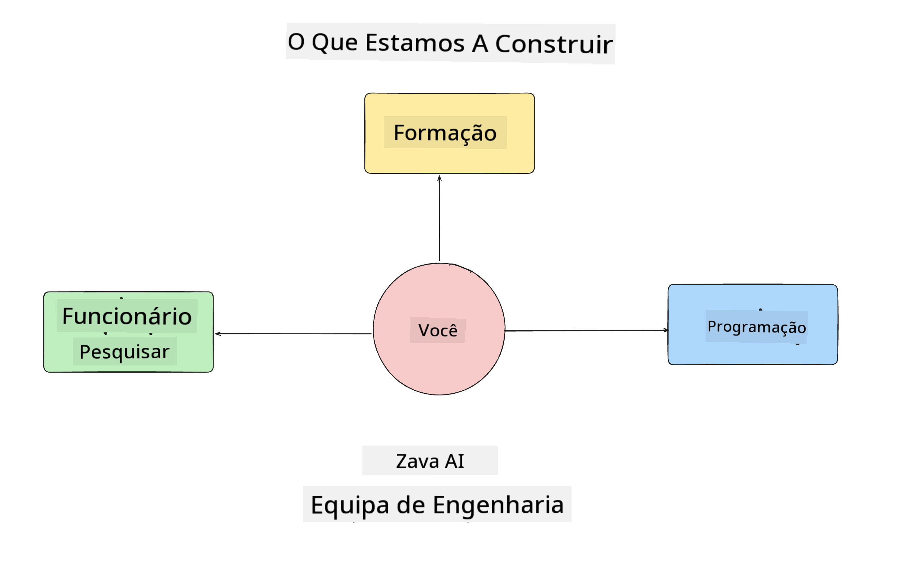
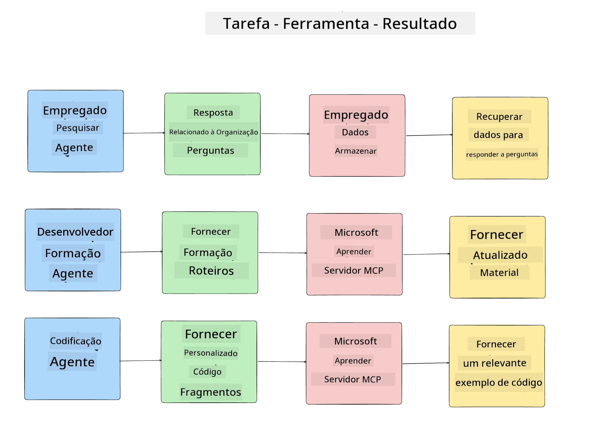
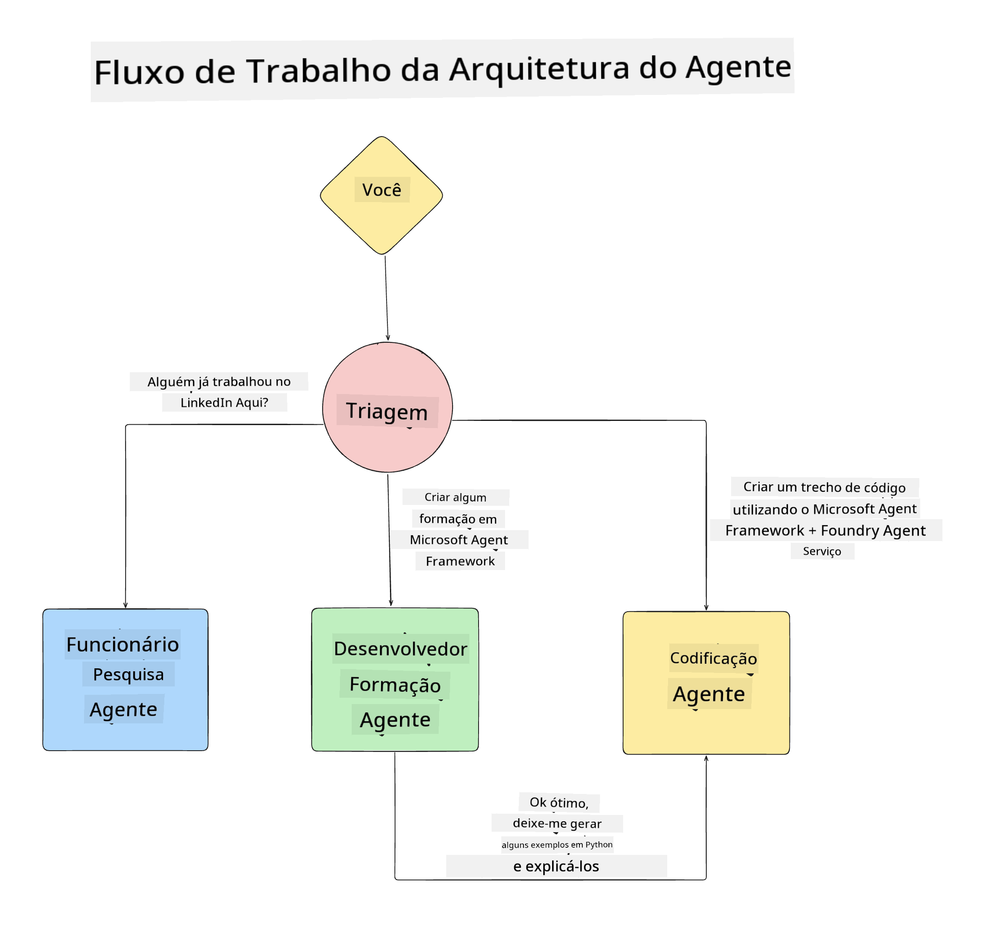

<!--
CO_OP_TRANSLATOR_METADATA:
{
  "original_hash": "99c07849641a850775c188c9333f31e5",
  "translation_date": "2025-12-12T18:25:49+00:00",
  "source_file": "lesson-1-agent-design/README.md",
  "language_code": "pt"
}
-->
# Lesson 1: Design de Agentes de IA

Bem-vindo à primeira lição do "Curso de Construção de Agentes de IA do Zero à Produção"!

Nesta lição vamos abordar:

- Definir o que são Agentes de IA
  
- Discutir a Aplicação de Agentes de IA que estamos a construir  

- Identificar as ferramentas e serviços necessários para cada agente
  
- Arquitetar a nossa Aplicação de Agentes
  
Vamos começar por definir o que são agentes e por que os usaríamos dentro de uma aplicação.

## O Que São Agentes de IA?

Se esta é a sua primeira vez a explorar como construir um Agente de IA, poderá ter dúvidas sobre como definir exatamente o que é um Agente de IA.

Uma forma simples de definir o que é um Agente de IA é pelos componentes que o constituem:

**Modelo de Linguagem Grande** - O LLM irá alimentar tanto a capacidade de processar linguagem natural do utilizador para interpretar a tarefa que quer realizar, como interpretar as descrições das ferramentas disponíveis para completar essas tarefas.

**Ferramentas** - Estas serão funções, APIs, armazenamentos de dados e outros serviços que o LLM pode escolher usar para completar as tarefas solicitadas pelo utilizador.

**Memória** - É assim que armazenamos tanto as interações de curto prazo como de longo prazo entre o Agente de IA e o utilizador. Armazenar e recuperar esta informação é importante para fazer melhorias e guardar preferências do utilizador ao longo do tempo.

## O Nosso Caso de Uso de Agente de IA

Para este curso, vamos construir uma aplicação de Agente de IA que ajuda novos desenvolvedores a integrarem-se na nossa Equipa de Desenvolvimento de Agentes de IA!

Antes de fazermos qualquer trabalho de desenvolvimento, o primeiro passo para criar uma aplicação de Agente de IA bem-sucedida é definir cenários claros sobre como esperamos que os nossos utilizadores trabalhem com os nossos Agentes de IA.

Para esta aplicação, vamos trabalhar com estes cenários:

**Cenário 1**: Um novo colaborador junta-se à nossa organização e quer saber mais sobre a equipa a que se juntou e como se pode ligar a ela.

**Cenário 2:** Um novo colaborador quer saber qual seria a melhor primeira tarefa para começar a trabalhar.

**Cenário 3:** Um novo colaborador quer reunir recursos de aprendizagem e exemplos de código para o ajudar a começar a completar esta tarefa.

## Identificação das Ferramentas e Serviços

Agora que temos estes cenários criados, o próximo passo é mapeá-los para as ferramentas e serviços que os nossos agentes de IA vão precisar para completar estas tarefas.

Este processo enquadra-se na categoria de Engenharia de Contexto, pois vamos focar-nos em garantir que os nossos Agentes de IA têm o contexto certo no momento certo para completar as tarefas.

Vamos fazer isto cenário a cenário e realizar um bom design agentic listando a tarefa, ferramentas e resultados desejados de cada agente.

### Cenário 1 - Agente de Pesquisa de Colaboradores

**Tarefa** - Responder a perguntas sobre colaboradores na organização, como data de entrada, equipa atual, localização e última posição.

**Ferramentas** - Base de dados da lista atual de colaboradores e organograma

**Resultados** - Capaz de recuperar informação da base de dados para responder a perguntas gerais sobre a organização e perguntas específicas sobre colaboradores.

### Cenário 2 - Agente de Recomendação de Tarefas

**Tarefa** - Com base na experiência de desenvolvimento do novo colaborador, sugerir 1-3 issues em que o novo colaborador possa trabalhar.

**Ferramentas** - Servidor MCP do GitHub para obter issues abertas e construir um perfil de desenvolvedor

**Resultados** - Capaz de ler os últimos 5 commits de um Perfil GitHub e issues abertas num projeto GitHub e fazer recomendações baseadas numa correspondência

### Cenário 3 - Agente Assistente de Código

**Tarefa** - Com base nas Issues Abertas recomendadas pelo Agente de "Recomendação de Tarefas", pesquisar e fornecer recursos e gerar snippets de código para ajudar o colaborador.

**Ferramentas** - Microsoft Learn MCP para encontrar recursos e Code Interpreter para gerar snippets de código personalizados.

**Resultados** - Se o utilizador pedir ajuda adicional, o fluxo de trabalho deve usar o Servidor Learn MCP para fornecer links e snippets para recursos e depois passar para o agente Code Interpreter para gerar pequenos snippets de código com explicações.

## Arquitetar a nossa Aplicação de Agentes

Agora que definimos cada um dos nossos Agentes, vamos criar um diagrama de arquitetura que nos ajude a entender como cada agente vai trabalhar em conjunto e separadamente dependendo da tarefa:

## Próximos Passos

Agora que desenhámos cada agente e o nosso sistema agentic, vamos avançar para a próxima lição onde vamos desenvolver cada um destes agentes!

---

<!-- CO-OP TRANSLATOR DISCLAIMER START -->
**Aviso Legal**:
Este documento foi traduzido utilizando o serviço de tradução automática [Co-op Translator](https://github.com/Azure/co-op-translator). Embora nos esforcemos para garantir a precisão, por favor tenha em conta que traduções automáticas podem conter erros ou imprecisões. O documento original na sua língua nativa deve ser considerado a fonte autorizada. Para informações críticas, recomenda-se a tradução profissional humana. Não nos responsabilizamos por quaisquer mal-entendidos ou interpretações incorretas decorrentes da utilização desta tradução.
<!-- CO-OP TRANSLATOR DISCLAIMER END -->