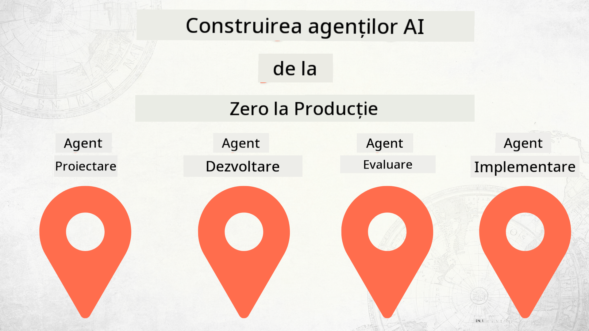

<!--
CO_OP_TRANSLATOR_METADATA:
{
  "original_hash": "73b37a335747d59d319b00aac130f073",
  "translation_date": "2025-12-24T23:52:25+00:00",
  "source_file": "README.md",
  "language_code": "ro"
}
-->
# Construirea agenților AI de la zero până la producție

### 🌐 Suport multilingv

#### Suportat prin GitHub Action (automatizat și întotdeauna actualizat)

<!-- CO-OP TRANSLATOR LANGUAGES TABLE START -->
[Arabă](../ar/README.md) | [Bengaleză](../bn/README.md) | [Bulgară](../bg/README.md) | [Birmaneză (Myanmar)](../my/README.md) | [Chineză (Simplificată)](../zh/README.md) | [Chineză (Tradițională, Hong Kong)](../hk/README.md) | [Chineză (Tradițională, Macau)](../mo/README.md) | [Chineză (Tradițională, Taiwan)](../tw/README.md) | [Croată](../hr/README.md) | [Cehă](../cs/README.md) | [Daneză](../da/README.md) | [Olandeză](../nl/README.md) | [Estonă](../et/README.md) | [Finlandeză](../fi/README.md) | [Franceză](../fr/README.md) | [Germană](../de/README.md) | [Greacă](../el/README.md) | [Ebraică](../he/README.md) | [Hindi](../hi/README.md) | [Maghiară](../hu/README.md) | [Indoneziană](../id/README.md) | [Italiană](../it/README.md) | [Japoneză](../ja/README.md) | [Kannada](../kn/README.md) | [Coreeană](../ko/README.md) | [Lituaniană](../lt/README.md) | [Malaeză](../ms/README.md) | [Malayalam](../ml/README.md) | [Marathi](../mr/README.md) | [Nepaleză](../ne/README.md) | [Pidgin nigerian](../pcm/README.md) | [Norvegiană](../no/README.md) | [Persană (Farsi)](../fa/README.md) | [Poloneză](../pl/README.md) | [Portugheză (Brazilia)](../br/README.md) | [Portugheză (Portugalia)](../pt/README.md) | [Punjabi (Gurmukhi)](../pa/README.md) | [Română](./README.md) | [Rusă](../ru/README.md) | [Sârbă (chirilică)](../sr/README.md) | [Slovacă](../sk/README.md) | [Slovenă](../sl/README.md) | [Spaniolă](../es/README.md) | [Swahili](../sw/README.md) | [Suedeză](../sv/README.md) | [Tagalog (Filipineză)](../tl/README.md) | [Tamil](../ta/README.md) | [Telugu](../te/README.md) | [Thailandeză](../th/README.md) | [Turcă](../tr/README.md) | [Ucraineană](../uk/README.md) | [Urdu](../ur/README.md) | [Vietnameză](../vi/README.md)
<!-- CO-OP TRANSLATOR LANGUAGES TABLE END -->

## Un curs care te învață fundamentele ciclului de viață al dezvoltării agenților AI

## 🌱 Începe aici

Acest curs are lecții care acoperă fundamentele construirii și implementării agenților AI.

Fiecare lecție se bazează pe cea anterioară, așa că recomandăm să începi de la început și să parcurgi întregul material.

Dacă vrei să explorezi mai mult despre subiectele legate de agenți AI, poți consulta [Cursul AI Agents pentru începători](https://aka.ms/ai-agents-beginners).

### Întâlnește alți cursanți, obține răspunsuri la întrebările tale

Dacă te blochezi sau ai întrebări despre construirea agenților AI, alătură-te canalului nostru dedicat Discord în [Microsoft Foundry Discord](https://discord.gg/Kuaw3ktsu6).

### Ce ai nevoie

Fiecare lecție are propriul exemplu de cod pe care îl poți rula local. Poți [fă fork la acest repo](https://github.com/microsoft/Building-AI-Agents-From-Zero-To-Production/fork) pentru a-ți crea propria copie.

Acest curs folosește în prezent următoarele:

- [Microsoft Agent Framework (MAF)](https://aka.ms/ai-agents-beginners/agent-framework)
- [Microsoft Foundry](https://azure.microsoft.com/products/ai-foundry)
- [Azure OpenAI Service](https://azure.microsoft.com/products/ai-foundry/models/openai)
- [Azure CLI](https://learn.microsoft.com/cli/azure/authenticate-azure-cli?view=azure-cli-latest)

Asigură-te că ai acces la aceste servicii înainte de a începe.

Mai multe opțiuni privind găzduirea modelelor și serviciile vor fi disponibile în curând. 

## 🗃️ Lecții

| **Lecție**         | **Descriere**                                                                                  |
|--------------------|--------------------------------------------------------------------------------------------------|
| [Designul Agentului](./lesson-1-agent-design/README.md)       | O introducere în cazul de utilizare "Onboarding pentru dezvoltatori" al agentului nostru și cum să proiectezi agenți eficienți  |
| [Dezvoltarea Agentului](./lesson-2-agent-development/README.md)  | Folosind Microsoft Agent Framework (MAF), creează 3 agenți pentru a ajuta noii dezvoltatori să se integreze.       |
| [Evaluarea Agenților](./lesson-3-agent-evals/README.md)  | Folosind Microsoft Foundry, află cât de bine se descurcă agenții noștri AI și cum să-i îmbunătățești. |
| [Implementarea Agentului](./lesson-4-agent-deployment/README.md)   | Folosind Hosted Agents și OpenAI Chatkit, vezi cum să implementezi un agent AI în producție.       |

## 🎒 Alte cursuri

Echipa noastră produce și alte cursuri! Vezi:

<!-- CO-OP TRANSLATOR OTHER COURSES START -->
### LangChain

---

### Azure / Edge / MCP / Agenți

---
 
### Seria Generative AI

[-9333EA?style=for-the-badge&labelColor=E5E7EB&color=9333EA)](https://github.com/microsoft/Generative-AI-for-beginners-dotnet?WT.mc_id=academic-105485-koreyst)
[-C084FC?style=for-the-badge&labelColor=E5E7EB&color=C084FC)](https://github.com/microsoft/generative-ai-for-beginners-java?WT.mc_id=academic-105485-koreyst)
[-E879F9?style=for-the-badge&labelColor=E5E7EB&color=E879F9)](https://github.com/microsoft/generative-ai-with-javascript?WT.mc_id=academic-105485-koreyst)

---
 
### Învățare de bază

---
 
### Seria Copilot

<!-- CO-OP TRANSLATOR OTHER COURSES END -->

## Contribuții

Acest proiect primește cu plăcere contribuții și sugestii. Majoritatea contribuțiilor necesită să fiți de acord cu un Acord de Licență pentru Contribuitori (CLA) prin care declarați că aveți dreptul și chiar acordați drepturile de a folosi contribuția dvs. Pentru detalii, vizitați <https://cla.opensource.microsoft.com>.

Când trimiteți un pull request, un bot CLA va determina automat dacă trebuie să furnizați un CLA și va marca PR-ul corespunzător (de ex., verificare de stare, comentariu). Pur și simplu urmați instrucțiunile furnizate de bot. Va trebui să faceți acest lucru o singură dată pentru toate depozitele care folosesc CLA-ul nostru.

Acest proiect a adoptat [Codul de conduită pentru proiecte open source Microsoft](https://opensource.microsoft.com/codeofconduct/).
Pentru mai multe informații vedeți [Întrebări frecvente despre Codul de conduită](https://opensource.microsoft.com/codeofconduct/faq/) sau contactați [opencode@microsoft.com](mailto:opencode@microsoft.com) pentru orice întrebări sau comentarii suplimentare.

## Mărci comerciale

Acest proiect poate conține mărci comerciale sau sigle pentru proiecte, produse sau servicii. Utilizarea autorizată a mărcilor comerciale sau siglelor Microsoft este supusă și trebuie să respecte
[Ghidul privind mărcile comerciale și brandul Microsoft](https://www.microsoft.com/legal/intellectualproperty/trademarks/usage/general).
Utilizarea mărcilor comerciale sau a siglelor Microsoft în versiuni modificate ale acestui proiect nu trebuie să cauzeze confuzie sau să sugereze sponsorizarea de către Microsoft.
Orice utilizare a mărcilor comerciale sau siglelor terților este supusă politicilor acelorași terți.

## Obținerea ajutorului

Dacă întâmpinați dificultăți sau aveți întrebări despre crearea aplicațiilor AI, alăturați-vă:

Dacă aveți feedback despre produs sau erori în timpul dezvoltării, vizitați:

---

<!-- CO-OP TRANSLATOR DISCLAIMER START -->
Declinare de responsabilitate:
Acest document a fost tradus folosind serviciul de traducere AI [Co-op Translator](https://github.com/Azure/co-op-translator). Deși ne străduim pentru acuratețe, vă rugăm să rețineți că traducerile automate pot conține erori sau inexactități. Documentul original, în limba sa nativă, trebuie considerat sursa autoritativă. Pentru informații critice, se recomandă o traducere profesională realizată de un translator uman. Nu ne asumăm nicio răspundere pentru eventualele neînțelegeri sau interpretări greșite care decurg din utilizarea acestei traduceri.
<!-- CO-OP TRANSLATOR DISCLAIMER END -->