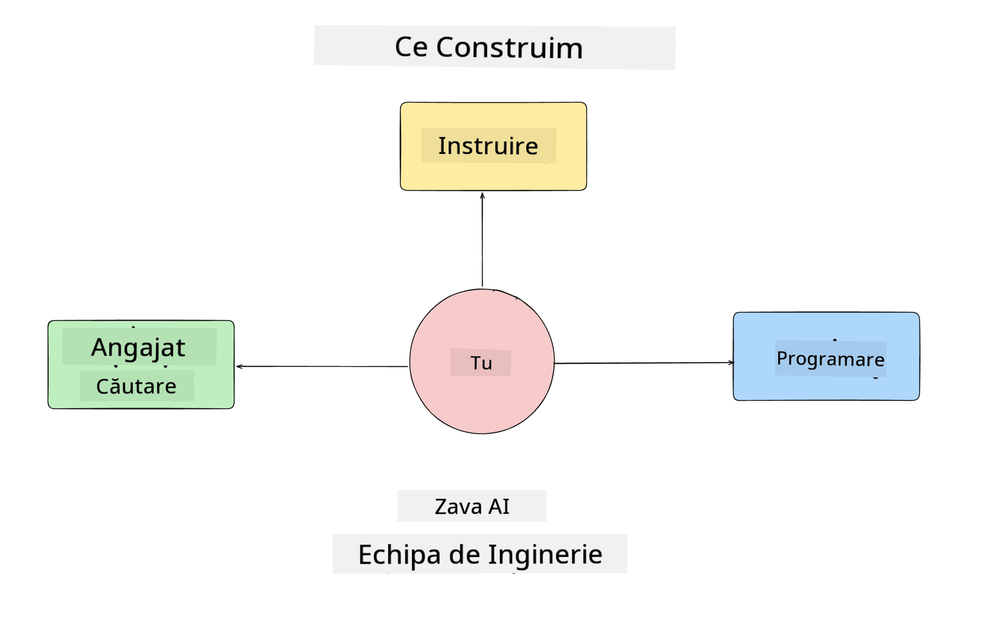
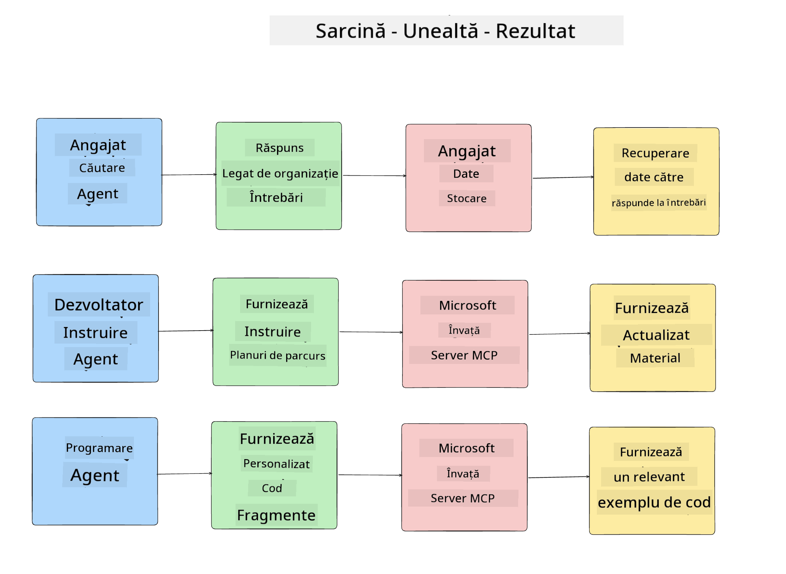
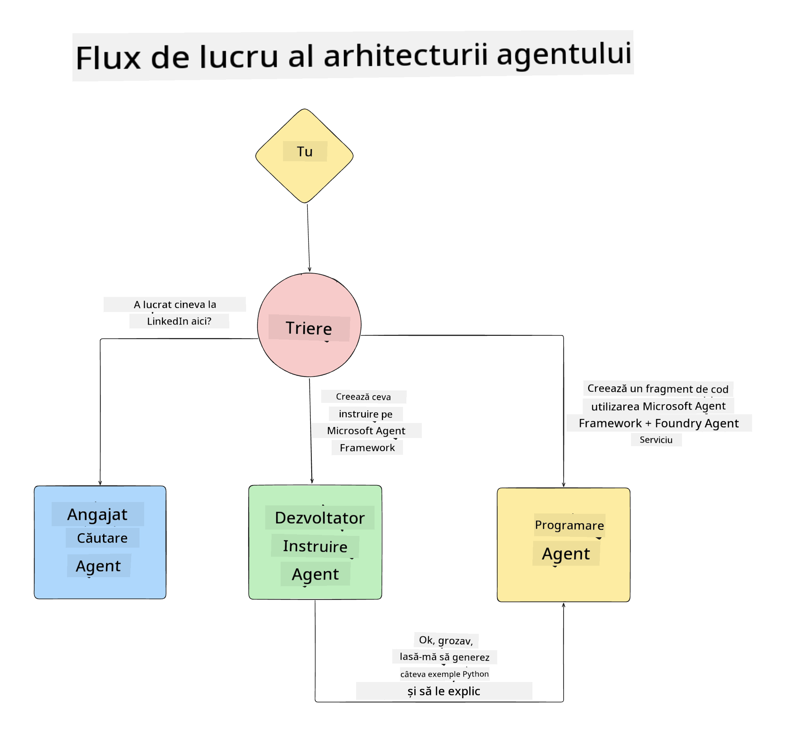

<!--
CO_OP_TRANSLATOR_METADATA:
{
  "original_hash": "99c07849641a850775c188c9333f31e5",
  "translation_date": "2025-12-12T18:39:14+00:00",
  "source_file": "lesson-1-agent-design/README.md",
  "language_code": "ro"
}
-->
# Lecția 1: Proiectarea Agentului AI

Bine ați venit la prima lecție a cursului "Construirea unui Agent AI de la Zero până la Producție"!

În această lecție vom acoperi:

- Definirea a ceea ce sunt Agenții AI
  
- Discutarea aplicației Agent AI pe care o construim  

- Identificarea uneltelor și serviciilor necesare pentru fiecare agent
  
- Arhitecturarea aplicației noastre de agenți
  
Să începem prin a defini ce este un agent și de ce am folosi agenți într-o aplicație.

## Ce Sunt Agenții AI?

Dacă este prima dată când explorați cum să construiți un Agent AI, este posibil să aveți întrebări despre cum să definiți exact ce este un Agent AI.

O modalitate simplă de a defini ce este un Agent AI este prin componentele care îl alcătuiesc:

**Model de Limbaj Mare** - LLM-ul va alimenta atât capacitatea de a procesa limbajul natural de la utilizator pentru a interpreta sarcina pe care dorește să o îndeplinească, cât și interpretarea descrierilor uneltelor disponibile pentru a finaliza acele sarcini.

**Unelte** - Acestea vor fi funcții, API-uri, depozite de date și alte servicii pe care LLM-ul le poate alege să le folosească pentru a îndeplini sarcinile solicitate de utilizator.

**Memorie** - Aici stocăm atât interacțiunile pe termen scurt, cât și pe termen lung dintre Agentul AI și utilizator. Stocarea și recuperarea acestor informații este importantă pentru a face îmbunătățiri și a salva preferințele utilizatorului în timp.

## Cazul nostru de utilizare AI Agent

Pentru acest curs, vom construi o aplicație Agent AI care ajută noii dezvoltatori să se integreze în echipa noastră de dezvoltare AI Agent!

Înainte de a face orice lucru de dezvoltare, primul pas pentru a crea o aplicație Agent AI de succes este definirea unor scenarii clare despre cum ne așteptăm ca utilizatorii noștri să lucreze cu Agenții noștri AI.

Pentru această aplicație, vom lucra cu aceste scenarii:

**Scenariul 1**: Un angajat nou se alătură organizației noastre și dorește să afle mai multe despre echipa la care s-a alăturat și cum să ia legătura cu aceasta.

**Scenariul 2:** Un angajat nou dorește să știe care ar fi cea mai bună primă sarcină la care să înceapă să lucreze.

**Scenariul 3:** Un angajat nou dorește să adune resurse de învățare și exemple de cod pentru a-l ajuta să înceapă să finalizeze această sarcină.

## Identificarea uneltelor și serviciilor

Acum că avem aceste scenarii create, următorul pas este să le mapăm la uneltele și serviciile de care agenții noștri AI vor avea nevoie pentru a finaliza aceste sarcini.

Acest proces intră în categoria Ingineriei Contextului, deoarece ne vom concentra pe asigurarea faptului că Agenții noștri AI au contextul potrivit la momentul potrivit pentru a îndeplini sarcinile.

Să facem acest lucru scenariu cu scenariu și să realizăm un design agentic bun listând sarcina fiecărui agent, uneltele și rezultatele dorite.

### Scenariul 1 - Agent de Căutare Angajați

**Sarcină** - Răspunde la întrebări despre angajații din organizație, cum ar fi data angajării, echipa curentă, locația și ultima poziție.

**Unelte** - Depozit de date cu lista actuală a angajaților și organigrama

**Rezultate** - Capacitatea de a prelua informații din depozitul de date pentru a răspunde la întrebări generale despre organizație și întrebări specifice despre angajați.

### Scenariul 2 - Agent de Recomandare Sarcini

**Sarcină** - Pe baza experienței de dezvoltator a angajatului nou, să propună 1-3 probleme la care angajatul nou poate lucra.

**Unelte** - Server GitHub MCP pentru a obține probleme deschise și a construi un profil de dezvoltator

**Rezultate** - Capacitatea de a citi ultimele 5 commit-uri ale unui profil GitHub și problemele deschise pe un proiect GitHub și de a face recomandări bazate pe o potrivire

### Scenariul 3 - Agent Asistent de Cod

**Sarcină** - Pe baza problemelor deschise recomandate de Agentul "Recomandare Sarcini", să cerceteze și să ofere resurse și să genereze fragmente de cod pentru a ajuta angajatul.

**Unelte** - Microsoft Learn MCP pentru a găsi resurse și Code Interpreter pentru a genera fragmente de cod personalizate.

**Rezultate** - Dacă utilizatorul solicită ajutor suplimentar, fluxul de lucru ar trebui să folosească serverul Learn MCP pentru a oferi linkuri și fragmente către resurse și apoi să predea agentului Code Interpreter generarea de fragmente mici de cod cu explicații.

## Arhitecturarea aplicației noastre de agenți

Acum că am definit fiecare dintre Agenții noștri, să creăm un diagramă de arhitectură care ne va ajuta să înțelegem cum va funcționa fiecare agent împreună și separat, în funcție de sarcină:

## Pașii următori

Acum că am proiectat fiecare agent și sistemul nostru agentic, să trecem la următoarea lecție unde vom dezvolta fiecare dintre acești agenți!

---

<!-- CO-OP TRANSLATOR DISCLAIMER START -->
**Declinare de responsabilitate**:  
Acest document a fost tradus folosind serviciul de traducere AI [Co-op Translator](https://github.com/Azure/co-op-translator). Deși ne străduim pentru acuratețe, vă rugăm să rețineți că traducerile automate pot conține erori sau inexactități. Documentul original în limba sa nativă trebuie considerat sursa autorizată. Pentru informații critice, se recomandă traducerea profesională realizată de un specialist uman. Nu ne asumăm răspunderea pentru eventualele neînțelegeri sau interpretări greșite rezultate din utilizarea acestei traduceri.
<!-- CO-OP TRANSLATOR DISCLAIMER END -->