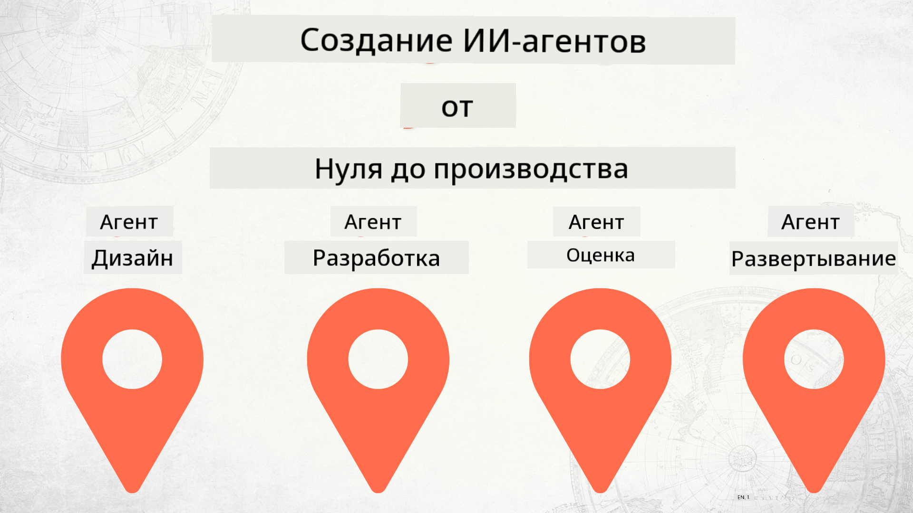

<!--
CO_OP_TRANSLATOR_METADATA:
{
  "original_hash": "73b37a335747d59d319b00aac130f073",
  "translation_date": "2025-12-24T22:41:38+00:00",
  "source_file": "README.md",
  "language_code": "ru"
}
-->
# Создание AI-агентов от нуля до продакшна

### 🌐 Поддержка нескольких языков

#### Поддерживается через GitHub Action (автоматически и всегда актуально)

<!-- CO-OP TRANSLATOR LANGUAGES TABLE START -->
[Арабский](../ar/README.md) | [Бенгальский](../bn/README.md) | [Болгарский](../bg/README.md) | [Бирманский (Мьянма)](../my/README.md) | [Китайский (упрощённый)](../zh/README.md) | [Китайский (традиционный, Гонконг)](../hk/README.md) | [Китайский (традиционный, Макао)](../mo/README.md) | [Китайский (традиционный, Тайвань)](../tw/README.md) | [Хорватский](../hr/README.md) | [Чешский](../cs/README.md) | [Датский](../da/README.md) | [Нидерландский](../nl/README.md) | [Эстонский](../et/README.md) | [Финский](../fi/README.md) | [Французский](../fr/README.md) | [Немецкий](../de/README.md) | [Греческий](../el/README.md) | [Иврит](../he/README.md) | [Хинди](../hi/README.md) | [Венгерский](../hu/README.md) | [Индонезийский](../id/README.md) | [Итальянский](../it/README.md) | [Японский](../ja/README.md) | [Каннада](../kn/README.md) | [Корейский](../ko/README.md) | [Литовский](../lt/README.md) | [Малайский](../ms/README.md) | [Малаялам](../ml/README.md) | [Маратхи](../mr/README.md) | [Непальский](../ne/README.md) | [Нигерийский пиджин](../pcm/README.md) | [Норвежский](../no/README.md) | [Персидский (фарси)](../fa/README.md) | [Польский](../pl/README.md) | [Португальский (Бразилия)](../br/README.md) | [Португальский (Португалия)](../pt/README.md) | [Пенджаби (гурмухи)](../pa/README.md) | [Румынский](../ro/README.md) | [Русский](./README.md) | [Сербский (кириллица)](../sr/README.md) | [Словацкий](../sk/README.md) | [Словенский](../sl/README.md) | [Испанский](../es/README.md) | [Свахили](../sw/README.md) | [Шведский](../sv/README.md) | [Тагальский (филиппинский)](../tl/README.md) | [Тамильский](../ta/README.md) | [Телугу](../te/README.md) | [Тайский](../th/README.md) | [Турецкий](../tr/README.md) | [Украинский](../uk/README.md) | [Урду](../ur/README.md) | [Вьетнамский](../vi/README.md)
<!-- CO-OP TRANSLATOR LANGUAGES TABLE END -->

## Курс, обучающий основам жизненного цикла разработки AI-агентов

## 🌱 Начало работы

В этом курсе представлены уроки, охватывающие основы создания и развёртывания AI-агентов.

Каждый урок основывается на предыдущем, поэтому мы рекомендуем начинать с первого и проходить курс последовательно до конца.

Если вы хотите узнать больше о темах, связанных с AI-агентами, вы можете ознакомиться с курсом [Курс «AI-агенты для начинающих»](https://aka.ms/ai-agents-beginners).

### Познакомьтесь с другими участниками, получите ответы на свои вопросы

Если вы застряли или у вас есть вопросы по созданию AI-агентов, присоединяйтесь к нашему выделенному каналу в Discord в [Microsoft Foundry Discord](https://discord.gg/Kuaw3ktsu6).

### Что потребуется

У каждого урока есть собственный пример кода, который вы можете запустить локально. Вы можете [форкните этот репозиторий](https://github.com/microsoft/Building-AI-Agents-From-Zero-To-Production/fork) чтобы создать свою копию.

В этом курсе используются следующие средства:

- [Microsoft Agent Framework (MAF)](https://aka.ms/ai-agents-beginners/agent-framework)
- [Microsoft Foundry](https://azure.microsoft.com/products/ai-foundry)
- [Azure OpenAI Service](https://azure.microsoft.com/products/ai-foundry/models/openai)
- [Azure CLI](https://learn.microsoft.com/cli/azure/authenticate-azure-cli?view=azure-cli-latest)

Убедитесь, что у вас есть доступ к этим сервисам перед началом работы.

Скоро появятся дополнительные варианты размещения моделей и сервисов. 

## 🗃️ Уроки

| **Урок**         | **Описание**                                                                                  |
|--------------------|--------------------------------------------------------------------------------------------------|
| [Дизайн агента](./lesson-1-agent-design/README.md)       | Введение в наш кейс использования агента «Адаптация разработчика» и в то, как проектировать эффективных агентов  |
| [Разработка агента](./lesson-2-agent-development/README.md)  | С помощью Microsoft Agent Framework (MAF) создайте 3 агента, которые помогут новым разработчикам пройти адаптацию.       |
| [Оценка агентов](./lesson-3-agent-evals/README.md)  | С помощью Microsoft Foundry узнайте, насколько хорошо работают наши AI-агенты и как их улучшить. |
| [Развёртывание агента](./lesson-4-agent-deployment/README.md)   | Используя Hosted Agents и OpenAI Chatkit, узнайте, как развернуть AI-агента в продакшен.       |

## 🎒 Другие курсы

Наша команда выпускает и другие курсы! Смотрите:

<!-- CO-OP TRANSLATOR OTHER COURSES START -->
### LangChain

---

### Azure / Edge / MCP / Agents

---
 
### Серия Generative AI

[-9333EA?style=for-the-badge&labelColor=E5E7EB&color=9333EA)](https://github.com/microsoft/Generative-AI-for-beginners-dotnet?WT.mc_id=academic-105485-koreyst)
[-C084FC?style=for-the-badge&labelColor=E5E7EB&color=C084FC)](https://github.com/microsoft/generative-ai-for-beginners-java?WT.mc_id=academic-105485-koreyst)
[-E879F9?style=for-the-badge&labelColor=E5E7EB&color=E879F9)](https://github.com/microsoft/generative-ai-with-javascript?WT.mc_id=academic-105485-koreyst)

---
 
### Базовое обучение

---
 
### Серия Copilot

<!-- CO-OP TRANSLATOR OTHER COURSES END -->

## Вклад

Этот проект приветствует вклад и предложения. Большинство вкладов требует, чтобы вы согласились с Соглашением об участии авторов (Contributor License Agreement, CLA), в котором вы заявляете, что имеете право и фактически предоставляете нам права на использование вашего вклада. Для подробностей посетите <https://cla.opensource.microsoft.com>.

Когда вы отправляете pull request, бот CLA автоматически определит, нужно ли вам предоставить CLA, и пометит PR соответствующим образом (например, проверкой статуса, комментарием). Просто следуйте инструкциям, которые предоставит бот. Вам нужно будет сделать это лишь один раз для всех репозиториев, использующих нашу CLA.

В этом проекте принят [Кодекс поведения Microsoft для проектов с открытым исходным кодом](https://opensource.microsoft.com/codeofconduct/).
Для получения дополнительной информации см. [FAQ по кодексу поведения](https://opensource.microsoft.com/codeofconduct/faq/) или свяжитесь по адресу [opencode@microsoft.com](mailto:opencode@microsoft.com) с любыми дополнительными вопросами или комментариями.

## Торговые марки

В этом проекте могут использоваться торговые марки или логотипы проектов, продуктов или услуг. Разрешенное использование торговых марок или логотипов Microsoft регулируется и должно соответствовать
[Рекомендациям Microsoft по торговым маркам и бренду](https://www.microsoft.com/legal/intellectualproperty/trademarks/usage/general).
Использование торговых марок или логотипов Microsoft в измененных версиях этого проекта не должно вводить в заблуждение или подразумевать спонсорство Microsoft.
Любое использование торговых марок или логотипов третьих сторон подчиняется правилам соответствующих третьих сторон.

## Получение помощи

Если вы застряли или у вас есть вопросы по разработке AI-приложений, присоединяйтесь:

Если у вас есть отзывы о продукте или вы столкнулись с ошибками во время разработки, посетите:

---

<!-- CO-OP TRANSLATOR DISCLAIMER START -->
Отказ от ответственности:
Этот документ был переведён с помощью сервиса машинного перевода с использованием искусственного интеллекта [Co-op Translator](https://github.com/Azure/co-op-translator). Хотя мы стремимся к точности, имейте в виду, что автоматические переводы могут содержать ошибки или неточности. Оригинальный документ на его исходном языке следует считать авторитетным источником. Для критически важной информации рекомендуется профессиональный перевод, выполненный человеком. Мы не несем ответственности за любые недоразумения или неправильные толкования, возникшие в результате использования этого перевода.
<!-- CO-OP TRANSLATOR DISCLAIMER END -->