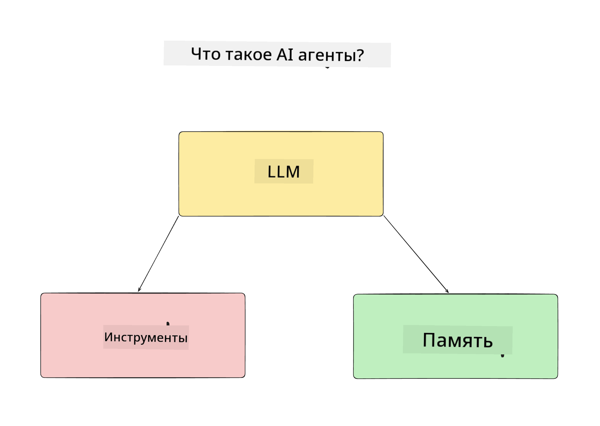
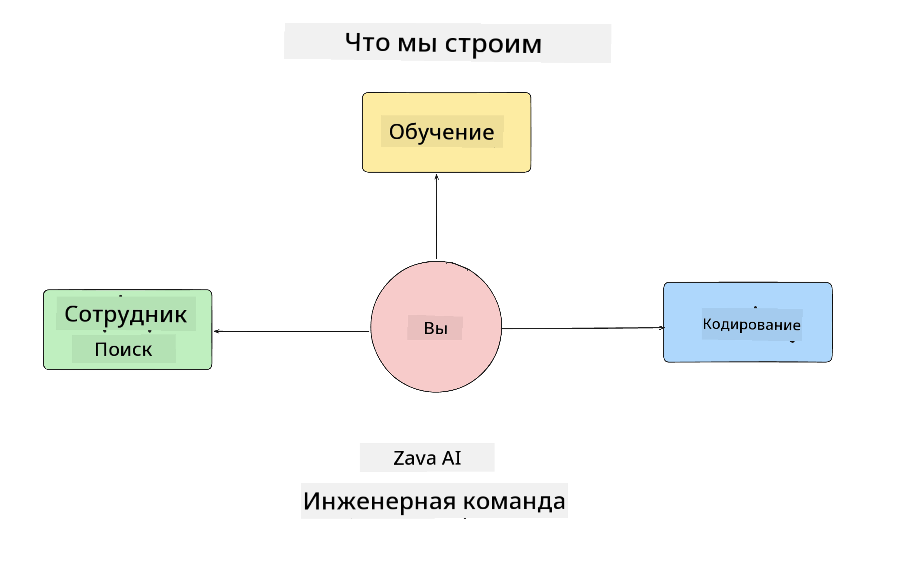
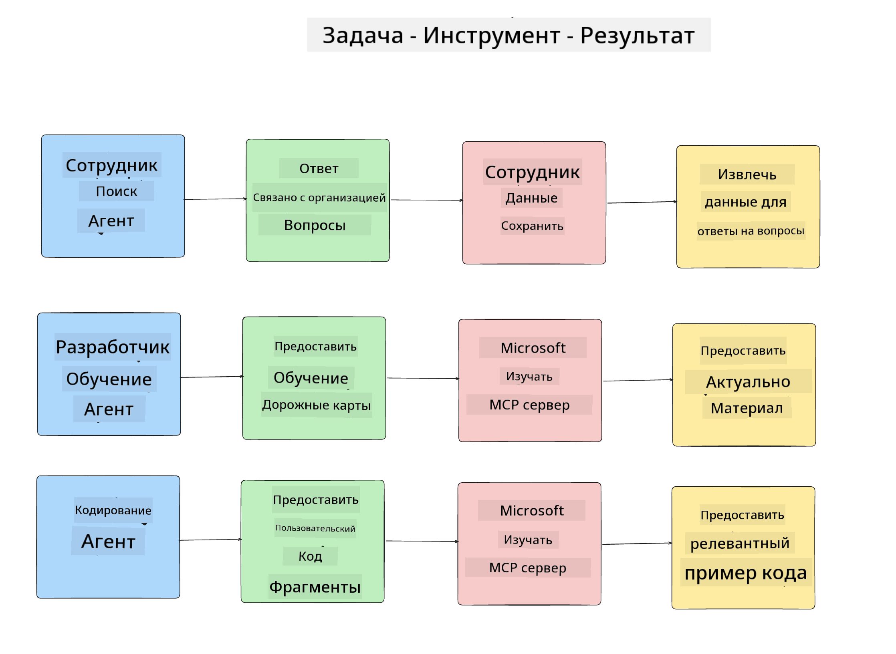
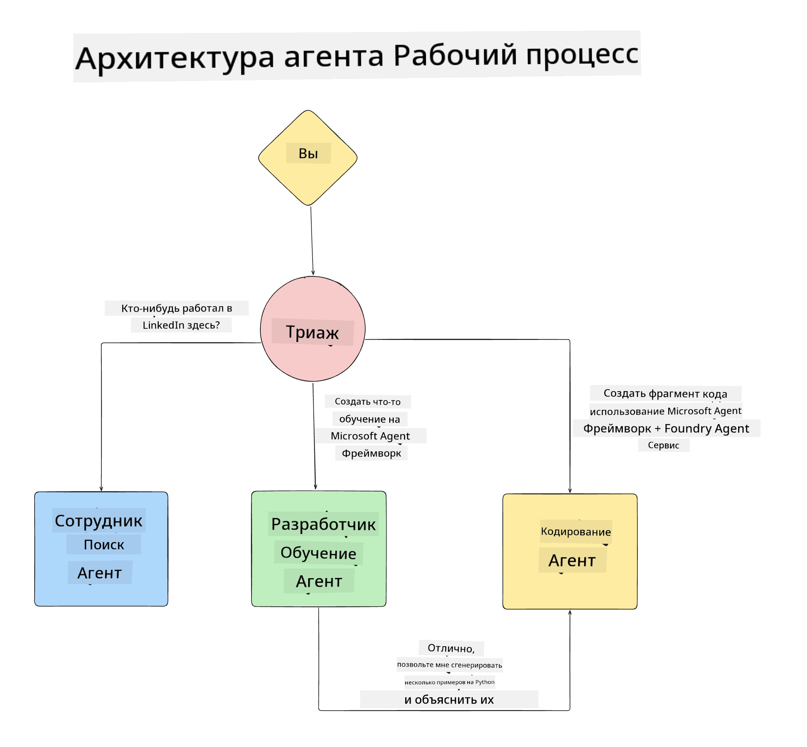

<!--
CO_OP_TRANSLATOR_METADATA:
{
  "original_hash": "99c07849641a850775c188c9333f31e5",
  "translation_date": "2025-12-12T18:15:51+00:00",
  "source_file": "lesson-1-agent-design/README.md",
  "language_code": "ru"
}
-->
# Урок 1: Проектирование AI Агентов

Добро пожаловать на первый урок курса "Создание AI Агентов с нуля до продакшена"!

В этом уроке мы рассмотрим:

- Определение, что такое AI агенты
  
- Обсуждение AI агентного приложения, которое мы создаём  

- Определение необходимых инструментов и сервисов для каждого агента
  
- Архитектуру нашего агентного приложения
  
Давайте начнём с определения, что такое агент и почему мы используем их внутри приложения.

## Что такое AI агенты?

Если вы впервые изучаете, как создать AI агента, у вас могут возникнуть вопросы, как именно определить, что такое AI агент.

Простой способ определить, что такое AI агент — это рассмотреть компоненты, из которых он состоит:

**Большая языковая модель** — LLM обеспечивает как способность обрабатывать естественный язык от пользователя для интерпретации задачи, которую он хочет выполнить, так и интерпретировать описания доступных инструментов для выполнения этих задач.

**Инструменты** — это функции, API, хранилища данных и другие сервисы, которые LLM может использовать для выполнения задач, запрошенных пользователем.

**Память** — это способ хранения как краткосрочных, так и долгосрочных взаимодействий между AI агентом и пользователем. Хранение и извлечение этой информации важно для улучшений и сохранения предпочтений пользователя со временем.

## Наш кейс использования AI агента

Для этого курса мы создадим AI агентное приложение, которое помогает новым разработчикам адаптироваться в нашей команде разработки AI агентов!

Прежде чем приступать к разработке, первый шаг к созданию успешного AI агентного приложения — это определить чёткие сценарии, как мы ожидаем, что пользователи будут взаимодействовать с нашими AI агентами.

Для этого приложения мы будем работать со следующими сценариями:

**Сценарий 1**: Новый сотрудник присоединяется к нашей организации и хочет узнать больше о команде, в которую он вошёл, и как с ней связаться.

**Сценарий 2:** Новый сотрудник хочет узнать, какая будет лучшая первая задача для начала работы.

**Сценарий 3:** Новый сотрудник хочет собрать обучающие материалы и примеры кода, чтобы помочь ему начать выполнение этой задачи.

## Определение инструментов и сервисов

Теперь, когда у нас есть эти сценарии, следующий шаг — сопоставить их с инструментами и сервисами, которые нашим AI агентам понадобятся для выполнения этих задач.

Этот процесс относится к категории инженерии контекста, так как мы сосредоточимся на том, чтобы наши AI агенты имели правильный контекст в нужное время для выполнения задач.

Давайте пройдёмся по каждому сценарию и выполним хорошее агентное проектирование, перечислив задачи, инструменты и желаемые результаты каждого агента.

### Сценарий 1 — Агент поиска сотрудников

**Задача** — Отвечать на вопросы о сотрудниках организации, такие как дата присоединения, текущая команда, местоположение и последняя должность.

**Инструменты** — Хранилище данных с текущим списком сотрудников и организационной схемой

**Результаты** — Способность извлекать информацию из хранилища для ответа на общие организационные вопросы и конкретные вопросы о сотрудниках.

### Сценарий 2 — Агент рекомендаций задач

**Задача** — На основе опыта нового сотрудника-разработчика предложить 1-3 задачи, над которыми он может работать.

**Инструменты** — MCP сервер GitHub для получения открытых задач и создания профиля разработчика

**Результаты** — Способность читать последние 5 коммитов профиля GitHub и открытые задачи на проекте GitHub и делать рекомендации на основе совпадений

### Сценарий 3 — Агент помощника по коду

**Задача** — На основе открытых задач, рекомендованных агентом "Рекомендации задач", исследовать и предоставлять ресурсы, а также генерировать фрагменты кода, чтобы помочь сотруднику.

**Инструменты** — Microsoft Learn MCP для поиска ресурсов и Code Interpreter для генерации пользовательских фрагментов кода.

**Результаты** — Если пользователь запрашивает дополнительную помощь, рабочий процесс должен использовать Learn MCP сервер для предоставления ссылок и фрагментов ресурсов, а затем передавать управление агенту Code Interpreter для генерации небольших фрагментов кода с объяснениями.

## Архитектура нашего агентного приложения

Теперь, когда мы определили каждого из наших агентов, давайте создадим диаграмму архитектуры, которая поможет нам понять, как каждый агент будет работать вместе и отдельно в зависимости от задачи:

## Следующие шаги

Теперь, когда мы спроектировали каждого агента и нашу агентную систему, давайте перейдём к следующему уроку, где мы разработаем каждого из этих агентов!

---

<!-- CO-OP TRANSLATOR DISCLAIMER START -->
**Отказ от ответственности**:  
Этот документ был переведен с помощью сервиса автоматического перевода [Co-op Translator](https://github.com/Azure/co-op-translator). Несмотря на наши усилия обеспечить точность, имейте в виду, что автоматический перевод может содержать ошибки или неточности. Оригинальный документ на его исходном языке следует считать авторитетным источником. Для получения критически важной информации рекомендуется обращаться к профессиональному переводу, выполненному человеком. Мы не несем ответственности за любые недоразумения или неправильные толкования, возникшие в результате использования данного перевода.
<!-- CO-OP TRANSLATOR DISCLAIMER END -->