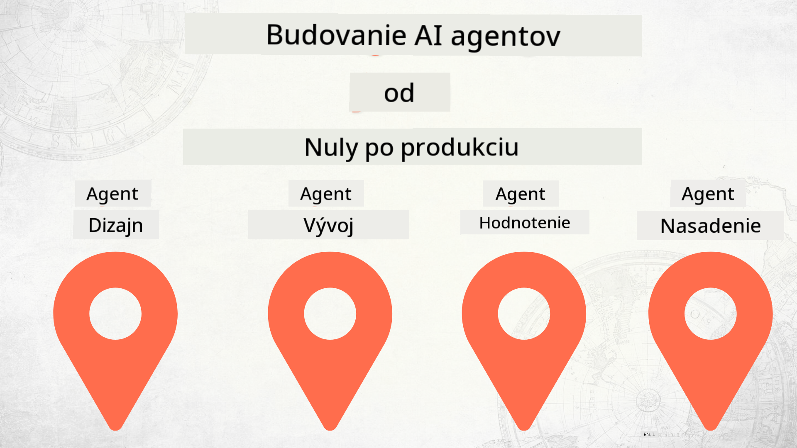

<!--
CO_OP_TRANSLATOR_METADATA:
{
  "original_hash": "2799ceaaefbd8571688459ac03eac5aa",
  "translation_date": "2025-12-12T17:08:38+00:00",
  "source_file": "README.md",
  "language_code": "sk"
}
-->
# Budovanie AI agentov od nuly po produkciu

## Kurz, ktorý vás naučí základy životného cyklu vývoja AI agentov

## 🌱 Začíname

Tento kurz obsahuje lekcie pokrývajúce základy budovania a nasadzovania AI agentov.

Každá lekcia nadväzuje na predchádzajúcu, preto odporúčame začať od začiatku a postupovať až do konca.

Ak chcete preskúmať viac tém o AI agentoch, môžete si pozrieť [Kurz AI agentov pre začiatočníkov](https://aka.ms/ai-agents-beginners).

### Spoznajte ostatných študentov, získajte odpovede na svoje otázky

Ak sa zaseknete alebo máte otázky ohľadom budovania AI agentov, pripojte sa k nášmu vyhradenému Discord kanálu v [Microsoft Foundry Discord](https://discord.gg/Kuaw3ktsu6).

### Čo potrebujete

Každá lekcia má svoj vlastný ukážkový kód, ktorý môžete spustiť lokálne. Môžete si [forknúť tento repozitár](https://github.com/microsoft/Building-AI-Agents-From-Zero-To-Production/fork) a vytvoriť si tak vlastnú kópiu.

Tento kurz momentálne používa:

- [Microsoft Agent Framework (MAF)](https://aka.ms/ai-agents-beginners/agent-framework)
- [Microsoft Foundry](https://azure.microsoft.com/products/ai-foundry)
- [Azure OpenAI Service](https://azure.microsoft.com/products/ai-foundry/models/openai)
- [Azure CLI](https://learn.microsoft.com/cli/azure/authenticate-azure-cli?view=azure-cli-latest)

Pred začatím sa uistite, že máte prístup k týmto službám.

Čoskoro budú dostupné ďalšie možnosti ohľadom hostovania modelov a služieb.

## 🗃️ Lekcie

| **Lekcia**         | **Popis**                                                                                  |
|--------------------|--------------------------------------------------------------------------------------------|
| [Návrh agenta](./lesson-1-agent-design/README.md)       | Úvod do nášho prípadu použitia "Developer Onboarding" agenta a ako navrhovať efektívnych agentov  |
| [Vývoj agenta](./lesson-2-agent-development/README.md)  | Pomocou Microsoft Agent Framework (MAF) vytvorte 3 agentov, ktorí pomôžu novým vývojárom s onboardovaním.       |
| [Hodnotenie agentov](./lesson-3-agent-evals/README.md)  | Pomocou Microsoft Foundry zistite, ako dobre naše AI agenti fungujú a ako ich zlepšiť. |
| [Nasadenie agenta](./lesson-4-agent-deployment/README.md)   | Pomocou Hosted Agents a OpenAI Chatkit si pozrite, ako nasadiť AI agenta do produkcie.       |

## Prispievanie

Tento projekt vítá príspevky a návrhy. Väčšina príspevkov vyžaduje, aby ste súhlasili s
Dohodou o licencii prispievateľa (CLA), ktorá deklaruje, že máte právo a skutočne nám udeľujete
práva na použitie vášho príspevku. Pre podrobnosti navštívte <https://cla.opensource.microsoft.com>.

Keď odošlete pull request, bot CLA automaticky zistí, či musíte poskytnúť
CLA a príslušne označí PR (napr. kontrola stavu, komentár). Jednoducho postupujte podľa pokynov
poskytnutých botom. Toto budete musieť urobiť iba raz pre všetky repozitáre používajúce našu CLA.

Tento projekt prijal [Microsoft Open Source Code of Conduct](https://opensource.microsoft.com/codeofconduct/).
Pre viac informácií si pozrite [FAQ k Code of Conduct](https://opensource.microsoft.com/codeofconduct/faq/) alebo
kontaktujte [opencode@microsoft.com](mailto:opencode@microsoft.com) s ďalšími otázkami alebo pripomienkami.

## Ochranné známky

Tento projekt môže obsahovať ochranné známky alebo logá projektov, produktov alebo služieb. Autorizované použitie ochranných známok alebo log Microsoftu podlieha a musí dodržiavať
[Pravidlá používania ochranných známok a značiek Microsoftu](https://www.microsoft.com/legal/intellectualproperty/trademarks/usage/general).
Použitie ochranných známok alebo log Microsoftu v upravených verziách tohto projektu nesmie spôsobovať zmätok ani naznačovať sponzorstvo Microsoftom.
Akékoľvek použitie ochranných známok alebo log tretích strán podlieha pravidlám týchto tretích strán.

## Získanie pomoci

Ak sa zaseknete alebo máte otázky ohľadom budovania AI aplikácií, pripojte sa:

Ak máte spätnú väzbu k produktu alebo chyby počas vývoja, navštívte:

---

<!-- CO-OP TRANSLATOR DISCLAIMER START -->
**Zrieknutie sa zodpovednosti**:
Tento dokument bol preložený pomocou AI prekladateľskej služby [Co-op Translator](https://github.com/Azure/co-op-translator). Aj keď sa snažíme o presnosť, prosím, majte na pamäti, že automatizované preklady môžu obsahovať chyby alebo nepresnosti. Originálny dokument v jeho pôvodnom jazyku by mal byť považovaný za autoritatívny zdroj. Pre kritické informácie sa odporúča profesionálny ľudský preklad. Nie sme zodpovední za akékoľvek nedorozumenia alebo nesprávne interpretácie vyplývajúce z použitia tohto prekladu.
<!-- CO-OP TRANSLATOR DISCLAIMER END -->