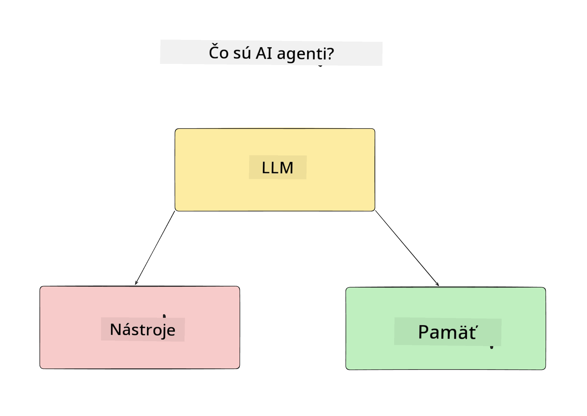
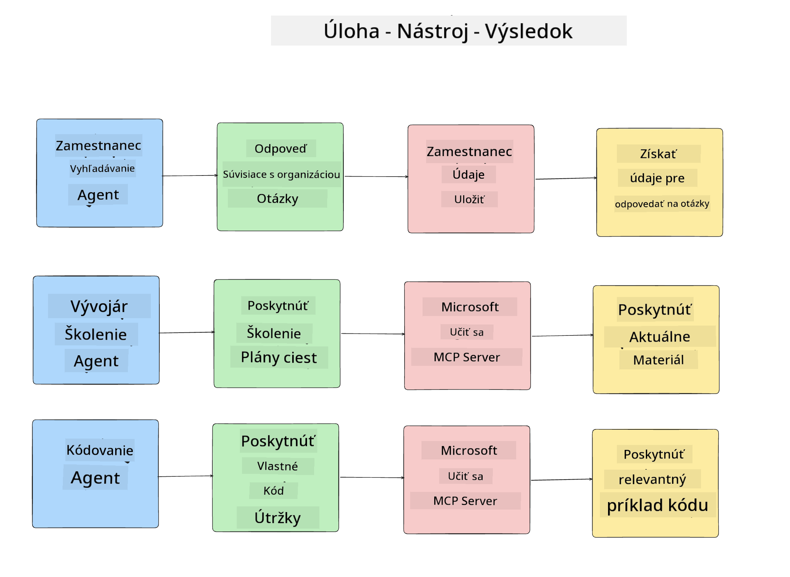
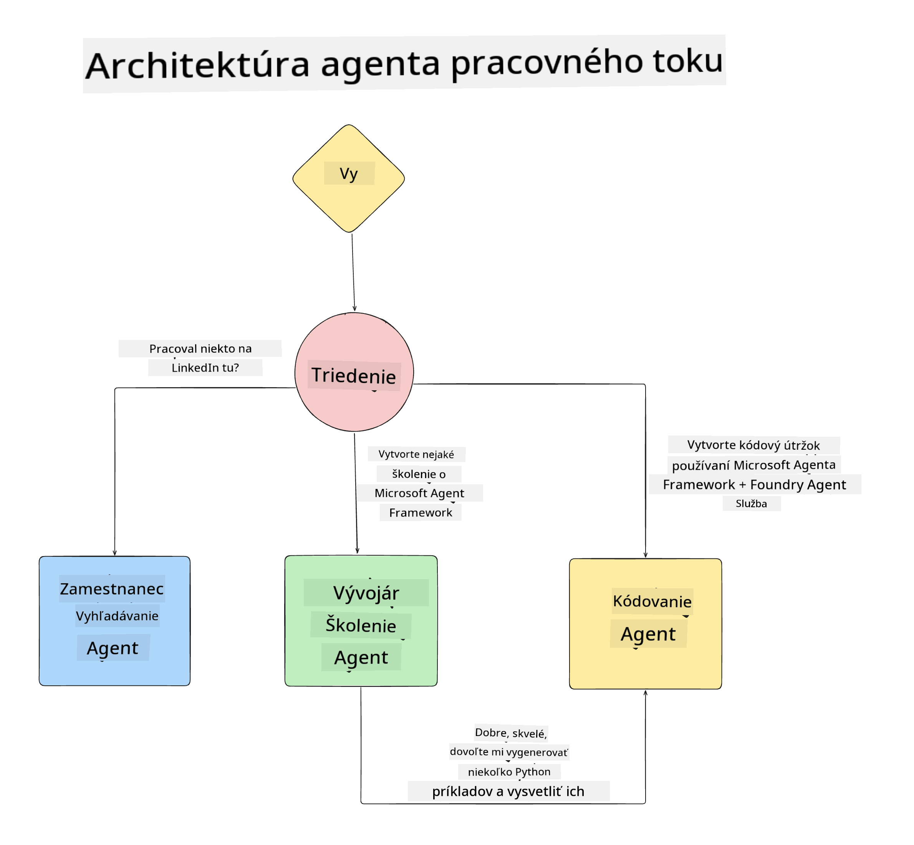

<!--
CO_OP_TRANSLATOR_METADATA:
{
  "original_hash": "99c07849641a850775c188c9333f31e5",
  "translation_date": "2025-12-12T18:38:38+00:00",
  "source_file": "lesson-1-agent-design/README.md",
  "language_code": "sk"
}
-->
# Lekcia 1: Návrh AI Agenta

Vitajte v prvej lekcii kurzu "Budovanie AI Agenta od nuly po produkciu"!

V tejto lekcii pokryjeme:

- Definovanie, čo sú AI Agenti
  
- Diskutovanie o AI Agent aplikácii, ktorú budujeme  

- Identifikovanie potrebných nástrojov a služieb pre každého agenta
  
- Architektúru našej Agent aplikácie
  
Začnime definovaním, čo je agent a prečo ich používame v aplikácii.

## Čo sú AI Agenti?

Ak je to váš prvýkrát, čo skúmate, ako vytvoriť AI Agenta, možno máte otázky, ako presne definovať, čo AI Agent je.

Jednoduchý spôsob, ako definovať, čo AI Agent je, je podľa komponentov, ktoré ho tvoria:

**Veľký jazykový model** - LLM bude poháňať schopnosť spracovať prirodzený jazyk od používateľa na interpretáciu úlohy, ktorú chce dokončiť, ako aj interpretovať popisy nástrojov dostupných na splnenie týchto úloh.

**Nástroje** - Budú to funkcie, API, dátové úložiská a iné služby, ktoré si LLM môže vybrať na dokončenie úloh požadovaných používateľom.

**Pamäť** - Toto je spôsob, ako uchovávame krátkodobé aj dlhodobé interakcie medzi AI Agentom a používateľom. Ukladanie a získavanie týchto informácií je dôležité pre zlepšenia a ukladanie preferencií používateľa v priebehu času.

## Náš prípad použitia AI Agenta

Pre tento kurz vytvoríme AI Agent aplikáciu, ktorá pomáha novým vývojárom začleniť sa do nášho AI Agent vývojárskeho tímu!

Predtým, než začneme s vývojom, prvým krokom k vytvoreniu úspešnej AI Agent aplikácie je definovať jasné scenáre, ako očakávame, že naši používatelia budú pracovať s našimi AI Agentmi.

Pre túto aplikáciu budeme pracovať s týmito scenármi:

**Scenár 1**: Nový zamestnanec sa pripojí k našej organizácii a chce vedieť viac o tíme, ku ktorému sa pridal, a ako sa s nimi spojiť.

**Scenár 2:** Nový zamestnanec chce vedieť, aká by bola najlepšia prvá úloha, na ktorej by mohol začať pracovať.

**Scenár 3:** Nový zamestnanec chce zhromaždiť vzdelávacie zdroje a ukážky kódu, ktoré mu pomôžu začať s dokončením tejto úlohy.

## Identifikácia nástrojov a služieb

Teraz, keď máme tieto scenáre vytvorené, ďalším krokom je priradiť ich k nástrojom a službám, ktoré naši AI agenti budú potrebovať na dokončenie týchto úloh.

Tento proces spadá do kategórie Context Engineering, pretože sa zameriame na to, aby naši AI Agenti mali správny kontext v správnom čase na dokončenie úloh.

Urobme to scenár po scenári a vykonajme dobrý agentný návrh tým, že uvedieme úlohy, nástroje a požadované výsledky každého agenta.

### Scenár 1 - Agent na vyhľadávanie zamestnancov

**Úloha** - Odpovedať na otázky o zamestnancoch v organizácii, ako je dátum nástupu, aktuálny tím, lokalita a posledná pozícia.

**Nástroje** - Dátové úložisko zoznamu aktuálnych zamestnancov a organizačná schéma

**Výsledky** - Schopnosť získať informácie z dátového úložiska na odpovede na všeobecné organizačné otázky a konkrétne otázky o zamestnancoch.

### Scenár 2 - Agent na odporúčanie úloh

**Úloha** - Na základe vývojárskych skúseností nového zamestnanca navrhnúť 1-3 problémy, na ktorých môže nový zamestnanec pracovať.

**Nástroje** - GitHub MCP Server na získanie otvorených problémov a vytvorenie vývojárskeho profilu

**Výsledky** - Schopnosť prečítať posledných 5 commitov GitHub profilu a otvorené problémy na GitHub projekte a na základe zhody poskytnúť odporúčania

### Scenár 3 - Agent asistent kódu

**Úloha** - Na základe otvorených problémov, ktoré odporučil agent "Odporúčanie úloh", vyhľadať zdroje a poskytnúť zdroje a generovať úryvky kódu na pomoc zamestnancovi.

**Nástroje** - Microsoft Learn MCP na vyhľadávanie zdrojov a Code Interpreter na generovanie vlastných úryvkov kódu.

**Výsledky** - Ak používateľ požiada o ďalšiu pomoc, pracovný tok by mal použiť Learn MCP Server na poskytnutie odkazov a úryvkov zo zdrojov a potom odovzdať agentovi Code Interpreter na generovanie malých úryvkov kódu s vysvetleniami.

## Architektúra našej Agent aplikácie

Teraz, keď sme definovali každého z našich agentov, vytvorme architektonický diagram, ktorý nám pomôže pochopiť, ako bude každý agent spolupracovať a pracovať samostatne v závislosti od úlohy:

## Ďalšie kroky

Teraz, keď sme navrhli každého agenta a náš agentný systém, poďme na ďalšiu lekciu, kde vyvineme každého z týchto agentov!

---

<!-- CO-OP TRANSLATOR DISCLAIMER START -->
**Zrieknutie sa zodpovednosti**:
Tento dokument bol preložený pomocou AI prekladateľskej služby [Co-op Translator](https://github.com/Azure/co-op-translator). Aj keď sa snažíme o presnosť, majte prosím na pamäti, že automatizované preklady môžu obsahovať chyby alebo nepresnosti. Originálny dokument v jeho pôvodnom jazyku by mal byť považovaný za autoritatívny zdroj. Pre kritické informácie sa odporúča profesionálny ľudský preklad. Nie sme zodpovední za akékoľvek nedorozumenia alebo nesprávne interpretácie vyplývajúce z použitia tohto prekladu.
<!-- CO-OP TRANSLATOR DISCLAIMER END -->