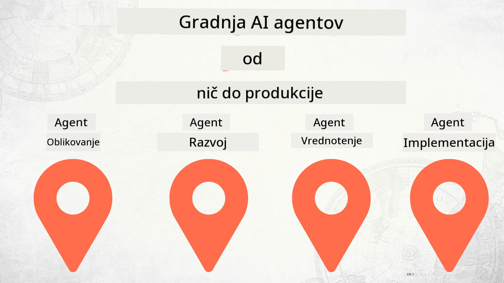

<!--
CO_OP_TRANSLATOR_METADATA:
{
  "original_hash": "df86a71d9a4a65d134d60f783a2aba86",
  "translation_date": "2025-12-18T14:44:16+00:00",
  "source_file": "README.md",
  "language_code": "sl"
}
-->
# Gradnja AI agentov od začetka do produkcije

### 🌐 Podpora za več jezikov

#### Podprto preko GitHub Action (avtomatizirano in vedno posodobljeno)

<!-- CO-OP TRANSLATOR LANGUAGES TABLE START -->
[Arabic](../ar/README.md) | [Bengali](../bn/README.md) | [Bulgarian](../bg/README.md) | [Burmese (Myanmar)](../my/README.md) | [Chinese (Simplified)](../zh/README.md) | [Chinese (Traditional, Hong Kong)](../hk/README.md) | [Chinese (Traditional, Macau)](../mo/README.md) | [Chinese (Traditional, Taiwan)](../tw/README.md) | [Croatian](../hr/README.md) | [Czech](../cs/README.md) | [Danish](../da/README.md) | [Dutch](../nl/README.md) | [Estonian](../et/README.md) | [Finnish](../fi/README.md) | [French](../fr/README.md) | [German](../de/README.md) | [Greek](../el/README.md) | [Hebrew](../he/README.md) | [Hindi](../hi/README.md) | [Hungarian](../hu/README.md) | [Indonesian](../id/README.md) | [Italian](../it/README.md) | [Japanese](../ja/README.md) | [Kannada](../kn/README.md) | [Korean](../ko/README.md) | [Lithuanian](../lt/README.md) | [Malay](../ms/README.md) | [Malayalam](../ml/README.md) | [Marathi](../mr/README.md) | [Nepali](../ne/README.md) | [Nigerian Pidgin](../pcm/README.md) | [Norwegian](../no/README.md) | [Persian (Farsi)](../fa/README.md) | [Polish](../pl/README.md) | [Portuguese (Brazil)](../br/README.md) | [Portuguese (Portugal)](../pt/README.md) | [Punjabi (Gurmukhi)](../pa/README.md) | [Romanian](../ro/README.md) | [Russian](../ru/README.md) | [Serbian (Cyrillic)](../sr/README.md) | [Slovak](../sk/README.md) | [Slovenian](./README.md) | [Spanish](../es/README.md) | [Swahili](../sw/README.md) | [Swedish](../sv/README.md) | [Tagalog (Filipino)](../tl/README.md) | [Tamil](../ta/README.md) | [Telugu](../te/README.md) | [Thai](../th/README.md) | [Turkish](../tr/README.md) | [Ukrainian](../uk/README.md) | [Urdu](../ur/README.md) | [Vietnamese](../vi/README.md)
<!-- CO-OP TRANSLATOR LANGUAGES TABLE END -->

## Tečaj, ki vas uči osnov življenjskega cikla razvoja AI agentov

## 🌱 Začetek

Ta tečaj vsebuje lekcije, ki pokrivajo osnove gradnje in uvajanja AI agentov.

Vsaka lekcija gradi na prejšnji, zato priporočamo, da začnete od začetka in nadaljujete do konca.

Če želite raziskati več o temah AI agentov, si lahko ogledate [Tečaj AI agentov za začetnike](https://aka.ms/ai-agents-beginners).

### Spoznajte druge učence, dobite odgovore na svoja vprašanja

Če se zataknete ali imate kakršnakoli vprašanja o gradnji AI agentov, se pridružite našemu namenskem Discord kanalu v [Microsoft Foundry Discord](https://discord.gg/Kuaw3ktsu6).

### Kaj potrebujete

Vsaka lekcija ima svojo kodo, ki jo lahko zaženete lokalno. Lahko [forkate ta repozitorij](https://github.com/microsoft/Building-AI-Agents-From-Zero-To-Production/fork) in ustvarite svojo kopijo.

Ta tečaj trenutno uporablja naslednje:

- [Microsoft Agent Framework (MAF)](https://aka.ms/ai-agents-beginners/agent-framework)
- [Microsoft Foundry](https://azure.microsoft.com/products/ai-foundry)
- [Azure OpenAI Service](https://azure.microsoft.com/products/ai-foundry/models/openai)
- [Azure CLI](https://learn.microsoft.com/cli/azure/authenticate-azure-cli?view=azure-cli-latest)

Prosimo, zagotovite, da imate dostop do teh storitev, preden začnete.

Več možnosti glede gostovanja modelov in storitev prihaja kmalu.

## 🗃️ Lekcije

| **Lekcija**         | **Opis**                                                                                  |
|--------------------|-------------------------------------------------------------------------------------------|
| [Oblikovanje agenta](./lesson-1-agent-design/README.md)       | Uvod v naš primer uporabe "Onboarding razvijalcev" in kako oblikovati učinkovite agente  |
| [Razvoj agenta](./lesson-2-agent-development/README.md)  | Z uporabo Microsoft Agent Framework (MAF) ustvarite 3 agente, ki pomagajo novim razvijalcem pri uvajanju.       |
| [Evalvacije agentov](./lesson-3-agent-evals/README.md)  | Z uporabo Microsoft Foundry ugotovite, kako dobro delujejo naši AI agenti in kako jih izboljšati. |
| [Uvajanje agenta](./lesson-4-agent-deployment/README.md)   | Z uporabo gostujočih agentov in OpenAI Chatkit si oglejte, kako uvesti AI agenta v produkcijo.       |

## Prispevanje

Ta projekt sprejema prispevke in predloge. Večina prispevkov zahteva, da se strinjate z
Licenčno pogodbo za prispevke (CLA), ki potrjuje, da imate pravico in dejansko podeljujete
pravice za uporabo vašega prispevka. Za podrobnosti obiščite <https://cla.opensource.microsoft.com>.

Ko oddate pull request, bo bot za CLA samodejno ugotovil, ali morate predložiti
CLA in ustrezno označil PR (npr. statusni pregled, komentar). Preprosto sledite navodilom,
ki jih poda bot. To boste morali storiti samo enkrat za vse repozitorije, ki uporabljajo naš CLA.

Ta projekt je sprejel [Microsoftov kodeks ravnanja za odprto kodo](https://opensource.microsoft.com/codeofconduct/).
Za več informacij si oglejte [Pogosta vprašanja o kodeksu ravnanja](https://opensource.microsoft.com/codeofconduct/faq/) ali
kontaktirajte [opencode@microsoft.com](mailto:opencode@microsoft.com) za dodatna vprašanja ali komentarje.

## Blagovne znamke

Ta projekt lahko vsebuje blagovne znamke ali logotipe za projekte, izdelke ali storitve. Pooblaščena uporaba Microsoftovih
blagovnih znamk ali logotipov je predmet in mora slediti
[Microsoftovim smernicam za blagovne znamke in znamčenje](https://www.microsoft.com/legal/intellectualproperty/trademarks/usage/general).
Uporaba Microsoftovih blagovnih znamk ali logotipov v spremenjenih različicah tega projekta ne sme povzročati zmede ali nakazovati sponzorstva Microsofta.
Vsaka uporaba blagovnih znamk ali logotipov tretjih oseb je predmet pravil teh tretjih oseb.

## Pomoč

Če se zataknete ali imate kakršnakoli vprašanja o gradnji AI aplikacij, se pridružite:

Če imate povratne informacije o izdelku ali napake med gradnjo, obiščite:

---

<!-- CO-OP TRANSLATOR DISCLAIMER START -->
**Omejitev odgovornosti**:
Ta dokument je bil preveden z uporabo storitve za prevajanje z umetno inteligenco [Co-op Translator](https://github.com/Azure/co-op-translator). Čeprav si prizadevamo za natančnost, vas opozarjamo, da avtomatizirani prevodi lahko vsebujejo napake ali netočnosti. Izvirni dokument v njegovem izvirnem jeziku velja za avtoritativni vir. Za ključne informacije priporočamo strokovni človeški prevod. Za morebitna nesporazume ali napačne interpretacije, ki izhajajo iz uporabe tega prevoda, ne odgovarjamo.
<!-- CO-OP TRANSLATOR DISCLAIMER END -->