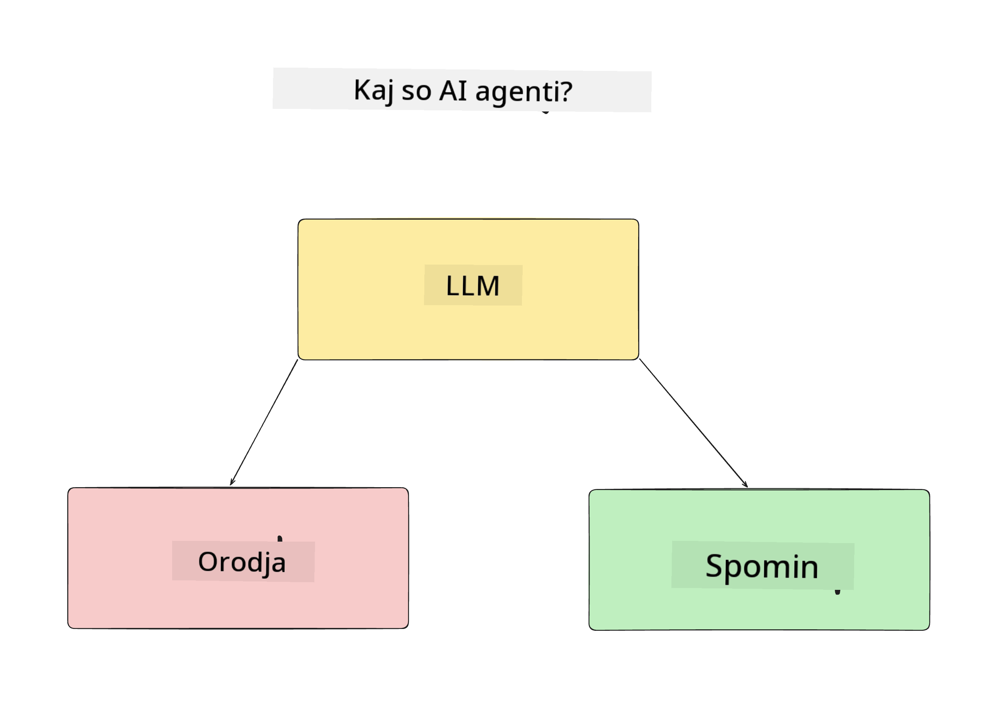
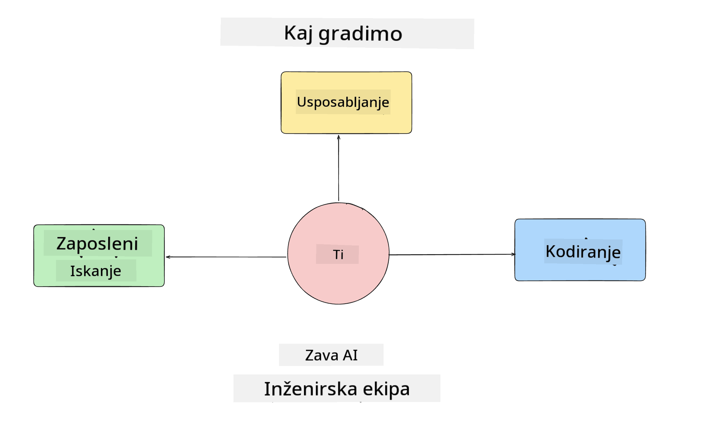
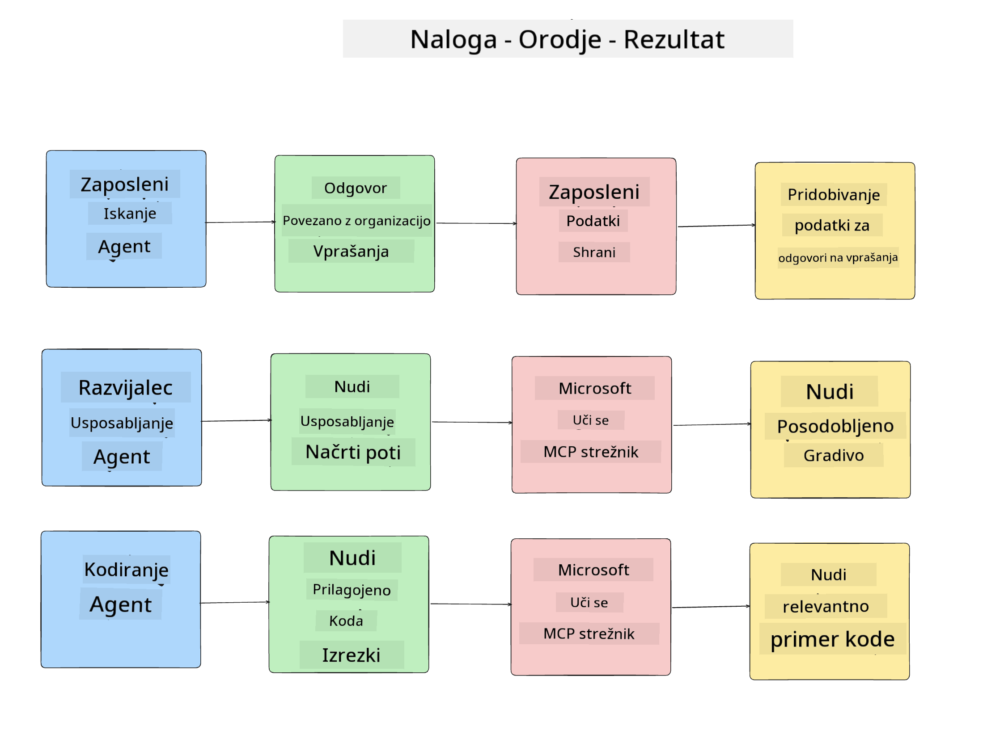
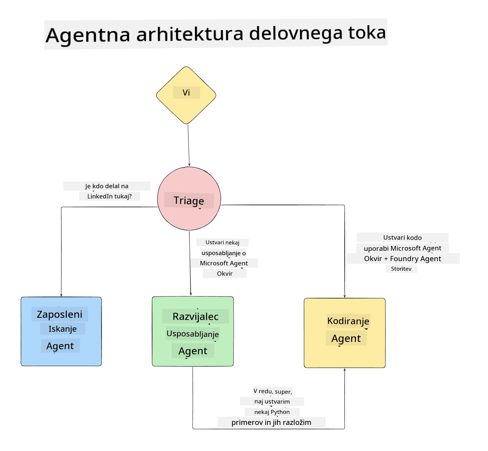

<!--
CO_OP_TRANSLATOR_METADATA:
{
  "original_hash": "99c07849641a850775c188c9333f31e5",
  "translation_date": "2025-12-12T18:41:51+00:00",
  "source_file": "lesson-1-agent-design/README.md",
  "language_code": "sl"
}
-->
# Lekcija 1: Oblikovanje AI Agenta

Dobrodošli na prvo lekcijo tečaja "Gradnja AI Agenta od nič do produkcije"!

V tej lekciji bomo obravnavali:

- Določitev, kaj so AI Agenti
  
- Pogovor o AI Agent aplikaciji, ki jo gradimo  

- Identifikacijo potrebnih orodij in storitev za vsakega agenta
  
- Arhitekturo naše Agent aplikacije
  
Začnimo z določanjem, kaj je agent in zakaj jih uporabljamo v aplikaciji.

## Kaj so AI Agenti?

Če prvič raziskujete, kako zgraditi AI Agenta, imate morda vprašanja, kako natančno definirati, kaj je AI Agent.

Preprosta definicija AI Agenta temelji na komponentah, ki ga sestavljajo:

**Velik jezikovni model** - LLM bo omogočal tako sposobnost obdelave naravnega jezika uporabnika za interpretacijo naloge, ki jo želi opraviti, kot tudi interpretacijo opisov orodij, ki so na voljo za izvedbo teh nalog.

**Orodja** - To so funkcije, API-ji, podatkovne baze in druge storitve, ki jih LLM lahko izbere za izvedbo nalog, ki jih zahteva uporabnik.

**Spomin** - Tako shranjujemo kratkoročne in dolgoročne interakcije med AI Agentom in uporabnikom. Shranjevanje in pridobivanje teh informacij je pomembno za izboljšave in ohranjanje uporabniških nastavitev skozi čas.

## Naš primer uporabe AI Agenta

Za ta tečaj bomo zgradili AI Agent aplikacijo, ki pomaga novim razvijalcem pri vključevanju v našo razvojno ekipo AI Agentov!

Preden začnemo z razvojem, je prvi korak pri ustvarjanju uspešne AI Agent aplikacije določitev jasnih scenarijev, kako pričakujemo, da bodo naši uporabniki delali z našimi AI Agenti.

Za to aplikacijo bomo delali s temi scenariji:

**Scenarij 1**: Nov zaposleni se pridruži naši organizaciji in želi izvedeti več o ekipi, v katero je vstopil, in kako se z njo povezati.

**Scenarij 2:** Nov zaposleni želi vedeti, katera bi bila najboljša prva naloga, na kateri naj začne delati.

**Scenarij 3:** Nov zaposleni želi zbrati učne vire in vzorce kode, ki mu bodo pomagali začeti z izvedbo te naloge.

## Identifikacija orodij in storitev

Zdaj, ko imamo ustvarjene te scenarije, je naslednji korak, da jih povežemo z orodji in storitvami, ki jih bodo naši AI Agenti potrebovali za izvedbo teh nalog.

Ta proces spada v kategorijo inženiringa konteksta, saj se bomo osredotočili na zagotavljanje, da imajo naši AI Agenti pravi kontekst ob pravem času za izvedbo nalog.

Pojdimo scenarij za scenarijem in izvedimo dobro agentno oblikovanje tako, da navedemo naloge, orodja in želene rezultate vsakega agenta.

### Scenarij 1 - Agent za iskanje zaposlenih

**Naloga** - Odgovarjati na vprašanja o zaposlenih v organizaciji, kot so datum zaposlitve, trenutna ekipa, lokacija in zadnji položaj.

**Orodja** - Podatkovna baza trenutnega seznama zaposlenih in organizacijska shema

**Rezultati** - Sposobnost pridobivanja informacij iz podatkovne baze za odgovore na splošna organizacijska vprašanja in specifična vprašanja o zaposlenih.

### Scenarij 2 - Agent za priporočanje nalog

**Naloga** - Na podlagi izkušenj novega zaposlenega razvijalca predlagati 1-3 težave, na katerih lahko novi zaposleni dela.

**Orodja** - GitHub MCP strežnik za pridobivanje odprtih težav in gradnjo profila razvijalca

**Rezultati** - Sposobnost branja zadnjih 5 commitov GitHub profila in odprtih težav na GitHub projektu ter podajanje priporočil na podlagi ujemanja

### Scenarij 3 - Agent pomočnik za kodo

**Naloga** - Na podlagi odprtih težav, ki jih je priporočil agent "Priporočanje nalog", raziskati in zagotoviti vire ter ustvariti kode primere, ki pomagajo zaposlenemu.

**Orodja** - Microsoft Learn MCP za iskanje virov in Code Interpreter za generiranje prilagojenih kodnih odlomkov.

**Rezultati** - Če uporabnik zaprosi za dodatno pomoč, naj delovni tok uporabi Learn MCP strežnik za zagotavljanje povezav in odlomkov do virov ter nato predajo agentu Code Interpreter za generiranje majhnih kodnih odlomkov z razlagami.

## Arhitektura naše Agent aplikacije

Zdaj, ko smo definirali vsakega od naših agentov, ustvarimo arhitekturni diagram, ki nam bo pomagal razumeti, kako bodo agenti delovali skupaj in ločeno glede na nalogo:

## Naslednji koraki

Zdaj, ko smo oblikovali vsakega agenta in naš agentni sistem, pojdimo na naslednjo lekcijo, kjer bomo razvili vsakega od teh agentov!

---

<!-- CO-OP TRANSLATOR DISCLAIMER START -->
**Omejitev odgovornosti**:
Ta dokument je bil preveden z uporabo storitve za prevajanje z umetno inteligenco [Co-op Translator](https://github.com/Azure/co-op-translator). Čeprav si prizadevamo za natančnost, vas opozarjamo, da avtomatizirani prevodi lahko vsebujejo napake ali netočnosti. Izvirni dokument v njegovem izvirnem jeziku velja za avtoritativni vir. Za ključne informacije priporočamo strokovni človeški prevod. Za morebitna nesporazume ali napačne interpretacije, ki izhajajo iz uporabe tega prevoda, ne odgovarjamo.
<!-- CO-OP TRANSLATOR DISCLAIMER END -->