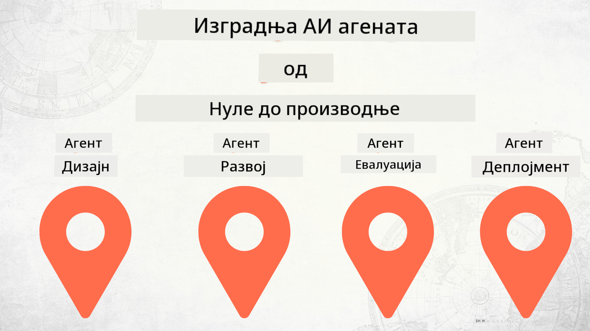

<!--
CO_OP_TRANSLATOR_METADATA:
{
  "original_hash": "2799ceaaefbd8571688459ac03eac5aa",
  "translation_date": "2025-12-12T17:10:00+00:00",
  "source_file": "README.md",
  "language_code": "sr"
}
-->
# Изградња AI агената од нуле до производње

## Курс који вас учи основама животног циклуса развоја AI агената

## 🌱 Почетак

Овај курс има лекције које покривају основе изградње и постављања AI агената.

Свака лекција се надовезује на претходну, па препоручујемо да почнете од почетка и радите до краја.

Ако желите да истражите више о темама AI агената, можете погледати [Курс за почетнике AI агената](https://aka.ms/ai-agents-beginners).

### Упознајте друге ученике, добијте одговоре на ваша питања

Ако запнете или имате питања о изградњи AI агената, придружите се нашем посвећеном Discord каналу у [Microsoft Foundry Discord](https://discord.gg/Kuaw3ktsu6).

### Шта вам је потребно

Свака лекција има свој пример кода који можете покренути локално. Можете [форковати овај репо](https://github.com/microsoft/Building-AI-Agents-From-Zero-To-Production/fork) да бисте направили своју копију.

Овај курс тренутно користи следеће:

- [Microsoft Agent Framework (MAF)](https://aka.ms/ai-agents-beginners/agent-framework)
- [Microsoft Foundry](https://azure.microsoft.com/products/ai-foundry)
- [Azure OpenAI Service](https://azure.microsoft.com/products/ai-foundry/models/openai)
- [Azure CLI](https://learn.microsoft.com/cli/azure/authenticate-azure-cli?view=azure-cli-latest)

Молимо вас да обезбедите приступ овим услугама пре него што почнете.

Више опција око хостинга модела и услуга долази ускоро.

## 🗃️ Лекције

| **Лекција**         | **Опис**                                                                                  |
|--------------------|--------------------------------------------------------------------------------------------------|
| [Дизајн агента](./lesson-1-agent-design/README.md)       | Увод у наш "Developer Onboarding" случај употребе агента и како дизајнирати ефикасне агенте  |
| [Развој агента](./lesson-2-agent-development/README.md)  | Користећи Microsoft Agent Framework (MAF), направите 3 агента који помажу новим програмерима да се укључе.       |
| [Евалуације агената](./lesson-3-agent-evals/README.md)  | Користећи Microsoft Foundry, сазнајте колико добро наши AI агенти раде и како их побољшати. |
| [Постављање агената](./lesson-4-agent-deployment/README.md)   | Користећи Hosted Agents и OpenAI Chatkit, погледајте како поставити AI агента у производњу.       |

## Допринос

Овај пројекат поздравља доприносе и предлоге. Већина доприноса захтева да се сложите са
Уговором о лиценци за допринос (CLA) којим изјављујете да имате право и заиста нам дајете
права да користимо ваш допринос. За детаље посетите <https://cla.opensource.microsoft.com>.

Када пошаљете захтев за повлачење, CLA бот ће аутоматски одредити да ли треба да доставите
CLA и одговарајуће означити PR (нпр. провера статуса, коментар). Једноставно пратите упутства
која пружа бот. Ово ћете морати урадити само једном за све репозиторијуме који користе наш CLA.

Овај пројекат је усвојио [Microsoft Open Source Code of Conduct](https://opensource.microsoft.com/codeofconduct/).
За више информација погледајте [Често постављана питања о Кодексу понашања](https://opensource.microsoft.com/codeofconduct/faq/) или
контактирајте [opencode@microsoft.com](mailto:opencode@microsoft.com) за додатна питања или коментаре.

## Заштитни знаци

Овај пројекат може садржати заштитне знакове или логотипе пројеката, производа или услуга. Овлашћена употреба Microsoft
заштитних знакова или логотипа подлеже и мора пратити
[Microsoft-ове смернице за заштитне знакове и бренд](https://www.microsoft.com/legal/intellectualproperty/trademarks/usage/general).
Употреба Microsoft заштитних знакова или логотипа у модификованим верзијама овог пројекта не сме изазвати конфузију нити имплицирати Microsoft спонзорство.
Свака употреба заштитних знакова или логотипа трећих страна подлеже политикама тих трећих страна.

## Помоћ

Ако запнете или имате питања о изградњи AI апликација, придружите се:

Ако имате повратне информације о производу или грешке током изградње посетите:

---

<!-- CO-OP TRANSLATOR DISCLAIMER START -->
**Одрицање од одговорности**:  
Овај документ је преведен коришћењем AI преводилачке услуге [Co-op Translator](https://github.com/Azure/co-op-translator). Иако тежимо прецизности, молимо вас да имате у виду да аутоматски преводи могу садржати грешке или нетачности. Оригинални документ на његовом изворном језику треба сматрати ауторитетним извором. За критичне информације препоручује се професионални људски превод. Нисмо одговорни за било каква неспоразума или погрешна тумачења која произилазе из коришћења овог превода.
<!-- CO-OP TRANSLATOR DISCLAIMER END -->