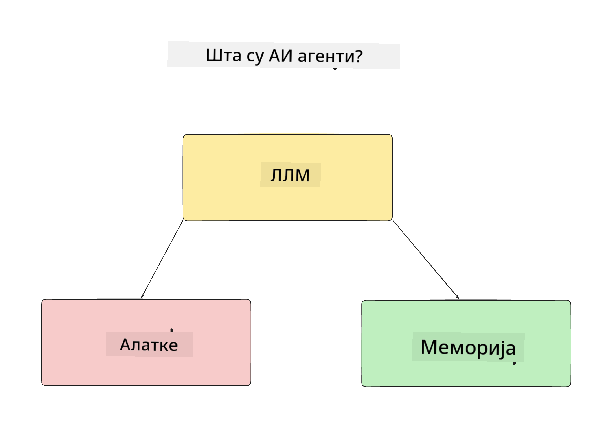
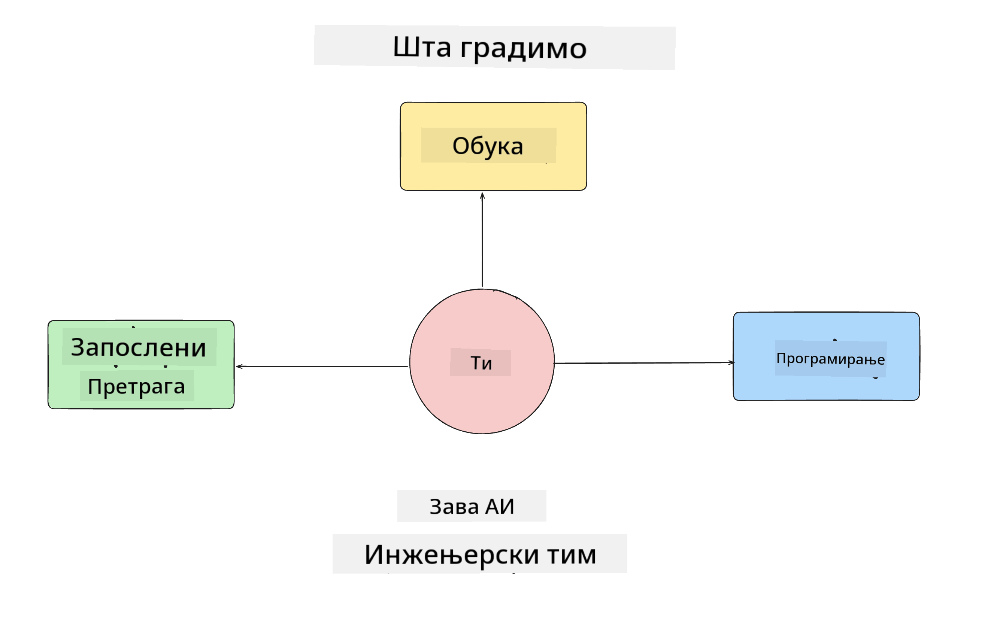
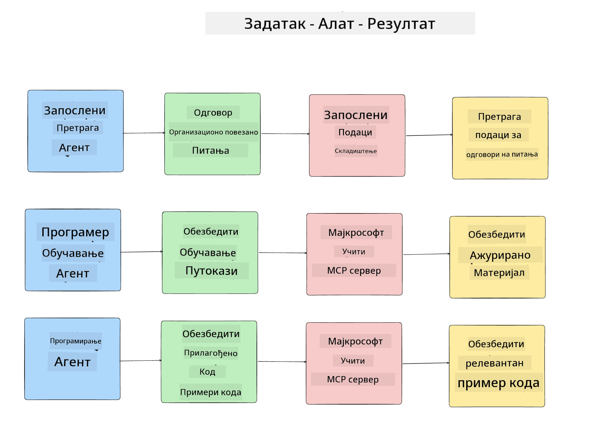
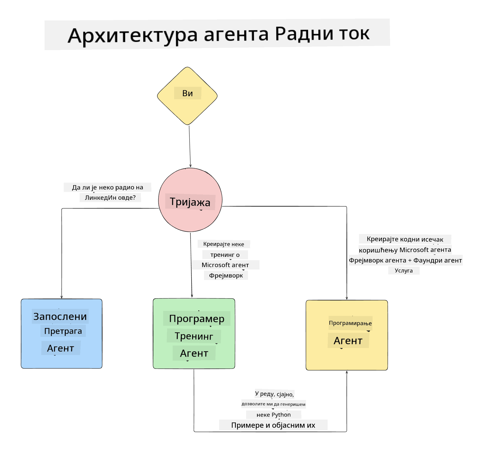

<!--
CO_OP_TRANSLATOR_METADATA:
{
  "original_hash": "99c07849641a850775c188c9333f31e5",
  "translation_date": "2025-12-12T18:40:29+00:00",
  "source_file": "lesson-1-agent-design/README.md",
  "language_code": "sr"
}
-->
# Лекција 1: Дизајн AI Агента

Добродошли у прву лекцију курса "Изградња AI Агента од нуле до продукције"!

У овој лекцији ћемо обрадити:

- Дефинисање шта су AI агенти
  
- Разговор о AI апликацији агента коју градимо  

- Идентификовање потребних алата и услуга за сваког агента
  
- Архитектуру наше апликације агента
  
Хајде да почнемо дефинисањем шта је агент и зашто бисмо их користили у апликацији.

## Шта су AI агенти?

Ако је ово ваш први пут да истражујете како изградити AI агента, можда имате питања како тачно дефинисати шта је AI агент.

Једноставан начин да дефинишемо шта је AI агент је кроз компоненте које га чине:

**Велики језички модел** - LLM ће омогућити и способност обраде природног језика од корисника да интерпретира задатак који желе да заврше, као и да интерпретира описе алата доступних за извршење тих задатака.

**Алатке** - Ово ће бити функције, API-ји, складишта података и друге услуге које LLM може изабрати да користи како би завршио задатке које корисник тражи.

**Меморија** - Овде чувамо и краткорочне и дугорочне интеракције између AI агента и корисника. Чување и преузимање ових информација је важно за унапређења и чување корисничких преференција током времена.

## Наш случај употребе AI агента

За овај курс, направићемо AI апликацију агента која помаже новим програмерима да се укључе у наш тим за развој AI агената!

Пре него што започнемо било какав развој, први корак ка креирању успешне AI апликације агента је дефинисање јасних сценарија о томе како очекујемо да наши корисници раде са нашим AI агентима.

За ову апликацију, радићемо са овим сценаријима:

**Сценарио 1**: Нови запослени се придружује нашој организацији и жели да сазна више о тиму у који је ушао и како да се повежe са њима.

**Сценарио 2:** Нови запослени жели да зна који би био најбољи први задатак на којем може почети да ради.

**Сценарио 3:** Нови запослени жели да прикупи ресурсе за учење и примере кода који ће му помоћи да започне са извршењем тог задатка.

## Идентификовање алата и услуга

Сада када имамо креиране ове сценарије, следећи корак је да их повежемо са алатима и услугама које ће наши AI агенти морати да користе да би завршили ове задатке.

Овај процес спада у категорију инжењеринга контекста јер ћемо се фокусирати на то да наши AI агенти имају прави контекст у право време да заврше задатке.

Хајде да то урадимо сценарио по сценарио и извршимо добар агентски дизајн тако што ћемо набројати задатак, алате и жељене резултате сваког агента.

### Сценарио 1 - Агент за претрагу запослених

**Задатак** - Одговарати на питања о запосленима у организацији као што су датум придруживања, тренутни тим, локација и последња позиција.

**Алатке** - Складиште података са списком тренутних запослених и организационом шемом

**Резултати** - Могућност преузимања информација из складишта података за одговоре на општа организациона питања и специфична питања о запосленима.

### Сценарио 2 - Агент за препоруку задатака

**Задатак** - На основу искуства новог запосленог програмера, предложити 1-3 проблема на којима нови запослени може радити.

**Алатке** - GitHub MCP сервер за добијање отворених проблема и изградњу профила програмера

**Резултати** - Могућност читања последњих 5 комита GitHub профила и отворених проблема на GitHub пројекту и давање препорука на основу поклапања

### Сценарио 3 - Агент помоћник за код

**Задатак** - На основу отворених проблема које је препоручио агент "Препорука задатака", истражити и обезбедити ресурсе и генерисати примере кода који ће помоћи запосленом.

**Алатке** - Microsoft Learn MCP за проналажење ресурса и Code Interpreter за генерисање прилагођених примера кода.

**Резултати** - Ако корисник затражи додатну помоћ, ток рада треба да користи Learn MCP сервер за пружање линкова и примера ресурса, а затим да преда агенту Code Interpreter да генерише мале примере кода са објашњењима.

## Архитектура наше апликације агента

Сада када смо дефинисали сваког од наших агената, хајде да направимо дијаграм архитектуре који ће нам помоћи да разумемо како ће сваки агент радити заједно и одвојено у зависности од задатка:

## Следећи кораци

Сада када смо дизајнирали сваког агента и наш агентски систем, хајде да пређемо на следећу лекцију где ћемо развити сваки од ових агената!

---

<!-- CO-OP TRANSLATOR DISCLAIMER START -->
**Одрицање од одговорности**:
Овај документ је преведен коришћењем AI услуге за превођење [Co-op Translator](https://github.com/Azure/co-op-translator). Иако тежимо прецизности, молимо вас да имате у виду да аутоматски преводи могу садржати грешке или нетачности. Оригинални документ на његовом изворном језику треба сматрати ауторитетним извором. За критичне информације препоручује се професионални људски превод. Нисмо одговорни за било каква неспоразума или погрешна тумачења која произилазе из коришћења овог превода.
<!-- CO-OP TRANSLATOR DISCLAIMER END -->