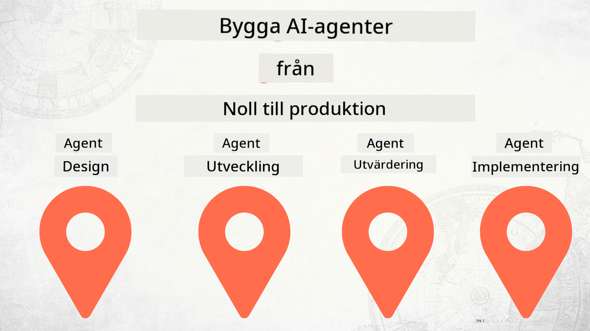

<!--
CO_OP_TRANSLATOR_METADATA:
{
  "original_hash": "d8cf941adeb146a5f00f04e4726c3033",
  "translation_date": "2025-12-19T10:19:33+00:00",
  "source_file": "README.md",
  "language_code": "sv"
}
-->
# Bygga AI-agenter från grunden till produktion

### 🌐 Flerspråkigt stöd

#### Stöds via GitHub Action (Automatiserat & Alltid Uppdaterat)

<!-- CO-OP TRANSLATOR LANGUAGES TABLE START -->
[Arabiska](../ar/README.md) | [Bengali](../bn/README.md) | [Bulgariska](../bg/README.md) | [Burmese (Myanmar)](../my/README.md) | [Kinesiska (Förenklad)](../zh/README.md) | [Kinesiska (Traditionell, Hong Kong)](../hk/README.md) | [Kinesiska (Traditionell, Macau)](../mo/README.md) | [Kinesiska (Traditionell, Taiwan)](../tw/README.md) | [Kroatiska](../hr/README.md) | [Tjeckiska](../cs/README.md) | [Danska](../da/README.md) | [Holländska](../nl/README.md) | [Estniska](../et/README.md) | [Finska](../fi/README.md) | [Franska](../fr/README.md) | [Tyska](../de/README.md) | [Grekiska](../el/README.md) | [Hebreiska](../he/README.md) | [Hindi](../hi/README.md) | [Ungerska](../hu/README.md) | [Indonesiska](../id/README.md) | [Italienska](../it/README.md) | [Japanska](../ja/README.md) | [Kannada](../kn/README.md) | [Koreanska](../ko/README.md) | [Litauiska](../lt/README.md) | [Malajiska](../ms/README.md) | [Malayalam](../ml/README.md) | [Marathi](../mr/README.md) | [Nepali](../ne/README.md) | [Nigeriansk Pidgin](../pcm/README.md) | [Norska](../no/README.md) | [Persiska (Farsi)](../fa/README.md) | [Polska](../pl/README.md) | [Portugisiska (Brasilien)](../br/README.md) | [Portugisiska (Portugal)](../pt/README.md) | [Punjabi (Gurmukhi)](../pa/README.md) | [Rumänska](../ro/README.md) | [Ryska](../ru/README.md) | [Serbiska (Kyrilliska)](../sr/README.md) | [Slovakiska](../sk/README.md) | [Slovenska](../sl/README.md) | [Spanska](../es/README.md) | [Swahili](../sw/README.md) | [Svenska](./README.md) | [Tagalog (Filippinska)](../tl/README.md) | [Tamil](../ta/README.md) | [Telugu](../te/README.md) | [Thailändska](../th/README.md) | [Turkiska](../tr/README.md) | [Ukrainska](../uk/README.md) | [Urdu](../ur/README.md) | [Vietnamesiska](../vi/README.md)
<!-- CO-OP TRANSLATOR LANGUAGES TABLE END -->

## En kurs som lär dig grunderna i AI-agenters utvecklingslivscykel

## 🌱 Kom igång

Denna kurs innehåller lektioner som täcker grunderna i att bygga och distribuera AI-agenter.

Varje lektion bygger på den föregående, så vi rekommenderar att du börjar från början och arbetar dig igenom till slutet.

Om du vill utforska mer om AI-agentämnen kan du kolla in [AI Agents For Beginners Course](https://aka.ms/ai-agents-beginners).

### Träffa andra elever, få dina frågor besvarade

Om du fastnar eller har några frågor om att bygga AI-agenter, gå med i vår dedikerade Discord-kanal i [Microsoft Foundry Discord](https://discord.gg/Kuaw3ktsu6).

### Vad du behöver

Varje lektion har sitt eget kodexempel som du kan köra lokalt. Du kan [forka detta repo](https://github.com/microsoft/Building-AI-Agents-From-Zero-To-Production/fork) för att skapa din egen kopia.

Denna kurs använder för närvarande följande:

- [Microsoft Agent Framework (MAF)](https://aka.ms/ai-agents-beginners/agent-framework)
- [Microsoft Foundry](https://azure.microsoft.com/products/ai-foundry)
- [Azure OpenAI Service](https://azure.microsoft.com/products/ai-foundry/models/openai)
- [Azure CLI](https://learn.microsoft.com/cli/azure/authenticate-azure-cli?view=azure-cli-latest)

Se till att du har tillgång till dessa tjänster innan du börjar.

Fler alternativ kring modellhosting och tjänster kommer snart.

## 🗃️ Lektioner

| **Lektion**         | **Beskrivning**                                                                                  |
|--------------------|--------------------------------------------------------------------------------------------------|
| [Agent Design](./lesson-1-agent-design/README.md)       | En introduktion till vårt "Developer Onboarding" Agent Use Case och hur man designar effektiva agenter  |
| [Agent Development](./lesson-2-agent-development/README.md)  | Använd Microsoft Agent Framework (MAF) för att skapa 3 agenter som hjälper nya utvecklare att komma igång.       |
| [Agent Evaluations](./lesson-3-agent-evals/README.md)  | Använd Microsoft Foundry för att ta reda på hur väl våra AI-agenter presterar och hur man förbättrar dem. |
| [Agent Deployment](./lesson-4-agent-deployment/README.md)   | Använd Hosted Agents och OpenAI Chatkit för att se hur man distribuerar en AI-agent i produktion.       |

## 🎒 Andra kurser

Vårt team producerar andra kurser! Kolla in:

<!-- CO-OP TRANSLATOR OTHER COURSES START -->
### LangChain

---

### Azure / Edge / MCP / Agenter

---
 
### Generativ AI-serie

[-9333EA?style=for-the-badge&labelColor=E5E7EB&color=9333EA)](https://github.com/microsoft/Generative-AI-for-beginners-dotnet?WT.mc_id=academic-105485-koreyst)
[-C084FC?style=for-the-badge&labelColor=E5E7EB&color=C084FC)](https://github.com/microsoft/generative-ai-for-beginners-java?WT.mc_id=academic-105485-koreyst)
[-E879F9?style=for-the-badge&labelColor=E5E7EB&color=E879F9)](https://github.com/microsoft/generative-ai-with-javascript?WT.mc_id=academic-105485-koreyst)

---
 
### Kärnkunskap

---
 
### Copilot-serien

<!-- CO-OP TRANSLATOR OTHER COURSES END -->

## Bidra

Detta projekt välkomnar bidrag och förslag. De flesta bidrag kräver att du godkänner ett
Contributor License Agreement (CLA) som intygar att du har rätt att, och faktiskt gör det, ge oss
rättigheterna att använda ditt bidrag. För detaljer, besök <https://cla.opensource.microsoft.com>.

När du skickar in en pull-begäran kommer en CLA-bot automatiskt att avgöra om du behöver tillhandahålla
en CLA och märka PR lämpligt (t.ex. statuskontroll, kommentar). Följ helt enkelt instruktionerna
från boten. Du behöver bara göra detta en gång för alla repos som använder vår CLA.

Detta projekt har antagit [Microsofts uppförandekod för öppen källkod](https://opensource.microsoft.com/codeofconduct/).
För mer information, se [FAQ för uppförandekoden](https://opensource.microsoft.com/codeofconduct/faq/) eller
kontakta [opencode@microsoft.com](mailto:opencode@microsoft.com) med eventuella ytterligare frågor eller kommentarer.

## Varumärken

Detta projekt kan innehålla varumärken eller logotyper för projekt, produkter eller tjänster. Auktoriserad användning av Microsofts
varumärken eller logotyper är föremål för och måste följa
[Microsofts riktlinjer för varumärken och varumärkesanvändning](https://www.microsoft.com/legal/intellectualproperty/trademarks/usage/general).
Användning av Microsofts varumärken eller logotyper i modifierade versioner av detta projekt får inte orsaka förvirring eller antyda Microsofts sponsring.
All användning av tredjeparts varumärken eller logotyper är föremål för dessa tredjeparts policyer.

## Få hjälp

Om du fastnar eller har frågor om att bygga AI-appar, gå med i:

Om du har produktfeedback eller fel under utveckling, besök:

---

<!-- CO-OP TRANSLATOR DISCLAIMER START -->
**Ansvarsfriskrivning**:
Detta dokument har översatts med hjälp av AI-översättningstjänsten [Co-op Translator](https://github.com/Azure/co-op-translator). Även om vi strävar efter noggrannhet, vänligen observera att automatiska översättningar kan innehålla fel eller brister. Det ursprungliga dokumentet på dess modersmål bör betraktas som den auktoritativa källan. För kritisk information rekommenderas professionell mänsklig översättning. Vi ansvarar inte för några missförstånd eller feltolkningar som uppstår till följd av användningen av denna översättning.
<!-- CO-OP TRANSLATOR DISCLAIMER END -->