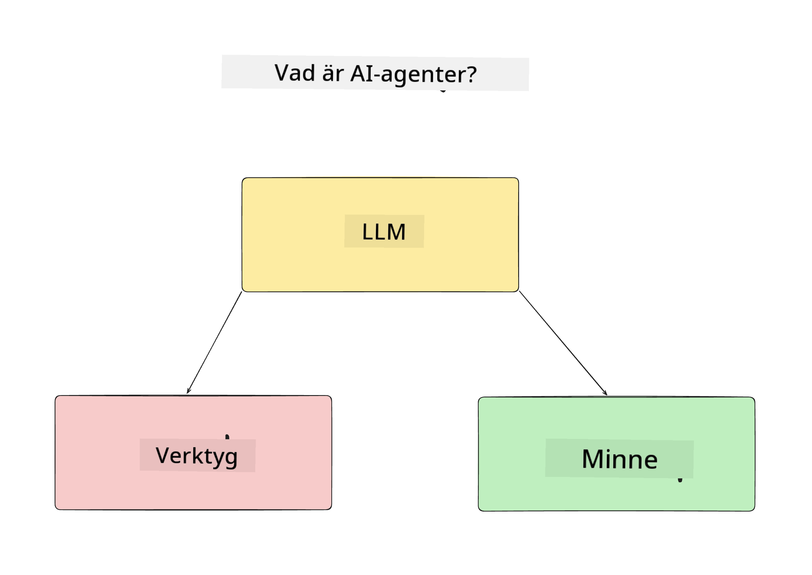
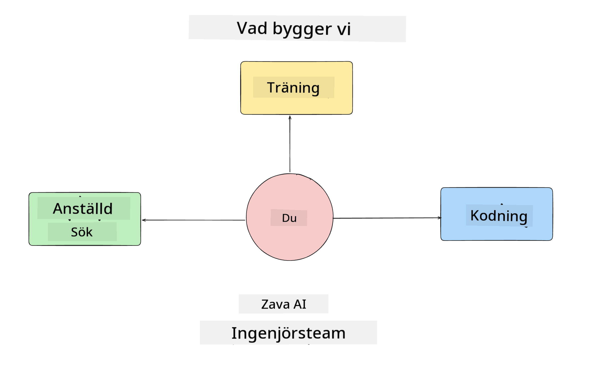
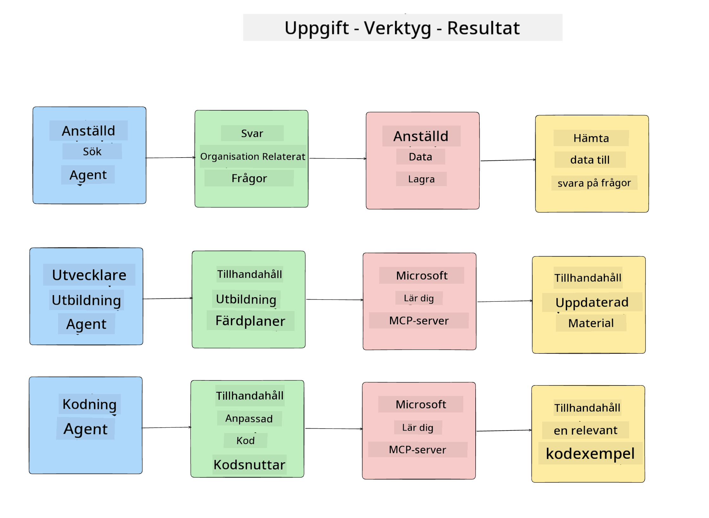
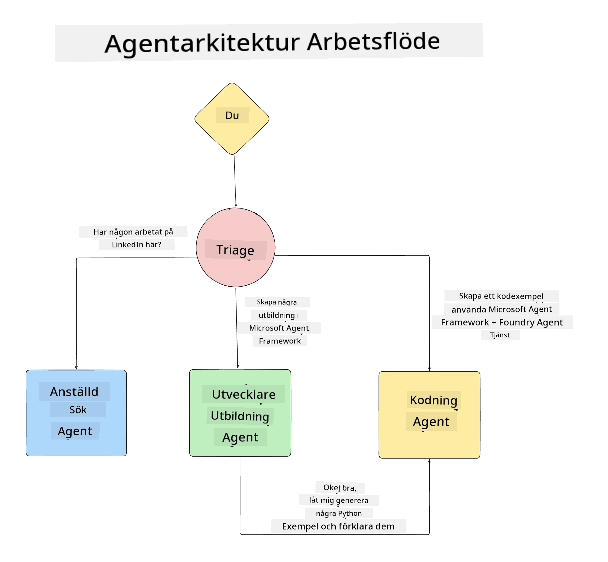

<!--
CO_OP_TRANSLATOR_METADATA:
{
  "original_hash": "99c07849641a850775c188c9333f31e5",
  "translation_date": "2025-12-12T18:30:36+00:00",
  "source_file": "lesson-1-agent-design/README.md",
  "language_code": "sv"
}
-->
# Lektion 1: Design av AI-agent

Välkommen till den första lektionen i kursen "Bygga AI-agent från noll till produktion"!

I denna lektion kommer vi att täcka:

- Definiera vad AI-agenter är
  
- Diskutera AI-agentapplikationen vi bygger  

- Identifiera de verktyg och tjänster som krävs för varje agent
  
- Arkitektera vår agentapplikation
  
Låt oss börja med att definiera vad en agent är och varför vi skulle använda dem i en applikation.

## Vad är AI-agenter?

Om detta är första gången du utforskar hur man bygger en AI-agent, kan du ha frågor om hur man exakt definierar vad en AI-agent är.

Ett enkelt sätt att definiera vad en AI-agent är utifrån de komponenter som utgör den:

**Stort språkmodell** - LLM kommer att driva både förmågan att bearbeta naturligt språk från användaren för att tolka uppgiften de vill utföra samt tolka beskrivningarna av de verktyg som finns tillgängliga för att slutföra dessa uppgifter.

**Verktyg** - Dessa kommer att vara funktioner, API:er, datalager och andra tjänster som LLM kan välja att använda för att slutföra de uppgifter som användaren begär.

**Minne** - Så här lagrar vi både kortsiktiga och långsiktiga interaktioner mellan AI-agenten och användaren. Att lagra och hämta denna information är viktigt för att göra förbättringar och spara användarpreferenser över tid.

## Vårt AI-agentanvändningsfall

För denna kurs ska vi bygga en AI-agentapplikation som hjälper nya utvecklare att komma igång i vårt AI-agentutvecklingsteam!

Innan vi gör något utvecklingsarbete är det första steget för att skapa en framgångsrik AI-agentapplikation att definiera tydliga scenarier för hur vi förväntar oss att våra användare ska arbeta med våra AI-agenter.

För denna applikation kommer vi att arbeta med dessa scenarier:

**Scenario 1**: En ny anställd börjar i vår organisation och vill veta mer om teamet de anslutit sig till och hur man kan kontakta dem.

**Scenario 2:** En ny anställd vill veta vilken som skulle vara den bästa första uppgiften för dem att börja arbeta med.

**Scenario 3:** En ny anställd vill samla in lärresurser och kodexempel för att hjälpa dem att komma igång med att slutföra denna uppgift.

## Identifiera verktyg och tjänster

Nu när vi har skapat dessa scenarier är nästa steg att koppla dem till de verktyg och tjänster som våra AI-agenter behöver för att slutföra dessa uppgifter.

Denna process faller under kategorin Kontextteknik eftersom vi kommer att fokusera på att säkerställa att våra AI-agenter har rätt kontext vid rätt tidpunkt för att slutföra uppgifterna.

Låt oss göra detta scenario för scenario och utföra bra agentdesign genom att lista varje agents uppgift, verktyg och önskade resultat.

### Scenario 1 - Agent för anställdssökning

**Uppgift** - Svara på frågor om anställda i organisationen såsom anställningsdatum, nuvarande team, plats och senaste position.

**Verktyg** - Datalager med aktuell anställdlista och organisationsschema

**Resultat** - Kunna hämta information från datalagret för att svara på allmänna organisationsfrågor och specifika frågor om anställda.

### Scenario 2 - Agent för uppgiftsrekommendation

**Uppgift** - Baserat på den nya anställdes utvecklarerfarenhet, ta fram 1-3 ärenden som den nya anställde kan arbeta med.

**Verktyg** - GitHub MCP-server för att hämta öppna ärenden och bygga en utvecklarprofil

**Resultat** - Kunna läsa de senaste 5 committerna i en GitHub-profil och öppna ärenden i ett GitHub-projekt och ge rekommendationer baserat på en matchning

### Scenario 3 - Agent för kodassistent

**Uppgift** - Baserat på de öppna ärenden som rekommenderades av "Uppgiftsrekommendationsagenten", undersöka och tillhandahålla resurser samt generera kodsnuttar för att hjälpa den anställde.

**Verktyg** - Microsoft Learn MCP för att hitta resurser och Code Interpreter för att generera anpassade kodsnuttar.

**Resultat** - Om användaren ber om ytterligare hjälp ska arbetsflödet använda Learn MCP-servern för att tillhandahålla länkar och kodsnuttar till resurser och sedan överlämna till Code Interpreter-agenten för att generera små kodsnuttar med förklaringar.

## Arkitektera vår agentapplikation

Nu när vi har definierat var och en av våra agenter, låt oss skapa ett arkitekturdiagram som hjälper oss att förstå hur varje agent kommer att arbeta tillsammans och separat beroende på uppgiften:

## Nästa steg

Nu när vi har designat varje agent och vårt agentbaserade system, låt oss gå vidare till nästa lektion där vi kommer att utveckla var och en av dessa agenter!

---

<!-- CO-OP TRANSLATOR DISCLAIMER START -->
**Ansvarsfriskrivning**:
Detta dokument har översatts med hjälp av AI-översättningstjänsten [Co-op Translator](https://github.com/Azure/co-op-translator). Även om vi strävar efter noggrannhet, vänligen observera att automatiska översättningar kan innehålla fel eller brister. Det ursprungliga dokumentet på dess modersmål bör betraktas som den auktoritativa källan. För kritisk information rekommenderas professionell mänsklig översättning. Vi ansvarar inte för några missförstånd eller feltolkningar som uppstår till följd av användningen av denna översättning.
<!-- CO-OP TRANSLATOR DISCLAIMER END -->