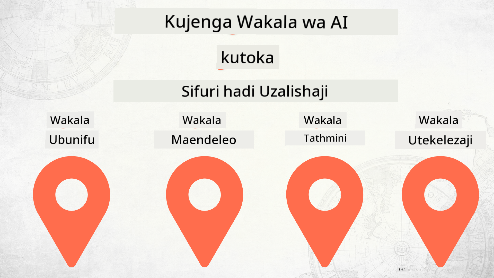

<!--
CO_OP_TRANSLATOR_METADATA:
{
  "original_hash": "f8ea8224e106540413202b4151bb2bcd",
  "translation_date": "2025-12-15T14:31:24+00:00",
  "source_file": "README.md",
  "language_code": "sw"
}
-->
# Kujenga Wakala wa AI Kutoka Mwanzo hadi Uzalishaji

### 🌐 Msaada wa Lugha Nyingi

#### Unaungwa mkono kupitia Kitendo cha GitHub (Kiotomatiki & Kila Wakati Kikiwa Kisasa)

<!-- CO-OP TRANSLATOR LANGUAGES TABLE START -->
[Arabic](../ar/README.md) | [Bengali](../bn/README.md) | [Bulgarian](../bg/README.md) | [Burmese (Myanmar)](../my/README.md) | [Chinese (Simplified)](../zh/README.md) | [Chinese (Traditional, Hong Kong)](../hk/README.md) | [Chinese (Traditional, Macau)](../mo/README.md) | [Chinese (Traditional, Taiwan)](../tw/README.md) | [Croatian](../hr/README.md) | [Czech](../cs/README.md) | [Danish](../da/README.md) | [Dutch](../nl/README.md) | [Estonian](../et/README.md) | [Finnish](../fi/README.md) | [French](../fr/README.md) | [German](../de/README.md) | [Greek](../el/README.md) | [Hebrew](../he/README.md) | [Hindi](../hi/README.md) | [Hungarian](../hu/README.md) | [Indonesian](../id/README.md) | [Italian](../it/README.md) | [Japanese](../ja/README.md) | [Kannada](../kn/README.md) | [Korean](../ko/README.md) | [Lithuanian](../lt/README.md) | [Malay](../ms/README.md) | [Malayalam](../ml/README.md) | [Marathi](../mr/README.md) | [Nepali](../ne/README.md) | [Nigerian Pidgin](../pcm/README.md) | [Norwegian](../no/README.md) | [Persian (Farsi)](../fa/README.md) | [Polish](../pl/README.md) | [Portuguese (Brazil)](../br/README.md) | [Portuguese (Portugal)](../pt/README.md) | [Punjabi (Gurmukhi)](../pa/README.md) | [Romanian](../ro/README.md) | [Russian](../ru/README.md) | [Serbian (Cyrillic)](../sr/README.md) | [Slovak](../sk/README.md) | [Slovenian](../sl/README.md) | [Spanish](../es/README.md) | [Swahili](./README.md) | [Swedish](../sv/README.md) | [Tagalog (Filipino)](../tl/README.md) | [Tamil](../ta/README.md) | [Telugu](../te/README.md) | [Thai](../th/README.md) | [Turkish](../tr/README.md) | [Ukrainian](../uk/README.md) | [Urdu](../ur/README.md) | [Vietnamese](../vi/README.md)
<!-- CO-OP TRANSLATOR LANGUAGES TABLE END -->

## Kozi inayokufundisha misingi ya Mzunguko wa Maendeleo ya Wakala wa AI

## 🌱 Kuanzia

Kozi hii ina masomo yanayofunika misingi ya kujenga na kupeleka Wakala wa AI.

Kila somo linaendelea na lile lililotangulia, kwa hivyo tunapendekeza kuanza kutoka mwanzo na kufuata hadi mwisho.

Ikiwa unataka kuchunguza zaidi kuhusu mada za Wakala wa AI, unaweza kuangalia [Kozi ya Wakala wa AI kwa Waanzilishi](https://aka.ms/ai-agents-beginners).

### Kutana na Wanafunzi Wengine, Pata Majibu ya Maswali Yako

Ikiwa unakumbwa na shida au una maswali yoyote kuhusu kujenga Wakala wa AI, jiunge na Kituo chetu maalum cha Discord katika [Microsoft Foundry Discord](https://discord.gg/Kuaw3ktsu6).

### Unachohitaji

Kila Somo lina sampuli yake ya msimbo ambayo unaweza kuendesha kwa ndani. Unaweza [kuforka repo hii](https://github.com/microsoft/Building-AI-Agents-From-Zero-To-Production/fork) kuunda nakala yako mwenyewe.

Kozi hii kwa sasa inatumia yafuatayo:

- [Microsoft Agent Framework (MAF)](https://aka.ms/ai-agents-beginners/agent-framework)
- [Microsoft Foundry](https://azure.microsoft.com/products/ai-foundry)
- [Huduma ya Azure OpenAI](https://azure.microsoft.com/products/ai-foundry/models/openai)
- [Azure CLI](https://learn.microsoft.com/cli/azure/authenticate-azure-cli?view=azure-cli-latest)

Tafadhali hakikisha una upatikanaji wa huduma hizi kabla ya kuanza.

Chaguzi zaidi kuhusu mwenyeji wa modeli na huduma zitakuja hivi karibuni.

## 🗃️ Masomo

| **Somo**           | **Maelezo**                                                                                     |
|--------------------|------------------------------------------------------------------------------------------------|
| [Ubunifu wa Wakala](./lesson-1-agent-design/README.md)       | Utangulizi wa "Kuanzisha Mwanaendelezaji" kwa Wakala na jinsi ya kubuni wakala bora            |
| [Maendeleo ya Wakala](./lesson-2-agent-development/README.md)  | Kutumia Microsoft Agent Framework (MAF), tengeneza wakala 3 kusaidia waendelezaji wapya kuanza. |
| [Tathmini za Wakala](./lesson-3-agent-evals/README.md)  | Kutumia Microsoft Foundry, pata jinsi Wakala wetu wa AI wanavyofanya kazi na jinsi ya kuboresha. |
| [Uwekaji Wakala](./lesson-4-agent-deployment/README.md)   | Kutumia Wakala Waliohifadhiwa na OpenAI Chatkit, ona jinsi ya kuweka Wakala wa AI uzalishaji.  |

## Kuchangia

Mradi huu unakaribisha michango na mapendekezo. Michango mingi inahitaji kukubaliana na
Makubaliano ya Leseni ya Mchango (CLA) yanayosema kuwa una haki ya, na kwa kweli unatoa,
haki za kutumia mchango wako. Kwa maelezo, tembelea <https://cla.opensource.microsoft.com>.

Unapowasilisha ombi la kuvuta, bot wa CLA atabaini moja kwa moja kama unahitaji kutoa
CLA na kupamba PR ipasavyo (mfano, ukaguzi wa hali, maoni). Fuata tu maelekezo
yanayotolewa na bot. Hii itahitajika mara moja tu kwa repos zote zinazotumia CLA yetu.

Mradi huu umechukua [Kanuni ya Maadili ya Chanzo Huria ya Microsoft](https://opensource.microsoft.com/codeofconduct/).
Kwa maelezo zaidi angalia [Maswali Yanayoulizwa Mara kwa Mara kuhusu Kanuni ya Maadili](https://opensource.microsoft.com/codeofconduct/faq/) au
wasiliana na [opencode@microsoft.com](mailto:opencode@microsoft.com) kwa maswali au maoni zaidi.

## Alama za Biashara

Mradi huu unaweza kuwa na alama za biashara au nembo za miradi, bidhaa, au huduma. Matumizi ya idhini ya alama za biashara au nembo za Microsoft
yanategemea na lazima yafuatilie
[Mwongozo wa Alama za Biashara & Brand wa Microsoft](https://www.microsoft.com/legal/intellectualproperty/trademarks/usage/general).
Matumizi ya alama za biashara au nembo za Microsoft katika matoleo yaliyobadilishwa ya mradi huu hayapaswi kusababisha mkanganyiko au kuashiria udhamini wa Microsoft.
Matumizi yoyote ya alama za biashara au nembo za wahusika wengine yanategemea sera za wahusika hao.

## Kupata Msaada

Ikiwa unakumbwa na shida au una maswali yoyote kuhusu kujenga programu za AI, jiunge:

Ikiwa una maoni kuhusu bidhaa au makosa wakati wa kujenga tembelea:

---

<!-- CO-OP TRANSLATOR DISCLAIMER START -->
**Kiarifu cha Kutotegemea**:
Hati hii imetafsiriwa kwa kutumia huduma ya tafsiri ya AI [Co-op Translator](https://github.com/Azure/co-op-translator). Ingawa tunajitahidi kwa usahihi, tafadhali fahamu kwamba tafsiri za kiotomatiki zinaweza kuwa na makosa au upungufu wa usahihi. Hati ya asili katika lugha yake ya asili inapaswa kuchukuliwa kama chanzo cha mamlaka. Kwa taarifa muhimu, tafsiri ya kitaalamu ya binadamu inapendekezwa. Hatuna dhamana kwa kutoelewana au tafsiri potofu zinazotokana na matumizi ya tafsiri hii.
<!-- CO-OP TRANSLATOR DISCLAIMER END -->