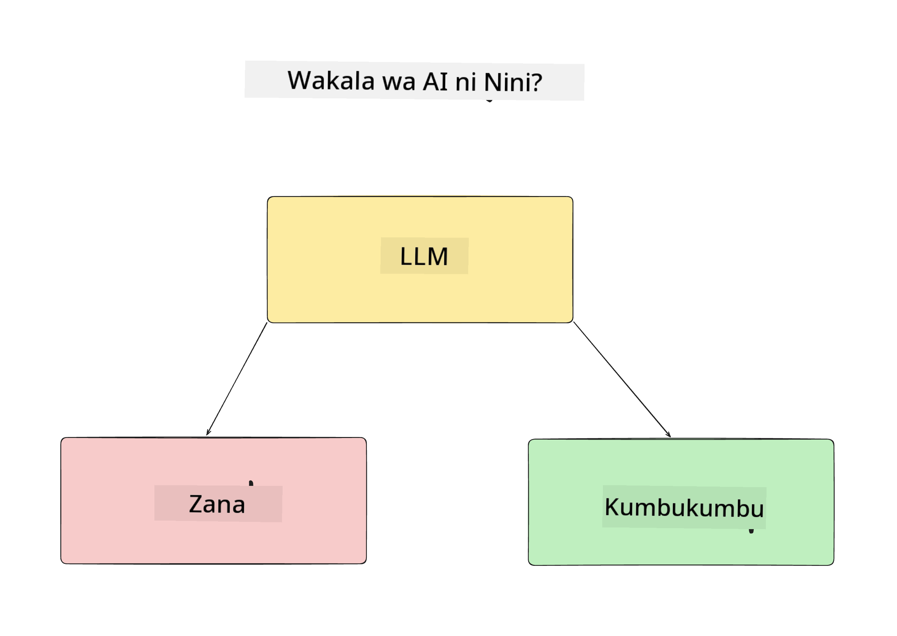
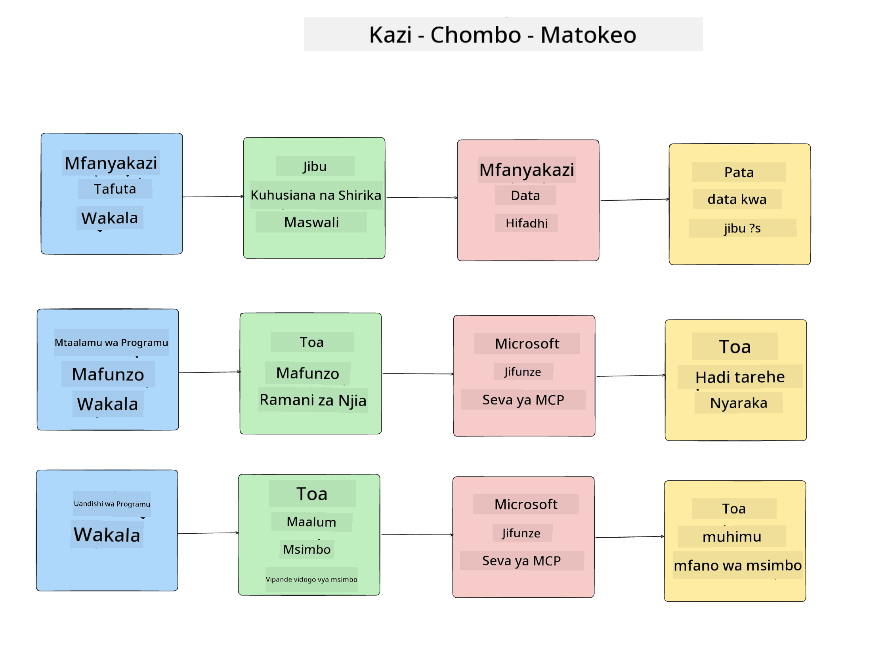
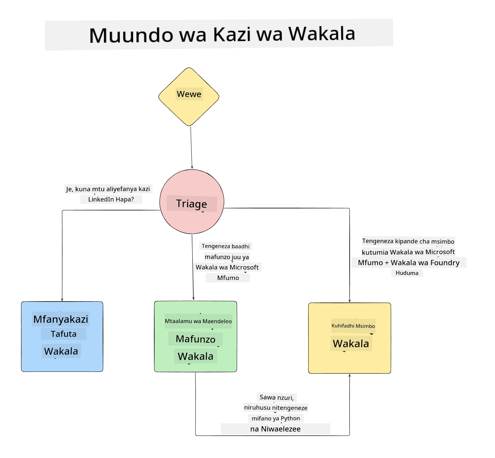

<!--
CO_OP_TRANSLATOR_METADATA:
{
  "original_hash": "99c07849641a850775c188c9333f31e5",
  "translation_date": "2025-12-12T18:36:24+00:00",
  "source_file": "lesson-1-agent-design/README.md",
  "language_code": "sw"
}
-->
# Somo la 1: Ubunifu wa Wakala wa AI

Karibu kwenye somo la kwanza la "Kozi ya Kujenga Wakala wa AI kutoka Mwanzo hadi Uzalishaji"!

Katika somo hili tutashughulikia:

- Kuelezea ni Wakala wa AI ni nini
  
- Kujadili Programu ya Wakala wa AI tunayoijenga  

- Kutambua zana na huduma zinazohitajika kwa kila wakala
  
- Kuunda usanifu wa Programu yetu ya Wakala
  
Tuanze kwa kuelezea ni wakala ni nini na kwa nini tungetumia ndani ya programu.

## Wakala wa AI ni Nini?

Ikiwa huu ni mara yako ya kwanza kuchunguza jinsi ya kujenga Wakala wa AI, unaweza kuwa na maswali juu ya jinsi ya kuelezea hasa ni nini Wakala wa AI.

Njia rahisi ya kuelezea ni kwa vipengele vinavyounda:

**Mfano Mkubwa wa Lugha** - LLM itakuwa na uwezo wa kuchakata lugha ya asili kutoka kwa mtumiaji ili kufasiri kazi wanayotaka kukamilisha pamoja na kufasiri maelezo ya zana zinazopatikana kukamilisha kazi hizo.

**Zana** - Hizi zitakuwa ni kazi, API, hifadhidata na huduma nyingine ambazo LLM inaweza kuchagua kutumia kukamilisha kazi zinazotakiwa na mtumiaji.

**Kumbukumbu** - Hii ni jinsi tunavyohifadhi mwingiliano wa muda mfupi na mrefu kati ya Wakala wa AI na mtumiaji. Kuhifadhi na kupata taarifa hii ni muhimu kwa kufanya maboresho na kuhifadhi mapendeleo ya mtumiaji kwa muda.

## Mfano wa Matumizi ya Wakala wetu wa AI

Kwa kozi hii, tutajenga programu ya Wakala wa AI inayosaidia waendelezaji wapya kujiunga na Timu yetu ya Maendeleo ya Wakala wa AI!

Kabla ya kufanya kazi yoyote ya maendeleo, hatua ya kwanza ya kuunda programu ya Wakala wa AI yenye mafanikio, ni kufafanua hali wazi za jinsi tunavyotarajia watumiaji wetu kufanya kazi na Wakala wetu wa AI.

Kwa programu hii, tutafanya kazi na hali hizi:

**Hali 1**: Mfanyakazi mpya anaingia shirika letu na anataka kujua zaidi kuhusu timu aliyoiungana nayo na jinsi ya kuwasiliana nao.

**Hali 2:** Mfanyakazi mpya anataka kujua ni kazi gani bora ya kwanza kwao kuanza kufanya kazi.

**Hali 3:** Mfanyakazi mpya anataka kukusanya rasilimali za kujifunza na mifano ya msimbo kusaidia kuanza kukamilisha kazi hii.

## Kutambua Zana na Huduma

Sasa tunapokuwa na hali hizi zilizoundwa, hatua inayofuata ni kuzibadilisha kuwa zana na huduma ambazo wakala wetu wa AI watahitaji kukamilisha kazi hizi.

Mchakato huu unaangukia katika kundi la Uhandisi wa Muktadha kwani tutazingatia kuhakikisha Wakala wetu wa AI wana muktadha sahihi kwa wakati sahihi kukamilisha kazi.

Tufanye hivi hali kwa hali na kufanya ubunifu mzuri wa wakala kwa kuorodhesha kazi, zana na matokeo yanayotarajiwa ya kila wakala.

### Hali 1 - Wakala wa Utafutaji wa Mfanyakazi

**Kazi** - Jibu maswali kuhusu wafanyakazi katika shirika kama tarehe ya kujiunga, timu ya sasa, eneo na nafasi ya mwisho.

**Zana** - Hifadhidata ya orodha ya wafanyakazi wa sasa na chati ya shirika

**Matokeo** - Kuweza kupata taarifa kutoka hifadhidata kujibu maswali ya jumla ya shirika na maswali maalum kuhusu wafanyakazi.

### Hali 2 - Wakala wa Mapendekezo ya Kazi

**Kazi** - Kulingana na uzoefu wa waendelezaji wa mfanyakazi mpya, toa masuala 1-3 ambayo mfanyakazi mpya anaweza kufanya kazi juu yake.

**Zana** - Seva ya MCP ya GitHub kupata masuala yaliyofunguliwa na kujenga wasifu wa mendelezaji

**Matokeo** - Kuweza kusoma mabadiliko 5 ya mwisho ya Wasifu wa GitHub na masuala yaliyofunguliwa kwenye mradi wa GitHub na kutoa mapendekezo kulingana na mechi

### Hali 3 - Wakala Msaidizi wa Msimbo

**Kazi** - Kulingana na Masuala ya Funguliwa yaliyopendekezwa na Wakala wa "Mapendekezo ya Kazi", fanya utafiti na toa rasilimali na tengeneza vipande vya msimbo kusaidia mfanyakazi.

**Zana** - Microsoft Learn MCP kupata rasilimali na Mfasiri wa Msimbo kutengeneza vipande vya msimbo maalum.

**Matokeo** - Ikiwa mtumiaji ataomba msaada zaidi, mtiririko wa kazi unapaswa kutumia Seva ya Learn MCP kutoa viungo na vipande vya rasilimali kisha kuhamisha kwa wakala wa Mfasiri wa Msimbo kutengeneza vipande vidogo vya msimbo na maelezo.

## Kuunda Usanifu wa Programu Yetu ya Wakala

Sasa tunapokuwa tumefafanua kila Wakala wetu, hebu tengeneze mchoro wa usanifu utakaotusaidia kuelewa jinsi kila wakala atakavyofanya kazi pamoja na kwa tofauti kulingana na kazi:

## Hatua Zifuatazo

Sasa tunapokuwa tumebuni kila wakala na mfumo wetu wa wakala, hebu tuende kwenye somo lijalo ambapo tutatengeneza kila mmoja wa wakala hawa!

---

<!-- CO-OP TRANSLATOR DISCLAIMER START -->
**Kiarifa cha Kukataa**:
Hati hii imetafsiriwa kwa kutumia huduma ya tafsiri ya AI [Co-op Translator](https://github.com/Azure/co-op-translator). Ingawa tunajitahidi kwa usahihi, tafadhali fahamu kuwa tafsiri za kiotomatiki zinaweza kuwa na makosa au upungufu wa usahihi. Hati ya asili katika lugha yake ya asili inapaswa kuchukuliwa kama chanzo cha mamlaka. Kwa taarifa muhimu, tafsiri ya kitaalamu ya binadamu inapendekezwa. Hatubebei dhamana kwa kutoelewana au tafsiri potofu zinazotokana na matumizi ya tafsiri hii.
<!-- CO-OP TRANSLATOR DISCLAIMER END -->