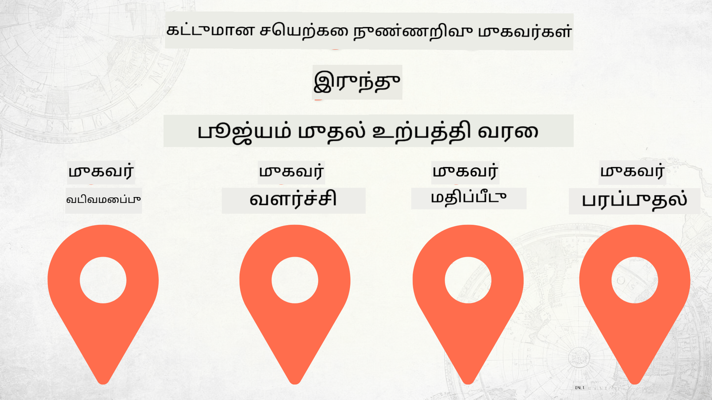

<!--
CO_OP_TRANSLATOR_METADATA:
{
  "original_hash": "d8cf941adeb146a5f00f04e4726c3033",
  "translation_date": "2025-12-19T10:49:51+00:00",
  "source_file": "README.md",
  "language_code": "ta"
}
-->
# பூஜ்யத்திலிருந்து உற்பத்தி வரை AI முகவர்களை உருவாக்குதல்

### 🌐 பன்மொழி ஆதரவு

#### GitHub செயல்பாட்டின் மூலம் ஆதரிக்கப்படுகிறது (தானாகவும் எப்போதும் புதுப்பிக்கப்படும்)

<!-- CO-OP TRANSLATOR LANGUAGES TABLE START -->
[Arabic](../ar/README.md) | [Bengali](../bn/README.md) | [Bulgarian](../bg/README.md) | [Burmese (Myanmar)](../my/README.md) | [Chinese (Simplified)](../zh/README.md) | [Chinese (Traditional, Hong Kong)](../hk/README.md) | [Chinese (Traditional, Macau)](../mo/README.md) | [Chinese (Traditional, Taiwan)](../tw/README.md) | [Croatian](../hr/README.md) | [Czech](../cs/README.md) | [Danish](../da/README.md) | [Dutch](../nl/README.md) | [Estonian](../et/README.md) | [Finnish](../fi/README.md) | [French](../fr/README.md) | [German](../de/README.md) | [Greek](../el/README.md) | [Hebrew](../he/README.md) | [Hindi](../hi/README.md) | [Hungarian](../hu/README.md) | [Indonesian](../id/README.md) | [Italian](../it/README.md) | [Japanese](../ja/README.md) | [Kannada](../kn/README.md) | [Korean](../ko/README.md) | [Lithuanian](../lt/README.md) | [Malay](../ms/README.md) | [Malayalam](../ml/README.md) | [Marathi](../mr/README.md) | [Nepali](../ne/README.md) | [Nigerian Pidgin](../pcm/README.md) | [Norwegian](../no/README.md) | [Persian (Farsi)](../fa/README.md) | [Polish](../pl/README.md) | [Portuguese (Brazil)](../br/README.md) | [Portuguese (Portugal)](../pt/README.md) | [Punjabi (Gurmukhi)](../pa/README.md) | [Romanian](../ro/README.md) | [Russian](../ru/README.md) | [Serbian (Cyrillic)](../sr/README.md) | [Slovak](../sk/README.md) | [Slovenian](../sl/README.md) | [Spanish](../es/README.md) | [Swahili](../sw/README.md) | [Swedish](../sv/README.md) | [Tagalog (Filipino)](../tl/README.md) | [Tamil](./README.md) | [Telugu](../te/README.md) | [Thai](../th/README.md) | [Turkish](../tr/README.md) | [Ukrainian](../uk/README.md) | [Urdu](../ur/README.md) | [Vietnamese](../vi/README.md)
<!-- CO-OP TRANSLATOR LANGUAGES TABLE END -->

## AI முகவர் மேம்பாட்டு வாழ்க்கைச்சுழற்சியின் அடிப்படைகளை கற்பிக்கும் ஒரு பாடநெறி

## 🌱 தொடக்கம்

இந்த பாடநெறி AI முகவர்களை உருவாக்குதல் மற்றும் வெளியிடுதல் அடிப்படைகளை உள்ளடக்கிய பாடங்களை கொண்டுள்ளது.

ஒவ்வொரு பாடமும் முந்தையதை அடிப்படையாகக் கொண்டு கட்டமைக்கப்பட்டுள்ளது, எனவே தொடக்கம் முதல் முடிவுவரை படிப்பதைக் பரிந்துரைக்கிறோம்.

AI முகவர் தலைப்புகளை மேலும் ஆராய விரும்பினால், [AI Agents For Beginners Course](https://aka.ms/ai-agents-beginners) ஐப் பார்க்கலாம்.

### மற்ற கற்றலாளர்களை சந்திக்கவும், உங்கள் கேள்விகளுக்கு பதில்கள் பெறவும்

AI முகவர்களை உருவாக்குவதில் சிக்கல் ஏற்பட்டால் அல்லது கேள்விகள் இருந்தால், எங்கள் Microsoft Foundry Discord இல் உள்ள அர்ப்பணிக்கப்பட்ட Discord சேனலில் சேரவும்: [Microsoft Foundry Discord](https://discord.gg/Kuaw3ktsu6).

### நீங்கள் தேவையானவை

ஒவ்வொரு பாடத்திற்கும் தனித்துவமான குறியீட்டு மாதிரிகள் உள்ளன, அவற்றை நீங்கள் உள்ளூரில் இயக்கலாம். உங்கள் சொந்த நகலை உருவாக்க [இந்த ரெப்போவை fork செய்யலாம்](https://github.com/microsoft/Building-AI-Agents-From-Zero-To-Production/fork).

இந்த பாடநெறி தற்போது பின்வரும் சேவைகளைப் பயன்படுத்துகிறது:

- [Microsoft Agent Framework (MAF)](https://aka.ms/ai-agents-beginners/agent-framework)
- [Microsoft Foundry](https://azure.microsoft.com/products/ai-foundry)
- [Azure OpenAI Service](https://azure.microsoft.com/products/ai-foundry/models/openai)
- [Azure CLI](https://learn.microsoft.com/cli/azure/authenticate-azure-cli?view=azure-cli-latest)

தொடங்குவதற்கு முன் இந்த சேவைகளுக்கு அணுகல் உங்களிடம் இருப்பதை உறுதிப்படுத்திக் கொள்ளவும்.

மாதிரி ஹோஸ்டிங் மற்றும் சேவைகள் தொடர்பான கூடுதல் விருப்பங்கள் விரைவில் வரும்.

## 🗃️ பாடங்கள்

| **பாடம்**         | **விளக்கம்**                                                                                  |
|--------------------|--------------------------------------------------------------------------------------------------|
| [Agent Design](./lesson-1-agent-design/README.md)       | எங்கள் "Developer Onboarding" முகவர் பயன்பாட்டிற்கான அறிமுகம் மற்றும் பயனுள்ள முகவர்களை வடிவமைப்பது எப்படி |
| [Agent Development](./lesson-2-agent-development/README.md)  | Microsoft Agent Framework (MAF) பயன்படுத்தி புதிய டெவலப்பர்களுக்கு உதவும் 3 முகவர்களை உருவாக்குதல்       |
| [Agent Evaluations](./lesson-3-agent-evals/README.md)  | Microsoft Foundry பயன்படுத்தி எங்கள் AI முகவர்கள் எவ்வாறு செயல்படுகின்றனர் மற்றும் அவற்றை மேம்படுத்துவது எப்படி என்பதை அறிதல் |
| [Agent Deployment](./lesson-4-agent-deployment/README.md)   | Hosted Agents மற்றும் OpenAI Chatkit பயன்படுத்தி AI முகவர்களை உற்பத்தியில் வெளியிடுவது எப்படி என்பதை காண்பது       |

## 🎒 பிற பாடநெறிகள்

எங்கள் குழு பிற பாடநெறிகளையும் உருவாக்குகிறது! பாருங்கள்:

<!-- CO-OP TRANSLATOR OTHER COURSES START -->
### LangChain

---

### Azure / Edge / MCP / Agents

---
 
### Generative AI Series

[-9333EA?style=for-the-badge&labelColor=E5E7EB&color=9333EA)](https://github.com/microsoft/Generative-AI-for-beginners-dotnet?WT.mc_id=academic-105485-koreyst)
[-C084FC?style=for-the-badge&labelColor=E5E7EB&color=C084FC)](https://github.com/microsoft/generative-ai-for-beginners-java?WT.mc_id=academic-105485-koreyst)
[-E879F9?style=for-the-badge&labelColor=E5E7EB&color=E879F9)](https://github.com/microsoft/generative-ai-with-javascript?WT.mc_id=academic-105485-koreyst)

---
 
### Core Learning

---
 
### Copilot தொடர்

<!-- CO-OP TRANSLATOR OTHER COURSES END -->

## பங்களிப்பு

இந்த திட்டம் பங்களிப்புகளையும் பரிந்துரைகளையும் வரவேற்கிறது. பெரும்பாலான பங்களிப்புகள் நீங்கள் பங்களிப்பை பயன்படுத்துவதற்கான உரிமையை உங்களுக்கு உள்ளது மற்றும் உண்மையில் வழங்குகிறீர்கள் என்று அறிவிக்கும்
ஒரு பங்களிப்பாளர் உரிமம் ஒப்பந்தத்துடன் (CLA) ஒப்புக்கொள்ள வேண்டும். விவரங்களுக்கு, <https://cla.opensource.microsoft.com> ஐ பார்வையிடவும்.

நீங்கள் ஒரு புல் கோரிக்கையை சமர்ப்பிக்கும் போது, CLA பாட்டி தானாகவே நீங்கள் CLA வழங்க வேண்டுமா என்பதை தீர்மானித்து PR ஐ சரியான முறையில் அலங்கரிக்கும் (எ.கா., நிலை சரிபார்ப்பு, கருத்து). பாட்டி வழங்கும் வழிமுறைகளை பின்பற்றவும். எங்கள் CLA பயன்படுத்தும் அனைத்து ரெப்போக்களிலும் இதை ஒருமுறை மட்டுமே செய்ய வேண்டும்.

இந்த திட்டம் [Microsoft Open Source Code of Conduct](https://opensource.microsoft.com/codeofconduct/) ஐ ஏற்றுக்கொண்டுள்ளது.
மேலும் தகவலுக்கு [Code of Conduct FAQ](https://opensource.microsoft.com/codeofconduct/faq/) ஐ பார்க்கவும் அல்லது
[opencode@microsoft.com](mailto:opencode@microsoft.com) என்ற முகவரிக்கு மேலதிக கேள்விகள் அல்லது கருத்துகளுக்கு தொடர்பு கொள்ளவும்.

## வர்த்தக அடையாளங்கள்

இந்த திட்டத்தில் திட்டங்கள், தயாரிப்புகள் அல்லது சேவைகளுக்கான வர்த்தக அடையாளங்கள் அல்லது லோகோக்கள் இருக்கலாம். Microsoft
வர்த்தக அடையாளங்கள் அல்லது லோகோக்களின் அங்கீகாரம் மற்றும் பயன்பாடு
[Microsoft's Trademark & Brand Guidelines](https://www.microsoft.com/legal/intellectualproperty/trademarks/usage/general) ஐ பின்பற்ற வேண்டும்.
இந்த திட்டத்தின் மாற்றியமைக்கப்பட்ட பதிப்புகளில் Microsoft வர்த்தக அடையாளங்கள் அல்லது லோகோக்களை பயன்படுத்துவது குழப்பத்தை ஏற்படுத்தக்கூடாது அல்லது Microsoft ஆதரவைக் குறிக்கக்கூடாது.
மூன்றாம் தரப்பு வர்த்தக அடையாளங்கள் அல்லது லோகோக்களின் எந்தவொரு பயன்பாடும் அந்த மூன்றாம் தரப்புகளின் கொள்கைகளுக்கு உட்பட்டது.

## உதவி பெறுதல்

AI செயலிகளை உருவாக்குவதில் சிக்கல் அல்லது கேள்விகள் இருந்தால், இணைக:

தயாரிப்பு கருத்து அல்லது பிழைகள் இருந்தால், பார்வையிடவும்:

---

<!-- CO-OP TRANSLATOR DISCLAIMER START -->
**குறிப்பு**:  
இந்த ஆவணம் AI மொழிபெயர்ப்பு சேவை [Co-op Translator](https://github.com/Azure/co-op-translator) மூலம் மொழிபெயர்க்கப்பட்டுள்ளது. நாங்கள் துல்லியத்திற்காக முயற்சித்தாலும், தானியங்கி மொழிபெயர்ப்புகளில் பிழைகள் அல்லது தவறுகள் இருக்கக்கூடும் என்பதை தயவுசெய்து கவனிக்கவும். அசல் ஆவணம் அதன் சொந்த மொழியில் அதிகாரப்பூர்வ மூலமாக கருதப்பட வேண்டும். முக்கியமான தகவல்களுக்கு, தொழில்முறை மனித மொழிபெயர்ப்பை பரிந்துரைக்கிறோம். இந்த மொழிபெயர்ப்பின் பயன்பாட்டால் ஏற்படும் எந்தவொரு தவறான புரிதலுக்கும் அல்லது தவறான விளக்கங்களுக்கும் நாங்கள் பொறுப்பேற்கமாட்டோம்.
<!-- CO-OP TRANSLATOR DISCLAIMER END -->