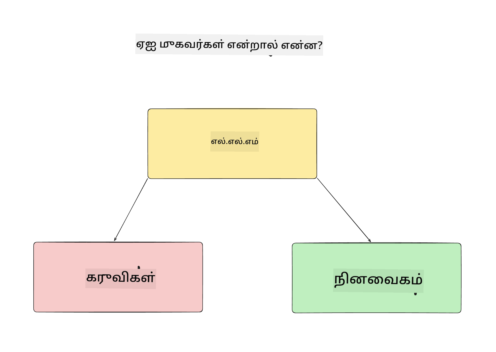
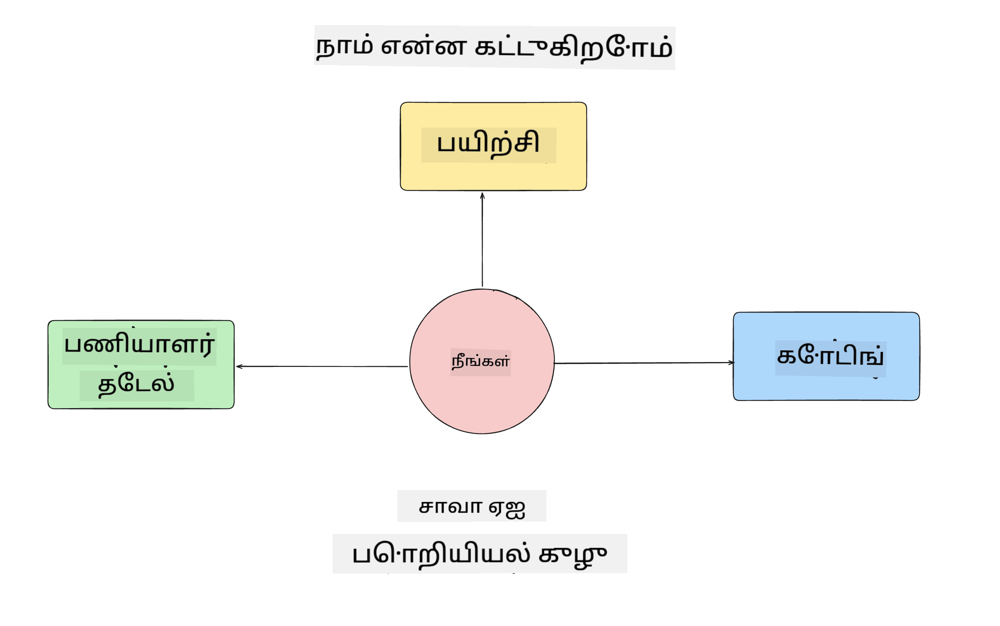
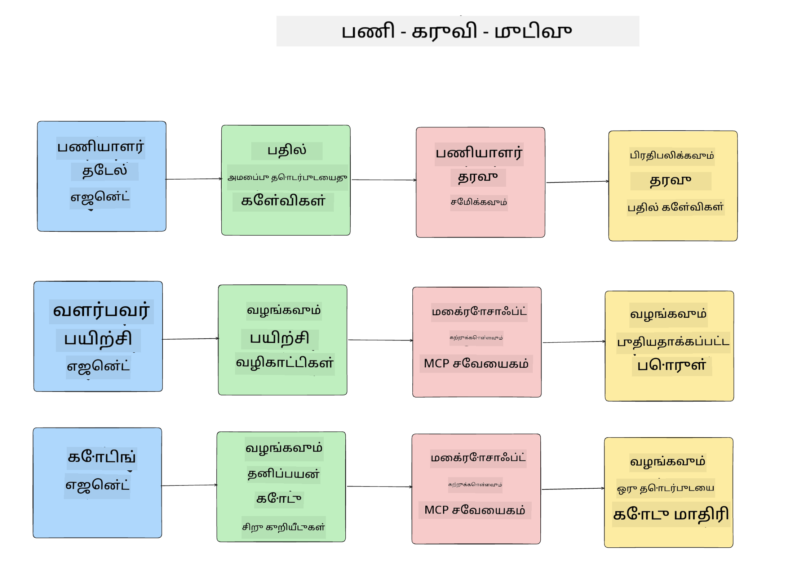
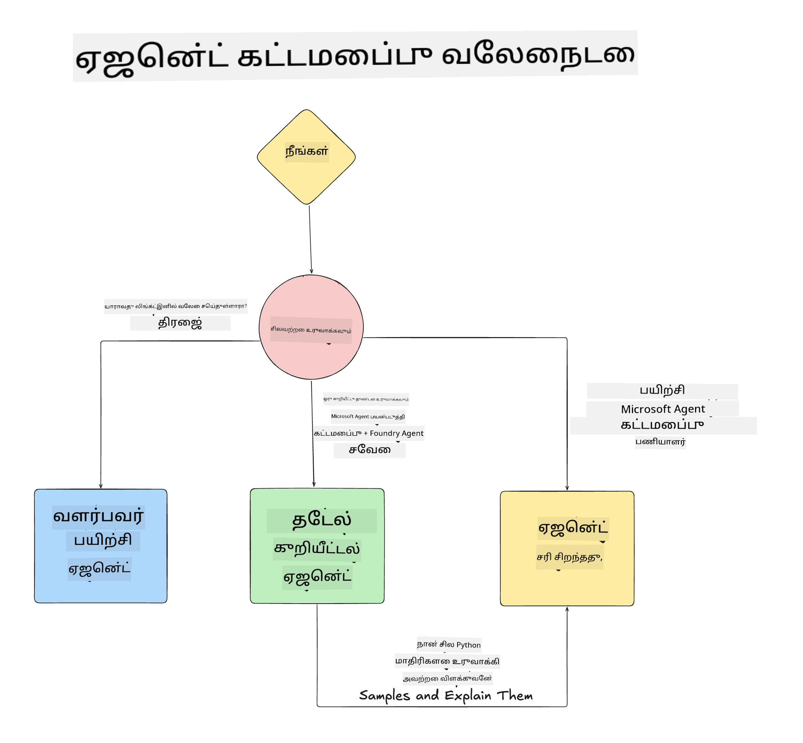

<!--
CO_OP_TRANSLATOR_METADATA:
{
  "original_hash": "99c07849641a850775c188c9333f31e5",
  "translation_date": "2025-12-12T18:45:00+00:00",
  "source_file": "lesson-1-agent-design/README.md",
  "language_code": "ta"
}
-->
# பாடம் 1: AI முகவர் வடிவமைப்பு

"பூஜ்ஜியத்திலிருந்து உற்பத்தி வரை AI முகவர்களை உருவாக்கும் பாடநெறி"யின் முதல் பாடத்திற்கு வரவேற்கிறோம்!

இந்த பாடத்தில் நாம் கையாளப்போகும் விஷயங்கள்:

- AI முகவர்கள் என்ன என்பதை வரையறுத்தல்
  
- நாம் உருவாக்கும் AI முகவர் பயன்பாட்டை விவாதித்தல்  

- ஒவ்வொரு முகவருக்கும் தேவையான கருவிகள் மற்றும் சேவைகளை அடையாளம் காண்தல்
  
- நமது முகவர் பயன்பாட்டை வடிவமைத்தல்
  
முகவர்கள் என்ன மற்றும் ஏன் நாம் அவற்றை ஒரு பயன்பாட்டில் பயன்படுத்த வேண்டும் என்பதை வரையறுத்தல் மூலம் தொடங்குவோம்.

## AI முகவர்கள் என்ன?

AI முகவர்களை எப்படி உருவாக்குவது என்பதை முதன்முறையாக ஆராயும் போது, AI முகவர் என்றால் என்ன என்பதை சரியாக வரையறுப்பதில் கேள்விகள் இருக்கலாம்.

AI முகவர் என்றால் என்ன என்பதை எளிதாக வரையறுப்பது அதன் கூறுகளின் மூலம்:

**பெரிய மொழி மாதிரி** - LLM பயனரிடமிருந்து இயற்கை மொழியை செயலாக்கும் திறனையும், அவர்கள் செய்ய விரும்பும் பணியை புரிந்துகொள்ளவும், அந்த பணிகளை முடிக்க கிடைக்கும் கருவிகளின் விளக்கங்களையும் புரிந்துகொள்ளும் திறனையும் வழங்கும்.

**கருவிகள்** - இவை செயல்பாடுகள், APIகள், தரவுத்தளங்கள் மற்றும் LLM பயன்படுத்தி பயனர் கோரிய பணிகளை முடிக்க தேர்வு செய்யக்கூடிய பிற சேவைகள் ஆகும்.

**நினைவகம்** - இது AI முகவருக்கும் பயனருக்கும் இடையேயான குறுகிய மற்றும் நீண்டகால தொடர்புகளை சேமிக்கும் முறையாகும். இந்த தகவலை சேமித்து மீட்டெடுப்பது மேம்பாடுகளைச் செய்யவும், பயனர் விருப்பங்களை காலத்தால் சேமிக்கவும் முக்கியம்.

## நமது AI முகவர் பயன்பாடு

இந்த பாடநெறிக்காக, நாங்கள் புதிய டெவலப்பர்களுக்கு நமது AI முகவர் மேம்பாட்டு குழுவில் சேர உதவும் ஒரு AI முகவர் பயன்பாட்டை உருவாக்கப்போகிறோம்!

எந்தவொரு மேம்பாட்டு பணியையும் செய்யும் முன், வெற்றிகரமான AI முகவர் பயன்பாட்டை உருவாக்குவதற்கான முதல் படி, பயனர்கள் எவ்வாறு நமது AI முகவர்களுடன் பணியாற்றுவார்கள் என்பதை தெளிவாகக் குறிப்பிடும் காட்சிகளை வரையறுத்தல் ஆகும்.

இந்த பயன்பாட்டிற்காக, நாம் பின்வரும் காட்சிகளுடன் பணியாற்றப்போகிறோம்:

**காட்சி 1**: ஒரு புதிய ஊழியர் நமது நிறுவனத்தில் சேர்ந்துவிட்டு, சேர்ந்த குழுவைப் பற்றி மேலும் அறிய விரும்புகிறார் மற்றும் அவர்களுடன் எப்படி தொடர்பு கொள்ள வேண்டும் என்பதைக் கேட்கிறார்.

**காட்சி 2:** ஒரு புதிய ஊழியர் துவங்க சிறந்த முதல் பணியை என்ன என்பதை அறிய விரும்புகிறார்.

**காட்சி 3:** ஒரு புதிய ஊழியர் இந்த பணியை முடிக்க உதவும் கற்றல் வளங்கள் மற்றும் குறியீட்டு மாதிரிகளை சேகரிக்க விரும்புகிறார்.

## கருவிகள் மற்றும் சேவைகளை அடையாளம் காண்தல்

இப்போது இந்த காட்சிகள் உருவாக்கப்பட்டுள்ளதால், அடுத்த படி அவற்றை நமது AI முகவர்கள் இந்த பணிகளை முடிக்க தேவையான கருவிகள் மற்றும் சேவைகளுடன் பொருத்துவது ஆகும்.

இந்த செயல்முறை Context Engineering என்ற பிரிவில் வருகிறது, ஏனெனில் நமது AI முகவர்கள் சரியான நேரத்தில் சரியான சூழலைப் பெறுவதை உறுதி செய்வதில் கவனம் செலுத்தப்போகிறோம்.

ஒவ்வொரு காட்சியையும் தனித்தனியாக செய்து, ஒவ்வொரு முகவரின் பணி, கருவிகள் மற்றும் எதிர்பார்க்கப்படும் முடிவுகளை பட்டியலிட்டு சிறந்த முகவர் வடிவமைப்பை செய்யலாம்.

### காட்சி 1 - ஊழியர் தேடல் முகவர்

**பணி** - நிறுவனத்தில் உள்ள ஊழியர்களின் சேர்க்கை தேதி, தற்போதைய குழு, இடம் மற்றும் கடைசி பதவி போன்ற கேள்விகளுக்கு பதில் அளித்தல்.

**கருவிகள்** - தற்போதைய ஊழியர் பட்டியல் மற்றும் நிறுவன வரைபடம் தரவுத்தளம்

**முடிவுகள்** - பொதுவான நிறுவன கேள்விகளுக்கும், ஊழியர்களைப் பற்றிய குறிப்பிட்ட கேள்விகளுக்கும் பதில் அளிக்க தரவுத்தளத்திலிருந்து தகவலை மீட்டெடுக்க முடியும்.

### காட்சி 2 - பணி பரிந்துரை முகவர்

**பணி** - புதிய ஊழியரின் டெவலப்பர் அனுபவத்தின் அடிப்படையில், புதிய ஊழியர் செய்யக்கூடிய 1-3 பிரச்சனைகளை பரிந்துரைக்க.

**கருவிகள்** - திறந்த பிரச்சனைகளைப் பெற GitHub MCP சர்வர் மற்றும் டெவலப்பர் சுயவிவரத்தை உருவாக்குதல்

**முடிவுகள்** - GitHub சுயவிவரத்தின் கடைசி 5 கமிட்களை மற்றும் GitHub திட்டத்தில் திறந்த பிரச்சனைகளைப் படித்து பொருத்தமான பரிந்துரைகளை வழங்க முடியும்.

### காட்சி 3 - குறியீட்டு உதவியாளர் முகவர்

**பணி** - "பணி பரிந்துரை" முகவரால் பரிந்துரைக்கப்பட்ட திறந்த பிரச்சனைகளின் அடிப்படையில், ஊழியருக்கு உதவும் வளங்கள் மற்றும் குறியீட்டு துணுக்குகளை ஆராய்ந்து வழங்குதல்.

**கருவிகள்** - வளங்களை கண்டறிய Microsoft Learn MCP மற்றும் தனிப்பயன் குறியீட்டு துணுக்குகளை உருவாக்க Code Interpreter.

**முடிவுகள்** - பயனர் கூடுதல் உதவியை கேட்கும்போது, வேலைநடை Learn MCP சர்வரைப் பயன்படுத்தி வளங்களுக்கான இணைப்புகள் மற்றும் துணுக்குகளை வழங்கி, பின்னர் Code Interpreter முகவருக்கு கையளித்து சிறிய குறியீட்டு துணுக்குகளை விளக்கங்களுடன் உருவாக்கும்.

## நமது முகவர் பயன்பாட்டை வடிவமைத்தல்

இப்போது ஒவ்வொரு முகவரையும் வரையறுத்துள்ளதால், ஒவ்வொரு முகவரும் பணியைப் பொறுத்து ஒன்றாகவும் தனித்தனியாகவும் எப்படி செயல்படுவார்கள் என்பதை புரிந்துகொள்ள உதவும் கட்டமைப்பு வரைபடத்தை உருவாக்குவோம்:

## அடுத்த படிகள்

இப்போது நமது ஒவ்வொரு முகவரையும் மற்றும் முகவர் அமைப்பையும் வடிவமைத்துள்ளோம், அடுத்த பாடத்திற்கு செல்லலாம், அங்கு நாம் இந்த முகவர்களை ஒவ்வொன்றாக உருவாக்கப்போகிறோம்!

---

<!-- CO-OP TRANSLATOR DISCLAIMER START -->
**குறிப்பு**:  
இந்த ஆவணம் AI மொழிபெயர்ப்பு சேவை [Co-op Translator](https://github.com/Azure/co-op-translator) மூலம் மொழிபெயர்க்கப்பட்டுள்ளது. நாங்கள் துல்லியத்திற்காக முயற்சித்தாலும், தானியங்கி மொழிபெயர்ப்புகளில் பிழைகள் அல்லது தவறுகள் இருக்கக்கூடும் என்பதை தயவுசெய்து கவனிக்கவும். அசல் ஆவணம் அதன் சொந்த மொழியில் அதிகாரப்பூர்வ மூலமாக கருதப்பட வேண்டும். முக்கியமான தகவல்களுக்கு, தொழில்முறை மனித மொழிபெயர்ப்பை பரிந்துரைக்கிறோம். இந்த மொழிபெயர்ப்பின் பயன்பாட்டால் ஏற்படும் எந்த தவறான புரிதல்கள் அல்லது தவறான விளக்கங்களுக்கும் நாங்கள் பொறுப்பேற்கமாட்டோம்.
<!-- CO-OP TRANSLATOR DISCLAIMER END -->