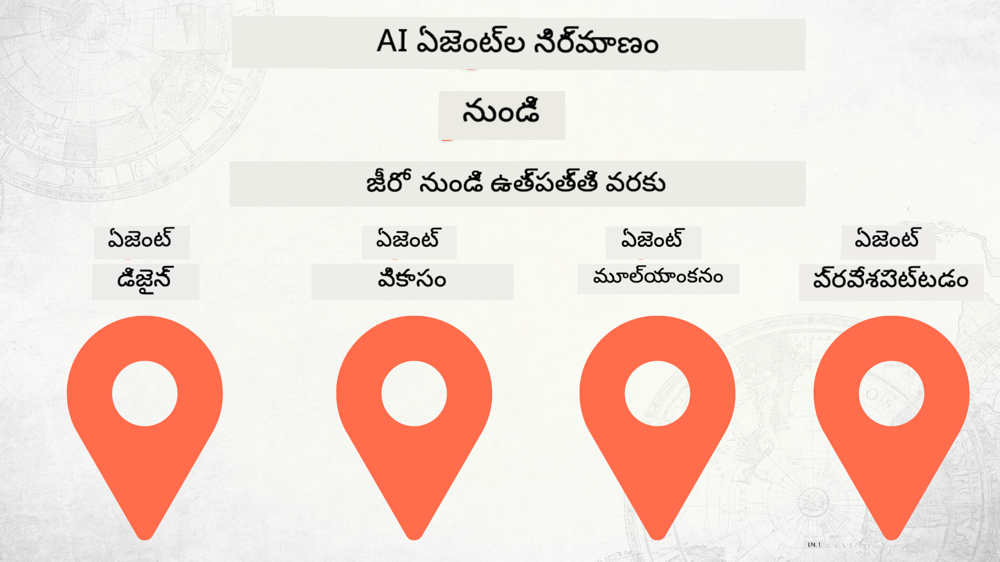

<!--
CO_OP_TRANSLATOR_METADATA:
{
  "original_hash": "df86a71d9a4a65d134d60f783a2aba86",
  "translation_date": "2025-12-18T14:49:23+00:00",
  "source_file": "README.md",
  "language_code": "te"
}
-->
# జీరో నుండి ప్రొడక్షన్ వరకు AI ఏజెంట్ల నిర్మాణం

### 🌐 బహుభాషా మద్దతు

#### GitHub యాక్షన్ ద్వారా మద్దతు (ఆటోమేటెడ్ & ఎప్పుడూ తాజా)

<!-- CO-OP TRANSLATOR LANGUAGES TABLE START -->
[Arabic](../ar/README.md) | [Bengali](../bn/README.md) | [Bulgarian](../bg/README.md) | [Burmese (Myanmar)](../my/README.md) | [Chinese (Simplified)](../zh/README.md) | [Chinese (Traditional, Hong Kong)](../hk/README.md) | [Chinese (Traditional, Macau)](../mo/README.md) | [Chinese (Traditional, Taiwan)](../tw/README.md) | [Croatian](../hr/README.md) | [Czech](../cs/README.md) | [Danish](../da/README.md) | [Dutch](../nl/README.md) | [Estonian](../et/README.md) | [Finnish](../fi/README.md) | [French](../fr/README.md) | [German](../de/README.md) | [Greek](../el/README.md) | [Hebrew](../he/README.md) | [Hindi](../hi/README.md) | [Hungarian](../hu/README.md) | [Indonesian](../id/README.md) | [Italian](../it/README.md) | [Japanese](../ja/README.md) | [Kannada](../kn/README.md) | [Korean](../ko/README.md) | [Lithuanian](../lt/README.md) | [Malay](../ms/README.md) | [Malayalam](../ml/README.md) | [Marathi](../mr/README.md) | [Nepali](../ne/README.md) | [Nigerian Pidgin](../pcm/README.md) | [Norwegian](../no/README.md) | [Persian (Farsi)](../fa/README.md) | [Polish](../pl/README.md) | [Portuguese (Brazil)](../br/README.md) | [Portuguese (Portugal)](../pt/README.md) | [Punjabi (Gurmukhi)](../pa/README.md) | [Romanian](../ro/README.md) | [Russian](../ru/README.md) | [Serbian (Cyrillic)](../sr/README.md) | [Slovak](../sk/README.md) | [Slovenian](../sl/README.md) | [Spanish](../es/README.md) | [Swahili](../sw/README.md) | [Swedish](../sv/README.md) | [Tagalog (Filipino)](../tl/README.md) | [Tamil](../ta/README.md) | [Telugu](./README.md) | [Thai](../th/README.md) | [Turkish](../tr/README.md) | [Ukrainian](../uk/README.md) | [Urdu](../ur/README.md) | [Vietnamese](../vi/README.md)
<!-- CO-OP TRANSLATOR LANGUAGES TABLE END -->

## AI ఏజెంట్ అభివృద్ధి జీవనచక్రం యొక్క ప్రాథమికాంశాలను నేర్పించే కోర్సు

## 🌱 ప్రారంభించడం

ఈ కోర్సు AI ఏజెంట్లను నిర్మించడం మరియు డిప్లాయ్ చేయడం యొక్క ప్రాథమికాంశాలను కవర్ చేసే పాఠాలు కలిగి ఉంది.

ప్రతి పాఠం మునుపటి పాఠంపై ఆధారపడి ఉంటుంది, కాబట్టి మేము ప్రారంభం నుండి మొదలు పెట్టి చివరి వరకు కొనసాగాలని సిఫార్సు చేస్తాము.

మీకు AI ఏజెంట్ విషయాల గురించి మరింత తెలుసుకోవాలనుకుంటే, మీరు [AI Agents For Beginners Course](https://aka.ms/ai-agents-beginners) ను చూడవచ్చు.

### ఇతర అభ్యాసకులను కలవండి, మీ ప్రశ్నలకు సమాధానాలు పొందండి

మీరు ఇబ్బంది పడితే లేదా AI ఏజెంట్ల నిర్మాణం గురించి ఏవైనా ప్రశ్నలు ఉంటే, మా ప్రత్యేక Discord ఛానెల్‌లో చేరండి [Microsoft Foundry Discord](https://discord.gg/Kuaw3ktsu6).

### మీకు కావలసినవి

ప్రతి పాఠానికి దాని స్వంత కోడ్ నమూనా ఉంటుంది, మీరు స్థానికంగా నడపవచ్చు. మీరు [ఈ రిపోను ఫోర్క్](https://github.com/microsoft/Building-AI-Agents-From-Zero-To-Production/fork) చేసి మీ స్వంత కాపీ సృష్టించవచ్చు.

ఈ కోర్సు ప్రస్తుతం క్రింది వాటిని ఉపయోగిస్తుంది:

- [Microsoft Agent Framework (MAF)](https://aka.ms/ai-agents-beginners/agent-framework)
- [Microsoft Foundry](https://azure.microsoft.com/products/ai-foundry)
- [Azure OpenAI Service](https://azure.microsoft.com/products/ai-foundry/models/openai)
- [Azure CLI](https://learn.microsoft.com/cli/azure/authenticate-azure-cli?view=azure-cli-latest)

ప్రారంభించే ముందు మీరు ఈ సేవలకు యాక్సెస్ కలిగి ఉన్నారని నిర్ధారించుకోండి.

మోడల్ హోస్టింగ్ మరియు సేవల గురించి మరిన్ని ఎంపికలు త్వరలో అందుబాటులోకి వస్తాయి.

## 🗃️ పాఠాలు

| **పాఠం**         | **వివరణ**                                                                                  |
|--------------------|--------------------------------------------------------------------------------------------------|
| [ఏజెంట్ డిజైన్](./lesson-1-agent-design/README.md)       | మా "డెవలపర్ ఆన్‌బోర్డింగ్" ఏజెంట్ ఉపయోగ కేసు పరిచయం మరియు సమర్థవంతమైన ఏజెంట్లను ఎలా డిజైన్ చేయాలో |
| [ఏజెంట్ అభివృద్ధి](./lesson-2-agent-development/README.md)  | Microsoft Agent Framework (MAF) ఉపయోగించి, కొత్త డెవలపర్లను ఆన్‌బోర్డ్ చేయడానికి 3 ఏజెంట్లను సృష్టించండి.       |
| [ఏజెంట్ మూల్యాంకనాలు](./lesson-3-agent-evals/README.md)  | Microsoft Foundry ఉపయోగించి, మా AI ఏజెంట్లు ఎంత బాగా పనిచేస్తున్నాయో మరియు వాటిని ఎలా మెరుగుపరచాలో తెలుసుకోండి. |
| [ఏజెంట్ డిప్లాయ్‌మెంట్](./lesson-4-agent-deployment/README.md)   | హోస్టెడ్ ఏజెంట్లు మరియు OpenAI చాట్‌కిట్ ఉపయోగించి, AI ఏజెంట్‌ను ప్రొడక్షన్‌లో ఎలా డిప్లాయ్ చేయాలో చూడండి.       |

## సహకారం

ఈ ప్రాజెక్ట్ సహకారాలు మరియు సూచనలను స్వాగతిస్తుంది. చాలా సహకారాలు మీరు ఒక
కాంట్రిబ్యూటర్ లైసెన్స్ అగ్రిమెంట్ (CLA) కు అంగీకరించాల్సి ఉంటుంది, ఇది మీరు మీ కాంట్రిబ్యూషన్ ఉపయోగించడానికి హక్కు కలిగి ఉన్నారని మరియు నిజంగా హక్కులు ఇస్తున్నారని ప్రకటిస్తుంది. వివరాలకు, <https://cla.opensource.microsoft.com> ను సందర్శించండి.

మీరు పుల్ రిక్వెస్ట్ సమర్పించినప్పుడు, CLA బాట్ ఆటోమేటిక్‌గా మీరు CLA అందించాల్సిన అవసరం ఉందో లేదో నిర్ణయించి PR ను సరైన విధంగా అలంకరించును (ఉదా: స్థితి తనిఖీ, వ్యాఖ్య). బాట్ ఇచ్చిన సూచనలను అనుసరించండి. మా CLA ఉపయోగించే అన్ని రిపోస్‌లో మీరు ఈ ప్రక్రియను ఒక్కసారి మాత్రమే చేయాలి.

ఈ ప్రాజెక్ట్ [Microsoft Open Source Code of Conduct](https://opensource.microsoft.com/codeofconduct/) ను అనుసరిస్తుంది.
మరింత సమాచారం కోసం [Code of Conduct FAQ](https://opensource.microsoft.com/codeofconduct/faq/) చూడండి లేదా
ఏవైనా అదనపు ప్రశ్నలు లేదా వ్యాఖ్యల కోసం [opencode@microsoft.com](mailto:opencode@microsoft.com) ను సంప్రదించండి.

## ట్రేడ్మార్కులు

ఈ ప్రాజెక్ట్ ప్రాజెక్టులు, ఉత్పత్తులు లేదా సేవల కోసం ట్రేడ్మార్కులు లేదా లోగోలు కలిగి ఉండవచ్చు. Microsoft ట్రేడ్మార్కులు లేదా లోగోల అధికారిక ఉపయోగం [Microsoft's Trademark & Brand Guidelines](https://www.microsoft.com/legal/intellectualproperty/trademarks/usage/general) ను అనుసరించాలి.
Microsoft ట్రేడ్మార్కులు లేదా లోగోలను ఈ ప్రాజెక్ట్ యొక్క సవరించిన సంస్కరణలలో ఉపయోగించడం Microsoft స్పాన్సర్షిప్ కలిగినట్టు గందరగోళం కలిగించకూడదు.
మూడవ పక్ష ట్రేడ్మార్కులు లేదా లోగోల ఏవైనా ఉపయోగం ఆ మూడవ పక్షాల విధానాలకు అనుగుణంగా ఉండాలి.

## సహాయం పొందడం

మీరు ఇబ్బంది పడితే లేదా AI యాప్స్ నిర్మాణం గురించి ఏవైనా ప్రశ్నలు ఉంటే, చేరండి:

ఉత్పత్తి అభిప్రాయం లేదా నిర్మాణంలో లోపాలు ఉంటే సందర్శించండి:

---

<!-- CO-OP TRANSLATOR DISCLAIMER START -->
**అస్పష్టత**:  
ఈ పత్రాన్ని AI అనువాద సేవ [Co-op Translator](https://github.com/Azure/co-op-translator) ఉపయోగించి అనువదించబడింది. మేము ఖచ్చితత్వానికి ప్రయత్నించినప్పటికీ, ఆటోమేటెడ్ అనువాదాల్లో పొరపాట్లు లేదా తప్పిదాలు ఉండవచ్చు. మూల పత్రం దాని స్వదేశీ భాషలోనే అధికారిక మూలంగా పరిగణించాలి. ముఖ్యమైన సమాచారానికి, ప్రొఫెషనల్ మానవ అనువాదం సిఫార్సు చేయబడుతుంది. ఈ అనువాదం వాడకంలో ఏర్పడిన ఏవైనా అపార్థాలు లేదా తప్పుదారుల కోసం మేము బాధ్యత వహించము.
<!-- CO-OP TRANSLATOR DISCLAIMER END -->