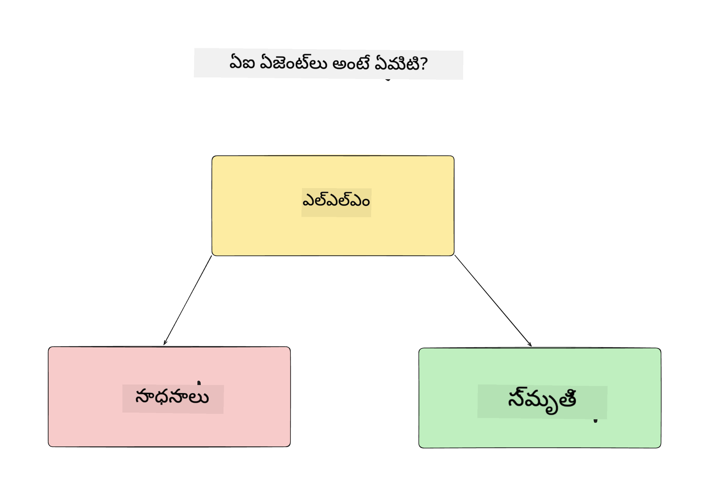
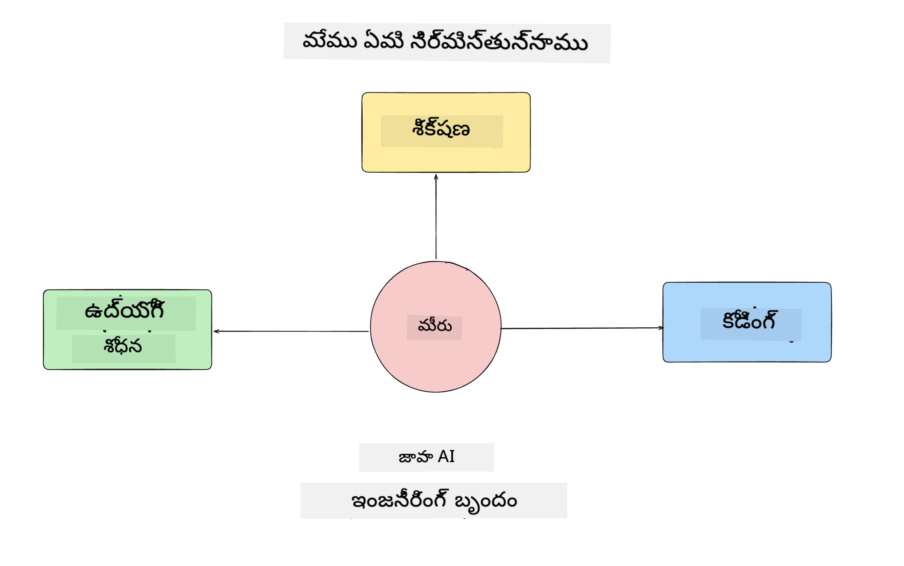
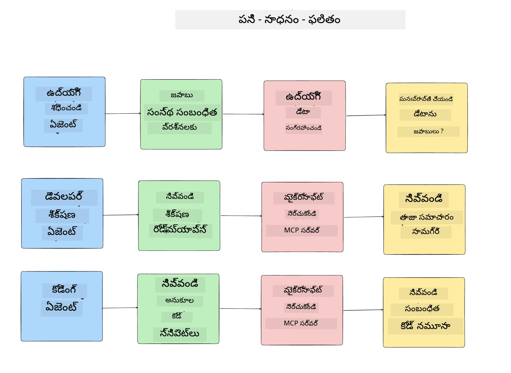
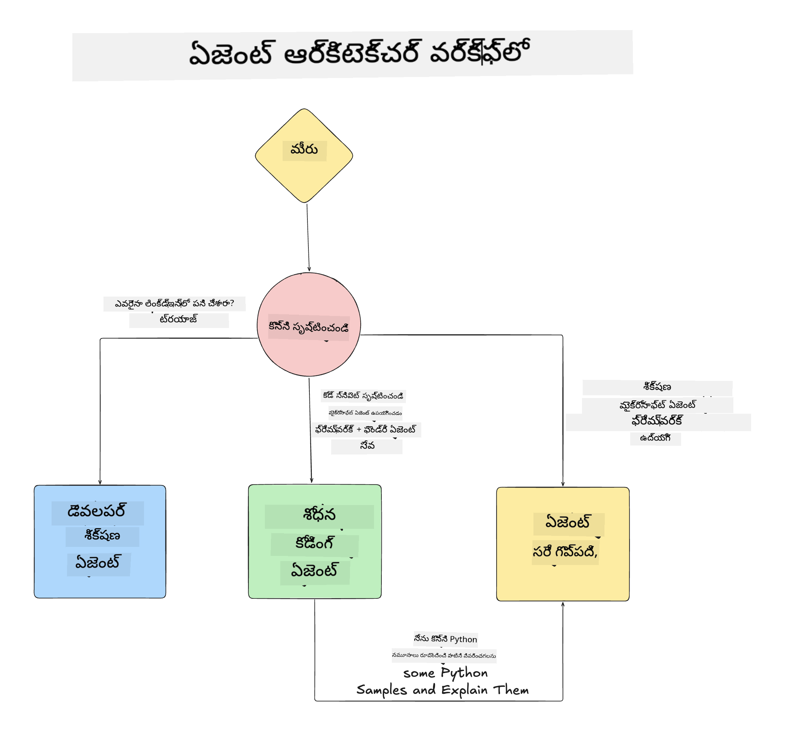

<!--
CO_OP_TRANSLATOR_METADATA:
{
  "original_hash": "99c07849641a850775c188c9333f31e5",
  "translation_date": "2025-12-12T18:46:40+00:00",
  "source_file": "lesson-1-agent-design/README.md",
  "language_code": "te"
}
-->
# పాఠం 1: AI ఏజెంట్ డిజైన్

"జీరో నుండి ప్రొడక్షన్ వరకు AI ఏజెంట్ నిర్మాణం కోర్సు" యొక్క మొదటి పాఠానికి స్వాగతం!

ఈ పాఠంలో మనం కవర్ చేయబోతున్నవి:

- AI ఏజెంట్లు ఏమిటి అనేది నిర్వచించడం
  
- మనం నిర్మిస్తున్న AI ఏజెంట్ అప్లికేషన్ గురించి చర్చించడం  

- ప్రతి ఏజెంట్ కోసం అవసరమైన టూల్స్ మరియు సర్వీసులను గుర్తించడం
  
- మన ఏజెంట్ అప్లికేషన్ ఆర్కిటెక్చర్ చేయడం
  
ముందుగా ఏజెంట్ అంటే ఏమిటి మరియు మనం వాటిని అప్లికేషన్ లో ఎందుకు ఉపయోగిస్తామో నిర్వచించుకుందాం.

## AI ఏజెంట్లు ఏమిటి?

మీకు AI ఏజెంట్ ఎలా నిర్మించాలో మొదటిసారి అన్వేషిస్తున్నట్లయితే, AI ఏజెంట్ అంటే ఏమిటి అనేది ఖచ్చితంగా నిర్వచించడంలో మీకు ప్రశ్నలు ఉండవచ్చు.

AI ఏజెంట్ అంటే ఏమిటి అనేది సులభంగా నిర్వచించడానికి దాని భాగాలు:

**లార్జ్ లాంగ్వేజ్ మోడల్** - LLM యూజర్ నుండి సహజ భాషను ప్రాసెస్ చేయగల సామర్థ్యాన్ని అందిస్తుంది, వారు పూర్తి చేయదలచిన పనిని అర్థం చేసుకోవడానికి మరియు ఆ పనులను పూర్తి చేయడానికి అందుబాటులో ఉన్న టూల్స్ వివరణలను అర్థం చేసుకోవడానికి.

**టూల్స్** - ఇవి ఫంక్షన్లు, APIs, డేటా స్టోర్స్ మరియు ఇతర సర్వీసులు, LLM వాటిని ఎంచుకుని యూజర్ అభ్యర్థించిన పనులను పూర్తి చేయడానికి ఉపయోగించగలదు.

**మెమరీ** - ఇది AI ఏజెంట్ మరియు యూజర్ మధ్య ఉన్న తాత్కాలిక మరియు దీర్ఘకాలిక పరస్పర చర్యలను నిల్వ చేయడం. ఈ సమాచారాన్ని నిల్వ చేసి తిరిగి పొందడం మెరుగుదలలు చేయడానికి మరియు యూజర్ ప్రాధాన్యతలను కాలక్రమేణా సేవ్ చేయడానికి ముఖ్యం.

## మన AI ఏజెంట్ ఉపయోగ కేసు

ఈ కోర్సు కోసం, మనం కొత్త డెవలపర్లను మన AI ఏజెంట్ డెవలప్‌మెంట్ టీమ్‌లో చేరడంలో సహాయపడే AI ఏజెంట్ అప్లికేషన్‌ను నిర్మించబోతున్నాము!

ఏ డెవలప్‌మెంట్ పని చేయకముందు, విజయవంతమైన AI ఏజెంట్ అప్లికేషన్ సృష్టించడానికి మొదటి దశ, మన యూజర్లు మన AI ఏజెంట్లతో ఎలా పని చేయాలని ఆశిస్తున్నామో స్పష్టమైన సన్నివేశాలను నిర్వచించడం.

ఈ అప్లికేషన్ కోసం, మనం ఈ సన్నివేశాలతో పని చేస్తాము:

**సన్నివేశం 1**: ఒక కొత్త ఉద్యోగి మన సంస్థలో చేరి, వారు చేరిన టీమ్ గురించి మరియు వారితో ఎలా కనెక్ట్ కావాలో తెలుసుకోవాలనుకుంటున్నారు.

**సన్నివేశం 2:** ఒక కొత్త ఉద్యోగి మొదటి పని ఏది మొదలుపెట్టడం ఉత్తమమో తెలుసుకోవాలనుకుంటున్నారు.

**సన్నివేశం 3:** ఒక కొత్త ఉద్యోగి ఈ పనిని పూర్తి చేయడానికి సహాయపడే నేర్చుకునే వనరులు మరియు కోడ్ నమూనాలను సేకరించాలనుకుంటున్నారు.

## టూల్స్ మరియు సర్వీసులను గుర్తించడం

ఇప్పుడు మనకు ఈ సన్నివేశాలు ఉన్నందున, తదుపరి దశ వాటిని మన AI ఏజెంట్లు ఈ పనులను పూర్తి చేయడానికి అవసరమైన టూల్స్ మరియు సర్వీసులకు మ్యాప్ చేయడం.

ఈ ప్రక్రియ కాంటెక్స్ట్ ఇంజనీరింగ్ విభాగంలో వస్తుంది, ఎందుకంటే మన AI ఏజెంట్లు సరైన సమయంలో సరైన కాంటెక్స్ట్ కలిగి ఉండేలా చూసుకోవడమే మన దృష్టి.

ప్రతి సన్నివేశం ప్రకారం ఈ పని చేద్దాం మరియు ప్రతి ఏజెంట్ యొక్క పని, టూల్స్ మరియు ఆశించిన ఫలితాలను జాబితా చేయడం ద్వారా మంచి ఏజెంటిక్ డిజైన్ చేయండి.

### సన్నివేశం 1 - ఉద్యోగి శోధన ఏజెంట్

**పని** - సంస్థలో ఉద్యోగుల గురించి ప్రశ్నలకు జవాబివ్వడం, ఉదాహరణకు చేరిన తేదీ, ప్రస్తుత టీమ్, స్థానం మరియు చివరి స్థానం.

**టూల్స్** - ప్రస్తుత ఉద్యోగుల జాబితా మరియు సంస్థ చార్ట్ డేటాస్టోర్

**ఫలితాలు** - సాధారణ సంస్థ సంబంధిత ప్రశ్నలకు మరియు ఉద్యోగుల గురించి ప్రత్యేక ప్రశ్నలకు డేటాస్టోర్ నుండి సమాచారం పొందగలగడం.

### సన్నివేశం 2 - పని సిఫార్సు ఏజెంట్

**పని** - కొత్త ఉద్యోగి యొక్క డెవలపర్ అనుభవం ఆధారంగా, కొత్త ఉద్యోగి పని చేయగల 1-3 సమస్యలను సూచించడం.

**టూల్స్** - GitHub MCP సర్వర్ నుండి ఓపెన్ ఇష్యూలను పొందడం మరియు డెవలపర్ ప్రొఫైల్ నిర్మించడం

**ఫలితాలు** - GitHub ప్రొఫైల్ యొక్క చివరి 5 కమిట్లను చదవగలగడం మరియు GitHub ప్రాజెక్ట్ పై ఓపెన్ ఇష్యూలను చదివి సరిపోలిక ఆధారంగా సిఫార్సులు చేయగలగడం.

### సన్నివేశం 3 - కోడ్ అసిస్టెంట్ ఏజెంట్

**పని** - "పని సిఫార్సు" ఏజెంట్ సూచించిన ఓపెన్ ఇష్యూల ఆధారంగా, పరిశోధన చేసి వనరులు అందించడం మరియు ఉద్యోగికి సహాయపడే కోడ్ స్నిపెట్లను రూపొందించడం.

**టూల్స్** - Microsoft Learn MCP వనరులు కనుగొనడానికి మరియు కోడ్ ఇంటర్ప్రెటర్ కస్టమ్ కోడ్ స్నిపెట్లను రూపొందించడానికి.

**ఫలితాలు** - యూజర్ అదనపు సహాయం కోరితే, వర్క్‌ఫ్లో Learn MCP సర్వర్ ఉపయోగించి వనరులకు లింకులు మరియు స్నిపెట్లను అందించి, తరువాత కోడ్ ఇంటర్ప్రెటర్ ఏజెంట్‌కు హ్యాండాఫ్ చేసి చిన్న కోడ్ స్నిపెట్లను వివరణలతో రూపొందించడం.

## మన ఏజెంట్ అప్లికేషన్ ఆర్కిటెక్చర్

ఇప్పుడు మనం ప్రతి ఏజెంట్‌ను నిర్వచించుకున్నందున, ప్రతి ఏజెంట్ పని ఎలా కలిసి మరియు వేర్వేరు పని చేస్తుందో అర్థం చేసుకోవడానికి ఆర్కిటెక్చర్ డయాగ్రామ్ సృష్టిద్దాం:

## తదుపరి దశలు

ఇప్పుడు మనం ప్రతి ఏజెంట్ మరియు మన ఏజెంటిక్ సిస్టమ్ డిజైన్ చేశాము, తదుపరి పాఠానికి వెళ్లి ఈ ఏజెంట్లను అభివృద్ధి చేద్దాం!

---

<!-- CO-OP TRANSLATOR DISCLAIMER START -->
**అస్పష్టత**:  
ఈ పత్రాన్ని AI అనువాద సేవ [Co-op Translator](https://github.com/Azure/co-op-translator) ఉపయోగించి అనువదించబడింది. మేము ఖచ్చితత్వానికి ప్రయత్నించినప్పటికీ, ఆటోమేటెడ్ అనువాదాల్లో పొరపాట్లు లేదా తప్పిదాలు ఉండవచ్చు. అసలు పత్రం దాని స్వదేశీ భాషలోనే అధికారిక మూలంగా పరిగణించాలి. ముఖ్యమైన సమాచారానికి, ప్రొఫెషనల్ మానవ అనువాదం చేయించుకోవడం మంచిది. ఈ అనువాదం వలన కలిగే ఏవైనా అపార్థాలు లేదా తప్పుదారుల బాధ్యత మేము తీసుకోము.
<!-- CO-OP TRANSLATOR DISCLAIMER END -->