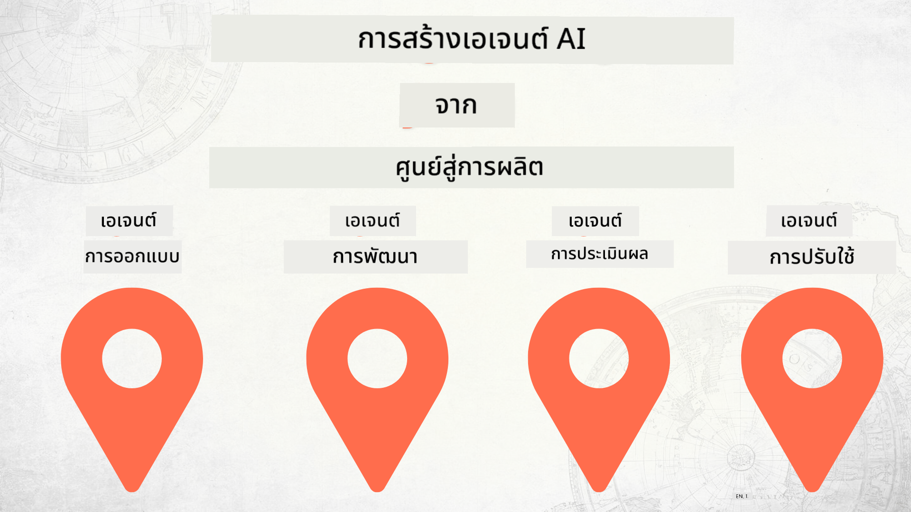

<!--
CO_OP_TRANSLATOR_METADATA:
{
  "original_hash": "73b37a335747d59d319b00aac130f073",
  "translation_date": "2025-12-24T23:25:46+00:00",
  "source_file": "README.md",
  "language_code": "th"
}
-->
# การสร้างเอเจนต์ AI ตั้งแต่ศูนย์จนถึงการใช้งานจริง

### 🌐 รองรับหลายภาษา

#### รองรับผ่าน GitHub Action (อัตโนมัติ & อัปเดตอยู่เสมอ)

<!-- CO-OP TRANSLATOR LANGUAGES TABLE START -->
[อาหรับ](../ar/README.md) | [เบงกาลี](../bn/README.md) | [บัลแกเรีย](../bg/README.md) | [พม่า (เมียนมา)](../my/README.md) | [จีน (ตัวย่อ)](../zh/README.md) | [จีน (ตัวเต็ม, ฮ่องกง)](../hk/README.md) | [จีน (ตัวเต็ม, มาเก๊า)](../mo/README.md) | [จีน (ตัวเต็ม, ไต้หวัน)](../tw/README.md) | [โครเอเชีย](../hr/README.md) | [เช็ก](../cs/README.md) | [เดนมาร์ก](../da/README.md) | [ดัตช์](../nl/README.md) | [เอสโตเนีย](../et/README.md) | [ฟินแลนด์](../fi/README.md) | [ฝรั่งเศส](../fr/README.md) | [เยอรมัน](../de/README.md) | [กรีก](../el/README.md) | [ฮีบรู](../he/README.md) | [ฮินดี](../hi/README.md) | [ฮังการี](../hu/README.md) | [อินโดนีเซีย](../id/README.md) | [อิตาลี](../it/README.md) | [ญี่ปุ่น](../ja/README.md) | [กันนาดา](../kn/README.md) | [เกาหลี](../ko/README.md) | [ลิทัวเนีย](../lt/README.md) | [มาเลย์](../ms/README.md) | [มาลายาลัม](../ml/README.md) | [มราฐี](../mr/README.md) | [เนปาลี](../ne/README.md) | [ไนจีเรีย พิดจิน](../pcm/README.md) | [นอร์เวย์](../no/README.md) | [เปอร์เซีย (ฟาร์ซี)](../fa/README.md) | [โปแลนด์](../pl/README.md) | [โปรตุเกส (บราซิล)](../br/README.md) | [โปรตุเกส (โปรตุเกส)](../pt/README.md) | [ปัญจาบี (กุรมุกี)](../pa/README.md) | [โรมาเนีย](../ro/README.md) | [รัสเซีย](../ru/README.md) | [เซอร์เบีย (คิริลลิก)](../sr/README.md) | [สโลวัก](../sk/README.md) | [สโลวีเนีย](../sl/README.md) | [สเปน](../es/README.md) | [สวาฮีลี](../sw/README.md) | [สวีเดน](../sv/README.md) | [ตากาล็อก (ฟิลิปปินส์)](../tl/README.md) | [ทมิฬ](../ta/README.md) | [เทลูกู](../te/README.md) | [ไทย](./README.md) | [ตุรกี](../tr/README.md) | [ยูเครน](../uk/README.md) | [อูรดู](../ur/README.md) | [เวียดนาม](../vi/README.md)
<!-- CO-OP TRANSLATOR LANGUAGES TABLE END -->

## คอร์สสอนพื้นฐานของวงจรการพัฒนาเอเจนต์ AI

## 🌱 เริ่มต้นใช้งาน

คอร์สนี้มีบทเรียนที่ครอบคลุมพื้นฐานของการสร้างและปรับใช้งานเอเจนต์ AI

แต่ละบทเรียนต่อยอดจากบทก่อนหน้า ดังนั้นเราขอแนะนำให้เริ่มจากตอนต้นและทำตามลำดับจนจบ

หากคุณต้องการสำรวจหัวข้อเกี่ยวกับเอเจนต์ AI เพิ่มเติม คุณสามารถดูที่ [คอร์ส AI Agents สำหรับผู้เริ่มต้น](https://aka.ms/ai-agents-beginners).

### พบผู้เรียนคนอื่น ๆ และรับคำตอบสำหรับคำถามของคุณ

หากคุณติดขัดหรือมีคำถามเกี่ยวกับการสร้างเอเจนต์ AI เข้าร่วมช่อง Discord เฉพาะของเราใน [Discord ของ Microsoft Foundry](https://discord.gg/Kuaw3ktsu6).

### สิ่งที่คุณต้องมี

แต่ละบทเรียนมีตัวอย่างโค้ดที่คุณสามารถรันได้ในเครื่องของคุณเอง คุณสามารถ [fork รีโปนี้](https://github.com/microsoft/Building-AI-Agents-From-Zero-To-Production/fork) เพื่อสร้างสำเนาของคุณเอง

คอร์สนี้ปัจจุบันใช้สิ่งต่อไปนี้:

- [Microsoft Agent Framework (MAF)](https://aka.ms/ai-agents-beginners/agent-framework)
- [Microsoft Foundry](https://azure.microsoft.com/products/ai-foundry)
- [Azure OpenAI Service](https://azure.microsoft.com/products/ai-foundry/models/openai)
- [Azure CLI](https://learn.microsoft.com/cli/azure/authenticate-azure-cli?view=azure-cli-latest)

โปรดตรวจสอบว่าคุณมีสิทธิ์เข้าถึงบริการเหล่านี้ก่อนเริ่มต้น

ตัวเลือกเพิ่มเติมเกี่ยวกับการโฮสต์โมเดลและบริการจะตามมาเร็วๆ นี้。 

## 🗃️ บทเรียน

| **บทเรียน**         | **คำอธิบาย**                                                                                  |
|--------------------|--------------------------------------------------------------------------------------------------|
| [การออกแบบเอเจนต์](./lesson-1-agent-design/README.md)       | บทนำสู่กรณีการใช้งาน "Developer Onboarding" ของเรา และวิธีการออกแบบเอเจนต์ให้มีประสิทธิภาพ  |
| [การพัฒนาเอเจนต์](./lesson-2-agent-development/README.md)  | ใช้ Microsoft Agent Framework (MAF) สร้างเอเจนต์ 3 ตัวเพื่อช่วยผู้พัฒนามือใหม่ในการเริ่มต้นใช้งาน       |
| [การประเมินเอเจนต์](./lesson-3-agent-evals/README.md)  | ใช้ Microsoft Foundry วิเคราะห์ประสิทธิภาพของเอเจนต์ AI ของเราและวิธีปรับปรุง |
| [การปรับใช้เอเจนต์](./lesson-4-agent-deployment/README.md)   | ใช้ Hosted Agents และ OpenAI Chatkit ดูวิธีปรับใช้เอเจนต์ AI สู่การใช้งานจริง       |

## 🎒 หลักสูตรอื่น ๆ

ทีมของเราผลิตหลักสูตรอื่น ๆ! ดูได้ที่:

<!-- CO-OP TRANSLATOR OTHER COURSES START -->
### LangChain

---

### Azure / Edge / MCP / Agents

---
 
### ชุด Generative AI

[-9333EA?style=for-the-badge&labelColor=E5E7EB&color=9333EA)](https://github.com/microsoft/Generative-AI-for-beginners-dotnet?WT.mc_id=academic-105485-koreyst)
[-C084FC?style=for-the-badge&labelColor=E5E7EB&color=C084FC)](https://github.com/microsoft/generative-ai-for-beginners-java?WT.mc_id=academic-105485-koreyst)
[-E879F9?style=for-the-badge&labelColor=E5E7EB&color=E879F9)](https://github.com/microsoft/generative-ai-with-javascript?WT.mc_id=academic-105485-koreyst)

---
 
### การเรียนรู้หลัก

---
 
### ชุด Copilot

<!-- CO-OP TRANSLATOR OTHER COURSES END -->

## การมีส่วนร่วม

โครงการนี้ยินดีรับการมีส่วนร่วมและข้อเสนอแนะ โดยส่วนใหญ่การมีส่วนร่วมจะต้องให้คุณยอมรับข้อตกลงอนุญาตผู้ร่วมให้ผลงาน (Contributor License Agreement - CLA) ที่ระบุว่าคุณมีสิทธิและจริง ๆ แล้วได้มอบสิทธิแก่เราในการใช้ผลงานของคุณ สำหรับรายละเอียด ดูที่ <https://cla.opensource.microsoft.com>.

เมื่อคุณส่ง pull request บ็อต CLA จะตรวจสอบโดยอัตโนมัติว่าคุณต้องยื่น CLA หรือไม่ และตกแต่ง PR ให้เหมาะสม (เช่น การตรวจสอบสถานะ, ความคิดเห็น) เพียงทำตามคำแนะนำที่บ็อตให้ไว้ คุณจะต้องทำเพียงครั้งเดียวสำหรับทุกรีโปที่ใช้ CLA ของเรา.

โครงการนี้ได้ยอมรับ [หลักจริยธรรมโอเพนซอร์สของ Microsoft](https://opensource.microsoft.com/codeofconduct/). สำหรับข้อมูลเพิ่มเติม ดู [คำถามที่พบบ่อยเกี่ยวกับหลักจริยธรรม](https://opensource.microsoft.com/codeofconduct/faq/) หรือติดต่อ [opencode@microsoft.com](mailto:opencode@microsoft.com) หากมีคำถามหรือข้อคิดเห็นเพิ่มเติม.

## เครื่องหมายการค้า

โครงการนี้อาจประกอบด้วยเครื่องหมายการค้าหรือโลโก้ของโครงการ ผลิตภัณฑ์ หรือบริการ การใช้เครื่องหมายการค้าหรือโลโก้ของ Microsoft โดยได้รับอนุญาตต้องเป็นไปตามและปฏิบัติตาม [แนวทางการใช้เครื่องหมายการค้าและแบรนด์ของ Microsoft](https://www.microsoft.com/legal/intellectualproperty/trademarks/usage/general). การใช้เครื่องหมายการค้าหรือโลโก้ของ Microsoft ในเวอร์ชันที่ดัดแปลงของโครงการนี้ต้องไม่ก่อให้เกิดความสับสนหรือสื่อว่าได้รับการสนับสนุนจาก Microsoft ใด ๆ การใช้เครื่องหมายการค้าหรือโลโก้ของบุคคลที่สามต้องเป็นไปตามนโยบายของบุคคลที่สามเหล่านั้น

## การขอความช่วยเหลือ

หากคุณติดขัดหรือมีคำถามเกี่ยวกับการสร้างแอป AI เข้าร่วมได้ที่:

หากคุณมีความคิดเห็นเกี่ยวกับผลิตภัณฑ์หรือพบข้อผิดพลาดขณะสร้าง โปรดเยี่ยมชม:

---

<!-- CO-OP TRANSLATOR DISCLAIMER START -->
ข้อจำกัดความรับผิดชอบ:
เอกสารฉบับนี้ได้รับการแปลโดยใช้บริการแปลด้วย AI Co-op Translator (https://github.com/Azure/co-op-translator) แม้ว่าเราจะพยายามให้การแปลถูกต้อง โปรดทราบว่าการแปลโดยอัตโนมัติอาจมีข้อผิดพลาดหรือความคลาดเคลื่อนได้ เอกสารฉบับภาษาเดิมควรถือเป็นแหล่งข้อมูลที่เชื่อถือได้เป็นหลัก หากเป็นข้อมูลที่มีความสำคัญ แนะนำให้ใช้การแปลโดยนักแปลมืออาชีพ เราไม่รับผิดชอบต่อความเข้าใจผิดหรือการตีความที่ผิดพลาดใด ๆ ที่อาจเกิดจากการใช้การแปลฉบับนี้
<!-- CO-OP TRANSLATOR DISCLAIMER END -->