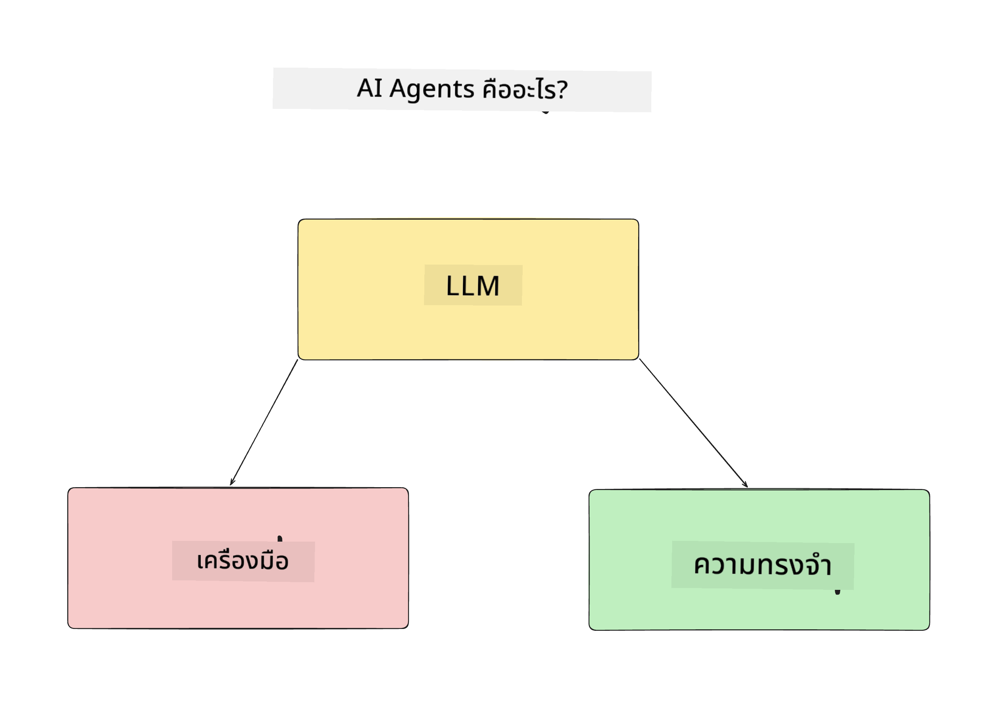
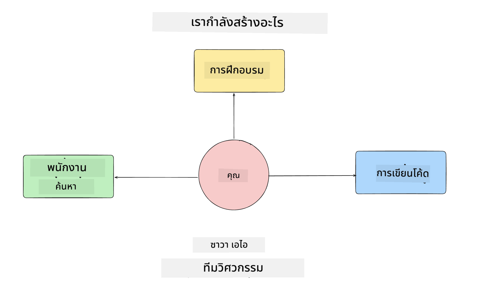
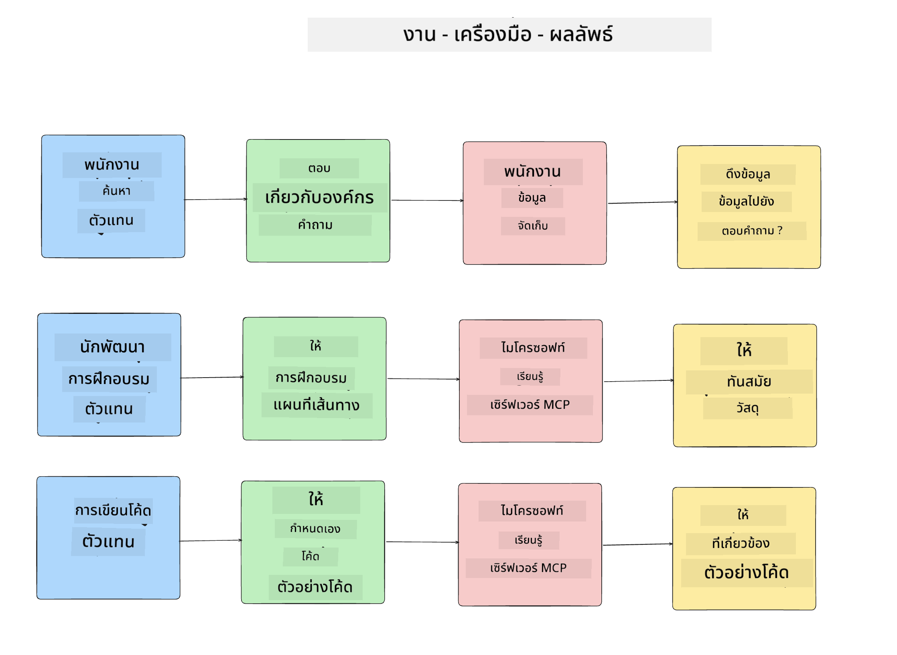
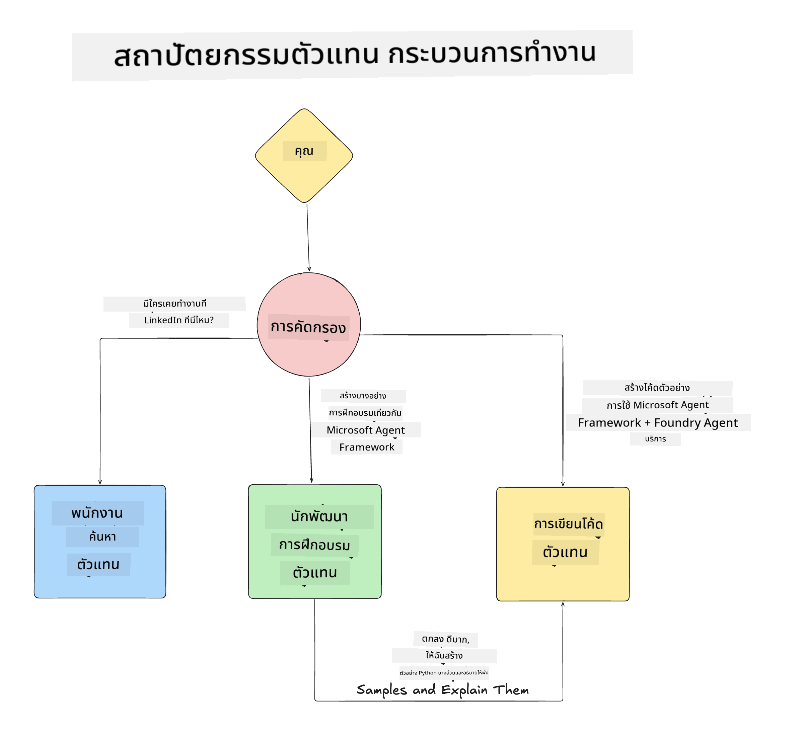

<!--
CO_OP_TRANSLATOR_METADATA:
{
  "original_hash": "99c07849641a850775c188c9333f31e5",
  "translation_date": "2025-12-12T18:29:44+00:00",
  "source_file": "lesson-1-agent-design/README.md",
  "language_code": "th"
}
-->
# บทที่ 1: การออกแบบ AI Agent

ยินดีต้อนรับสู่บทเรียนแรกของหลักสูตร "การสร้าง AI Agent จากศูนย์สู่การผลิต"!

ในบทเรียนนี้เราจะครอบคลุม:

- การกำหนดว่า AI Agents คืออะไร
  
- การพูดคุยเกี่ยวกับแอปพลิเคชัน AI Agent ที่เรากำลังสร้าง  

- การระบุเครื่องมือและบริการที่จำเป็นสำหรับแต่ละเอเจนต์
  
- การออกแบบสถาปัตยกรรมแอปพลิเคชันเอเจนต์ของเรา
  
เรามาเริ่มต้นด้วยการกำหนดว่าเอเจนต์คืออะไรและทำไมเราถึงใช้พวกมันในแอปพลิเคชัน

## AI Agents คืออะไร?

ถ้านี่เป็นครั้งแรกของคุณที่สำรวจวิธีการสร้าง AI Agent คุณอาจมีคำถามเกี่ยวกับวิธีการกำหนดว่า AI Agent คืออะไรอย่างชัดเจน

วิธีง่ายๆ ในการกำหนดว่า AI Agent คืออะไรโดยดูจากส่วนประกอบที่ทำให้มันเป็น:

**Large Language Model** - LLM จะขับเคลื่อนทั้งความสามารถในการประมวลผลภาษาธรรมชาติจากผู้ใช้เพื่อแปลความหมายของงานที่พวกเขาต้องการทำให้เสร็จ รวมถึงแปลความหมายของคำอธิบายเครื่องมือที่มีเพื่อทำงานเหล่านั้นให้เสร็จ

**เครื่องมือ** - เหล่านี้จะเป็นฟังก์ชัน, API, ที่เก็บข้อมูล และบริการอื่นๆ ที่ LLM สามารถเลือกใช้เพื่อทำงานที่ผู้ใช้ร้องขอให้เสร็จ

**หน่วยความจำ** - นี่คือวิธีที่เราจัดเก็บทั้งการโต้ตอบระยะสั้นและระยะยาวระหว่าง AI Agent กับผู้ใช้ การจัดเก็บและดึงข้อมูลนี้เป็นสิ่งสำคัญในการปรับปรุงและบันทึกความชอบของผู้ใช้เมื่อเวลาผ่านไป

## กรณีการใช้งาน AI Agent ของเรา

สำหรับหลักสูตรนี้ เราจะสร้างแอปพลิเคชัน AI Agent ที่ช่วยนักพัฒนามือใหม่ในการเข้าร่วมทีมพัฒนา AI Agent ของเรา!

ก่อนที่เราจะเริ่มพัฒนางานใดๆ ขั้นตอนแรกในการสร้างแอปพลิเคชัน AI Agent ที่ประสบความสำเร็จ คือการกำหนดสถานการณ์ที่ชัดเจนเกี่ยวกับวิธีที่เราคาดหวังให้ผู้ใช้ทำงานร่วมกับ AI Agents ของเรา

สำหรับแอปพลิเคชันนี้ เราจะทำงานกับสถานการณ์เหล่านี้:

**สถานการณ์ที่ 1**: พนักงานใหม่เข้าร่วมองค์กรของเราและต้องการทราบข้อมูลเพิ่มเติมเกี่ยวกับทีมที่พวกเขาเข้าร่วมและวิธีการติดต่อกับทีม

**สถานการณ์ที่ 2:** พนักงานใหม่ต้องการทราบว่างานแรกที่ดีที่สุดสำหรับพวกเขาในการเริ่มทำงานคืออะไร

**สถานการณ์ที่ 3:** พนักงานใหม่ต้องการรวบรวมแหล่งเรียนรู้และตัวอย่างโค้ดเพื่อช่วยให้พวกเขาเริ่มต้นทำงานนี้ให้เสร็จ

## การระบุเครื่องมือและบริการ

ตอนนี้ที่เรามีสถานการณ์เหล่านี้แล้ว ขั้นตอนถัดไปคือการจับคู่สถานการณ์เหล่านี้กับเครื่องมือและบริการที่ AI Agents ของเราจะต้องใช้เพื่อทำงานเหล่านี้ให้เสร็จ

กระบวนการนี้อยู่ในหมวดหมู่ของ Context Engineering เพราะเราจะมุ่งเน้นให้แน่ใจว่า AI Agents ของเรามีบริบทที่ถูกต้องในเวลาที่เหมาะสมเพื่อทำงานให้เสร็จ

เรามาทำทีละสถานการณ์และออกแบบเอเจนต์อย่างดีโดยการระบุงานของแต่ละเอเจนต์, เครื่องมือ และผลลัพธ์ที่ต้องการ

### สถานการณ์ที่ 1 - เอเจนต์ค้นหาพนักงาน

**งาน** - ตอบคำถามเกี่ยวกับพนักงานในองค์กร เช่น วันที่เข้าร่วมทีม, ทีมปัจจุบัน, สถานที่ และตำแหน่งล่าสุด

**เครื่องมือ** - ฐานข้อมูลรายชื่อพนักงานปัจจุบันและแผนผังองค์กร

**ผลลัพธ์** - สามารถดึงข้อมูลจากฐานข้อมูลเพื่อตอบคำถามทั่วไปเกี่ยวกับองค์กรและคำถามเฉพาะเกี่ยวกับพนักงานได้

### สถานการณ์ที่ 2 - เอเจนต์แนะนำงาน

**งาน** - อิงจากประสบการณ์นักพัฒนาของพนักงานใหม่ คิดหาปัญหา 1-3 เรื่องที่พนักงานใหม่สามารถทำงานได้

**เครื่องมือ** - GitHub MCP Server เพื่อดึงปัญหาที่เปิดอยู่และสร้างโปรไฟล์นักพัฒนา

**ผลลัพธ์** - สามารถอ่าน commit ล่าสุด 5 รายการของโปรไฟล์ GitHub และปัญหาที่เปิดอยู่ในโปรเจกต์ GitHub และแนะนำตามการจับคู่

### สถานการณ์ที่ 3 - เอเจนต์ช่วยเหลือโค้ด

**งาน** - อิงจากปัญหาที่เปิดอยู่ซึ่งได้รับการแนะนำโดยเอเจนต์ "แนะนำงาน" ทำการค้นคว้าและจัดหาทรัพยากรและสร้างโค้ดตัวอย่างเพื่อช่วยพนักงาน

**เครื่องมือ** - Microsoft Learn MCP เพื่อค้นหาทรัพยากรและ Code Interpreter เพื่อสร้างโค้ดตัวอย่างที่กำหนดเอง

**ผลลัพธ์** - หากผู้ใช้ขอความช่วยเหลือเพิ่มเติม เวิร์กโฟลว์ควรใช้ Learn MCP Server เพื่อให้ลิงก์และตัวอย่างไปยังทรัพยากร จากนั้นส่งต่อไปยังเอเจนต์ Code Interpreter เพื่อสร้างโค้ดตัวอย่างขนาดเล็กพร้อมคำอธิบาย

## การออกแบบสถาปัตยกรรมแอปพลิเคชันเอเจนต์ของเรา

ตอนนี้ที่เรากำหนดเอเจนต์แต่ละตัวแล้ว มาสร้างแผนภาพสถาปัตยกรรมที่จะช่วยให้เราเข้าใจว่าแต่ละเอเจนต์จะทำงานร่วมกันและแยกกันอย่างไรขึ้นอยู่กับงาน:

## ขั้นตอนถัดไป

ตอนนี้ที่เราได้ออกแบบเอเจนต์แต่ละตัวและระบบเอเจนต์ของเราแล้ว มาต่อกันที่บทเรียนถัดไปซึ่งเราจะพัฒนาเอเจนต์เหล่านี้แต่ละตัว!

---

<!-- CO-OP TRANSLATOR DISCLAIMER START -->
**ข้อจำกัดความรับผิดชอบ**:  
เอกสารนี้ได้รับการแปลโดยใช้บริการแปลภาษาอัตโนมัติ [Co-op Translator](https://github.com/Azure/co-op-translator) แม้ว่าเราจะพยายามให้ความถูกต้องสูงสุด แต่โปรดทราบว่าการแปลโดยอัตโนมัติอาจมีข้อผิดพลาดหรือความไม่ถูกต้อง เอกสารต้นฉบับในภาษาต้นทางถือเป็นแหล่งข้อมูลที่เชื่อถือได้ สำหรับข้อมูลที่สำคัญ ขอแนะนำให้ใช้บริการแปลโดยผู้เชี่ยวชาญมนุษย์ เราไม่รับผิดชอบต่อความเข้าใจผิดหรือการตีความผิดใด ๆ ที่เกิดจากการใช้การแปลนี้
<!-- CO-OP TRANSLATOR DISCLAIMER END -->