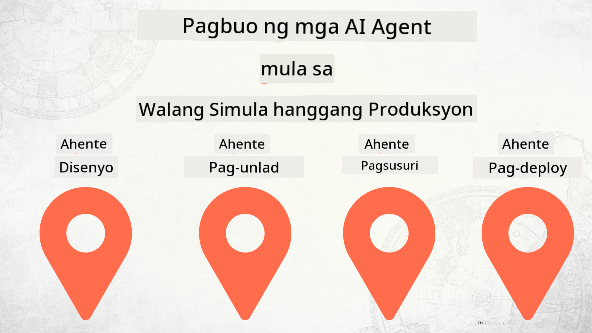

<!--
CO_OP_TRANSLATOR_METADATA:
{
  "original_hash": "84eb09fa4e48cff3f63a5dc64f8efab7",
  "translation_date": "2025-12-17T11:51:00+00:00",
  "source_file": "README.md",
  "language_code": "tl"
}
-->
# Paggawa ng AI Agents mula Zero hanggang Produksyon

### 🌐 Suporta sa Maramihang Wika

#### Sinusuportahan sa pamamagitan ng GitHub Action (Awtomatiko at Laging Napapanahon)

<!-- CO-OP TRANSLATOR LANGUAGES TABLE START -->
[Arabic](../ar/README.md) | [Bengali](../bn/README.md) | [Bulgarian](../bg/README.md) | [Burmese (Myanmar)](../my/README.md) | [Chinese (Simplified)](../zh/README.md) | [Chinese (Traditional, Hong Kong)](../hk/README.md) | [Chinese (Traditional, Macau)](../mo/README.md) | [Chinese (Traditional, Taiwan)](../tw/README.md) | [Croatian](../hr/README.md) | [Czech](../cs/README.md) | [Danish](../da/README.md) | [Dutch](../nl/README.md) | [Estonian](../et/README.md) | [Finnish](../fi/README.md) | [French](../fr/README.md) | [German](../de/README.md) | [Greek](../el/README.md) | [Hebrew](../he/README.md) | [Hindi](../hi/README.md) | [Hungarian](../hu/README.md) | [Indonesian](../id/README.md) | [Italian](../it/README.md) | [Japanese](../ja/README.md) | [Kannada](../kn/README.md) | [Korean](../ko/README.md) | [Lithuanian](../lt/README.md) | [Malay](../ms/README.md) | [Malayalam](../ml/README.md) | [Marathi](../mr/README.md) | [Nepali](../ne/README.md) | [Nigerian Pidgin](../pcm/README.md) | [Norwegian](../no/README.md) | [Persian (Farsi)](../fa/README.md) | [Polish](../pl/README.md) | [Portuguese (Brazil)](../br/README.md) | [Portuguese (Portugal)](../pt/README.md) | [Punjabi (Gurmukhi)](../pa/README.md) | [Romanian](../ro/README.md) | [Russian](../ru/README.md) | [Serbian (Cyrillic)](../sr/README.md) | [Slovak](../sk/README.md) | [Slovenian](../sl/README.md) | [Spanish](../es/README.md) | [Swahili](../sw/README.md) | [Swedish](../sv/README.md) | [Tagalog (Filipino)](./README.md) | [Tamil](../ta/README.md) | [Telugu](../te/README.md) | [Thai](../th/README.md) | [Turkish](../tr/README.md) | [Ukrainian](../uk/README.md) | [Urdu](../ur/README.md) | [Vietnamese](../vi/README.md)
<!-- CO-OP TRANSLATOR LANGUAGES TABLE END -->

## Isang kurso na nagtuturo sa iyo ng mga pundasyon ng AI Agent Development Lifecycle

## 🌱 Pagsisimula

Ang kursong ito ay may mga aralin na sumasaklaw sa mga pundasyon ng paggawa at pag-deploy ng AI Agents.

Bawat aralin ay nakabatay sa naunang aralin, kaya inirerekomenda naming magsimula sa simula at magpatuloy hanggang sa dulo.

Kung nais mong tuklasin pa ang mga paksa tungkol sa AI Agent, maaari mong tingnan ang [AI Agents For Beginners Course](https://aka.ms/ai-agents-beginners).

### Makipagkilala sa Iba Pang mga Nag-aaral, Sagutin ang Iyong mga Tanong

Kung ikaw ay ma-stuck o may mga tanong tungkol sa paggawa ng AI Agents, sumali sa aming dedikadong Discord Channel sa [Microsoft Foundry Discord](https://discord.gg/Kuaw3ktsu6).

### Ano ang Kailangan Mo

Bawat Aralin ay may sariling code sample na maaari mong patakbuhin nang lokal. Maaari mong [i-fork ang repo na ito](https://github.com/microsoft/Building-AI-Agents-From-Zero-To-Production/fork) upang gumawa ng sarili mong kopya.

Ang kursong ito ay kasalukuyang gumagamit ng mga sumusunod:

- [Microsoft Agent Framework (MAF)](https://aka.ms/ai-agents-beginners/agent-framework)
- [Microsoft Foundry](https://azure.microsoft.com/products/ai-foundry)
- [Azure OpenAI Service](https://azure.microsoft.com/products/ai-foundry/models/openai)
- [Azure CLI](https://learn.microsoft.com/cli/azure/authenticate-azure-cli?view=azure-cli-latest)

Mangyaring tiyakin na mayroon kang access sa mga serbisyong ito bago magsimula.

May mga karagdagang opsyon tungkol sa pagho-host ng modelo at mga serbisyo na paparating.

## 🗃️ Mga Aralin

| **Aralin**         | **Paglalarawan**                                                                                  |
|--------------------|--------------------------------------------------------------------------------------------------|
| [Agent Design](./lesson-1-agent-design/README.md)       | Isang pagpapakilala sa aming "Developer Onboarding" Agent Use Case at kung paano magdisenyo ng epektibong mga agent  |
| [Agent Development](./lesson-2-agent-development/README.md)  | Gamit ang Microsoft Agent Framework (MAF), gumawa ng 3 agent upang tulungan ang mga bagong developer na mag-onboard.       |
| [Agent Evaluations](./lesson-3-agent-evals/README.md)  | Gamit ang Microsoft Foundry, alamin kung gaano kahusay ang pagganap ng aming mga AI Agents at kung paano sila mapapabuti. |
| [Agent Deployment](./lesson-4-agent-deployment/README.md)   | Gamit ang Hosted Agents at OpenAI Chatkit, tingnan kung paano i-deploy ang isang AI Agent sa produksyon.       |

## Pagsusulong

Malugod na tinatanggap ng proyektong ito ang mga kontribusyon at mungkahi. Karamihan sa mga kontribusyon ay nangangailangan na sumang-ayon ka sa isang
Contributor License Agreement (CLA) na nagsasaad na ikaw ay may karapatan, at talagang nagbibigay, sa amin ng
mga karapatan na gamitin ang iyong kontribusyon. Para sa mga detalye, bisitahin ang <https://cla.opensource.microsoft.com>.

Kapag nagsumite ka ng pull request, awtomatikong tutukuyin ng CLA bot kung kailangan mong magbigay ng
CLA at bibigyan ng angkop na dekorasyon ang PR (hal., status check, komento). Sundin lamang ang mga tagubiling
ibinibigay ng bot. Isang beses mo lang ito kailangang gawin sa lahat ng mga repo na gumagamit ng aming CLA.

Ang proyektong ito ay nagpatibay ng [Microsoft Open Source Code of Conduct](https://opensource.microsoft.com/codeofconduct/).
Para sa karagdagang impormasyon, tingnan ang [Code of Conduct FAQ](https://opensource.microsoft.com/codeofconduct/faq/) o
makipag-ugnayan sa [opencode@microsoft.com](mailto:opencode@microsoft.com) para sa anumang karagdagang tanong o komento.

## Mga Trademark

Ang proyektong ito ay maaaring maglaman ng mga trademark o logo para sa mga proyekto, produkto, o serbisyo. Ang awtorisadong paggamit ng mga trademark o logo ng Microsoft ay napapailalim at dapat sumunod sa
[Microsoft's Trademark & Brand Guidelines](https://www.microsoft.com/legal/intellectualproperty/trademarks/usage/general).
Ang paggamit ng mga trademark o logo ng Microsoft sa mga binagong bersyon ng proyektong ito ay hindi dapat magdulot ng kalituhan o magpahiwatig ng sponsorship ng Microsoft.
Anumang paggamit ng mga trademark o logo ng third-party ay napapailalim sa mga patakaran ng mga third-party na iyon.

## Pagkuha ng Tulong

Kung ikaw ay ma-stuck o may mga tanong tungkol sa paggawa ng AI apps, sumali sa:

Kung mayroon kang feedback sa produkto o mga error habang gumagawa, bisitahin:

---

<!-- CO-OP TRANSLATOR DISCLAIMER START -->
**Paalala**:
Ang dokumentong ito ay isinalin gamit ang AI translation service na [Co-op Translator](https://github.com/Azure/co-op-translator). Bagamat nagsusumikap kami para sa katumpakan, pakatandaan na ang mga awtomatikong pagsasalin ay maaaring maglaman ng mga pagkakamali o di-tumpak na impormasyon. Ang orihinal na dokumento sa orihinal nitong wika ang dapat ituring na pangunahing sanggunian. Para sa mahahalagang impormasyon, inirerekomenda ang propesyonal na pagsasalin ng tao. Hindi kami mananagot sa anumang hindi pagkakaunawaan o maling interpretasyon na maaaring magmula sa paggamit ng pagsasaling ito.
<!-- CO-OP TRANSLATOR DISCLAIMER END -->