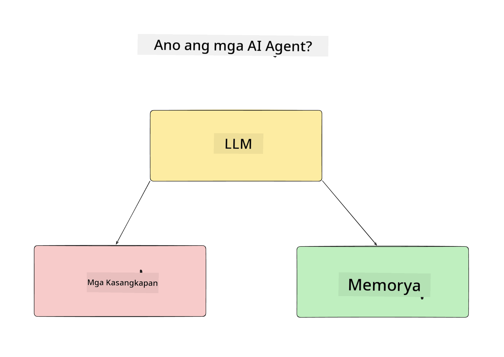
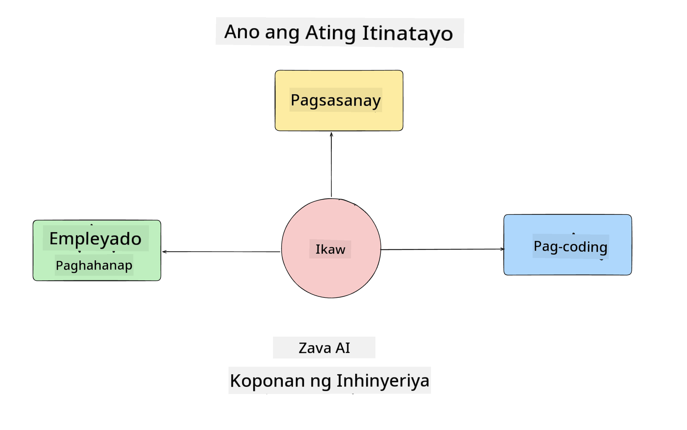
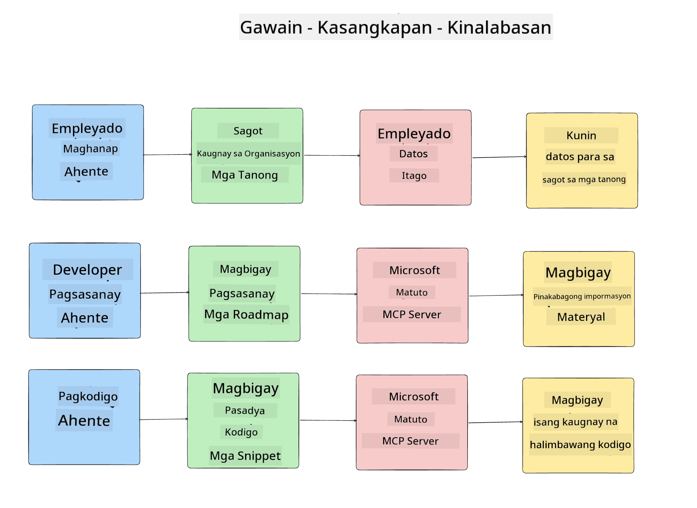
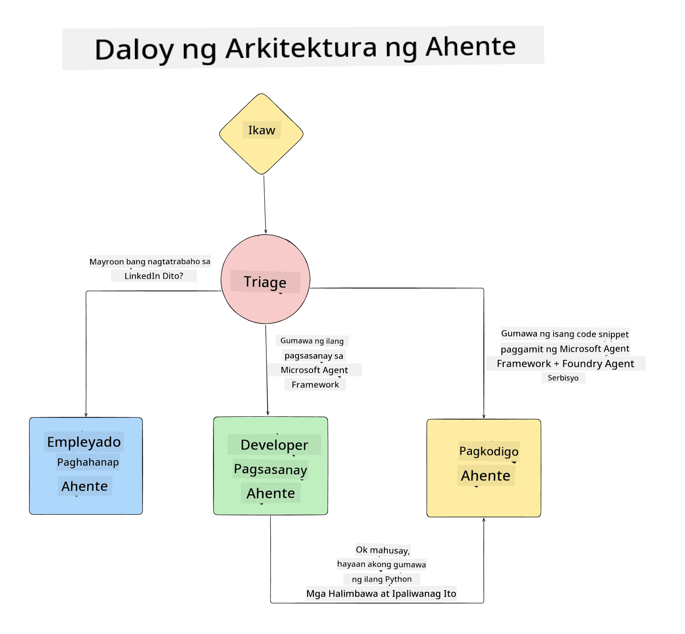

<!--
CO_OP_TRANSLATOR_METADATA:
{
  "original_hash": "99c07849641a850775c188c9333f31e5",
  "translation_date": "2025-12-12T18:35:47+00:00",
  "source_file": "lesson-1-agent-design/README.md",
  "language_code": "tl"
}
-->
# Lesson 1: Disenyo ng AI Agent

Maligayang pagdating sa unang leksyon ng "Building AI Agent from Zero to Production Course"!

Sa leksyong ito tatalakayin natin:

- Pagpapakahulugan kung ano ang AI Agents
  
- Talakayin ang AI Agent Application na ating binubuo  

- Tukuyin ang mga kinakailangang tools at serbisyo para sa bawat agent
  
- I-arkitekto ang ating Agent Application
  
Magsimula tayo sa pagpapakahulugan kung ano ang agent at bakit natin ito gagamitin sa loob ng isang aplikasyon.

## Ano ang AI Agents?

Kung ito ang unang pagkakataon mo na tuklasin kung paano bumuo ng AI Agent, maaaring may mga tanong ka kung paano eksaktong ipapakahulugan kung ano ang AI Agent.

Para sa isang simpleng paraan ng pagpapakahulugan kung ano ang AI Agent ay sa pamamagitan ng mga bahagi na bumubuo nito:

**Large Language Model** - Ang LLM ang magpapagana sa kakayahang iproseso ang natural na wika mula sa user upang maunawaan ang gawain na nais nilang tapusin pati na rin ang pag-interpret ng mga paglalarawan ng mga tools na magagamit upang matapos ang mga gawain.

**Tools** - Ito ay mga function, APIs, data stores at iba pang serbisyo na maaaring piliin ng LLM na gamitin upang matapos ang mga gawain na hinihiling ng user.

**Memory** - Ito ang paraan kung paano natin iniimbak ang parehong panandalian at pangmatagalang interaksyon sa pagitan ng AI Agent at ng user. Mahalaga ang pag-iimbak at pagkuha ng impormasyong ito upang makagawa ng mga pagpapabuti at mai-save ang mga kagustuhan ng user sa paglipas ng panahon.

## Ang Gamit ng Ating AI Agent

Para sa kursong ito, gagawa tayo ng isang AI Agent application na tumutulong sa mga bagong developer na makapasok sa ating AI Agent Development Team!

Bago tayo magsimula sa anumang development work, ang unang hakbang sa paglikha ng matagumpay na AI Agent application ay ang malinaw na pagtukoy ng mga senaryo kung paano natin inaasahan na gagamitin ng ating mga user ang ating AI Agents.

Para sa aplikasyon na ito, gagamit tayo ng mga sumusunod na senaryo:

**Senaryo 1**: Isang bagong empleyado ang sumali sa ating organisasyon at nais malaman ang higit pa tungkol sa team na kanilang sinalihan at kung paano makakakonekta sa kanila.

**Senaryo 2:** Isang bagong empleyado ang nais malaman kung ano ang pinakamainam na unang gawain na maaari nilang simulan.

**Senaryo 3:** Isang bagong empleyado ang nais mangalap ng mga learning resources at mga halimbawa ng code upang matulungan silang makapagsimula sa pagtapos ng gawain.

## Pagtukoy sa mga Tools at Serbisyo

Ngayon na mayroon na tayong mga senaryong ito, ang susunod na hakbang ay i-map ang mga ito sa mga tools at serbisyo na kakailanganin ng ating mga AI agents upang matapos ang mga gawain.

Ang prosesong ito ay kabilang sa kategorya ng Context Engineering dahil magtutuon tayo sa pagtiyak na ang ating mga AI Agents ay may tamang konteksto sa tamang oras upang matapos ang mga gawain.

Gawin natin ito senaryo bawat senaryo at magsagawa ng mahusay na disenyo ng agent sa pamamagitan ng paglista ng bawat gawain ng agent, mga tools at mga inaasahang resulta.

### Senaryo 1 - Employee Search Agent

**Gawain** - Sagutin ang mga tanong tungkol sa mga empleyado sa organisasyon tulad ng petsa ng pagsali, kasalukuyang team, lokasyon at huling posisyon.

**Tools** - Datastore ng kasalukuyang listahan ng empleyado at org chart

**Mga Resulta** - Kayang kumuha ng impormasyon mula sa datastore upang sagutin ang mga pangkalahatang tanong tungkol sa organisasyon at mga partikular na tanong tungkol sa mga empleyado.

### Senaryo 2 - Task Recommendation Agent

**Gawain** - Batay sa karanasan ng bagong empleyado bilang developer, magbigay ng 1-3 isyu na maaaring trabahuhin ng bagong empleyado.

**Tools** - GitHub MCP Server upang makuha ang mga bukas na isyu at bumuo ng developer profile

**Mga Resulta** - Kayang basahin ang huling 5 commits ng isang GitHub Profile at mga bukas na isyu sa isang GitHub project at magbigay ng mga rekomendasyon batay sa tugma

### Senaryo 3 - Code Assistant Agent

**Gawain** - Batay sa mga Open Issues na inirekomenda ng "Task Recommendation" Agent, magsaliksik at magbigay ng mga resources at gumawa ng mga code snippet upang matulungan ang empleyado.

**Tools** - Microsoft Learn MCP upang maghanap ng mga resources at Code Interpreter upang gumawa ng mga custom na code snippet.

**Mga Resulta** - Kung humiling ang user ng karagdagang tulong, dapat gamitin ng workflow ang Learn MCP Server upang magbigay ng mga link at snippet sa mga resources at pagkatapos ay ipasa sa Code Interpreter agent upang gumawa ng maliliit na code snippet na may mga paliwanag.

## Pag-arkitekto ng ating Agent Application

Ngayon na naipaliwanag na natin ang bawat isa sa ating mga Agents, gumawa tayo ng isang architecture diagram na makakatulong sa atin na maunawaan kung paano magtutulungan at gagana nang hiwalay ang bawat agent depende sa gawain:

## Mga Susunod na Hakbang

Ngayon na naidisenyo na natin ang bawat agent at ang ating agentic system, magpatuloy tayo sa susunod na leksyon kung saan bubuuin natin ang bawat isa sa mga agent na ito!

---

<!-- CO-OP TRANSLATOR DISCLAIMER START -->
**Paunawa**:
Ang dokumentong ito ay isinalin gamit ang AI translation service na [Co-op Translator](https://github.com/Azure/co-op-translator). Bagamat nagsusumikap kami para sa katumpakan, pakatandaan na ang mga awtomatikong pagsasalin ay maaaring maglaman ng mga pagkakamali o di-tumpak na impormasyon. Ang orihinal na dokumento sa orihinal nitong wika ang dapat ituring na pangunahing sanggunian. Para sa mahahalagang impormasyon, inirerekomenda ang propesyonal na pagsasalin ng tao. Hindi kami mananagot sa anumang hindi pagkakaunawaan o maling interpretasyon na maaaring magmula sa paggamit ng pagsasaling ito.
<!-- CO-OP TRANSLATOR DISCLAIMER END -->