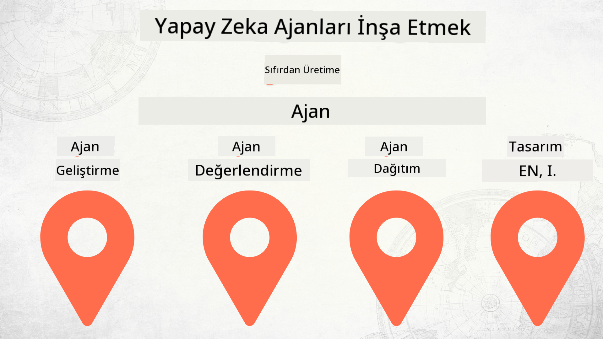

<!--
CO_OP_TRANSLATOR_METADATA:
{
  "original_hash": "03d63bb8bfb7f068db97b3703965a24f",
  "translation_date": "2025-12-17T13:51:31+00:00",
  "source_file": "README.md",
  "language_code": "tr"
}
-->
# Sıfırdan Üretime AI Ajanları İnşa Etmek

### 🌐 Çok Dilli Destek

#### GitHub Action ile Desteklenmektedir (Otomatik ve Her Zaman Güncel)

<!-- CO-OP TRANSLATOR LANGUAGES TABLE START -->
[Arabic](../ar/README.md) | [Bengali](../bn/README.md) | [Bulgarian](../bg/README.md) | [Burmese (Myanmar)](../my/README.md) | [Chinese (Simplified)](../zh/README.md) | [Chinese (Traditional, Hong Kong)](../hk/README.md) | [Chinese (Traditional, Macau)](../mo/README.md) | [Chinese (Traditional, Taiwan)](../tw/README.md) | [Croatian](../hr/README.md) | [Czech](../cs/README.md) | [Danish](../da/README.md) | [Dutch](../nl/README.md) | [Estonian](../et/README.md) | [Finnish](../fi/README.md) | [French](../fr/README.md) | [German](../de/README.md) | [Greek](../el/README.md) | [Hebrew](../he/README.md) | [Hindi](../hi/README.md) | [Hungarian](../hu/README.md) | [Indonesian](../id/README.md) | [Italian](../it/README.md) | [Japanese](../ja/README.md) | [Kannada](../kn/README.md) | [Korean](../ko/README.md) | [Lithuanian](../lt/README.md) | [Malay](../ms/README.md) | [Malayalam](../ml/README.md) | [Marathi](../mr/README.md) | [Nepali](../ne/README.md) | [Nigerian Pidgin](../pcm/README.md) | [Norwegian](../no/README.md) | [Persian (Farsi)](../fa/README.md) | [Polish](../pl/README.md) | [Portuguese (Brazil)](../br/README.md) | [Portuguese (Portugal)](../pt/README.md) | [Punjabi (Gurmukhi)](../pa/README.md) | [Romanian](../ro/README.md) | [Russian](../ru/README.md) | [Serbian (Cyrillic)](../sr/README.md) | [Slovak](../sk/README.md) | [Slovenian](../sl/README.md) | [Spanish](../es/README.md) | [Swahili](../sw/README.md) | [Swedish](../sv/README.md) | [Tagalog (Filipino)](../tl/README.md) | [Tamil](../ta/README.md) | [Telugu](../te/README.md) | [Thai](../th/README.md) | [Turkish](./README.md) | [Ukrainian](../uk/README.md) | [Urdu](../ur/README.md) | [Vietnamese](../vi/README.md)
<!-- CO-OP TRANSLATOR LANGUAGES TABLE END -->

## AI Ajan Geliştirme Yaşam Döngüsünün Temellerini Öğreten Bir Kurs

## 🌱 Başlarken

Bu kurs, AI Ajanları oluşturma ve dağıtmanın temellerini kapsayan dersler içerir.

Her ders bir öncekine dayanır, bu yüzden baştan başlayıp sona kadar ilerlemenizi öneririz.

AI Ajan konularını daha fazla keşfetmek isterseniz, [AI Agents For Beginners Course](https://aka.ms/ai-agents-beginners) kursuna göz atabilirsiniz.

### Diğer Öğrenenlerle Tanışın, Sorularınızı Yanıtlayın

AI Ajanları oluştururken takılırsanız veya herhangi bir sorunuz olursa, [Microsoft Foundry Discord](https://discord.gg/Kuaw3ktsu6) içindeki özel Discord Kanalımıza katılın.

### İhtiyacınız Olanlar

Her dersin yerel olarak çalıştırabileceğiniz kendi kod örneği vardır. Kendi kopyanızı oluşturmak için [bu repoyu fork edebilirsiniz](https://github.com/microsoft/Building-AI-Agents-From-Zero-To-Production/fork).

Bu kurs şu anda şunları kullanmaktadır:

- [Microsoft Agent Framework (MAF)](https://aka.ms/ai-agents-beginners/agent-framework)
- [Microsoft Foundry](https://azure.microsoft.com/products/ai-foundry)
- [Azure OpenAI Service](https://azure.microsoft.com/products/ai-foundry/models/openai)
- [Azure CLI](https://learn.microsoft.com/cli/azure/authenticate-azure-cli?view=azure-cli-latest)

Başlamadan önce bu hizmetlere erişiminizin olduğundan emin olun.

Model barındırma ve hizmetlerle ilgili daha fazla seçenek yakında geliyor.

## 🗃️ Dersler

| **Ders**         | **Açıklama**                                                                                  |
|------------------|------------------------------------------------------------------------------------------------|
| [Agent Design](./lesson-1-agent-design/README.md)       | "Geliştirici Onboarding" Ajan Kullanım Durumumuza giriş ve etkili ajanlar tasarlama          |
| [Agent Development](./lesson-2-agent-development/README.md)  | Microsoft Agent Framework (MAF) kullanarak yeni geliştiricilerin onboarding sürecine yardımcı olacak 3 ajan oluşturma.       |
| [Agent Evaluations](./lesson-3-agent-evals/README.md)  | Microsoft Foundry kullanarak AI Ajanlarımızın performansını değerlendirme ve iyileştirme yolları. |
| [Agent Deployment](./lesson-4-agent-deployment/README.md)   | Hosted Agents ve OpenAI Chatkit kullanarak bir AI Ajanını üretime nasıl dağıtacağınızı öğrenin.       |

## Katkıda Bulunma

Bu proje katkılara ve önerilere açıktır. Çoğu katkı, katkınızın kullanım haklarını bize verdiğinizi beyan eden bir Katkı Sağlayıcı Lisans Anlaşması'na (CLA) uymanızı gerektirir. Detaylar için <https://cla.opensource.microsoft.com> adresini ziyaret edin.

Bir pull request gönderdiğinizde, bir CLA botu otomatik olarak CLA sağlamanız gerekip gerekmediğini belirler ve PR'ı uygun şekilde işaretler (örneğin, durum kontrolü, yorum). Botun verdiği talimatları izleyin. CLA'yı kullanan tüm repolar için bunu yalnızca bir kez yapmanız yeterlidir.

Bu proje [Microsoft Açık Kaynak Davranış Kuralları](https://opensource.microsoft.com/codeofconduct/)nu benimsemiştir. Daha fazla bilgi için [Davranış Kuralları SSS](https://opensource.microsoft.com/codeofconduct/faq/) sayfasına bakabilir veya ek sorularınız için [opencode@microsoft.com](mailto:opencode@microsoft.com) adresiyle iletişime geçebilirsiniz.

## Ticari Markalar

Bu proje, projeler, ürünler veya hizmetler için ticari markalar veya logolar içerebilir. Microsoft ticari markalarının veya logolarının yetkili kullanımı, [Microsoft'un Ticari Marka ve Marka Kılavuzları](https://www.microsoft.com/legal/intellectualproperty/trademarks/usage/general)na tabidir ve bunlara uyulmalıdır. Bu projenin değiştirilmiş sürümlerinde Microsoft ticari markalarının veya logolarının kullanımı karışıklığa yol açmamalı veya Microsoft sponsorluğunu ima etmemelidir. Üçüncü taraf ticari markalarının veya logolarının kullanımı, ilgili üçüncü tarafların politikalarına tabidir.

## Yardım Alma

AI uygulamaları oluştururken takılırsanız veya sorularınız olursa, katılın:

Ürün geri bildirimi veya oluşturma sırasında hatalar için ziyaret edin:

---

<!-- CO-OP TRANSLATOR DISCLAIMER START -->
**Feragatname**:  
Bu belge, AI çeviri servisi [Co-op Translator](https://github.com/Azure/co-op-translator) kullanılarak çevrilmiştir. Doğruluk için çaba göstersek de, otomatik çevirilerin hatalar veya yanlışlıklar içerebileceğini lütfen unutmayınız. Orijinal belge, kendi dilinde yetkili kaynak olarak kabul edilmelidir. Kritik bilgiler için profesyonel insan çevirisi önerilir. Bu çevirinin kullanımı sonucu oluşabilecek yanlış anlamalar veya yorum hatalarından sorumlu değiliz.
<!-- CO-OP TRANSLATOR DISCLAIMER END -->