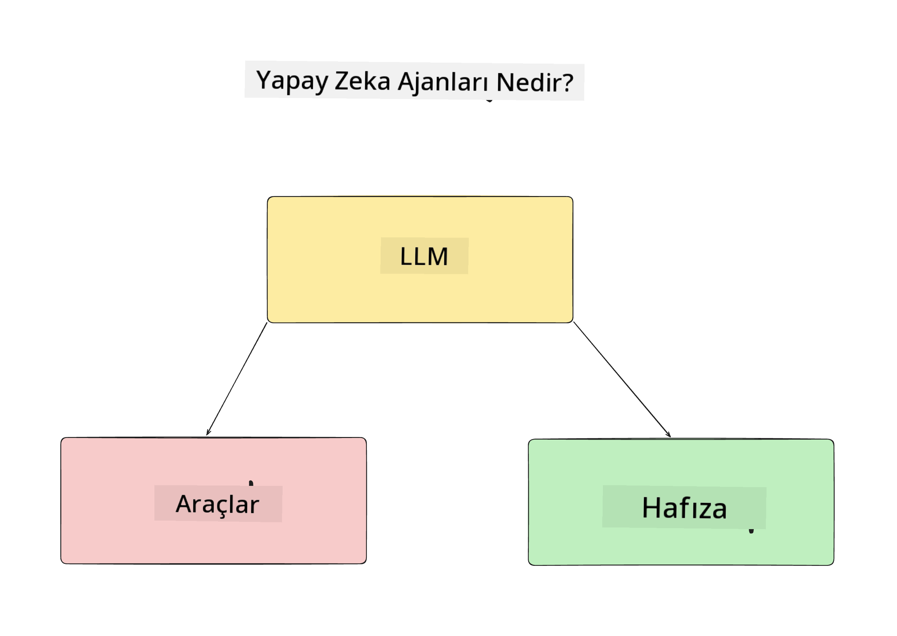
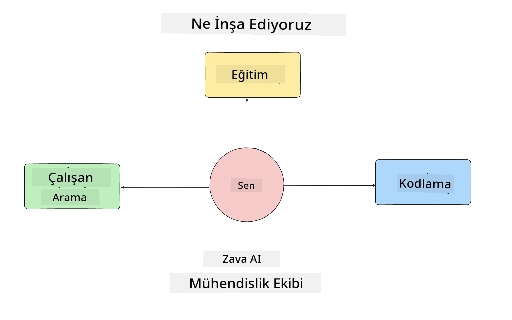
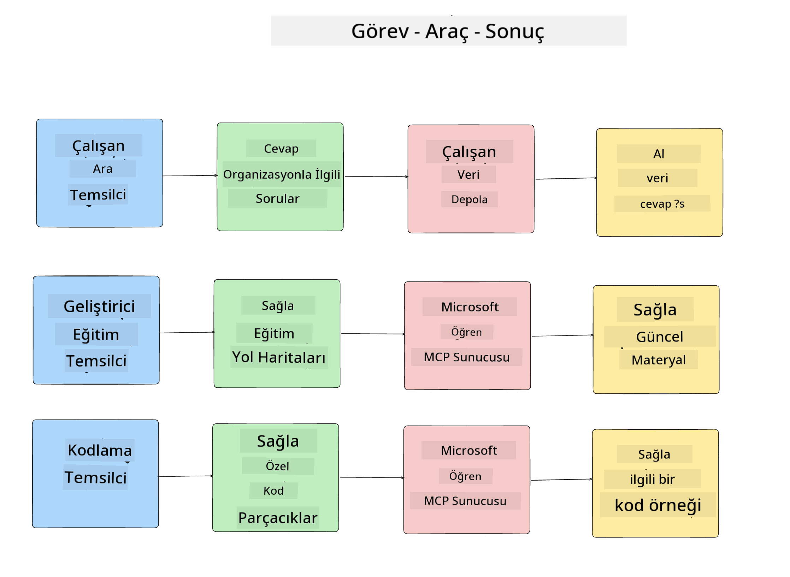
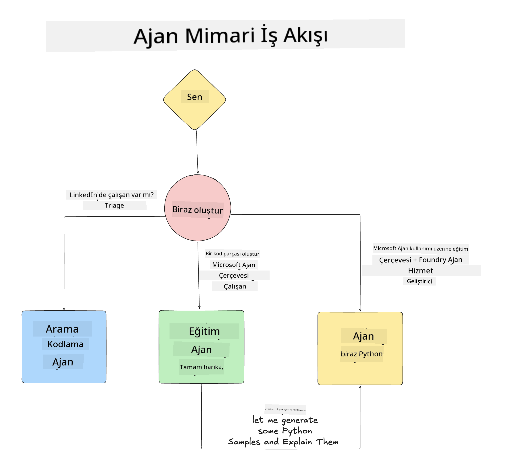

<!--
CO_OP_TRANSLATOR_METADATA:
{
  "original_hash": "99c07849641a850775c188c9333f31e5",
  "translation_date": "2025-12-12T18:28:06+00:00",
  "source_file": "lesson-1-agent-design/README.md",
  "language_code": "tr"
}
-->
# Ders 1: Yapay Zeka Ajanı Tasarımı

"Yapay Zeka Ajanı Sıfırdan Üretime Kursu"nun ilk dersine hoş geldiniz!

Bu derste şunları ele alacağız:

- Yapay Zeka Ajanlarının ne olduğunu tanımlamak
  
- İnşa ettiğimiz Yapay Zeka Ajanı Uygulamasını tartışmak  

- Her ajan için gerekli araçları ve servisleri belirlemek
  
- Ajan Uygulamamızı mimarilemek
  
Öncelikle ajanların ne olduğunu ve neden bir uygulama içinde kullanacağımızı tanımlayarak başlayalım.

## Yapay Zeka Ajanları Nedir?

Eğer bir Yapay Zeka Ajanı nasıl inşa edilir ilk kez keşfediyorsanız, Yapay Zeka Ajanının tam olarak ne olduğunu tanımlamak konusunda sorularınız olabilir.

Yapay Zeka Ajanını oluşturan bileşenler üzerinden basitçe tanımlamak gerekirse:

**Büyük Dil Modeli** - LLM, kullanıcının doğal dili işleyerek tamamlamak istediği görevi yorumlama yeteneğini ve bu görevleri tamamlamak için kullanılabilir araçların açıklamalarını yorumlama yeteneğini sağlar.

**Araçlar** - Bunlar, LLM'nin kullanıcının talep ettiği görevleri tamamlamak için seçebileceği fonksiyonlar, API'ler, veri depoları ve diğer servislerdir.

**Bellek** - Bu, Yapay Zeka Ajanı ile kullanıcı arasındaki kısa ve uzun vadeli etkileşimleri nasıl depoladığımızdır. Bu bilgiyi depolamak ve geri almak, zaman içinde iyileştirmeler yapmak ve kullanıcı tercihlerini kaydetmek için önemlidir.

## Yapay Zeka Ajanı Kullanım Durumumuz

Bu kurs için, yeni geliştiricilerin Yapay Zeka Ajanı Geliştirme Ekibimize katılmalarına yardımcı olan bir Yapay Zeka Ajanı uygulaması inşa edeceğiz!

Herhangi bir geliştirme çalışması yapmadan önce, başarılı bir Yapay Zeka Ajanı uygulaması oluşturmanın ilk adımı, kullanıcılarımızın Yapay Zeka Ajanlarımızla nasıl çalışmasını beklediğimize dair net senaryolar tanımlamaktır.

Bu uygulama için şu senaryolarla çalışacağız:

**Senaryo 1**: Yeni bir çalışan organizasyonumuza katılır ve katıldığı ekip hakkında daha fazla bilgi edinmek ve onlarla nasıl bağlantı kuracağını öğrenmek ister.

**Senaryo 2:** Yeni bir çalışan, üzerinde çalışmaya başlayabileceği en iyi ilk görevin ne olacağını öğrenmek ister.

**Senaryo 3:** Yeni bir çalışan, bu görevi tamamlamaya başlamasına yardımcı olacak öğrenme kaynakları ve kod örnekleri toplamak ister.

## Araçları ve Servisleri Belirlemek

Bu senaryoları oluşturduğumuza göre, bir sonraki adım bu görevleri tamamlamak için Yapay Zeka ajanlarımızın ihtiyaç duyacağı araçlar ve servislerle eşleştirmektir.

Bu süreç, Yapay Zeka Ajanlarımızın görevleri tamamlamak için doğru bağlama doğru zamanda sahip olmasını sağlamaya odaklanacağımız Bağlam Mühendisliği kategorisine girer.

Her senaryoyu tek tek ele alalım ve her ajanın görevini, araçlarını ve istenen sonuçlarını listeleyerek iyi bir ajan tasarımı yapalım.

### Senaryo 1 - Çalışan Arama Ajanı

**Görev** - Organizasyondaki çalışanlar hakkında katılım tarihi, mevcut ekip, konum ve son pozisyon gibi soruları yanıtlamak.

**Araçlar** - Mevcut çalışan listesi ve organizasyon şeması veri deposu

**Sonuçlar** - Genel organizasyon sorularını ve çalışanlara dair spesifik soruları yanıtlamak için veri deposundan bilgi alabilmek.

### Senaryo 2 - Görev Öneri Ajanı

**Görev** - Yeni çalışanın geliştirici deneyimine dayanarak, yeni çalışanın üzerinde çalışabileceği 1-3 sorun belirlemek.

**Araçlar** - Açık sorunları almak ve geliştirici profili oluşturmak için GitHub MCP Sunucusu

**Sonuçlar** - Bir GitHub profilinin son 5 commit'ini ve bir GitHub projesindeki açık sorunları okuyup eşleşmeye dayalı önerilerde bulunabilmek.

### Senaryo 3 - Kod Asistanı Ajanı

**Görev** - "Görev Öneri" Ajanı tarafından önerilen Açık Sorunlara dayanarak, çalışanı desteklemek için kaynaklar araştırmak ve kod parçacıkları oluşturmak.

**Araçlar** - Kaynak bulmak için Microsoft Learn MCP ve özel kod parçacıkları oluşturmak için Kod Yorumlayıcı.

**Sonuçlar** - Kullanıcı ek yardım isterse, iş akışı Learn MCP Sunucusunu kullanarak kaynaklara bağlantılar ve parçacıklar sağlar, ardından Kod Yorumlayıcı ajanına küçük kod parçacıkları açıklamalarla oluşturması için devreder.

## Ajan Uygulamamızı Mimarilemek

Her bir Ajanımızı tanımladığımıza göre, her ajanın göreve bağlı olarak birlikte ve ayrı ayrı nasıl çalışacağını anlamamıza yardımcı olacak bir mimari diyagram oluşturalım:

## Sonraki Adımlar

Her ajanı ve ajan sistemimizi tasarladığımıza göre, şimdi bu ajanların her birini geliştireceğimiz bir sonraki derse geçelim!

---

<!-- CO-OP TRANSLATOR DISCLAIMER START -->
**Feragatname**:  
Bu belge, AI çeviri servisi [Co-op Translator](https://github.com/Azure/co-op-translator) kullanılarak çevrilmiştir. Doğruluk için çaba gösterilse de, otomatik çevirilerin hatalar veya yanlışlıklar içerebileceğini lütfen unutmayınız. Orijinal belge, kendi dilinde yetkili kaynak olarak kabul edilmelidir. Kritik bilgiler için profesyonel insan çevirisi önerilir. Bu çevirinin kullanımı sonucu oluşabilecek yanlış anlamalar veya yorum hatalarından sorumlu değiliz.
<!-- CO-OP TRANSLATOR DISCLAIMER END -->