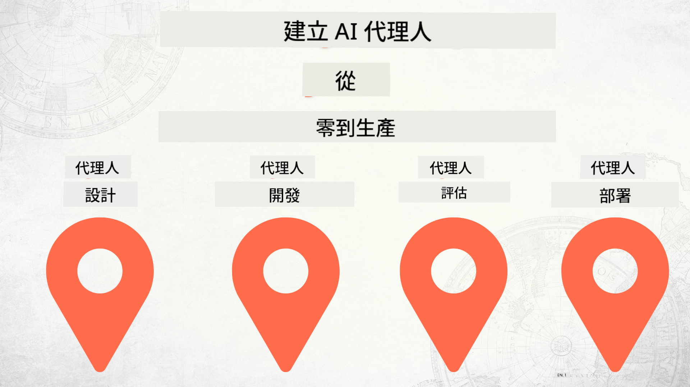

<!--
CO_OP_TRANSLATOR_METADATA:
{
  "original_hash": "73b37a335747d59d319b00aac130f073",
  "translation_date": "2025-12-24T22:58:03+00:00",
  "source_file": "README.md",
  "language_code": "tw"
}
-->
# 從零到投入生產：建立 AI 代理

### 🌐 多語言支援

#### 透過 GitHub Action 支援（自動且隨時保持最新）

<!-- CO-OP TRANSLATOR LANGUAGES TABLE START -->
[阿拉伯語](../ar/README.md) | [孟加拉語](../bn/README.md) | [保加利亞語](../bg/README.md) | [緬甸語 (Myanmar)](../my/README.md) | [中文（簡體）](../zh/README.md) | [中文（繁體，香港）](../hk/README.md) | [中文（繁體，澳門）](../mo/README.md) | [中文（繁體，台灣）](./README.md) | [克羅地亞語](../hr/README.md) | [捷克語](../cs/README.md) | [丹麥語](../da/README.md) | [荷蘭語](../nl/README.md) | [愛沙尼亞語](../et/README.md) | [芬蘭語](../fi/README.md) | [法語](../fr/README.md) | [德語](../de/README.md) | [希臘語](../el/README.md) | [希伯來語](../he/README.md) | [印地語](../hi/README.md) | [匈牙利語](../hu/README.md) | [印尼語](../id/README.md) | [義大利語](../it/README.md) | [日語](../ja/README.md) | [坎納達語](../kn/README.md) | [韓語](../ko/README.md) | [立陶宛語](../lt/README.md) | [馬來語](../ms/README.md) | [馬拉雅拉姆語](../ml/README.md) | [馬拉地語](../mr/README.md) | [尼泊爾語](../ne/README.md) | [奈及利亞皮欽語](../pcm/README.md) | [挪威語](../no/README.md) | [波斯語 (Farsi)](../fa/README.md) | [波蘭語](../pl/README.md) | [葡萄牙語（巴西）](../br/README.md) | [葡萄牙語（葡萄牙）](../pt/README.md) | [旁遮普語（Gurmukhi）](../pa/README.md) | [羅馬尼亞語](../ro/README.md) | [俄語](../ru/README.md) | [塞爾維亞語（西里爾字母）](../sr/README.md) | [斯洛伐克語](../sk/README.md) | [斯洛文尼亞語](../sl/README.md) | [西班牙語](../es/README.md) | [史瓦希里語](../sw/README.md) | [瑞典語](../sv/README.md) | [他加祿語（菲律賓）](../tl/README.md) | [泰米爾語](../ta/README.md) | [泰盧固語](../te/README.md) | [泰語](../th/README.md) | [土耳其語](../tr/README.md) | [烏克蘭語](../uk/README.md) | [烏爾都語](../ur/README.md) | [越南語](../vi/README.md)
<!-- CO-OP TRANSLATOR LANGUAGES TABLE END -->

## 一門教授 AI 代理開發生命週期基礎的課程

## 🌱 入門指南

本課程包含講解構建與部署 AI 代理基礎的課程。

每個課程會建立在先前內容之上，建議從頭開始依序學習至結束。

如果你想進一步探索 AI 代理相關主題，可以參考 [AI 代理初學者課程](https://aka.ms/ai-agents-beginners).

### 與其他學習者交流，獲得問題解答

如果你卡住或對構建 AI 代理有任何疑問，請加入我們在 [Microsoft Foundry Discord](https://discord.gg/Kuaw3ktsu6) 的專屬 Discord 頻道。

### 你需要準備的項目

每個課程都有可在本地執行的程式範例。你可以 [fork 這個專案](https://github.com/microsoft/Building-AI-Agents-From-Zero-To-Production/fork) 來建立你自己的複本。

本課程目前使用下列服務：

- [Microsoft Agent Framework (MAF)](https://aka.ms/ai-agents-beginners/agent-framework)
- [Microsoft Foundry](https://azure.microsoft.com/products/ai-foundry)
- [Azure OpenAI Service](https://azure.microsoft.com/products/ai-foundry/models/openai)
- [Azure CLI](https://learn.microsoft.com/cli/azure/authenticate-azure-cli?view=azure-cli-latest)

在開始之前，請確保你能夠存取這些服務。

有關模型託管與服務的更多選項即將推出。 

## 🗃️ 課程

| **課程**         | **說明**                                                                                  |
|--------------------|--------------------------------------------------------------------------------------------------|
| [代理設計](./lesson-1-agent-design/README.md)       | 介紹我們的「開發者入門」代理使用案例，以及如何設計有效的代理  |
| [代理開發](./lesson-2-agent-development/README.md)  | 使用 Microsoft Agent Framework (MAF)，建立 3 個代理來協助新開發者入門。       |
| [代理評估](./lesson-3-agent-evals/README.md)  | 使用 Microsoft Foundry，檢視我們的 AI 代理表現，以及如何改進它們。 |
| [代理部署](./lesson-4-agent-deployment/README.md)   | 使用 Hosted Agents 與 OpenAI Chatkit，示範如何將 AI 代理部署到生產環境。       |

## 🎒 其他課程

我們團隊也製作其他課程！請參考：

<!-- CO-OP TRANSLATOR OTHER COURSES START -->
### LangChain

---

### Azure / Edge / MCP / 代理

---
 
### 生成式 AI 系列

[-9333EA?style=for-the-badge&labelColor=E5E7EB&color=9333EA)](https://github.com/microsoft/Generative-AI-for-beginners-dotnet?WT.mc_id=academic-105485-koreyst)
[-C084FC?style=for-the-badge&labelColor=E5E7EB&color=C084FC)](https://github.com/microsoft/generative-ai-for-beginners-java?WT.mc_id=academic-105485-koreyst)
[-E879F9?style=for-the-badge&labelColor=E5E7EB&color=E879F9)](https://github.com/microsoft/generative-ai-with-javascript?WT.mc_id=academic-105485-koreyst)

---
 
### 核心學習

---
 
### Copilot 系列

<!-- CO-OP TRANSLATOR OTHER COURSES END -->

## 貢獻

本專案歡迎貢獻與建議。大多數的貢獻需要您同意一份貢獻者授權協議 (CLA)，聲明您有權且確實授與我們使用您貢獻的權利。更多詳情請訪問 <https://cla.opensource.microsoft.com>。

當您提交 pull request 時，CLA 機器人會自動判定您是否需要提供 CLA，並適當地標記該 PR（例如，狀態檢查、留言）。只要依照機器人提供的指示操作即可。對於所有使用我們 CLA 的倉庫，您只需執行此步驟一次。

本專案已採用 [Microsoft 開源行為守則](https://opensource.microsoft.com/codeofconduct/)。更多資訊請參閱 [行為守則常見問題](https://opensource.microsoft.com/codeofconduct/faq/) 或聯絡 [opencode@microsoft.com](mailto:opencode@microsoft.com) 提出其他問題或意見。

## 商標

本專案可能包含專案、產品或服務的商標或標誌。對 Microsoft 商標或標誌的授權使用必須遵循並受限於 [Microsoft 商標與品牌指南](https://www.microsoft.com/legal/intellectualproperty/trademarks/usage/general)。在本專案的修改版本中使用 Microsoft 商標或標誌不得造成混淆或暗示 Microsoft 提供贊助。任何第三方商標或標誌的使用皆須遵守該第三方的政策。

## 尋求協助

如果在建置 AI 應用程式時遇到困難或有任何問題，請加入：

如果您在建置過程中有產品回饋或發現錯誤，請造訪：

---

<!-- CO-OP TRANSLATOR DISCLAIMER START -->
**免責聲明**：
本文件係使用 AI 翻譯服務 [Co-op Translator](https://github.com/Azure/co-op-translator) 進行翻譯。雖然我們致力於維持準確性，請注意自動翻譯可能包含錯誤或不精確之處。原始文件的母語版本應被視為具權威性的版本。若為關鍵資訊，建議採用專業人工翻譯。我們不對因使用此翻譯而產生的任何誤解或誤譯負責。
<!-- CO-OP TRANSLATOR DISCLAIMER END -->