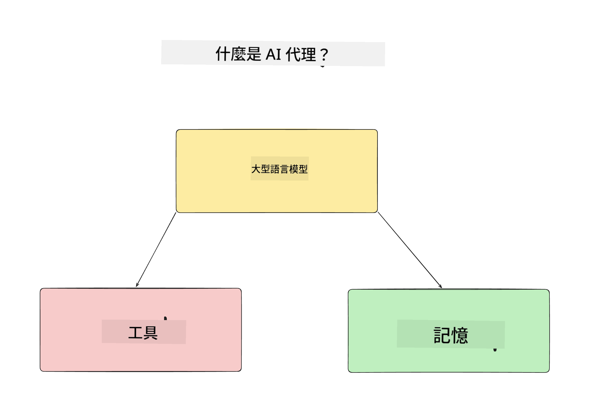
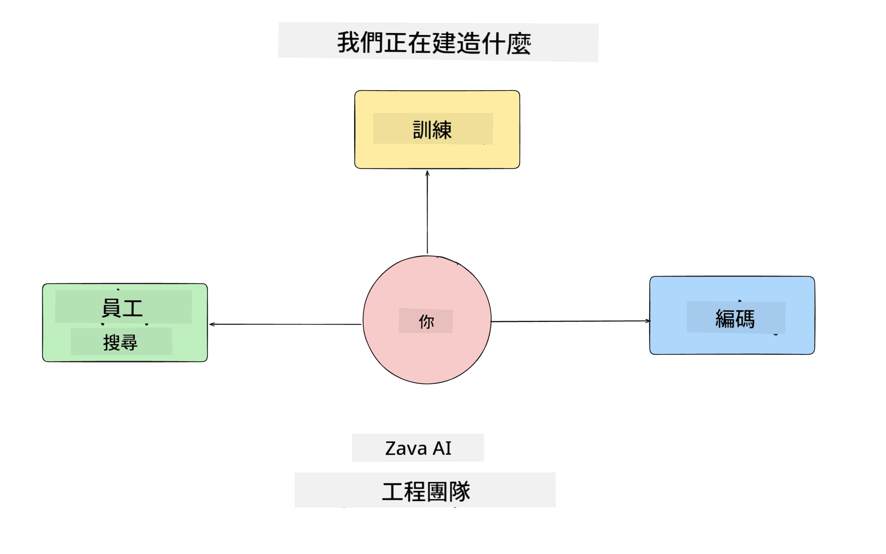
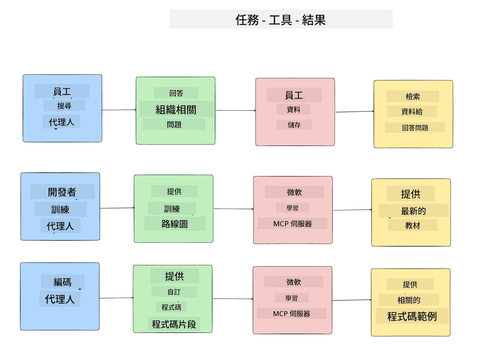
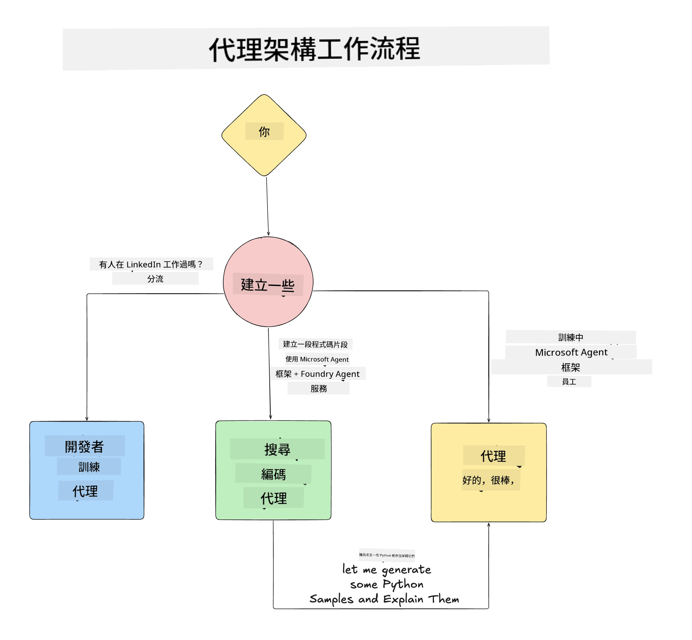

<!--
CO_OP_TRANSLATOR_METADATA:
{
  "original_hash": "99c07849641a850775c188c9333f31e5",
  "translation_date": "2025-12-12T18:19:50+00:00",
  "source_file": "lesson-1-agent-design/README.md",
  "language_code": "tw"
}
-->
# Lesson 1: AI 代理設計

歡迎來到「從零到生產的 AI 代理構建課程」的第一課！

在本課中，我們將涵蓋：

- 定義什麼是 AI 代理
  
- 討論我們正在構建的 AI 代理應用程式  

- 確認每個代理所需的工具和服務
  
- 架構我們的代理應用程式
  
讓我們先從定義什麼是代理以及為什麼我們會在應用程式中使用它們開始。

## 什麼是 AI 代理？

如果這是您第一次探索如何構建 AI 代理，您可能會對如何準確定義 AI 代理有疑問。

一個簡單的定義 AI 代理的方法是根據組成它的元件：

**大型語言模型** - LLM 將驅動處理用戶自然語言的能力，以解讀他們想完成的任務，以及解讀可用於完成這些任務的工具描述。

**工具** - 這些將是函數、API、資料庫和其他服務，LLM 可以選擇使用它們來完成用戶請求的任務。

**記憶** - 這是我們存儲 AI 代理與用戶之間短期和長期互動的方式。存取這些資訊對於改進和保存用戶偏好非常重要。

## 我們的 AI 代理使用案例

在本課程中，我們將構建一個 AI 代理應用程式，幫助新開發者加入我們的 AI 代理開發團隊！

在進行任何開發工作之前，創建成功的 AI 代理應用程式的第一步是明確定義我們期望用戶如何與 AI 代理互動的場景。

對於此應用程式，我們將處理以下場景：

**場景 1**：新員工加入我們的組織，想了解他們所加入的團隊以及如何與團隊聯繫。

**場景 2**：新員工想知道最適合他們開始著手的第一個任務是什麼。

**場景 3**：新員工想收集學習資源和程式碼範例，以幫助他們開始完成任務。

## 確認工具和服務

現在我們已經建立了這些場景，下一步是將它們映射到我們的 AI 代理完成任務所需的工具和服務。

這個過程屬於上下文工程範疇，我們將專注於確保 AI 代理在正確的時間擁有完成任務所需的正確上下文。

讓我們逐場景進行，並透過列出每個代理的任務、工具和期望結果來執行良好的代理設計。

### 場景 1 - 員工搜尋代理

**任務** - 回答關於組織中員工的問題，例如加入日期、目前團隊、地點和最後職位。

**工具** - 當前員工名單和組織架構的資料庫

**結果** - 能夠從資料庫檢索資訊，以回答一般組織問題和關於員工的具體問題。

### 場景 2 - 任務推薦代理

**任務** - 根據新員工的開發經驗，提出 1-3 個新員工可以著手的問題。

**工具** - GitHub MCP 伺服器以獲取開放問題並建立開發者檔案

**結果** - 能夠閱讀 GitHub 個人檔案的最近 5 次提交和 GitHub 專案的開放問題，並根據匹配情況提出建議。

### 場景 3 - 程式碼助理代理

**任務** - 根據「任務推薦」代理推薦的開放問題，研究並提供資源，並生成程式碼片段以協助員工。

**工具** - Microsoft Learn MCP 以尋找資源，Code Interpreter 以生成自訂程式碼片段。

**結果** - 如果用戶要求額外幫助，工作流程應使用 Learn MCP 伺服器提供資源連結和片段，然後交由 Code Interpreter 代理生成帶有說明的小程式碼片段。

## 架構我們的代理應用程式

現在我們已定義每個代理，讓我們建立一個架構圖，幫助我們了解每個代理如何根據任務一起或分別工作：

## 下一步

現在我們已設計好每個代理及我們的代理系統，讓我們進入下一課，開始開發這些代理！

---

<!-- CO-OP TRANSLATOR DISCLAIMER START -->
**免責聲明**：  
本文件係使用 AI 翻譯服務 [Co-op Translator](https://github.com/Azure/co-op-translator) 進行翻譯。雖然我們致力於確保翻譯的準確性，但請注意，自動翻譯可能包含錯誤或不準確之處。原始文件的母語版本應視為權威來源。對於重要資訊，建議採用專業人工翻譯。我們不對因使用本翻譯而產生的任何誤解或誤譯負責。
<!-- CO-OP TRANSLATOR DISCLAIMER END -->