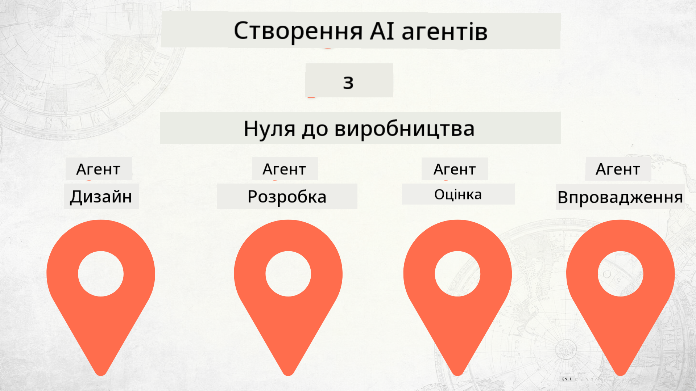

<!--
CO_OP_TRANSLATOR_METADATA:
{
  "original_hash": "df86a71d9a4a65d134d60f783a2aba86",
  "translation_date": "2025-12-18T14:45:33+00:00",
  "source_file": "README.md",
  "language_code": "uk"
}
-->
# Створення AI агентів від нуля до виробництва

### 🌐 Підтримка кількох мов

#### Підтримується через GitHub Action (автоматично та завжди актуально)

<!-- CO-OP TRANSLATOR LANGUAGES TABLE START -->
[Arabic](../ar/README.md) | [Bengali](../bn/README.md) | [Bulgarian](../bg/README.md) | [Burmese (Myanmar)](../my/README.md) | [Chinese (Simplified)](../zh/README.md) | [Chinese (Traditional, Hong Kong)](../hk/README.md) | [Chinese (Traditional, Macau)](../mo/README.md) | [Chinese (Traditional, Taiwan)](../tw/README.md) | [Croatian](../hr/README.md) | [Czech](../cs/README.md) | [Danish](../da/README.md) | [Dutch](../nl/README.md) | [Estonian](../et/README.md) | [Finnish](../fi/README.md) | [French](../fr/README.md) | [German](../de/README.md) | [Greek](../el/README.md) | [Hebrew](../he/README.md) | [Hindi](../hi/README.md) | [Hungarian](../hu/README.md) | [Indonesian](../id/README.md) | [Italian](../it/README.md) | [Japanese](../ja/README.md) | [Kannada](../kn/README.md) | [Korean](../ko/README.md) | [Lithuanian](../lt/README.md) | [Malay](../ms/README.md) | [Malayalam](../ml/README.md) | [Marathi](../mr/README.md) | [Nepali](../ne/README.md) | [Nigerian Pidgin](../pcm/README.md) | [Norwegian](../no/README.md) | [Persian (Farsi)](../fa/README.md) | [Polish](../pl/README.md) | [Portuguese (Brazil)](../br/README.md) | [Portuguese (Portugal)](../pt/README.md) | [Punjabi (Gurmukhi)](../pa/README.md) | [Romanian](../ro/README.md) | [Russian](../ru/README.md) | [Serbian (Cyrillic)](../sr/README.md) | [Slovak](../sk/README.md) | [Slovenian](../sl/README.md) | [Spanish](../es/README.md) | [Swahili](../sw/README.md) | [Swedish](../sv/README.md) | [Tagalog (Filipino)](../tl/README.md) | [Tamil](../ta/README.md) | [Telugu](../te/README.md) | [Thai](../th/README.md) | [Turkish](../tr/README.md) | [Ukrainian](./README.md) | [Urdu](../ur/README.md) | [Vietnamese](../vi/README.md)
<!-- CO-OP TRANSLATOR LANGUAGES TABLE END -->

## Курс, що навчає основам життєвого циклу розробки AI агентів

## 🌱 Початок роботи

Цей курс містить уроки, що охоплюють основи створення та розгортання AI агентів.

Кожен урок базується на попередньому, тому рекомендуємо починати з початку і проходити курс до кінця.

Якщо ви хочете дізнатися більше про теми AI агентів, можете ознайомитися з [Курсом для початківців AI агентів](https://aka.ms/ai-agents-beginners).

### Познайомтеся з іншими учнями, отримайте відповіді на свої питання

Якщо ви застрягли або маєте питання щодо створення AI агентів, приєднуйтесь до нашого спеціального Discord-каналу в [Microsoft Foundry Discord](https://discord.gg/Kuaw3ktsu6).

### Що вам потрібно

Кожен урок має власний приклад коду, який ви можете запускати локально. Ви можете [форкнути цей репозиторій](https://github.com/microsoft/Building-AI-Agents-From-Zero-To-Production/fork), щоб створити власну копію.

Цей курс наразі використовує наступне:

- [Microsoft Agent Framework (MAF)](https://aka.ms/ai-agents-beginners/agent-framework)
- [Microsoft Foundry](https://azure.microsoft.com/products/ai-foundry)
- [Azure OpenAI Service](https://azure.microsoft.com/products/ai-foundry/models/openai)
- [Azure CLI](https://learn.microsoft.com/cli/azure/authenticate-azure-cli?view=azure-cli-latest)

Будь ласка, переконайтеся, що у вас є доступ до цих сервісів перед початком.

Незабаром з’являться додаткові варіанти розміщення моделей та сервісів.

## 🗃️ Уроки

| **Урок**           | **Опис**                                                                                         |
|--------------------|--------------------------------------------------------------------------------------------------|
| [Agent Design](./lesson-1-agent-design/README.md)       | Вступ до нашого кейсу використання "Ознайомлення розробника" та як проектувати ефективних агентів  |
| [Agent Development](./lesson-2-agent-development/README.md)  | Використовуючи Microsoft Agent Framework (MAF), створіть 3 агентів, щоб допомогти новим розробникам ознайомитися.       |
| [Agent Evaluations](./lesson-3-agent-evals/README.md)  | Використовуючи Microsoft Foundry, дізнайтеся, наскільки добре працюють наші AI агенти і як їх покращити. |
| [Agent Deployment](./lesson-4-agent-deployment/README.md)   | Використовуючи Hosted Agents та OpenAI Chatkit, дізнайтеся, як розгорнути AI агента у виробництво.       |

## Внесок у проект

Цей проєкт вітає внески та пропозиції. Більшість внесків вимагають, щоб ви погодилися з
Угодою про ліцензію для контрибуторів (CLA), яка підтверджує, що ви маєте право і фактично надаєте нам
права на використання вашого внеску. Деталі дивіться на <https://cla.opensource.microsoft.com>.

Коли ви подаєте запит на злиття, бот CLA автоматично визначить, чи потрібно вам надати
CLA і відповідно позначить PR (наприклад, перевірка статусу, коментар). Просто дотримуйтесь інструкцій,
які надає бот. Вам потрібно буде зробити це лише один раз для всіх репозиторіїв, що використовують нашу CLA.

Цей проєкт прийняв [Кодекс поведінки Microsoft Open Source](https://opensource.microsoft.com/codeofconduct/).
Для отримання додаткової інформації дивіться [FAQ Кодексу поведінки](https://opensource.microsoft.com/codeofconduct/faq/) або
зв’яжіться з [opencode@microsoft.com](mailto:opencode@microsoft.com) з будь-якими додатковими питаннями чи коментарями.

## Торгові марки

Цей проєкт може містити торгові марки або логотипи проєктів, продуктів чи сервісів. Авторизоване використання торгових марок або логотипів Microsoft підпорядковується і має відповідати
[Правилам використання торгових марок і брендів Microsoft](https://www.microsoft.com/legal/intellectualproperty/trademarks/usage/general).
Використання торгових марок або логотипів Microsoft у змінених версіях цього проєкту не повинно викликати плутанину або припускати спонсорство Microsoft.
Будь-яке використання торгових марок або логотипів третіх сторін підпорядковується політикам цих третіх сторін.

## Отримання допомоги

Якщо ви застрягли або маєте питання щодо створення AI додатків, приєднуйтесь:

Якщо у вас є відгуки про продукт або помилки під час розробки, відвідайте:

---

<!-- CO-OP TRANSLATOR DISCLAIMER START -->
**Відмова від відповідальності**:  
Цей документ було перекладено за допомогою сервісу автоматичного перекладу [Co-op Translator](https://github.com/Azure/co-op-translator). Хоча ми прагнемо до точності, будь ласка, майте на увазі, що автоматичні переклади можуть містити помилки або неточності. Оригінальний документ рідною мовою слід вважати авторитетним джерелом. Для критично важливої інформації рекомендується звертатися до професійного людського перекладу. Ми не несемо відповідальності за будь-які непорозуміння або неправильні тлумачення, що виникли внаслідок використання цього перекладу.
<!-- CO-OP TRANSLATOR DISCLAIMER END -->