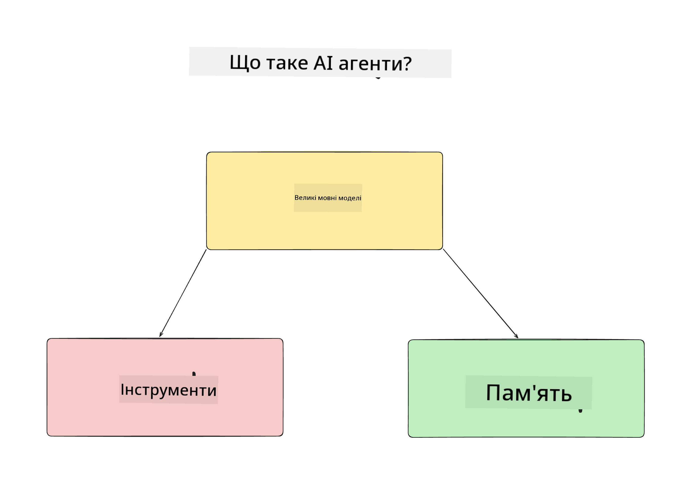
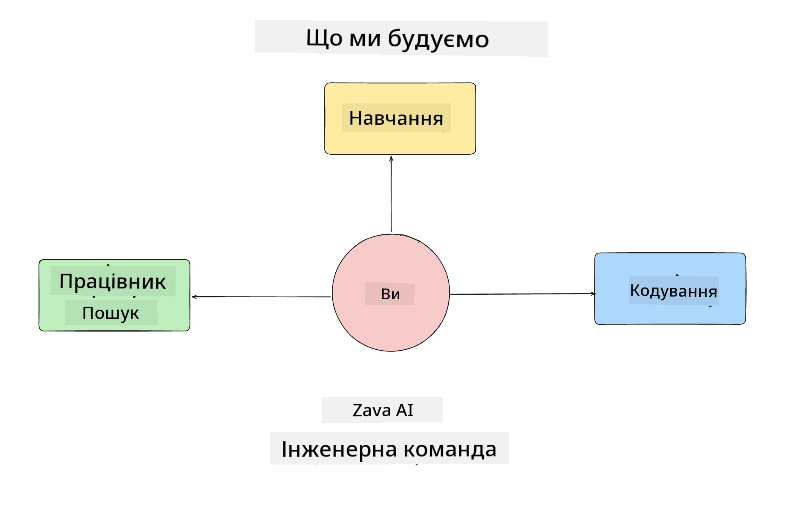
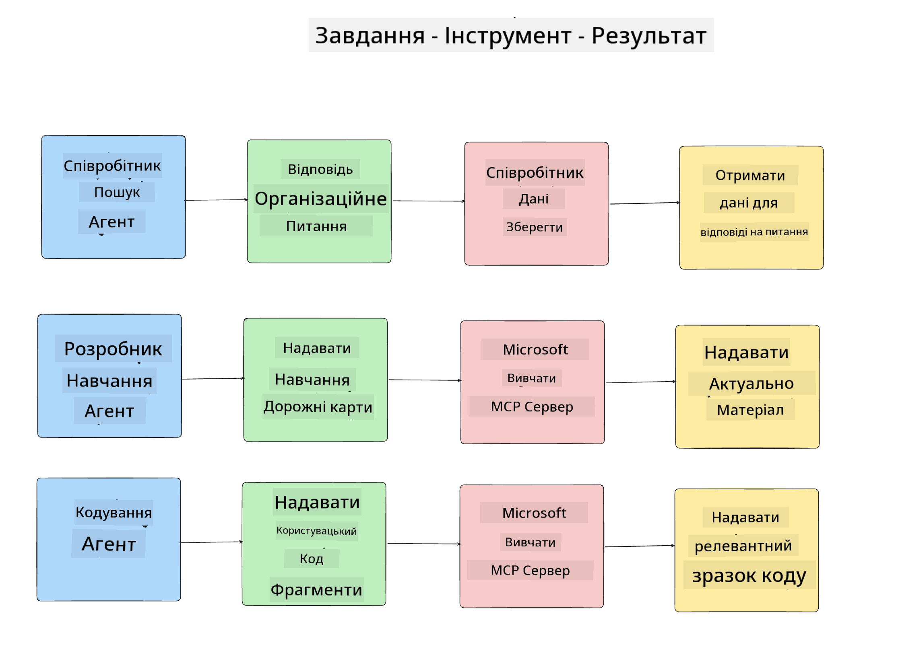
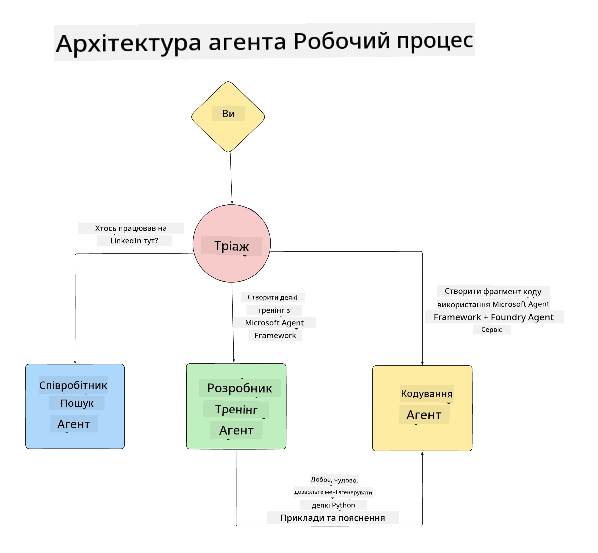

<!--
CO_OP_TRANSLATOR_METADATA:
{
  "original_hash": "99c07849641a850775c188c9333f31e5",
  "translation_date": "2025-12-12T18:43:49+00:00",
  "source_file": "lesson-1-agent-design/README.md",
  "language_code": "uk"
}
-->
# Lesson 1: Проєктування AI Агента

Ласкаво просимо до першого уроку курсу "Створення AI Агента від нуля до продакшену"!

У цьому уроці ми розглянемо:

- Визначення, що таке AI Агенти
  
- Обговорення AI Агентського застосунку, який ми створюємо  

- Визначення необхідних інструментів і сервісів для кожного агента
  
- Архітектуру нашого Агентського застосунку
  
Почнемо з визначення, що таке агент і чому ми використовуємо їх у застосунку.

## Що таке AI Агенти?

Якщо ви вперше досліджуєте, як створити AI Агента, у вас можуть виникнути питання, як саме визначити, що таке AI Агент.

Простий спосіб визначити, що таке AI Агент — це розглянути компоненти, які його складають:

**Велика мовна модель** — LLM забезпечує як здатність обробляти природну мову від користувача для інтерпретації завдання, яке він хоче виконати, так і інтерпретацію описів інструментів, доступних для виконання цих завдань.

**Інструменти** — це функції, API, сховища даних та інші сервіси, які LLM може обирати для виконання завдань, запитаних користувачем.

**Пам’ять** — це спосіб зберігання як короткострокових, так і довгострокових взаємодій між AI Агентом і користувачем. Збереження та отримання цієї інформації важливе для покращень і збереження вподобань користувача з часом.

## Наш випадок використання AI Агента

Для цього курсу ми створимо AI Агентський застосунок, який допомагає новим розробникам приєднатися до нашої команди розробки AI Агентів!

Перед тим, як почати розробку, перший крок до створення успішного AI Агентського застосунку — це визначити чіткі сценарії, як ми очікуємо, що користувачі працюватимуть з нашими AI Агенти.

Для цього застосунку ми працюватимемо з такими сценаріями:

**Сценарій 1**: Новий співробітник приєднується до нашої організації і хоче дізнатися більше про команду, до якої він приєднався, і як з нею зв’язатися.

**Сценарій 2:** Новий співробітник хоче дізнатися, яке завдання буде найкращим для початку роботи.

**Сценарій 3:** Новий співробітник хоче зібрати навчальні ресурси та приклади коду, щоб допомогти йому розпочати виконання цього завдання.

## Визначення інструментів і сервісів

Тепер, коли ми створили ці сценарії, наступний крок — зіставити їх з інструментами та сервісами, які наші AI агенти потребуватимуть для виконання цих завдань.

Цей процес належить до категорії інженерії контексту, оскільки ми зосередимося на тому, щоб наші AI Агенти мали правильний контекст у потрібний час для виконання завдань.

Розглянемо це сценарій за сценарієм і виконаємо якісний агентський дизайн, перелічуючи завдання, інструменти та бажані результати кожного агента.

### Сценарій 1 - Агент пошуку співробітників

**Завдання** — Відповідати на питання про співробітників організації, такі як дата приєднання, поточна команда, місцезнаходження та остання посада.

**Інструменти** — Сховище даних з поточним списком співробітників і організаційною структурою

**Результати** — Можливість отримувати інформацію зі сховища для відповіді на загальні організаційні питання та конкретні питання про співробітників.

### Сценарій 2 - Агент рекомендації завдань

**Завдання** — Виходячи з досвіду розробника нового співробітника, запропонувати 1-3 завдання, над якими новий співробітник може працювати.

**Інструменти** — GitHub MCP Server для отримання відкритих завдань і створення профілю розробника

**Результати** — Можливість читати останні 5 комітів профілю GitHub і відкриті завдання на проекті GitHub та робити рекомендації на основі співпадінь

### Сценарій 3 - Агент помічника з коду

**Завдання** — Виходячи з відкритих завдань, рекомендованих агентом "Рекомендації завдань", досліджувати і надавати ресурси та генерувати фрагменти коду, щоб допомогти співробітнику.

**Інструменти** — Microsoft Learn MCP для пошуку ресурсів і Code Interpreter для генерації індивідуальних фрагментів коду.

**Результати** — Якщо користувач просить додаткову допомогу, робочий процес повинен використовувати Learn MCP Server для надання посилань і фрагментів ресурсів, а потім передавати завдання агенту Code Interpreter для генерації невеликих фрагментів коду з поясненнями.

## Архітектура нашого Агентського застосунку

Тепер, коли ми визначили кожного з наших агентів, створимо діаграму архітектури, яка допоможе нам зрозуміти, як кожен агент працюватиме разом і окремо залежно від завдання:

## Наступні кроки

Тепер, коли ми спроєктували кожного агента і нашу агентську систему, перейдемо до наступного уроку, де ми розробимо кожного з цих агентів!

---

<!-- CO-OP TRANSLATOR DISCLAIMER START -->
**Відмова від відповідальності**:
Цей документ було перекладено за допомогою сервісу автоматичного перекладу [Co-op Translator](https://github.com/Azure/co-op-translator). Хоча ми прагнемо до точності, будь ласка, майте на увазі, що автоматичні переклади можуть містити помилки або неточності. Оригінальний документ рідною мовою слід вважати авторитетним джерелом. Для критично важливої інформації рекомендується звертатися до професійного людського перекладу. Ми не несемо відповідальності за будь-які непорозуміння або неправильні тлумачення, що виникли внаслідок використання цього перекладу.
<!-- CO-OP TRANSLATOR DISCLAIMER END -->